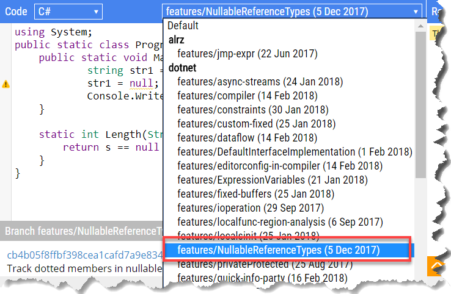
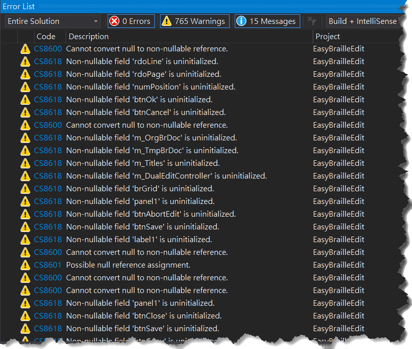
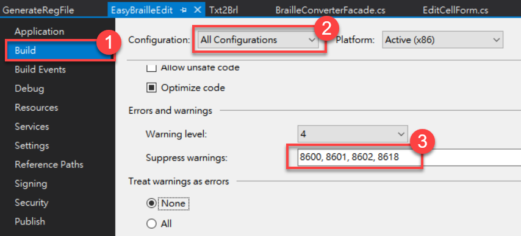

溫馨提醒：本文提及的 C# 8 新功能雖已通過提案，但不代表將來 C# 8 正式發布時一定會納入。這表示我這篇筆記有可能白寫了，也表示您不必急著瞭解這項新功能的所有細節，可能只要瞄一下底下的「概要」說明就夠了。

<!--more-->

## 概要

C# 8 的 Nullable Reference Types 意味著往後所有的參考型別預設都是不可為 `null`；對於可為 `null` 的參考型別變數，寫法跟可為 `null` 的實質型別一樣，宣告時必須在型別後面加上 `?`。請看以下範例：

~~~~~~~~csharp
int? num = null;         // 可為 null（實質型別）
string? userName = null; // 可為 null（參考型別）
string password = null;  // 編譯警告: 不可為 null!
Employee? emp = null;    // 可為 null（參考型別）
User user = null;        // 編譯警告: 不可為 null!
~~~~~~~~

這項新功能有不少細節，不容易幾句話帶過。所以，接下來是比較冗長、也比較詳細的說明。

## 基礎知識

一直以來，C# 開發人員已經很熟悉實質型別（value types）和參考型別（reference types）所代表的意義，以及它們之間的差異：

* 在宣告一個實質型別的變數時（例如 `int i`），如果沒有賦予初始值，那麼編譯器會將它設定成該型別的預設值。例如 `int` 型別的預設值是 0。
* 如果要讓實質型別的變數值可為 `null`，則要使用泛型結構 `System.Nullable<T>`，其中的 `T` 必須是實質型別。此泛型結構在 C# 中可以用更簡便的 `T?` 語法來表示，例如 `int?` 等同於 `Nullable<int>`，代表可為 `null` 的整數。
* 在宣告一個參考型別的變數時（例如 `string s`)，如果沒有賦予初始值，那麼它的預設值便是 `null`。也就是說，參考型別的變數是可以為 `null` 的。

> 在關聯式資料庫中，通常每一種欄位都可以指定是否允許空值（`NULL`）。早期沒有 `Nullable<T>` 的時代（.NET 1.0），在處理可為空值的資料欄位時並不直觀——當時常見的一種作法是把特定數值來當成空值來判斷，例如 `int` 變數值若為 -999999 就表示沒有值，`DateTime` 變數則常以 `DateTime.MinValue` 來表示空值，另外還有 ADO.NET 的 `DBNull.Value` 也是用來判斷欄位值是否為 `null` 的方法。有了 `Nullable<T>` 之後，就有了直接對應的型別。無需再使用以前那些比較繞彎的方法了。

那麼，既然參考型別本來就是可以是 `null`，C# 8 （計畫）新增的功能裡面怎麼會有一項叫做「可為空的參考型別」（Nullable Reference Types）呢？它究竟是什麼？

> 如果您想一邊閱讀，一邊把程式碼敲進去實驗看看，可以先跳到後面，找到有關安裝 C# 8 實驗性擴充功能的說明。

## Nullable Reference Types 是什麼？

簡單地說，在 C# 8 以前，參考型別都是可為 `null` 的，這點到了 C# 8 將開始改變：所有參考型別預設都是不可為 `null`；如果想要讓某個參考型別的變數可以為 `null`，則必須明確宣告它「可以為空」。請看以下範例：

~~~~~~~~csharp
string s1 = null;  // C# 7.x OK，C# 8 出現編譯警告。
string? s2 = null; // C# 7.x 編譯失敗，C# 8 OK。
~~~~~~~~

第 1 行程式碼在 C# 8 會出現下列編譯警告：

> Warning CS8600: Cannot convert null to non-nullable reference.

因為 string 是參考型別，而就如剛才提過的，參考型別到了 C# 8 已經改成預設不可為空，故編譯器會發出警告，告訴你不能把 `null` 指派給「不可為 `null` 的參考」。

另一方面，第 2 行程式碼在 C# 8 編譯沒問題，若使用 C# 7.2 或更早之前的編譯器，則會出現編譯錯誤：

> error CS0453: The type 'string' must be a non-nullable value type in order to use it as parameter 'T' in the generic type or method 'Nullable&lt;T&gt;'

這是因為 `string?` 是 C# 8 的 Nullable Reference Types 語法，表示要宣告一個可為 `null` 的字串變數。C# 7.2 沒有這種語法，便會出現編譯錯誤。

如您所見，「可為空的參考型別」跟「可為空的實質型別」的語法到了 C# 8 已經統一了：宣告時在型別後面加個問號（'?'）。

> 這只是透過編譯器的協助來達成語法上的一致，骨子裡，它們兩兄弟依然保有各自的性格——實質型別的變數值依然直接存放於它所配置的記憶體空間，參考型別的變數所保存的只是一個記憶體位址，該位址指向另一塊動態配置的記憶體空間。

## 為什麼 C# 8 要加入 Nullable Reference Types？

在 C# 8 之前，由於參考型別的變數值有兩種可能：`null` 或者不是 `null`，編譯器在這裡幫不上忙，所以在處理參考型別的變數時，我們常常會加上一些「防護罩」，也就是預先檢查變數是否為 `null`，例如：

~~~~~~~~csharp
static int Length(string text)
{
    return text == null? 0 : text.Length;
}
~~~~~~~~

就上例來說，我們在寫 `Length` 函式時，根本無法確定傳入的參數 `text` 究竟有沒有值。如果不先檢查變數是否為 `null` 就貿然使用它的屬性或方法，那麼當程式執行時，只要呼叫端傳入一個 `null`，就會發生  `NullReferenceException` 類型的錯誤。可是，寫程式的時候難免有些地方會忘記加上 `null` 檢查，防不勝防，這個部分能不能請編譯器幫點忙呢？（C# 8 表示：十分樂意!）

從上面的例子可以看得出來，既有的參考型別在表達 `null` 語意方面的不足。我們需要更明確的語法來表達下列意圖：

* 某個參考型別的變數可以是 `null`，因此，在存取該變數所代表的物件成員時，必須先檢查它是否為 `null`。
* 某個參考型別的變數必定要指向某個物件，而不可以是 `null`。

在 C# 8 以前，我們已經有了第一項。C# 8 則為了要滿足第二項需求，因而（預計）加入 Nullable Reference Types。而且，它希望開發人員在寫程式時要明確指定某個參考型別的變數是可以為 `null` 的；若不明白指定，則預設是不可為 `null`。如此一來，編譯器就能在檢查 `null` 這種細瑣工作上提供協助，讓我們在寫程式的時候就能避免將來程式執行時可能發生的問題。

> C# 8 的這項功能的用意是協助減少執行時期發生 `NullReferencException` 的機率，而非保證完全杜絕。

## 不允許 `Null` 的參考型別

以剛才的範例來說，如果想要讓 `Length` 方法的 `text` 參數不允許 `null`，原本的程式碼完全不用改，仍然是原本的樣子：

~~~~~~~~csharp
static int Length(string text)
{
    return text == null? 0 : text.Length;
}
~~~~~~~~

C# 8 編譯器會認為參數 `text` 必須有值。因此，當呼叫端傳入 `null`，例如：

~~~~~~~~csharp
int i = Length(null);
~~~~~~~~

此時編譯器就能檢查得出來，這個呼叫埋藏著 `NullReferenceException` 的風險，因而顯示編譯警告訊息。請注意只是警告，而非編譯錯誤，這點很重要——這樣才不會因為開發工具（編譯器）升級而導致既有專案突然出現一大堆編譯錯誤。

也因為它只是警告，所以原本已經有加入 `null` 檢查的防護罩，最好別多事去把它拿掉。像底下這寫法就有自廢武功的疑慮：

~~~~~~~~csharp
static int Length(string text)
{
    return text.Length; // 把預先檢查 null 防護拿掉。
}
~~~~~~~~

因為，如果開發人員忽略了 C# 8 編譯器的警告，那麼程式執行時就可能出現那個惡名昭彰的錯誤。（稍後會說明如何關閉這些警告。）

### default 表示式

對一個不可為 `null` 的參考型別變數賦予預設值，C# 8 編譯器會出現警告：

~~~~~~~~csharp
string s = default;  // 編譯警告：把 null 指派給不可為 null 的變數
~~~~~~~~

## 允許 `Null` 的參考型別

延續前面的範例，如果要讓參數 `text` 接受 `null`，便需要用到 C# 8 的新語法，也就是在宣告變數的時候，型別的後面加上一個問號。如下所示：

~~~~~~~~csharp
static int Length(string? text) // text 可以傳入 null。
{
    return text == null? 0 : text.Length;
}
~~~~~~~~

C# 8 編譯器會把上述程式碼編譯成類似底下這樣：

~~~~~~~~csharp
public static int Length([Nullable] string s)
{
    return (s == null) ? 0 : s.Length;
}
~~~~~~~~

其中的 [Nullable] 特徵項的全名是 `System.Runtime.CompilerServices.NullableAttribute`。

## 靜態路徑分析

編譯器會分析程式碼的執行路徑，以盡可能抓出可能發生 `NullReferenceException` 的地方。請看以下範例：

~~~~~~~~csharp
static int Length(string? s)  // 參數 s 可以為 null。
{
    if (s == null)   // 預先檢查 s 是否為 null
        return 0;    // 是 null 就返回 0。
    s = null;        // s 又變成 null 了!
    return s.Length; // 編譯器還是能偵測到，並警告：可能為 null!
}
~~~~~~~~

可是，程式碼靜態分析無法做到百分之百。應該說，靜態分析只能檢查到方法本身的參數宣告以及區域變數所涉及的程式邏輯，但無法深入到方法中呼叫的其他方法。以剛才的範例來說：

~~~~~~~~csharp
static int Length(string? s)
{
    if (String.IsNullOrEmpty(s)) // 編譯警告：CS8604。
        return 0;
    return s.Length; // 編譯警告：CS8602。
}
~~~~~~~~

這麼安全的寫法，編譯器竟然顯示兩個警告耶！分別是：

> Warning CS8604: Possible null reference argument for parameter 'value' in 'bool string.IsNullOrEmpty(string value)'.
>
> Warning CS8602: Possible dereference of a null reference.

出現警告 CS8604 的原因，是我們把可以為 `null` 的字串變數 `s` 傳入一個不可為 `null` 的參數。

出現警告 CS8602 的原因，則是剛才提到的，程式碼靜態分析不會再深入下一層方法呼叫，所以也就無法得知 `String.IsNullOrEmpty()` 的執行結果到底是傳回 `true` 還是 `false`。對此問題，C# 提出了一個語法，讓開發人員協助編譯器減少這類因為無法深入分析程式碼而產生的多於警告。這個語法使用的是驚嘆號（`!`），像這樣：

~~~~~~~~csharp
static int Length(string? s)
{
    if (String.IsNullOrEmpty(s)) // 編譯警告：CS8604。
        return 0;
    return s!.Length; // 這行不再引起編譯警告了。
}
~~~~~~~~

其中的 `s!` 就是在告訴編譯器：「嘿！這裡我比你清楚，s 肯定不會是 null，你就別費心警告我了。」

那麼，另一個警告 CS8604 要怎麼解決呢？目前我只知道這幾種方法：

* 透過編譯選項或前置處理指示 `#pragma` 來抑制這個警告。
* 改用 `if (s == null)`。

而官方 github 的這份文件：The C# Nullable Reference Types Preview 裡面有提到 [string.IsNullOrEmpty](https://github.com/dotnet/csharplang/wiki/Nullable-Reference-Types-Preview#inferring-null-state-from-stringisnullorempty) 的問題，上面的回答是：

We are investigating allowing annotations on methods that describe simple relationships between parameters and return value with respect to null values. The compiler could use those annotations when analyzing the calling code.

看來只能等等看後續發展了。

語法的部分，就先寫到這裡。接下來是比較輕鬆的部分：工具的安裝與設定。

## 安裝工具

想要嘗試 C# 8 新增的 Nullable Reference Types 語法，目前我試過兩種方法，一個是用 Visual Studio 2017 加上實驗版本的 Roslyn 擴充功能「Nullable Reference Types Preview」，另一個方法則是用瀏覽器開啟 <https://sharplab.io>，直接線上編譯和測試 C# 8 的新功能。

如果你不想「弄髒」自己目前的開發環境，那麼 sharplab.io 會是個不錯的選擇。當然啦，它跟 Visual Studio 2017 比起來，反應的速度還是比較慢一點。

以下分別說明兩種工具的安裝或設定方式。

### Sharplab.io

用法很簡單，用瀏覽器開啟 <https://sharplab.io>，左邊窗格可以輸入程式碼，右邊窗格則可以顯示程式的執行結果或者反組譯之後的程式碼，包括 C#、VB、IL、和 JIT 組合語言（酷！）。

如果要實驗 C# 8 的 Nullable Reference Types，必須在左邊窗格上方的下拉選單裡面挑選對應的編譯器版本，如下圖所示：

然後就可以敲入程式碼來觀察程式的執行結果、編譯器顯示的警告或錯誤訊息、以及反組譯之後的程式碼。

### 安裝擴充功能：Nullable Reference Types Preview

前提：你的 Visual Studio 2017 版本必須是 15.5.x，才能安裝此實驗性質的擴充功能。

步驟：

1. 關閉 Visual Studio 2017。
2. 下載 [Roslyn_Nullable_References_Preview.zip](https://roslyninfra.blob.core.windows.net/compilers/nonnull/Roslyn_Nullable_References_Preview_11152017.zip)
3. 解開剛才下載的壓縮檔，然後執行 install.bat。

下次開啟 Visual Studio 2017，C# 編譯器應該就會認得 Nullable Reference Types 語法了。

值得一提的是，如果你曾經修改過專案選項中的 C# 版本，最好再檢查一下：開啟專案的屬性（Properties）視窗，在左邊面板選擇 Build，然後在此「建置設定」視窗的最下方找到 Advanced 按鈕。點此按鈕之後，看一下 Language version，如下圖：

安裝好上述擴充功能後，在我的環境上，C# 語言的版本選擇 latest major version (default)或 latest minor version (latest) 都可以使用 Nullable Reference Types 語法，其他則不行。

> 這兩個選項可以讓 C# 設計團隊控制哪些新功能要出現在我們使用者的開發環境中。若想嚐鮮，可以選擇 latest minor；若偏好沉穩路線，等新功能正式發布之後才用於專案的話，便可選擇 latest major（適合新專案）。至於想要用更舊的版本來建置專案，就選擇其他特定的 C# 版本，例如 C# 5、6、或 7.2 等等（適合遺留專案）。

> 以下提到 Visual Studio 時，若無特別指明版本，則一律代表 Visual Studio 2017 v15.5.x，而且有安裝 Nullable Reference Types Preview。

## 編譯既有專案

按前述步驟安裝好工具之後，用 Visual Studio 2017 開啟我先前寫的一個用來製作點字書的專案，Rebuild 整個 solution，結果建置成功，只是有 765 個警告，如下圖：

這些警告是：

* Warning CS8600: Cannot convert null to non-nullable reference.
* Warning CS8601: Possible null reference assignment.
* Warning CS8602: Possible dereference of a null reference.
* Warning CS8618: Non-nullable field 'field-name' is uninitialized.

尤其以最後一個 CS8618 的數量最多。從這裡也可以看得出來，C# 8 推出的這項新功能對既有的 C# 程式碼並不會產生「侵入性」的影響——我的意思是，它並不強迫你改寫或重寫既有的程式碼。

然而，每次建置專案都出現這麼多編譯警告，還是會造成困擾。比如說，有些我們特別在意的編譯警告可能因為夾雜在一大堆警告訊息當中而不易發現。

### 調整編譯器的警告

用新版開發工具（編譯器）來編譯遺留專案時，若要避免產生一大堆編譯警告，最簡單迅速的方法就是把專案屬性中的語言版本設定成比較舊的版本，例如剛才提過的，C# 6、7.0、7.2 等等。當然，這也就等於完全捨棄 C# 8 的新功能了。

如果想要使用某些 C# 8 的新語法，但是又要關閉某些礙眼的警告，則可以在 C# 專案的屬性視窗中設定 Suppress warnings，如下圖：

或者也可以把某些警告視為錯誤，即上圖中的 Treat warning as errors 選項。

另外，對於少量的情形，我們還可以在程式中加上前置處理指示 `#pragma` 來關閉和恢復特定警告，像這樣：

~~~~~~~~csharp
#pragma warning disable CS8618 // Non-nullable field is uninitialized.
  程式碼
#pragma warning restore CS8618
~~~~~~~~

## 重點整理

* 在 C# 8 以前，參考型別都是可為 `null` 的，這點到了 C# 8 將開始改變：所有參考型別預設都是不可為 `null`。
* 對於可為 `null` 的參考型別變數，寫法跟可為 `null` 的實質型別一樣，宣告時必須在型別後面加上 `?`，例如 `string? text;`。這是 C# 8 新增的 Nullable Reference Types 語法。
* Nullable Reference Types 的用意是協助減少執行時期發生 `NullReferencException` 的機率，而非保證完全杜絕。
* 程式碼靜態分析只能檢查到方法本身的參數宣告以及區域變數所涉及的程式邏輯，但無法深入到方法中呼叫的其他方法。
* 對於既有的 C# 專案，我們可以在不修改程式碼的前提下繼續使用新版的編譯器，並透過編譯選項來避免編譯時產生一堆警告訊息。

## 參考資料

* [The C# Nullable Reference Types Preview](https://github.com/dotnet/csharplang/wiki/Nullable-Reference-Types-Preview#the-c-nullable-reference-types-preview)
