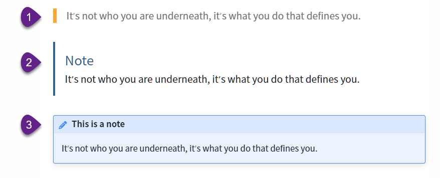
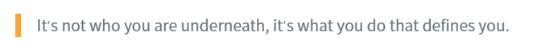
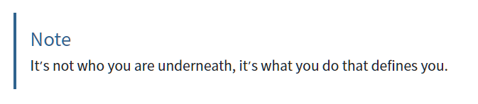
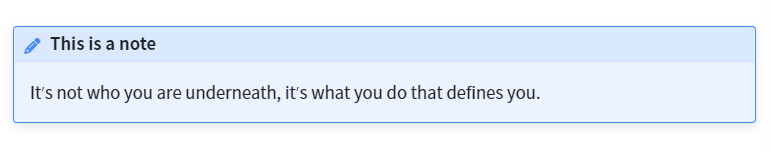
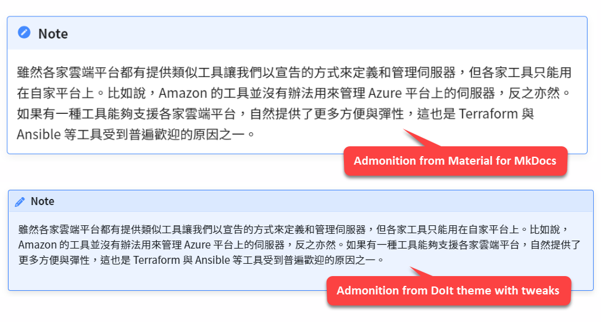

## Introduction

After I created the website with Hugo and Docsy theme, I spent some time searching the Internet just to find out how I can add admonitions (callouts) in my articles. In my experience with MkDocs and Material theme, it was easy, and I'm pretty happy with the result -- the syntax is simple and the rendered blocks are colorful and beautiful. However, there is no equivalent in Hugo and Docsy theme.

Take a look at the following figure and ask yourself which one is better:



If you can live with the first one and like the last one most, read on. In the end, you'll see how you can add the last admonition block in your Markdown document.

## Three Options

As shown earlier, the first one is generated with the basic Markdown syntax called *blockquote*, as below:

```text
> It's not who you are underneath, it's what you do that defines you.
```

It is rendered like this:



I can live with that because it is easy to write. Just type one `>` character at the beginning of a line and I get a simple quotation block. 

The second one is generated with the shortcode syntax called [alert](https://www.docsy.dev/docs/adding-content/shortcodes/#alert) provided by Docsy theme:

```text
{}
It's not who you are underneath, it's what you do that defines you.
{}
```

Rendered:



Both the syntax and rendered result are not quite satisfying, wouldn't you say?

Let's see the last one, which is the goal of this article.

### The Goal

The last one is also generated with a shortcode `admonition` that is found in another open-sourced Hugo theme called [DoIt](https://github.com/HEIGE-PCloud/DoIt).

The Markdown:

```text
{}
It's not who you are underneath, it's what you do that defines you.
{}
```

Rendered:



It's prettier than the others in my opinion. When I need to add a callout box in my article, I would use it despite the syntax being a bit more complex compared to the [admonition syntax of Material for MkDocs](https://squidfunk.github.io/mkdocs-material/reference/admonitions/#usage). 

With Material for MkDocs, I can achieve the same goal with extended Markdown syntax as below:

```markdown
!!! note "This is a note"
    It's not who you are underneath, it's what you do that defines you.
```

Neat, isn't it?

Now the question is, in a website created with Docsy theme, can I use shortcodes from another theme?

## A Possible Solution

It seems possible with theme composition and inheritance according to the official document: [Theme components](https://gohugo.io/hugo-modules/theme-components/). We can put multiple themes in the Hugo configuration file, for example:

```
theme = ['my-shortcodes', 'base-theme', 'hyde']
```

To be honest, I'm not sure if it will work for any combinations of themes, or if there are any potential side effects, e.g. conflicted names in CSS/SCSS, JavaScript, or even shortcodes. I just didn't try it yet.

The first thing I tried is cherry-picking what I need from DoIt theme and integrating it with Docsy, and I'm happy with the result. 

## How I Do It

In this section, I'll describe how I extract admonition shortcodes from DoIt theme, do some tweaks, then integrate them into an existing Hugo website with Docsy theme.

{}
If you're using another theme other than Docsy, the steps might be a little bit different. 
{}

### Step 1: _admonition.scss

Download [_admonition.scss](https://github.com/HEIGE-PCloud/DoIt/blob/main/assets/css/_partial/_single/_admonition.scss) from DoIt theme, and put this file in the `/assets/scss` folder of your website.

Open `/assets/scss/_admonition.scss` from your website and find the following lines:

```css
.admonition {
  position: relative;
  margin: 1rem 0;
  padding: 0 .75rem;
  background-color: map-get($admonition-background-color-map, 'note');
  border-left: .25rem solid map-get($admonition-color-map, 'note');
  overflow: auto;
```

Replace them with:

```css
.admonition {
  position: relative;

  background-color: map-get($admonition-background-color-map, 'note');
  border: 0.05rem solid #448aff;
  border-radius: 0.2rem;
  box-shadow: var(--md-shadow-z2);
//  color: var(--md-admonition-fg-color);
  display: flow-root;
  font-size: .87rem;
  margin: 1.5625em 0;
  padding: 0 0.8rem 0.8rem;
  page-break-inside: avoid;
```

Most of these CSS are copied from Material for MkDocs, with a bit tweaks just for my needs.

Note that I commented the line with `color` property simply because the font color looks good and no need to change it here. You can uncomment it if you want to change the text color of admonition blocks.

### Step 2: _variables.scss

Download [_variables.scss]( https://github.com/HEIGE-PCloud/DoIt/blob/main/assets/css/_variables.scss) from DoIt theme, put this file in the `/assets/scss` folder of your website and change the file name to `_admonition_variables.scss`.

Admonition colors are defined in this file, for example:

```css
// Color map of the admonition
$admonition-color-map: (
  'note': #448aff,
  'abstract': #00b0ff,
  'info': #00b8d4,
  'tip': #00bfa5,
  'success': #00c853,
  'question': #64dd17,
  'warning': #ff9100,
  'failure': #ff5252,
  'danger': #ff1744,
  'bug': #f50057,
  'example': #651fff,
  'quote': #9e9e9e,
) !default;
```

There's no need to modify this file unless you want to change some colors. 

### Step 3: admonition.html

Download [admonition.html](https://github.com/HEIGE-PCloud/DoIt/blob/main/layouts/shortcodes/admonition.html) from DoIt theme, and put this file in the `/layouts/shortcodes` folder of your website.

Open `/layouts/shortcodes/_admonition.scss` and find the following lines:

```html
{{- if .IsNamedParams -}}
    {{- $type := .Get "type" | default "note" -}}
    <div class="details admonition {{ $type }}{{ if .Get `open` | ne false }} open{{ end }}">
        <div class="details-summary admonition-title">
            <i class="icon {{ index $iconMap $type | default (index $iconMap "note") }}"></i>{{ .Get "title" | default (T $type) }}<i class="details-icon {{ $iconDetails }}"></i>
        </div>
        <div class="details-content">
            <div class="admonition-content">
                {{- $inner -}}
            </div>
        </div>
    </div>
{{- else -}}
```

Replace them with:

```html
{{- if .IsNamedParams -}}
    {{- $type := .Get "type" | default "note" -}}
    <div class="td-max-width-on-larger-screens details admonition {{ $type }}{{ if .Get `open` | ne false }} open{{ end }}">
        <div class="details-summary admonition-title">
            <i class="icon {{ index $iconMap $type | default (index $iconMap "note") }}"></i>{{ .Get "title" | default (T $type) }}
        </div>
        <div class="details-content">
            <div class="admonition-content">
                {{- $inner -}}
            </div>
        </div>
    </div>
{{- else -}}
```

As you can see, I removed the open/close icon. In DoIt theme, the icon works as a button to expand/collapse the admonition block. You can see them in action on the [DoIt theme website](https://hugodoit.pages.dev/theme-documentation-extended-shortcodes/#admonition).

Note that I didn't show the code of `{{- else -}}` block because the modification is similar.

### Step 4: _variables_project.scss

Add the following lines to the file `/assets/scss/_variables_project.scss` of your website:

```css
@import "_admonition_variables";
@import "_admonition";
```

### Step 5: _styles_project.scss

Add the following lines to the file `/assets/scss/_styles_project.scss` of your website:

```css
// For admonitions. Copied from Material for MkDocs.
:root > * {
    --md-shadow-z1: 0 0.2rem 0.5rem #0000000d,0 0 0.05rem #0000001a;
    --md-shadow-z2: 0 0.2rem 0.5rem #0000001a,0 0 0.05rem #00000040;
    --md-shadow-z3: 0 0.2rem 0.5rem #0003,0 0 0.05rem #00000059;
  }
```

To understand how `_variables_project.scss` and `_styles_project.scss` work, read the section [Project style files](https://www.docsy.dev/docs/adding-content/lookandfeel/#project-style-files) of Docsy document. 

### Step 6: Add Snippet in VS Code

The shortcode syntax is cumbersome, so I've added a [snippet in Visual Studio Code](https://code.visualstudio.com/docs/editor/userdefinedsnippets). To do this, select `Configure User Snippets` under `File` > `Preferences`, then select `markdown.json`. Add the following code to `markdown.json`:

```json
{
    "h-admonition":{
        "prefix": "h-admon",
        "body": [
            "{}",
            "${1:content}",
            "{}"
        ],
    }
}    
```

## Conclusion

In the figure below, the first admonition block is rendered with Material for MkDocs. The second one is the result of the work described in this article.



As you can see, the admonition from DoIt theme is customized and integrated into my website, and I would say the look and feel are pretty similar to Material for MkDocs, job done. 

> P.S. I didn't bother to modify the icon, but it should be a simple task.
 