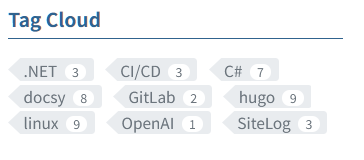
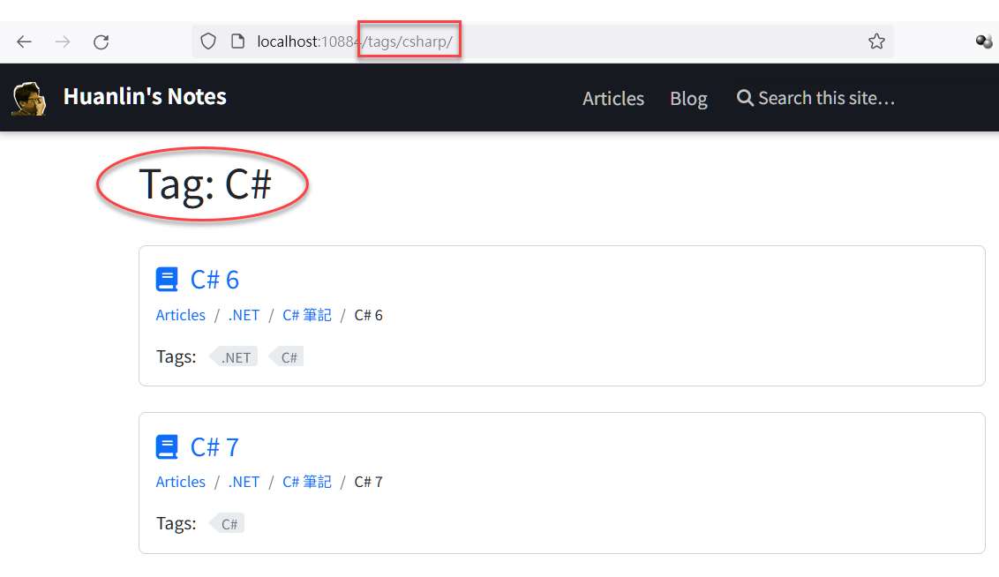
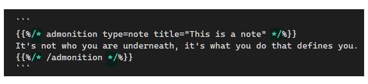

## Special Characters in Tags

A tag list page will be inaccessible if there are special characters in the tag name. For example, the following frontmatter uses "C#" as a tag name:

```md
---
title: "My C# Notes"
slug: "my-csharp-notes"
tag: ["C#"]
---
```

The link for the "C#" tag will be `/tags/c#`, which is inaccessible and the browser will return HTTP 404.

To solve this issue, use "csharp" as the tag name:

```md
---
title: "My C# Notes"
slug: "my-csharp-notes"
tag: [csharp]
---
```

Then create a `_index.md` under `/content/en/tags/csharp` folder. Below is the content of the `_index.md` file:

```md
---
title: "C#"
---
```

> **Note:** The file name must be `_index.md` with a leading `_` character. Using `index.md` will not solve this issue.


With the above setups, the Tag Cloud will display "C#" and the link will work as expected, shown as the screenshot below:



Click the `C#` tag and the browser will open `/tags/csharp` page:



## Escaping Shortcodes

Sometimes I need to demonstrate how to use a shortcode in my article. Simply put the shortcode example in a markdown code block won't work because the shortcode will be interpreted and executed anyway.

The solution is to add a pair of `/*` and `*/` in both the beginning and end lines of the shortcode block. Here is an example:



It is rendered like this:

```
{}
It's not who you are underneath, it's what you do that defines you.
{}
```

## Show Recent Posts

The following code can be used to show recent 5 posts:

```html
<h4>Recently added/updated posts</h4>
<div>
    {{ $byLastMod :=  .Site.RegularPages.ByLastmod  }}
    {{ $recent := ($byLastMod | last 5).Reverse }}

    <ul>
    {{ range $recent }}
      <li>
        <a href="{{ .RelPermalink }}">{{ .LinkTitle }}</a>
        &nbsp; ({{ .Lastmod.Format "2006-01-02" }})
      </li>
    {{ end }}
    </ul>
</div>
```

You can put them into a partial file, for example, if you're using Docsy theme, the `partials/section-index.html` might be a good choice.

See also: 

- [Sorting pages by last modified date in Hugo](https://echorand.me/posts/hugo-reverse-sort-modified/)
- [Ordering content by modified date?](https://discourse.gohugo.io/t/ordering-content-by-modified-date/3175)
- [Hugo 模板的一些配置](https://r888800009.github.io/wiki/hugo-template/)

