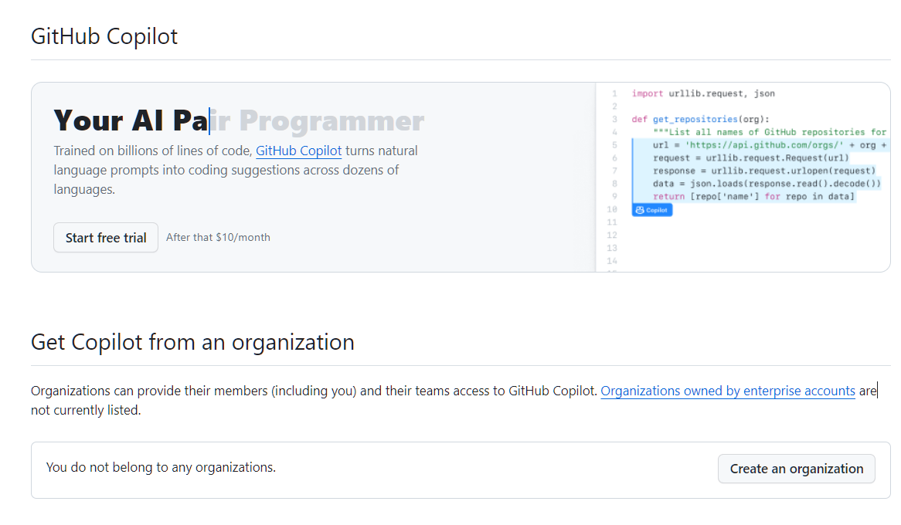
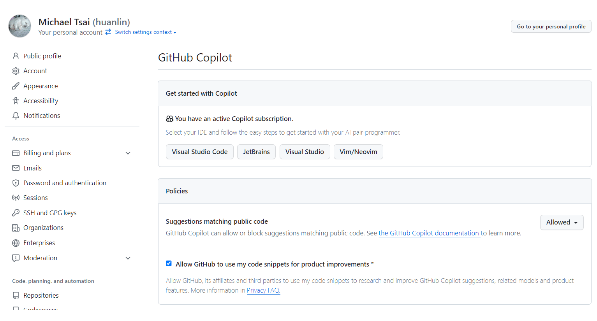
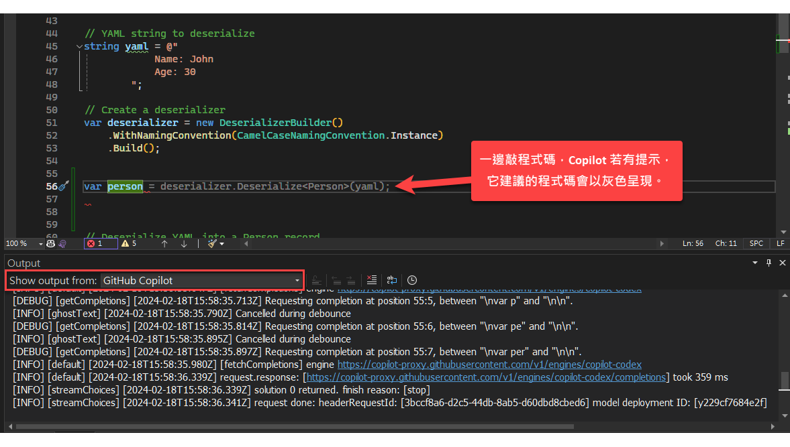
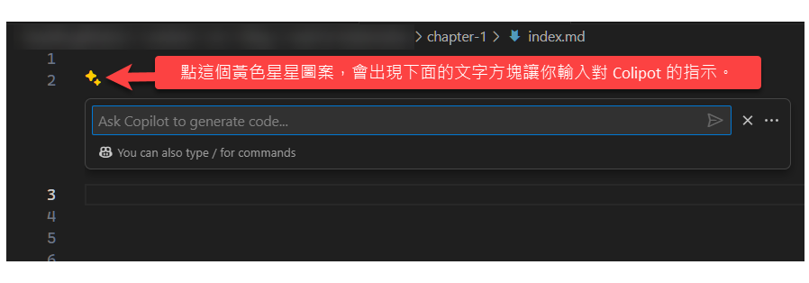
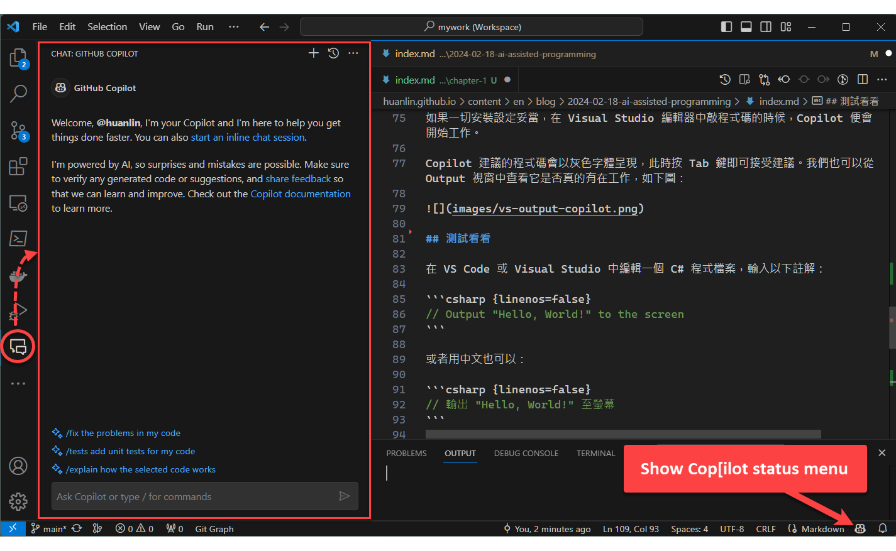

超級 lag 的我，終於也開始用 Copilot 啦。

## 簡介

### Copilot 能做什麼？

當我們寫程式的時候，Copilot 會在背後忙著推測我們的意圖，並適時提供它建議的程式碼。

除了幫我們產生程式碼（包括單元測試、SQL 查詢等等），Copilot 還能夠：

- 解釋程式碼（產生註解）。
- 重新組織程式碼，使其更易讀易懂。
- 自動找出程式中的 bug 並給予修正。

亦可參考官網的展示動畫來了解 Copilot 的功能：<https://github.com/features/copilot>。

### 如果沒有 Copilot...

如果沒有 Copilot 這類工具，我們寫程式的時候如果想要借助搜尋引擎或 AI 來找答案，通常會至少開兩個視窗：一個用於編寫程式碼，另一個用於詢問 Google 或 ChatGPT，或者其他網路論壇、文件等等。

在比較古早的年代，上述做法大致堪用。但以目前的生態環境，開發人員同時要會兩三種甚至更多種程式語言，已是司空見慣，而且程式語言的語法不斷演進和增加，再加上各式各樣的 API、SDK、類別庫等用法，如果沒有 Copilot 隨時提供提示，光是查 Google 或者問 ChatGPT，生產力恐怕很難跟得上別人。

## 啟用 Copilot

Copilot 是 GitHub 提供的訂閱制 AI 服務，逐月或逐年收費。如果要啟用 Copilot 服務，需要先登入 GitHub 帳號，然後開啟以下網址便可查看自己帳戶的 Copilot 服務狀態：

https://github.com/settings/copilot

如果你的 GitHub 帳戶尚未訂閱 Copilot 服務，看到的頁面會像這樣：



點擊 Start free trial 按鈕可以免費試用 30 天，但啟用之前必須先輸入你的信用卡資料。試用期限結束後，便會自動從你的信用卡扣款。

> 為何 Copilot 要收費？因為它背後所倚賴的 GPT3 模型的訓練成本很高。

若已經訂閱，頁面看起來會類似以下截圖：



點左邊面板的 Billing and plans，展開的選單可讓你查看你的帳單資訊、管理用量限制、設定付款方法等等。

啟用 Copilot 訂閱服務之後，便可以開始在 VS Code、Visual Studio 等 IDE 工具中安裝 Copilot 擴充功能，然後開始體驗寫程式的時候有 AI 助手隨時從旁協助的威力。

在開始之前，有一個小提醒（你大概早就知道了）：Copilot 提供的程式碼不見得符合你當下的意圖、程式語法不一定完全正確。你也可能會發現，有時候它提供的程式碼雖然能 work，但使用了比較老舊的語法。

總之：不要完全信任 Copilot。

## 安裝 Copilot 擴充功能

Copilot 官方文件提供了 VS Code、Visual Studio、JetBrains 等 IDE 的安裝說明，可由此進入：[Getting started with GitHub Copilot](https://docs.github.com/en/copilot/using-github-copilot/getting-started-with-github-copilot)，然後從頁面上方選擇你使用的 IDE。

我在 VS Code 和 Visual Studio 都安裝了以下擴充功能：

- [GitHub Copilot](https://marketplace.visualstudio.com/items?itemName=GitHub.copilot)
- [GitHub Copilot Chat](https://marketplace.visualstudio.com/items?itemName=GitHub.copilot-chat)

我的 Visual Studio 還有安裝 [Visual chatGPT Studio extension](https://marketplace.visualstudio.com/items?itemName=jefferson-pires.VisualChatGPTStudio)。

### For Visual Studio

如果是 Visual Studio，有兩個使用須知：

- 必須是 Visual Studio 2022 17.6 或之後的版本才有支援 Copilot。
- 在 Visual Studio 中安裝好 Copilot extension 之後，還必須加入你的 GitHub 帳號：從主選單點擊 **File > Account Settings...**。詳細步驟請參考：[Adding public GitHub accounts](https://learn.microsoft.com/en-us/visualstudio/ide/work-with-github-accounts?view=vs-2022#adding-public-github-accounts)

如果一切安裝設定妥當，在 Visual Studio 編輯器中敲程式碼的時候，Copilot 便會開始工作。

Copilot 建議的程式碼會以灰色字體呈現，此時按 Tab 鍵即可接受建議。我們也可以從 Output 視窗中查看它是否真的有在工作，如下圖：



## 測試看看

在 VS Code 或 Visual Studio 中編輯一個 C# 程式檔案，輸入以下註解：

```csharp {linenos=false}
// Output "Hello, World!" to the screen
```

或者用中文也可以：

```csharp {linenos=false}
// 輸出 "Hello, World!" 至螢幕
```

當你敲下最後一個字，按 Enter 之後（插入新行），Copilot 應該就會在下一行出現建議的程式碼：

```csharp {linenos=false}
Console.WriteLine("Hello, World!");
```

一旦確定 Copilot 能正常工作，之後就可以快樂使用了。

> 三不五時可能要登入 GitHub 網站查看用量和費用。

當你在 VS Code 編輯器中敲入文字時，如果看到如下圖的星星圖案，可以用滑鼠點一下來打開 inline chat 文字框，然後對 Copilot 下達指令。



這個 inline chat 功能是由 GitHub Copilot Chat extension 提供。你也可以從 VS Code 的 Activity Bar 開啟 Chat 面板，如下圖所示：



## 結語

- Copilot 強大好用，能大幅提高生產力。
- 開發人員還是必須有程式語言的基礎，並給予更具體、精確的提示。
- 不能完全信任 Copilot；自己一定要確認和測試。
