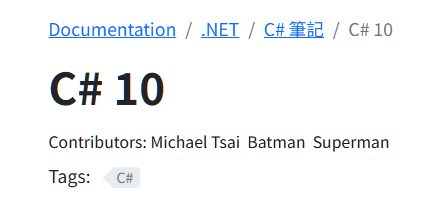

This post describes how to add contributors to each page by modifying Docsy's default content template.

## Prerequisites

The website must be created with the Docsy template. (Docsy v0.9 or later)

## Objective

The objective is to add an field named `contributors` to the page's front matter, so that rendered pages can display multiple authors' names.

The `contributors` field is a string array containing author names. Refer to the example below:

```yaml
---
title: This is an article
contributors: ["Michael Tsai", "Batman", "Superman"]
---
```

The result looks like the following figure:



The following section describes how to implement this field.

## Step 1: Modify the content template

Copy [Docsy's default content template file `content.html`](https://github.com/google/docsy/blob/main/layouts/_default/content.html) to your web site's `/layouts/_default/` folder, then add the following code before the `<header>` tag.

```go
	{{- if .Params.contributors -}}
		{{ partial "contributors.html" . }}
	{{- end -}}
```

Here is the complete code:

```go {linenos=false, hl_lines=["4-6"]}
<div class="td-content">
	<h1>{{ .Title }}</h1>
	{{ with .Params.description }}<div class="lead">{{ . | markdownify }}</div>{{ end }}
	{{- if .Params.contributors -}}
		{{ partial "contributors.html" . }}
	{{- end -}}
	<header class="article-meta">
		{{ partial "taxonomy_terms_article_wrapper.html" . -}}
		{{ if (and (not .Params.hide_readingtime) (.Site.Params.ui.readingtime.enable)) -}}
			{{ partial "reading-time.html" . -}}
		{{ end -}}
	</header>
	{{ .Content }}
	<br />
	{{ partial "page-meta-lastmod.html" . }}
    <br />
	{{ partial "feedback.html" . -}}

	<!-- Customized by Michael: Use Giscus comment system. -->
	{{- partial "giscus-comment.html" . -}}
</div>
{{/**/ -}}
```

The partial file `contributors.html` will be created in the next step.

## Step 2: Add contributors.html

Create a new file: `/layouts/partials/contributors.html`, then add the following code to the file:

```go
<div class="contributors">
    <span>Contributors: </span>
    {{- range .Params.contributors -}}
        {{ . }}&nbsp;&nbsp;
    {{- end -}}
</div>
```

The above template simply displays each contributor's name.

## Step 3: Add CSS

Edit `/assets/scss/_styles_project.scss` and add the following CSS:

```css
.contributors {
  color: var(--md-primary-fg-color);
  font-size: 0.9rem;
  margin-bottom: 12px;
}
```

## Improvement

Instead of using simple text to display contributors, you might want to use a hyperlink. For example, each element of the `contributors` array may contains a name and an ID (say, employee ID), separated with a slash `/`.

Example:

```yaml
---
title: This is an article
contributors: ["Michael Tsai/A001", "Batman/A002"]
---
```

Then, the `contributor.html` file might look like this:

```go
<div class="contributors">
    <span>Contributors: </span>
    {{- range .Params.contributors -}}
        {{- $author := strings.Split . "/" -}}
        {{- $url := printf "http://mycompany.com/emp/%s" (index $author 0) -}}
        <a href={{ $url }} target="_blank">{{ $author 1 }}</a> &nbsp;&nbsp;
    {{- end -}}
</div>
```

## Final words

Note that the `contributors` attribute is added to the default layout, so it will not be applied to blog posts unless you modify the `/layouts/blog/content.html` file as well.
