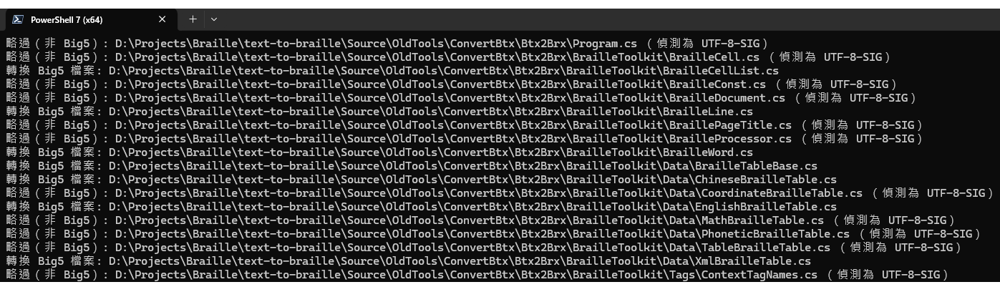

## 前言

在利用 [Gemini CLI](https://blog.google/intl/zh-tw/products/cloud/gemini-cli-your-open-source-ai-agent/) 幫我整理舊專案的程式時，我發現有些被 Gemini CLI 改過的檔案，裡面的中文字會變成亂碼。這才知道它目前並未支援檔案編碼的偵測，而是一律把修改過的檔案以 UTF-8 編碼來儲存，因而導致某些原先以 Big5 編碼的檔案內的中文字變成亂碼。若要手動一個個轉檔，太耗時費力了，也容易遺漏。於是，我透過 ChatGPT 的幫助產生了兩個指令腳本來解決這個問題。

---

**目標：** 批次轉換檔案的編碼，從 Big5 轉換成 UTF-8。（稍加修改之後也能用來處理其他編碼的轉換）

**前提：** 必須先偵測檔案的編碼是否為 Big5，是的話才能轉換成 UTF-8 編碼。不能任何檔案拿來就直接轉成 UTF-8，否則檔案裏面的中文字（或其他語言的字元）可能會變成亂碼。

此解法是問 ChatGPT 得到的。過程大致如下：

1. 詢問 ChatGPT 解法，條件是要能一次大量轉換指定目錄下的所有檔案（包含子目錄）。ChatGPT 提供的幾個解法當中，有一個是 PowerShell 命令，可一次將多個檔案的編碼一律轉換成 UTF-8。
2. 從 GitHub 上面找到一個開源工具 [chardet](https://github.com/chardet/chardet) 有支援偵測 Big5 編碼，而且準確率是足夠可靠的。
3. 請 ChatGPT 修改步驟 1 生成的 PowerShell 指令，在將檔案編碼轉換成 UTF-8 之前，先調用 chardet 的編碼偵測結果來判斷檔案是否為 Big5，是的話才執行轉換。若檔案不是 Big5 編碼則略過。

## 執行過程

執行過程的細節也是 ChatGPT 提供的。

### Step 1. 安裝 chardet

首先要在電腦上安裝 [chardet](https://github.com/chardet/chardet)：

```bash
pip install chardet
```

### Step 2. 用來偵測檔案編碼的 Python 腳本

將以下 Python 程式碼儲存為 `detect_encoding.py`：

```python
# detect_encoding.py
import sys
import chardet

def detect_encoding(file_path):
    with open(file_path, 'rb') as f:
        raw = f.read(100000)  # 讀前100KB
    result = chardet.detect(raw)
    print(result['encoding'])

if __name__ == "__main__":
    if len(sys.argv) < 2:
        print("Usage: python detect_encoding.py <file_path>")
    else:
        detect_encoding(sys.argv[1])
```

假設將此檔案儲存於 **`d:/work/`** 目錄下。下一個步驟的 PowerShell 指令也會放在此目錄下。

### Step 3. 建立 PowerShell 批次轉檔腳本

以下 PowerShell 指令會搜尋當前目錄及其所有子目錄下所有符合指定類型的檔案（`*.txt`、`*.cs`、`*.md`），然後將編碼為 Big5 的檔案轉換成 UTF-8。

```powershell
# 設定 Python 路徑與偵測編碼的 Python 腳本路徑
$pythonPath = "python"  # 或指定完整路徑，如 C:\Python39\python.exe
$detectScript = "d:\work\detect_encoding.py"

# 產生 UTF-8 with BOM 編碼器
$utf8Encoding = New-Object System.Text.UTF8Encoding($true)

# 處理多個副檔名：.txt, .cs, .md
$extensions = @("*.txt", "*.cs", "*.md")

foreach ($ext in $extensions) {
    Get-ChildItem -Recurse -Filter $ext | ForEach-Object {
        $file = $_.FullName
        try {
            $detectedEncoding = & $pythonPath $detectScript $file
        } catch {
            Write-Host "偵測編碼失敗：$file"
            return
        }

        if ($detectedEncoding -eq "Big5") {
            Write-Host "轉換 Big5 檔案: $file"

            $big5Encoding = [System.Text.Encoding]::GetEncoding("big5")
            $bytes = [System.IO.File]::ReadAllBytes($file)
            $text = $big5Encoding.GetString($bytes)

            [System.IO.File]::WriteAllText($file, $text, $utf8Encoding)
        }
        else {
            Write-Host "略過（非 Big5）: $file （偵測為 $detectedEncoding）"
        }
    }
}
```

使用之前，請先確認：

- `$detectScript` 變數是否指向正確路徑。
- `$extensions` 變數是否包含所有需要處理的檔案類型。

然後將指令儲存為 `d:/work/big5-to-utf8.ps1`，準備在下一個步驟執行真正的轉換工作。

> [!CAUTION]
> 此指令會直接覆蓋原始檔案！如果你覺得這樣不保險，請務必先備份檔案，放自行修改指令，將轉換過的檔案存放至其他資料夾。

### Step 4. 執行

執行時，先切換當前路徑至需要轉換編碼的檔案所在的目錄，然後執行上一個步驟的 PowerShell 指令。

```powershell
cd d:\Projects\MyApp
d:\work\big5-to-utf8.ps1
```

以下截圖展示了執行結果：



從圖中可以看到，不是 Big5 編碼的檔案會略過。因此，如果在同一個目錄下重複執行這個腳本，那麼第二次執行的結果應該是全部的檔案都被略過，因為第一次執行時就已經把需要轉換的檔案都轉成 UTF-8 編碼了。

Job done! Keep learning with AI.
