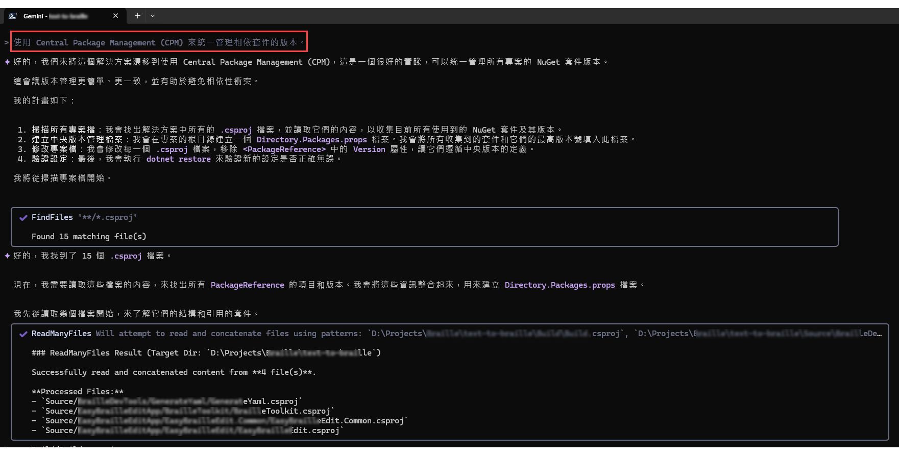
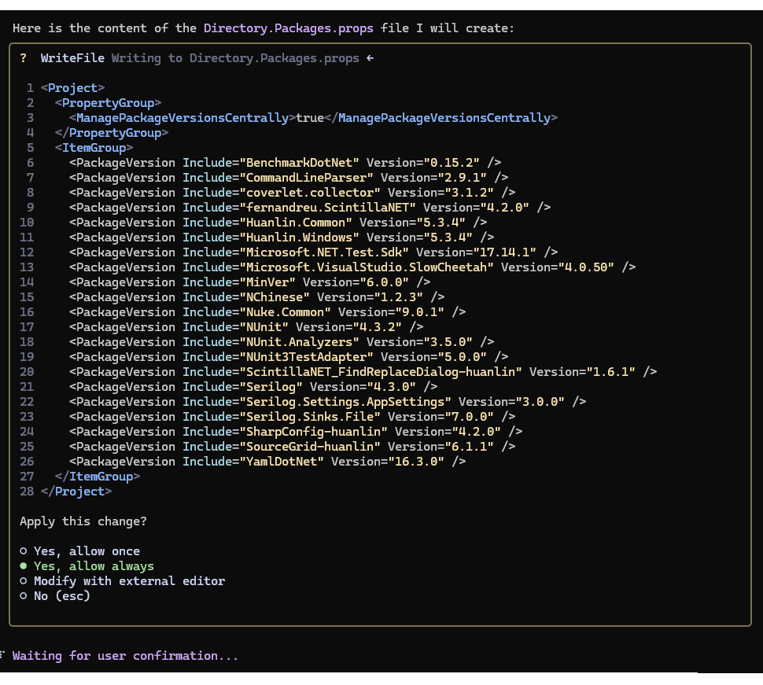

**摘要：** 此筆記整理了幾個我用來重構和改進 .NET 專案的 Gemini CLI 提示詞。

## 背景知識

您需要先了解[什麼是 Gemini CLI](https://blog.google/intl/zh-tw/products/cloud/gemini-cli-your-open-source-ai-agent/)，而且知道[如何安裝和啟動它](https://github.com/google-gemini/gemini-cli?tab=readme-ov-file#quickstart)。

> [!NOTE]
> 雖然本文是針對 Gemini CLI 而寫，但提示詞應該也適用於其他具備相似能力的 AI agents。


## 限制與注意事項

寫作此文時，Gemini CLI 並**未具備**偵測檔案字元編碼且自動「**無損**」轉換成 UTF-8 編碼的能力。它會將修改過的檔案都一律儲存成 UTF-8 編碼，<mark>這可能造成某些非 UTF-8 編碼的檔案中的字元變成亂碼。</mark>

因此，在給 Gemini CLI 改造程式碼之前，請務必先把那些檔案的字元編碼改為 UTF-8。具體做法可參考這篇文章：[批次轉換檔案編碼（Big5 至 UTF-8）](https://www.huanlintalk.com/2025/06/batch-convert-file-encoding.html)。

> [!IMPORTANT]
> 由 AI 工具改動的程式碼一定要逐一 review 其修改結果。例如以 Git Diff 逐一查看修改前後的差異。

以下各節為提示詞。使用前，請先將當前路徑切換至你的 .NET 專案或 repository 的所在目錄，然後再啟動 Gemini CLI。

## 第一步：總結專案

先用以下提示來讓 AI agent 替你的專案進行程式架構的分析與總結：

```text
分析此 solution 的程式架構，列出可改進之處。
```

然後，從 AI 總結的輸出結果當中，再逐條針對個別改善建議對 AI agent 提出具體的問題。或者，您也可以參考以下各小節的常用提示，直接複製或稍加修改後餵給 AI agent。

這裡先讓 Gemini CLI 建立 GEMINI.md 的用意是維護一個清楚、結構化的專案背景文件，這有助於 Gemini 模型更準確地理解並執行你的開發需求，也可以減少每次溝通時都要重新解釋需求，提高效率與一致性。

GEMINI.md 檔案中可以包含以下資訊：

- 專案的目的
- 架構概述
- 資料模型
- 特定規範（例如命名規則）
- 建置與部署方法
- 技術限制或預期輸出
- 其他注意事項

## Project and package

本節包含專案與套件管理相關的提示。

### 使用 Central Package Management

```text
使用 Central Package Management (CPM) 來統一管理相依套件的版本。
```

> See also: [Central Package Management (CPM)](https://learn.microsoft.com/en-us/nuget/consume-packages/central-package-management)

下圖展示了此提示實際執行的輸出結果：



最後，Gemini CLI 會問你是否可以真的開始修改你的檔案：



放心的話，可以選擇 "Yes, allow always"，即一路開綠燈讓 Gemini CLI 一口氣把工作全部執行完畢。

### Target framework

```text
更新目標框架為 net9.0，並修正不相容的 API。
```

### 找出未使用的 NuGet 套件

```text
分析此專案，找出可能未被使用到的 NuGet 套件並列出清單。
```

## CI/CD

```text
建立 GitHub Actions workflow 來建置和發布此專案。
```

```text
檢查 GitHub Actions workflow，看看有沒有不恰當的地方，例如打包 package 時不應該連同測試專案的 DLL 也一併打包和發布。
```

### 使用 MinVer

```text
使用 MinVer 套件來自動管理此專案的建置與發布時的版本編號，並且視需要修改 GitHub Actions workflow。
```

## Code readability

本節包含程式碼可讀性相關的提示。

### File-scoped namespaces

```text
轉換此專案中所有的 C# 檔案為 file-scoped namespaces，以減少巢狀。
```

### 重構方法

```text
重構 [檔案路徑] 中的 [方法名稱] 方法，以提高可讀性和降低圈複雜度 (cyclomatic complexity)。
```

### 格式化程式碼

```text
執行 dotnet format 命令來自動化程式碼排版，使其風格保持一致。
```

### 產生註解

```text
為 [檔案路徑] 內的 [類別名稱] 中所有 public 方法和屬性產生 XML 文件註解 (XML documentation comments)。
```

## Unit tests

```text
為此專案加入單元測試。
```

為特定方法產生單元測試：

```text
閱讀 [檔案路徑] 中的 [類別名稱] 類別，並為 [方法名稱] 方法編寫一個 xUnit 或 NUnit 的單元測試檔案。
```

> 曾經，Gemini 幫我生成的單元測試沒有辦法通過測試。查看了那些失敗的測試函式，全都是跟加解密演算法有關的，像是 DES、AES 等等。也許可以反覆用不同的提示令 AI 修正測試程式直到可以通過測試，當時我的選擇是手動去修改它生成的單元測試，並自行驗證，直到全都通過測試。

## Optimizations

本節包含程式效能優化相關的提示。

### 使用 `async/await`

```text
分析 [檔案路徑]，將同步的 I/O 操作 (如 File.ReadAllText, HttpClient.GetAsync().Result) 改為非同步的 async/await 模式。
```

### 使用 `StringBuilder`

```text
找出 [檔案路徑] 中在迴圈內使用 + 或 += 進行字串串接的地方，並將其重構為使用 StringBuilder。
```

## Best practices

本節包含最佳實踐的提示。

### 啟用 Nullable 參考型別

```text
在 [專案檔.csproj] 中啟用可為 Null 參考型別 (Nullable Reference Types)，然後修復因此產生的編譯警告。
```

---

先這樣，有新的再補上。

Keep coding with AI 😊
