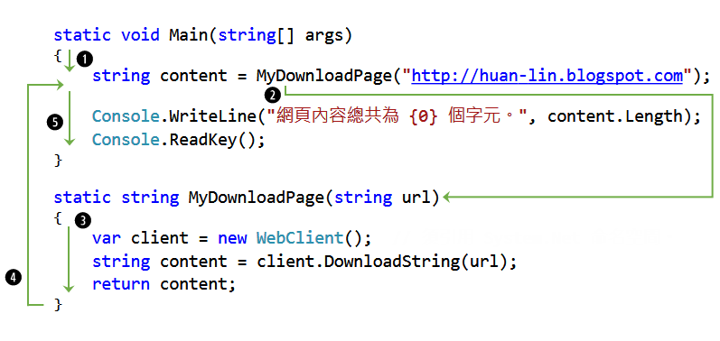
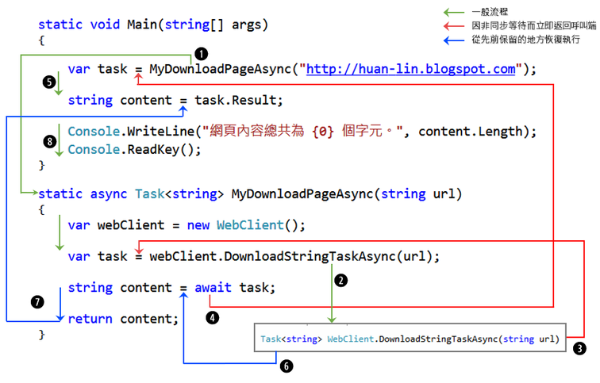

讀過上一章所概略介紹的&nbsp;.NET 平台從過去到現在的幾種非同步程式設計模型之後，相信你對非同步工作已經有了一些基礎概念。你應該也知道了，現行&nbsp;.NET 平台上面所建議使用的非同步程式設計模型 **TAP**（Task-based Asynchronous Programming）是基於 **TPL**（Task Parallel Library）這組 API，而它們的最重要核心則是用來代表非同步工作的 `Task` 類別（及其子類別 `Task<TResult>`）。至於 C# 的 `async` 與 `await` 關鍵字，則是讓非同步程式更容易撰寫與閱讀的語法——有了這些語法，我們才能
夠以比較接近同步呼叫的語法來撰寫和呼叫非同步方法。

由於 `Task` 很重要，本章一開始仍要延續這個議題，介紹非同步工作的**延續**（continuation），然後再進入 `async` 與 `await` 語法。

在閱讀本章前，你至少要知道：

- 執行緒（thread）的基礎觀念，例如：主執行緒（main thread）、執行緒同步化（synchronization）。
- 何謂 TAP、TPL、以及非同步工作（task）。

以上基礎觀念已經在前面兩章介紹過。

> 本章範例程式的原始碼位置：
> <https://github.com/huanlin/async-book-support> 裡面的 Examples/ch03 資料夾。

---

## 基礎觀念：控制流

在進入 `async` 和 `await` 語法之前，我想先提一個名詞：控制流（control flow），以作為後續討論的暖身。

以底下這段程式碼為例：

```cs
int x = 10;
Console.WriteLine(x);
```

程式執行時，它會是一個單純的、同步的控制流。當第 1 行程式碼執行完畢，接著會執行第 2 行程式碼。換言之，第 2 行程式碼是接著發生的工作。由許多程式敘述所依序連接起來的一連串工作，便形成了一條控制流。

如果利用 TPL（Task Parallel Library）的 `Task` 類別來建立背景工作，就會像是當前的控制流上面再岔開一條新的控制流。例如：

```cs
static void Main()
{
    // 應用程式的第一條控制流
    Console.WriteLine("程式開始");
    Task task = Task.Run(() =>
        {
            MyTask(); // 這個程式區塊會執行在另一條控制流。
        });
    Console.WriteLine("程式結束");
}
```

此範例程式執行時會有兩條控制流。一開始有一條主要的控制流（主執行緒），在執行第 5 行的時候，便會分出另一條控制流來執行 `MyTask()` 函式。而 `MyTask()` 在另一條控制流上面可能還沒跑完，應用程式的主要控制流可能就已經往下執行到 `Main()` 函式結尾的地方了。

由於這兩條控制流是分頭並進（非同步進行），而且無法確定誰先執行完畢（每次的執行結果可能不同），因此，非同步程式在撰寫與理解方面，會比單一控制流（單執行緒）的程式來得困難。其中一個麻煩的地方，就是多條控制流該如何適當地匯集，或者說，如何讓某個非同步工作完成之後接續執行另一個非同步工作。

這裡要特別說明的是，控制流與 `Task` 是比「執行緒」更抽象的概念。TPL 的 `Task` 物件即代表「非同步工作」，但不等同於「執行緒」—— 使用 `Task` 物件時，CLR 會自動幫你管理執行緒，這樣你就不用透過 `Thread` 類別去處理許多與執行緒管理的瑣碎細節。

接下來，我們要開始介紹 C# 的 `async` 和 `await` 語法了。

## Hello, async / await

這裡先用一個簡單的 console 應用程式來示範如何將一個採用同步呼叫的程式碼改成非同步呼叫的版本，使用的語法是 C# 的 `async` 與 `await` 關鍵字。接著會展示非同步程式設計的一個常見陷阱：鎖死（deadlock），並探討其原因。在探究問題的過程中，你將會了解什麼是 `SynchronousContext`，以及它和 UI 執行緒之間的關係。

%%本節將透過一個範例的修改過程來示範如何將原本的同步呼叫的程式碼改成非同步的版本。你會在這一節裡面了解 C# 的 `async` 與 `await` 關鍵字的用法以及非同步呼叫的執行流程。

### 範例：同步呼叫

先來看一個同步呼叫的範例。程式碼如下：

```cs
using System;
using System.Net;

......

static void Main()
{
    string content = MyDownloadPage("https://www.huanlintalk.com");

    Console.WriteLine("網頁內容總共為 {0} 個字元。", content.Length);
    Console.ReadKey();
}

static string MyDownloadPage(string url)
{
    using (var wc = new WebClient())
    {
        string content = wc.DownloadString(url);
        return content;
    }
}
```


> 此範例程式的專案：Ch03/Ex01_Sync.csproj

此 Console 應用程式範例有一個 `MyDownloadPage` 方法，它會透過&nbsp; .NET 的 `WebClient.DownloadString()` 來取得指定 URL 的網頁內容，並傳回呼叫端。各函式的執行順序如下圖，由於全都採用同步呼叫的寫法，程式的控制流只有一條，應該很容易理解，無需多加解釋。



接著使用 C# 的 `async` 與 `await` 關鍵字來把這個範例修改成非同步呼叫的版本。

### 範例：非同步呼叫

原本的 `MyDownloadPage` 是同步呼叫的寫法，底下是改成非同步呼叫的版本：

```cs
using System;
using System.Net;
using System.Threading.Tasks;

......

leanpub-start-delete
static string MyDownloadPage(string url)
leanpub-end-delete
static async Task<strin>  MyDownloadPageAsync(string url)
{
    using (var wc = new WebClient())
    {
        string content = wc.DownloadStringTaskAsync(url);
        return content;
    }
}
```

除了引用 `System.Threading.Tasks` 命名空間，在宣告 `MyDownloadPageAsync` 方法的地方有三處修改：

1. 宣告方法時加上關鍵字 `async`，即告訴 C# 編譯器：這是一個非同步方法，裡面會用到 `await` 關鍵字。
2. 以 `async` 關鍵字宣告的方法若有回傳值，回傳的型別須以泛型 `Task<T>` 表示。原先同步版本的方法是傳回 `string`，故此處改為 `Task<strin> `。非同步方法若不需要傳回值，則回傳型別應寫成 `Task`，而不要寫 `void`（原因後述）。
3. 一般而言，非同步方法的名稱會以「Async」結尾，故將方法名稱改為 `MyDownloadPageAsync`。

> [!note]
> 也許你注意到了，.NET 的 `WebClient.DownloadStringTaskAsync()` 方法名稱是以 "TaskAsync" 結尾。這是因為，在 TAP 出現之前，.NET 已經有提供 EAP（基於事件的非同步模式，見第 2 章）的版本：`DownloadStringAsync`。因此，在增加 TAP 的非同步版本時，只好以 "TaskAsync" 結尾的方式來命名。

接著來看方法的實作。先前同步版本的這行程式碼：

```cs
string content = client.DownloadString(url); // 同步呼叫
```

改成：

```cs
// 呼叫並等待非同步工作的執行結果
string content = await wc.DownloadStringTaskAsync(url);
```

或者也也可以拆成兩行來寫：

```cs
Task<strin>  task = wc.DownloadStringTaskAsync(url);
string content = await task; // 等待非同步工作的執行結果
```

說明：

1. 原本呼叫 `WebClient` 類別的 `DownloadString` 方法，現在改呼叫它提供的非同步版本：`DownloadStringTaskAsync`。與其他非同步 I/O 方法類似，`DownloadStringTaskAsync` 方法的內部會起始一個非同步 I/O 工作，而且不等該工作完成便立即返回呼叫端；此時傳回的物件是個 `Task<strin> `，代表一個將傳回 `string` 的非同步 I/O 工作。
2. 使用 `await` 關鍵字來等待非同步工作執行完畢，然後取得其執行結果。這裡的「等待」，是採取「非同步等待」的作法，意思是說，使用了關鍵字 `await` 的地方會暫且記住 `await` 敘述所在的位置，並且令程式控制流程立刻返回呼叫端繼續往下執行；直到呼叫端需要取得非同步工作的執行結果時，控制流才又會回到剛剛 `await` 暫且保留而未執行的程式碼，等待那個非同步工作執行完畢，並傳回其執行結果。

---

最後來看呼叫端，也就是 `Main` 函式。

```cs
static void Main(string[] args)
{
leanpub-start-delete
    string content = MyDownloadPage("https://www.huanlintalk.com");
leanpub-end-delete
leanpub-start-insert
    Task<strin>  task = MyDownloadPageAsync("https://www.huanlintalk.com");
leanpub-end-insert
    string content = task.Result; // 取得非同步工作的結果。

    Console.WriteLine("網頁內容總共為 {0} 個字元。", content.Length);
    Console.ReadKey();
}
```

這裡也是先取得非同步方法 `MyDownloadPageAsync` 所傳回的 `Task` 物件。但這一次是用 `Task` 的 `Result` 屬性來取得非同步工作的執行結果，而不是寫成 `await task`。其實這裡不能使用 `await` 關鍵字，因為有用到 `await` 的函式都必須在宣告時加上 `async` 關鍵字，否則無法通過編譯 ——這是 C# 非同步語法的一個特性，也是一個小麻煩：async 方法具有傳染性，亦即整個呼叫鍊必須從頭到尾都是 async 方法。

> 也許你已經知道，C# 從 7.1 版開始便加入了 `async Main` 語法。先別著急，稍後會把上述範例用新語法修改一下。

前面提過，「`await` 某件工作」的寫法會令控制流立刻返回呼叫端。相較之下，「讀取 `Task` 物件的 `Result` 屬性」則是阻斷式（blocking）操作，也就是說，它會令當前的執行緒暫停，直到欲等待的工作執行完畢並傳回結果之後，才繼續往下執行。

至此，原先採用同步呼叫的程式碼已經全部改成非同步的寫法。最後再以下面這張圖來呈現完整程式碼以及程式執行時的控制流：



> 上圖若無法清楚顯示在你的裝置上，請使用此連結查看原圖：<http://bit.ly/1QE2kIU>

圖中有綠、紅、藍三種不同顏色的箭頭，綠色箭頭代表一般流程，紅色箭頭代表因為非同步等待而立即返回呼叫端的控制流，藍色箭頭則代表從先前 `await` 所保留的地方恢復執行的控制流。請先別把這些不同顏色的箭頭想成不同的執行緒，稍後會再修改此範例來顯示這些控制流所在的執行緒。

圖中的控制流箭頭旁邊標有數字，分別說明如下：

1. 在 `Main` 中呼叫 `MyDownloadPageAsync` 方法。
2. 在 `MyDownloadPageAsync` 方法中，呼叫 `WebClient.DownloadStringTaskAsync` 方法時，該方法會在內部起始一個非同步 I/O 工作來取得指定 URL 的網頁內容。
3. `WebClient.DownloadStringTaskAsync` 方法一旦起始了內部的非同步 I/O 工作，就會立刻返回呼叫端，並傳回一個代表那件非同步工作的 `Task` 物件。
4. 碰到 `await` 時，立刻返回呼叫端（`Main` 函式），並傳回一個 `Task` 物件。
5. 在 `Main` 函式中以原先的控制流繼續執行程式。此時碰到了 `task.Result`，欲取得非同步工作的結果。這是個阻斷式呼叫，必須等待目標工作完成才能繼續往下執行。
6. 在某個時間點，`WebClient.DownloadStringTaskAsync` 方法終於完成了它內部的非同步 I/O 工作，並且取得了結果，於是控制流切回來先前 (4) 所在之 `await` 敘述所保留的程式區塊並繼續執行。
7. 把 `WebClient.DownloadStringTaskAsync` 的結果指派給 `content` 變數，然後返回呼叫端。
8. 回到 `Main` 函式，把非同步工作的執行結果輸出至螢幕。

> 此範例程式的專案：Ch03/Ex02_Async.csproj
> 亦可參考線上範例：<https://dotnetfiddle.net/24kSYR>

上述說明當中有提到幾個重點，接著用一個小節再詳細整理一遍。

## 關鍵字 `async` 與 `await` 的作用

前面提過，在宣告方法時加上關鍵字 `async`，即表示它是個非同步方法。其實 `async` 的作用也真的就只有一個，那就是告訴編譯器：「這是個非同步方法，裡面可以、而且應該要使用關鍵字 `await` 來等待非同步工作的結果。」

方便閱讀起見，再貼一次前面的非同步版本的範例：

```cs
static async Task<strin>  MyDownloadPageAsync(string url)
{
    using (var webClient = new WebClient())
    {
        string content = await webClient.DownloadStringTaskAsync(url);
        return content;
    }
}
```

請注意，程式的控制流一開始進入非同步方法時，仍是以同步的方式執行，而且是執行於呼叫端所在的執行緒；直到碰到 `await` 敘述，控制流才會一分為二。

> [!note]
> **誤解**：程式執行時，一旦進入以 `async` 關鍵字修飾的方法，就會執行在另一條工作執行緒上面。
>
> **正解**：函式宣告時加上 `async` 關鍵字僅表示該函式可以包含 `await` 表達式，且該函式允許以非阻斷（non-block）方式進行非同步呼叫。

基本上，我們可以這樣來理解：`await` 之前的程式碼是一個同步執行的程式區塊，而 `await` 敘述之後的程式碼則為另一個同步執行的程式區塊（這塊程式碼會在 await 所等待的工作完成之後才執行）。

一個以 `async` 關鍵字修飾的非同步方法裡面可以有一個或多個 `await` 敘述。按照先前的講法，若非同步方法中有兩個 `await` 陳述句，即可以理解為該方法被切成三個控制流（三個各自同步執行的程式區塊）。若非同步方法中有三個 `await` 陳述句，則表示該方法被切成四個控制流，依此類推。

> 碰到 `await` 時，控制流會立刻返回呼叫端，而 `await` 之後的程式碼則會暫時保留，直到 `await` 所等待的非同步工作完成後，才會從剛才暫時保留的地方恢復，繼續執行後面的程式碼（即被 `await` 切開的後半部分）。

在回傳值的部分，非同步方法比較常見的回傳型別有：

- `Task`：適用於沒有回傳值的場合。
- `Task<T>`：適用於有回傳值的場合。回傳值的型別帶入泛型參數 `T`，例如 `Task<strin> `。
- `ValueTask<T>`：類似 `Task<T>`，但它是實質型別（value type），物件實體是存放於堆疊（stack），而不像參考型別 `Task<T>` 那樣需要從堆積（heap）配置記憶體空間。使用堆疊空間的好處是可以減輕額外配置與回收記憶體的負荷，從而提高程式的執行效能（當然要用對場合才有這個好處）。
- `IAsyncEnumerable<T>` 和 `IAsyncEnumerator<T>`：用於回傳多個物件。

> `ValueTask<T>` 是從 .NET Core 2 開始出現。.NET Framework 4.x 沒有這個型別。

## 避免使用 `async void`

非同步方法雖然可以宣告為 `void`，但此寫法通常只用於事件處理常式。一般而言，應避免使用 `void` 來宣告沒有回傳值的非同步方法。

無回傳值的非同步方法不應宣告為 `async void` 的一個重要原因，是這種寫法會令呼叫端捕捉不到非同步方法所拋出的異常。參考以下範例：

```cs
static void Main(string[] args)
{
    try
    {
        TestVoidAsync();
    }
    catch (Exception ex) // 捕捉不到 TestVoidAsync 方法拋出的例外!
    {
        Console.WriteLine(ex);
    }
}

static async void TestVoidAsync()
{
    await Task.Delay(0); // 只是為了讓此方法有用到 await 陳述式。
    throw new Exception("error");
}
```

> 此範例程式的專案：Ch03/Ex03_AsyncVoid.csproj

第 15 行的 `await Task.Delay(0)` 其實沒有什麼作用，只是單純為了讓這個 `async` 方法裡面有用到 `await` 陳述式罷了。

執行此範例程式時，應用程式會立即正常結束，因為 `Main` 函式中的 `try...catch` 陳述式捕捉不到 `TestVoidAsync` 方法所拋出的例外。

另外要注意的是，以 `async` 關鍵字修飾的方法，其傳入參數有個規則：不可使用 `ref` 或 `out` 修飾詞。若違反此規則，程式將無法通過編譯。稍微想一下，此限制的確合理，畢竟非同步方法返回呼叫端時，可能還有程式碼尚未執行完畢，亦即輸出參數的值不見得已經設定好，故對於呼叫端而言不具意義。

## Async Main 方法

先前範例程式的 `Main` 方法都是宣告為 `void`，這使得我們無法在 `Main` 方法中使用 `await` 語法來獲取非同步工作的執行結果，而得用 `Task.Result` 屬性。C# 7.1 開始加入的 Async Main 語法便解決了這個問題，讓我們在程式的進入點也能使用 `async` 和 `await` 語法。

底下是改用此語法之後的範例程式：

```cs
static class Program
{
    static async Task Main()
    {
        var url = "https://www.huanlintalk.com";
        var content = await MyDownloadPageAsync(url);
        Console.WriteLine("網頁內容總共為 {0} 個字元。", content.Length);
    }

    static async Task<strin>  MyDownloadPageAsync(string url)
    {
        using (var wc = new WebClient())
        {
            return await wc.DownloadStringTaskAsync(url);
        }
    }
}
```

> 此範例程式的專案：Ch03/Ex04_AsyncMain.csproj

實際修改的地方只有第 3 行的 `async Task` 宣告，以及第 6 行的  `await` 陳述句。

---

到目前為止，不知道你是否覺得腦袋裝了太多東西、一時之間難以消化？由於非同步程式本來就比單一控制流來得複雜，所以無論是語法或程式碼的執行順序，都需要一些時間去熟悉、理解，甚至需要一點想像力。如果碰到疑問，最好的辦法就是寫一點程式碼來觀察執行結果，以驗證自己的理解是否正確。

## 觀察執行緒切換過程

經過前面幾個範例的說明，加上實際動手練習，相信你已經了解 `async` 和 `await` 語法的基本規則，以及它們對程式控制流程有何影響。也許你會好奇：程式碼被多個 `await` 關鍵字切成數個片段，令控制流在這些程式片段之間跳來跳去，這當中究竟有沒有建立新的執行緒？或者，哪些片段是以主執行緒來執行，哪些又是以其他工作執行緒來執行？

如果你對這些問題也感興趣，不妨試試底下的範例程式，看看結果如何。

```cs
static class Program
{
    static void Log(int num, string msg)
    {
        Console.WriteLine("({0}) T{1}: {2}",
            num, Thread.CurrentThread.ManagedThreadId, msg);
    }

    static async Task Main()
    {
        Log(1, "正要起始非同步工作 MyDownloadPageAsync()。");

        var task = MyDownloadPageAsync("https://www.huanlintalk.com");

        Log(4, "已從 MyDownloadPageAsync() 返回，但尚未取得工作結果。");

        string content = await task;

        Log(6, "已經取得 MyDownloadPageAsync() 的結果。");

        Console.WriteLine("網頁內容總共為 {0} 個字元。", content.Length);
    }

    static async Task<strin>  MyDownloadPageAsync(string url)
    {
        Log(2, "正要呼叫 WebClient.DownloadStringTaskAsync()。");

        using (var webClient = new WebClient())
        {
            var task = webClient.DownloadStringTaskAsync(url);

            Log(3, "已起始非同步工作 DownloadStringTaskAsync()。");

            string content = await task;

            Log(5, "已經取得 DownloadStringTaskAsync() 的結果。");

            return content;
        }
    }
}
```

這個版本只是在先前的範例程式中加入幾個 `Log` 呼叫，以便觀察程式執行的流程，以及每一個階段的程式碼是執行在哪一條執行緒上面（以執行緒 ID 來識別）。

> 此範例程式的專案：Ch03/Ex05_AsyncAndThreads.csproj

執行結果如下：

```text
(1) T1: 正要起始非同步工作 MyDownloadPageAsync()。
(2) T1: 正要呼叫 WebClient.DownloadStringTaskAsync()。
(3) T1: 已起始非同步工作 DownloadStringTaskAsync()。
(4) T1: 已從 MyDownloadPageAsync() 返回，但尚未取得工作結果。
(5) T9: 已經取得 DownloadStringTaskAsync() 的結果。
(6) T9: 已經取得 MyDownloadPageAsync() 的結果。
網頁內容總共為 258059 個字元。
```

其中每一行文字前面的數字代表程式執行的步驟，而 T1 和 T9 分別代表編號為 1 和 9 的執行緒（每次執行時，執行緒的編號可能不同）。說明如下：

- 步驟 (1) 至 (4) 的程式碼都是在同一條執行緒 T1 上面執行。顯然，這裡的 T1 即是此應用程式的主執行緒。
- 在 `MyDownloadPage()` 方法中，步驟 (3) 之後，碰到帶有 `await` 關鍵字的這行程式碼，就如稍早提過的，可以理解為程式的控制流由此處切開，先返回呼叫端，直到目前等待的非同步工作（即 `DownloadStringTaskAsync`）完成後，才又切回來繼續執行 `await` 之後的程式碼。因此，在步驟 (3) 之後是回到 `Main` 函式中輸出步驟 (4) 的訊息。
- 正當 `DownloadStringTaskAsync` 忙著以非同步 I/O 擷取遠端網頁內容的同時，此時 `Main` 區塊的控制流繼續執行，待碰到 `await task` 時，由於需要取得非同步工作的結果，故須在此處等待非同步工作完成，才能再繼續往下執行。
- 過了一段時間，先前以非同步呼叫的 `DownloadStringTaskAsync` 已經完成任務，並返回執行結果。此時必須從先前 `await` 切開的地方繼續執行底下的程式碼，而且會以另一條控制流來完成這個後續工作。從程式執行結果的步驟 (5) 可以看得出來，這個用來完成 `await` 後續工作的控制流是執行於另一條執行緒（T9）。
- `Main` 函式取得非同步工作的執行結果，接著輸出步驟 (6) 的訊息，程式結束。

值得一提的是，此實驗的結果僅適用於 Console 類型的應用程式，而不適用於有 UI（使用者介面）的應用程式。箇中原因，涉及了 .NET 非同步程式設計的另一個技術細節：**Synchronization Context**。下一節會繼續說分明。

## 我的程式當掉了

.NET 非同步程式設計有個通則：盡量從頭到尾都一致，亦即一旦使用了非同步呼叫，最好一路都是非同步，而不要中途由非同步呼叫改成同步（阻斷式）呼叫，例如使用 `Task.Wait` 或 `Task.Result`，因為那可能會讓你的程式鎖死（當掉）。

讓我們再做一個小實驗，把先前的 Console 應用程式範例改成像底下的 ASP.NET Web API 應用程式，看看結果會怎麼樣。

> 請注意，本節範例僅適用於傳統的 ASP.NET 4.x。若將本節範例程式放到 ASP.NET Core 環境，執行時並不會出現鎖死的狀況。

```cs
public class DemoDeadlockController : ApiController
{
    [HttpGet]
    public HttpResponseMessage DownloadPage()
    {
        var task = MyDownloadPageAsync("https://www.huanlintalk.com");
        var content = task.Result;
        return Request.CreateResponse($"網頁長度: {content.Length}");
    }

    static HttpClient _httpClient = new HttpClient();

    private async Task<strin>  MyDownloadPageAsync(string url)
    {
        var task = _httpClient.GetStringAsync(url);
        string content = await task; // 在 task 完成後，會 deadlock!
        return content;
    }
}
```


> 此範例程式的專案：Ch03/Ex06_AspNetAppDeadlock.csproj

其中有個和先前範例不一樣的地方，是用比較新的 `HttpClient` 類別來取代 `WebClient`。

當你實際執行此應用程式，並以瀏覽器開啟網址 `http://<主機名稱>/api/DemoDeadlock` 時，會發現網頁像當掉一樣，等了老半天都沒有任何回應。因為此時這個 ASP.NET 應用程式已經鎖死（deadlock）了。

為什麼會鎖死呢？

欲解答這個問題，我們必須在深入一些細節。

### `SynchronizationContext`

先說一個準則：對於像 Windows Forms、WPF、和 ASP.NET 這類有 UI（使用者介面）的應用程式，任何與 UI 相關的操作（例如更新某個 TextBox 的文字內容）都必須回到 UI 執行緒上面進行。

就拿 WPF 應用程式來說吧，當某個背景執行緒的工作已經返回結果，而我們想要將此結果顯示於 UI 物件時，就必須想辦法回到 UI 物件所在的執行緒（主執行緒）上面來進行。像這種情形，我們就說 UI 物件對特定執行緒有黏著性，也就是所謂的「**執行緒黏著性**」（thread affinity）。

`async` 和 `await` 的一個好處便在於它使用了 `SynchronizationContext` 來確保 `await` 之後的延續工作總是在呼叫 `await` 敘述之前的同步環境中執行。如此一來，在任何非同步方法中需要更新 UI 時，我們就不用額外寫程式碼來切換至 UI 執行緒了。

那麼，什麼是 `SynchronizationContext` 呢？

這裡的 `SynchronizationContext` 指的是 `System.Threading` 命名空間裡的一個類別，它代表當時的「同步環境」，而其用途在於簡化非同步工作之間的執行緒切換操作。一般來說，如果你的程式能夠從頭到尾都使用 `async` 和 `await` 來執行非同步工作，那麼你很可能不會需要用到 `SynchronizationContext`。

讀過前面幾個小節，你已經知道當我們使用 `await` 來等待某個非同步工作時，`await` 會把當時所在的程式碼區塊一分為二，並記住當時所在的位置，以便等到非同步工作完成時能夠再恢復並繼續執行後半部的程式碼。這個「記住當時所在的位置」，其實就是捕捉當時所在的執行緒環境（context）。說得更明確些，它會利用 `SynchronizationContext.Current` 屬性來取得當下的環境資訊：若不是 `null`，就會以它作為當前的環境資訊；若是 `null`，則會以當前的 `TaskScheduler`（工作排程器）物件來決定其後續的執行緒環境。換言之，這個「環境資訊」其實就是保留了先前同步區塊所在的執行緒環境（所以說成「同步環境」也行），以便在 `await` 所等待的非同步工作完成之後，能夠回到原始的（先前的）同步環境中繼續執行後續的工作。

> 具體來說，「回到原始的同步環境中繼續執行後續的工作」要如何達成呢？通常我們不太需要自行處理這個問題，若有需要，則可以透過 `SynchronizationContext` 的 `Post` 方法。至於 `Post` 方法要怎麼使用，這裡先不細說，稍後有一個 Windows Forms 的範例就會看到它的用法。

在 Console 應用程式中，`SynchronizationContext.Current` 必定為 `null`，所以在碰到 `await` 關鍵字時，會使用當前的 `TaskScheduler` 物件來決定後續的執行緒環境；而預設的 `TaskScheduler` 會使用執行緒集區（thread pool）來安排工作。這也就解釋了為什麼先前的〈觀察執行緒切換過程〉一節中的程式執行結果，`await` 敘述之後的程式碼會執行於另一條執行緒。但請注意，依執行緒集區內部的演算法而定，有時候它會認為使用新的執行緒更有效率，有時則可能會決定使用既有的執行緒。

`SynchronizationContext` 類別有一些虛擬方法，子類別可以改寫它們，以符合特定類型的應用程式的需要。.NET 執行環境會根據應用程式的類型來自動指派適當的 `SynchronizationContext` 類型。如果是 WPF 應用程式，執行緒所關聯的環境資訊會是 `DispatcherSynchronizationContext` 類型的物件。如果是 Windows Forms 應用程式，則為 `WindowsFormsSynchronizationContext`。

> 傳統的 ASP.NET 4.x 應用程式有 `AspNetSynchronizationContext`，但是到了 ASP.NET Core 時代則沒有這個類別，因為已經不需要它了。就如稍早提過的，本節範例程式的寫法，在 ASP.NET Core 上面並不會有鎖死的問題。

除了 Console 應用程式，剛才提及的各類 UI 應用程式的 `SynchronizationContext` 物件都有一個限制：一次只能等待一個同步區塊的程式碼——這句話有點抽象，我們將在下一節嘗試透過程式碼來理解。

### 鎖死的原因與解法

現在讓我們來試著回答前面的問題：為什麼底下的寫法會令 ASP.NET 程式鎖死？

```cs
public class DemoDeadlockController : ApiController
{
    [HttpGet]
    public HttpResponseMessage DownloadPage()
    {
        var task = MyDownloadPageAsync("https://www.huanlintalk.com");
        var content = task.Result;  // 阻斷式操作
        return Request.CreateResponse($"網頁長度: {content.Length}");
    }

    static HttpClient _httpClient = new HttpClient();

    private async Task<strin>  MyDownloadPageAsync(string url)
    {
        var task = _httpClient.GetStringAsync(url); // 建立非同步工作
        // 這裡會獲取當前的 SynchronizationContext
        string content = await task; // 在 task 完成後，會 deadlock!
        return content;
    }
}
```

> 如果你有親自實驗過本章前面的範例程式，並且了解 `await` 對控制流所產生的作用，那麼接下來的說明就不至於太難理解。

請注意第 7 行是個阻斷式操作（純粹為了示範，並非建議寫法），也就是控制流會停在那裡，等到非同步工作完成並返回，才能繼續往下執行。這裡等待的是 `MyDownloadPageAsync` 非同步方法，而此方法裡面有個 `await` 敘述（第 16 行）。如剛才提過的，`await` 即代表控制流會嘗試取得當前的同步環境，而 ASP.NET 應用程式的同步環境是個 `AspNetSynchronizationContext` 類型的物件。

然而，先前第 7 行所在的執行緒已經進入等待狀態，亦即當時的 `SynchronizationContext` 所關聯的執行緒已經卡住了，正在等待 `MyDownloadPageAsync` 完成之後才能繼續執行。此時，當 `MyDownloadPageAsync` 裡面的 `await` 敘述所等待的非同步工作已經結束，並準備使用先前獲取的 `SynchronizationContext` 物件來繼續執行剩下的程式碼時，由於當前的 `SynchronizationContext` 物件已經被占用，便只能等待它被用完後釋放（即稍早提過的「一次只能等待一個同步區塊的程式碼」）。如此一來，便產生了兩邊互相等待的情形——程式鎖死。

對此問題，一般有兩種解法。

#### 解法一：使用 `ConfigureAwait(false)`

解決方法之一，是呼叫 `Task` 類別的 `ConfigureAwait` 方法。此方法接受一個 `bool` 型別的參數 `continueOnCapturedContext`，若為 `false`，即可令某個非同步工作「**不要**」回到先前獲取的同步環境（`SynchronizationContext`）來接續執行 `await` 之後的工作。如下所示：

```cs
static HttpClient _httpClient = new HttpClient();

private async Task<strin>  MyDownloadPageAsync(string url)
{
    string content = await _httpClient.GetStringAsync(url).ConfigureAwait(false);
    return content;
}
```

這通常意味著，當 `await` 所等待的非同步工作完成後，要繼續恢復執行原先暫停的程式碼區塊時，會以另一條執行緒來完成後續處理。

要提醒的是，使用 `ConfigureAwait(false)` 並非解決此問題的最佳方法，而且它有個副作用：你可能會需要為一連串的非同步呼叫都加上 `ConfigureAwait(false)`。最好的辦法，就是不要阻斷（block）非同步呼叫，也就是從頭到尾都保持非同步呼叫。

> 在 ASP.NET Core 執行環境中，由於沒有 `SynchronizationContext` 物件，所以也完全用不到 `ConfigureAwait(false)`。

#### 解法二：從頭到尾都使用非同步方法

此問題的正確解法是：從頭到尾都使用非同步呼叫，也就是從 controller 開始就採用非同步方法。如下所示：

```cs
public class DemoDeadlockController : ApiController
{
    [HttpGet]
leanpub-start-delete
    public            HttpResponseMessage  DownloadPage()
leanpub-end-delete
    public async Task<HttpResponseMessage> DownloadPageAsync()
    {
        var task = MyDownloadPageAsync("https://www.huanlintalk.com");
        var content = await task;  // 這裡一樣採用非同步等待。
        return Request.CreateResponse($"網頁長度: {content.Length}");
    }

    static HttpClient _httpClient = new HttpClient();

    private async Task<strin>  MyDownloadPageAsync(string url)
    {
        string content = await _httpClient.GetStringAsync(url);
        return content;
    }
}
```

換句話說，從頭到尾都使用非同步等待，如此便不會有卡住並互相等待對方的情形出現了。

### Windows Forms 程式鎖死的範例

前述範例程式的鎖死問題，如果你想看看 Windows Forms 的版本，可以用以下程式碼來實驗：

```cs
private void button1_Click(object sender, EventArgs e)
{
    label1.Text = GetStringAsync().Result;
}

static HttpClient _httpClient = new HttpClient();

private async Task<strin>  GetStringAsync()
{
    return await _httpClient.GetStringAsync("https://www.google.com");
}
```

當你按下 button1，應用程式就會當掉。

> 此範例程式的專案：Ch03/Ex07_WinFormsAppDeadlock.csproj

#### 解法一：從頭到尾都使用非同步方法

最簡單的解法就是前面提過的，讓程式碼從頭到尾都採用非同步呼叫。只要在 button1 的按鈕事件處理常式前面加上 `async` 關鍵字，然後在函式裡面用 `await` 來取得 `GetStringAsync` 方法的執行結果就行了。如下所示：

```cs
private async void button1_Click(object sender, EventArgs e)
{
    label1.Text = await GetStringAsync();
}
```

你可能注意到了，這裡的事件處理常式 `button1_Click` 是宣告成 `async void`。前面提過，非同步方法如果不需要回傳執行結果給呼叫端，應宣告為 `async Task`，而不是 `async void`。不過，事件處理常式算是個特例。以這個範例程式來說，這樣的解法雖不是頂漂亮，但寫法簡單，也不至於產生嚴重的副作用。

#### 解法二：`SynchronizationContext` 的 `Post` 方法

如果你不滿意剛才的解法，另一個選擇是使用 `SynchronizationContext` 的 `Post` 方法。如下所示：

```cs
private void button1_Click(object sender, EventArgs e)
{
    var uiContext = SynchronizationContext.Current;

    GetStringAsync().ContinueWith(task =>
    {
        uiContext.Post(delegate
        {
            label1.Text = task.Result;
        }, null);
    });
}
```

說明：

- 第 1 行：把 `button1_Click` 恢復成原本的樣子，沒有加上 `async` 方法。
- 第 3 行：先取得當前的同步環境，保存於變數 `uiContext`，其執行時的真正型別是 `WindowsFormsSynchronizationContext`。
- 第 5 行透過 `Task.ContinueWith()` 方法來接續非同步工作完成之後的處理，而這接續的處理就寫在第 6～11 行的委派裡面。
- 第 7 行：利用先前保存的同步環境物件的 `Post` 方法來確保傳入的委派方法會回到 UI 執行緒上面執行。

你可以試試把 `SynchronizationContext` 相關的程式碼拿掉，只保留 `ContinueWith` 的部分，像這樣：

```cs
private void button1_Click(object sender, EventArgs e)
{
    GetStringAsync().ContinueWith(task =>
    {
        label1.Text = task.Result; // 執行時拋出例外!
    });
}
```

程式執行到第 5 行的時候不會鎖死，但是會發生錯誤：

> System.InvalidOperationException: '跨執行緒作業無效: 存取控制項 'label1' 時所使用的執行緒與建立控制項的執行緒不同。

這是因為，在預設情況下，`ContinueWith` 方法所建立的 `Task` 或 `Task<T>` 物件總是會執行於另一條執行緒，而就如本章稍早提過的，任何與 UI 相關的操作（例如更新某個 TextBox 的文字內容）都必須回到 UI 執行緒上面進行，否則便會出現上面的執行時期錯誤。

> `Task.ContinueWith()` 多載方法有許多版本，請參考線上說明文件以獲取更完整的資訊。本書第 4 章也有介紹 `ContinueWith` 的基本用法。

#### 解法三：ContinueWith 搭配 TaskScheduler

再看另一種解法：

```cs
private void button1_Click(object sender, EventArgs e)
{
    var uiScheduler = TaskScheduler.FromCurrentSynchronizationContext();
    var task = GetStringAsync();
    task.ContinueWith(t => label1.Text = t.Result, uiScheduler);
}
```

`TaskScheduler` 類別的靜態方法 `FromCurrentSynchronizationContext` 會從當前的同步環境取得工作排程器，而這個排程器在執行其佇列中的工作時，便是執行於它所屬的那個同步環境。因此，我們可以在 UI 執行緒上面呼叫 `FromCurrentSynchronizationContext` 方法來取得工作排程器，然後透過它來更新 UI，如此便安全無虞。

注意第 5 行程式碼，在呼叫 `Task` 的 `ContinueWidth` 方法來指定接續工作時有傳入 `uiScheduler`，也就是先前取得的那個在 UI 執行緒上面的工作排程器。因此，`ContinueWidth` 方法所建立的工作便會由我們指定的排程器來執行，也就是執行於 UI 執行緒。

---

以上介紹的幾種解決 UI 執行緒鎖死的方法，若無特殊原因，我會優先選擇簡單易懂的解法，也就是盡量採用 C# 提供的 `async` 和 `await` 語法。

## 重點回顧

本章介紹了 `async` 和 `await` 的寫法，並以範例程式搭配圖片來說明非同步程式的執行過程。以下是一些重點：

- `async` 的作用只有一個，那就是告訴編譯器：「這是個非同步方法，裡面可以、而且應該要使用關鍵字 `await` 來等待非同步工作的結果。」
- 有用到 `await` 關鍵字的函式，必須在宣告函式時加上對應的關鍵字 `async`，並將回傳型別改成 `Task`、`Task<T>` 或相似的型別（例如 `ValueTask<T>`）。
- 若非同步方法無須回傳任何物件給呼叫端，則回傳型別應宣告為 `Task`，而不是 `void`（除了某些特殊場合，例如事件處理常式）。
- 程式的控制流一開始進入 `async` 方法時，仍是以同步的方式執行，而且是執行於呼叫端所在的控制流；直到碰到 `await` 敘述，控制流才開始分開。基本上，`await` 之前的程式碼是一個同步執行的程式區塊，而 `await` 敘述之後的程式碼則為另一個同步執行的程式區塊。
- 碰到 `await` 關鍵字時，會先獲取當時的同步環境（`AsynchronousContext`），並記住稍後要回來繼續執行的地方，然後立刻返回呼叫端。等到 `await` 所等待的非同步工作執行完畢之後，控制流才又從原先保留的地方恢復執行。
- `SynchronizationContext` 代表當前的同步環境資訊，其功用在於簡化非同步工作之間的執行緒切換操作。需要知道的是，在 Console 和 ASP.NET Core 應用程式中並沒有 `SynchronizationContext` 物件。
- 存取 `Task` 物件的 `Result` 屬性就會擋住（block）目前的執行緒，一直等到那個非同步工作完成並傳回結果，才能繼續往下執行。最好盡量避免使用 `Task.Result` 這種阻斷式操作。
- 一旦使用了非同步呼叫，應從頭到尾都是非同步，而不要中途由非同步呼叫改成同步（阻斷式）呼叫。
