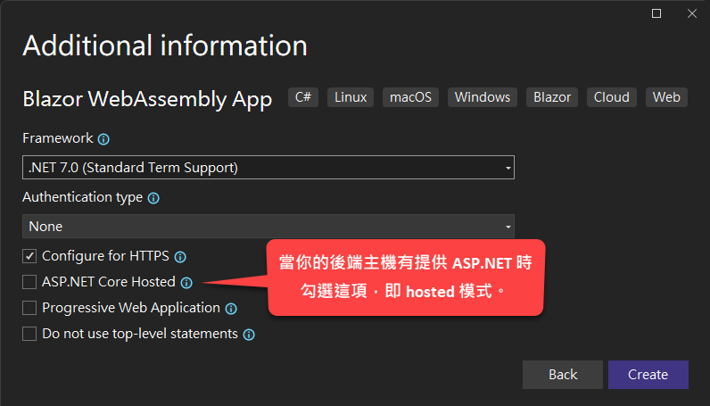
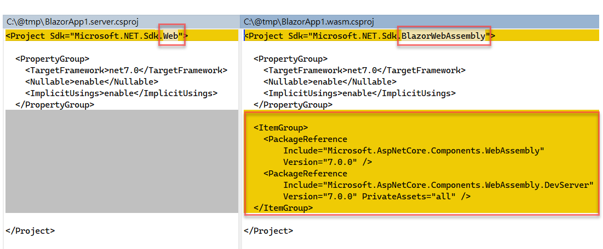
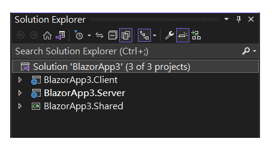
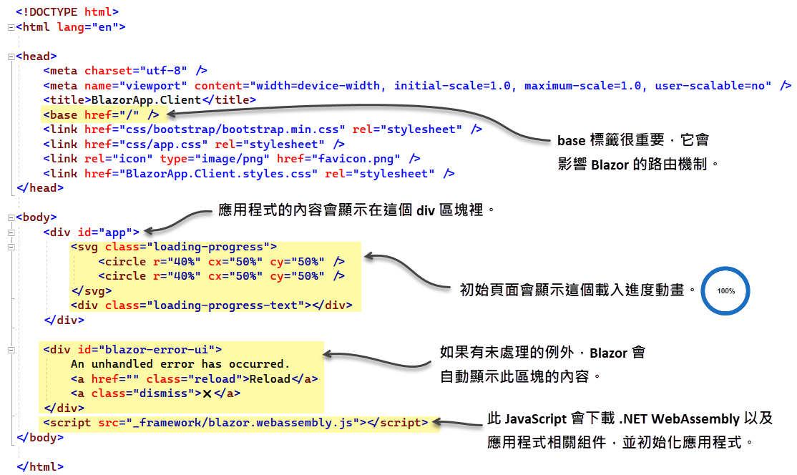
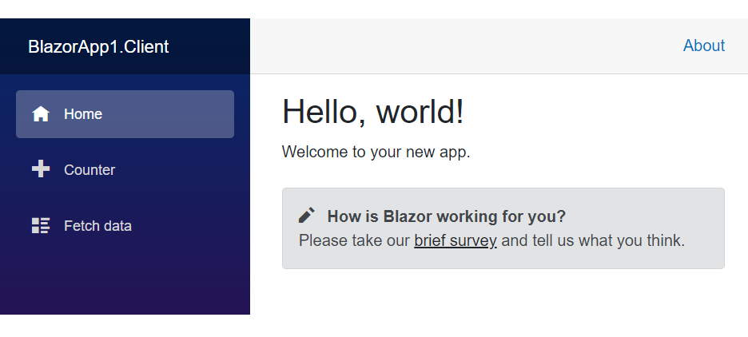
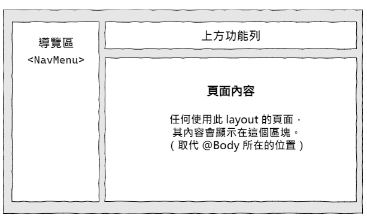

上一章都是概念性的文字描述，是時候捲起袖子了。

> 使用的工具是 Visual Studio 2022 與 .NET 7。

## 專案範本

Visual Studio 為 Blazor app 提供了兩個專案範本：Blazor Server App 和 Blazor WebAssembly App，分別對應至前面提過的兩種裝載模式。透過這兩個範本所建立的專案，它們的專案結構與 .csproj 檔案的內容會有一些差異。

這裡先說明兩個專案範本的主要差異，後續內容則會偏重於 Blazor WebAssembly app。

首先，當你選擇使用 Blazor Server App 範本來建立專案，那麼整個 solution 裡面就只會有一個專案，而且專案檔（.csproj）只有短短幾行的內容：

~~~~~~~~
<Project Sdk="Microsoft.NET.Sdk.Web">

  <PropertyGroup>
    <TargetFramework>net7.0</TargetFramework>
    <Nullable>enable</Nullable>
    <ImplicitUsings>enable</ImplicitUsings>
  </PropertyGroup>

</Project>
~~~~~~~~

如果是 Blazor WebAssembly App 範本，你會在建立專案的過程中看到一些額外的選項，如下圖：

在不修改任何預設選項的情況下所建立之專案，即所謂的 standalone Blazor WebAssembly app，專案建立完成後，solution 裡面只有一個專案。專案檔內容如下：

~~~~~~~~
<Project Sdk="Microsoft.NET.Sdk.BlazorWebAssembly">

  <PropertyGroup>
    <TargetFramework>net7.0</TargetFramework>
    <Nullable>enable</Nullable>
    <ImplicitUsings>enable</ImplicitUsings>
  </PropertyGroup>

  <ItemGroup>
    <PackageReference Include="Microsoft.AspNetCore.Components.WebAssembly" Version="7.0.0" />
    <PackageReference Include="Microsoft.AspNetCore.Components.WebAssembly.DevServer" Version="7.0.0" PrivateAssets="all" />
  </ItemGroup>

</Project>
~~~~~~~~

其中只有兩個 `<PackageReference>` 標籤，指明了專案需要用到的兩個 NuGet 套件。這裡並不需要列出專案用到的全部套件，而只要寫最上層的套件就行了，因為每個套件所用到的其他相依套件都會在建置專案的過程中自動加入。

下圖同時呈現 Blazor Server app（左邊）和 Blazor WebAssembly app（右邊）的專案檔內容，以便看出二者差異：

> 隨著 .NET 版本演進，你在實際操作時所看到的 csproj 檔案內容可能跟上圖不同。

建立新專案時，如果勾選了「ASP.NET Core Hosted」（參見本節稍早截圖），則表示你打算讓後端主機也提供 ASP.NET 執行環境，此時你所建立的應用程式就是所謂的 hosted Blazor WebAssembly app，而 solution 裡面至少會有三個專案，分別是：

- 用戶端專案，即 Blazor WebAssembly app。
- 伺服器專案，即 ASP.NET Core app。
- 共用程式庫，即一般的 .NET 類別庫。

參考下圖：

採用此配置，即表示你要建立全棧式（full-stack）.NET 應用程式，亦即後端主機可使用完整的 ASP.NET Core API。

如前面提過的，這種 hosted Blazor WebAssembly app 由於需要在後端主機上面安裝 .NET 執行環境，故此類應用程式將無法部署於 GitHub Pages 之類的靜態網頁伺服器。

## 建立專案

了解 Blazor 專案範本與相關選項之後，接著就來動手建立第一個 Blazor WebAssembly app。

往後示範的操作都是用 Visual Studio 2022。你也可以使用 .NET CLI（命令列）或其他 IDE，例如 Visual Studio Code 或 JetBrains Rider。

建立專案的操作步驟可參考我的 Youtube 影片：

如果你偏好使用命令列，可參考以下指令：

{linenos=off}
~~~~~~~~
dotnet new blazorwasm -o BlazorApp1/BlazorApp1.Client
dotnet new sln -n BlazorApp1
dotnet sln add BlazorApp1\BlazorApp1.Client
~~~~~~~~

我在專案名稱後面加上「.Client」，以明確表示此專案為可單獨執行於用戶端瀏覽器的 Blazor WebAssembly app。此外，將來如果發現有需要在後端主機加入 ASP.NET Core 應用程式，則可以將伺服器專案命名為 BlazorApp1.Server。
 
## 拆解專案結構

在閱讀本節內容時，如果遇到不明白的地方，建議您搭配微軟網站上的這篇文章一起看：[ASP.NET Core Blazor 專案結構](https://learn.microsoft.com/zh-tw/aspnet/core/blazor/project-structure)，說不定就能豁然開朗。

這裡要解說的是以下幾個重要部分：

- 程式進入點：Program.cs
- 起始頁面：index.html
- 根元件：App.razor
- 版面配置：MainLayout.razor

### 程式進入點：Program.cs

Program.cs 位於專案的根目錄，此檔案包含了應用程式的進入點，也就是 `Main` 方法。不過在預設情況下，Blazor 專案範本所產生的 Program.cs 會採用「[最上層語句](https://learn.microsoft.com/zh-tw/dotnet/csharp/fundamentals/program-structure/top-level-statements)」的寫法（C# 9 開始提供），所以我們不會在裡面看到明確宣告的 `Program` 類別和 `Main` 方法。閱讀程式碼的時候，只要知道編譯器會自動把這個檔案的程式碼編譯成 `Main` 方法就行了。程式碼如下：

~~~~~~~~
using BlazorApp.Client;
using Microsoft.AspNetCore.Components.Web;
using Microsoft.AspNetCore.Components.WebAssembly.Hosting;

var builder = WebAssemblyHostBuilder.CreateDefault(args);
builder.RootComponents.Add<App>("#app");
builder.RootComponents.Add<HeadOutlet>("head::after");

builder.Services.AddScoped(sp => new HttpClient { BaseAddress = new Uri(builder.HostEnvironment.BaseAddress) });

await builder.Build().RunAsync();
~~~~~~~~

說明：

- 第 5 行：建立 `WebAssemblyHostBuilder` 物件。
- 第 6 行：加入應用程式的根元件：`App`。這裡呼叫的 `builder.RootComponents.Add` 方法，其傳入參數是一個 CSS 選擇器，而 "#app" 即表示要尋找 ID 為 "app" 的元素——至於這個元素在哪裡，稍後會加以說明。
- 第 7 行：再加入一個根元件：`HeadOutlet`。目的是讓我們能修改首頁的 `<head>` 元素的內容。
- 第 9 行：註冊應用程式所需之服務。這裡是把一個 `HttpClient` 物件加入服務集合。
- 第 11 行：根據 `WebAssemblyHostBuilder` 的設定來建立 `WebAssemblyHost` 物件，並呼叫其 `RunAsync` 方法來運行應用程式。

第 9 行使用了所謂的 DI（dependency injection；依賴注入）模式來註冊應用程式所需要的服務。註冊服務至 DI 容器的方法有 `AddTransient`、`AddScoped` 和 `AddSingleton`，分別對應至以下三種生命週期：

- **Transient**：每當外界向 DI 容器索取某服務的執行個體，容器就會提供一個全新建立的執行個體。
- **Scoped**：在同一個 HTTP 請求的範圍內只會建立一個執行個體。換言之，在同一個 HTTP 請求的範圍內共用某服務的執行個體。
- **Singleton**：DI 容器只會替指定之服務建立一個執行個體，並由整個應用程式共用。也就是說，同時進行中的多個 HTTP 請求都會使用同一個執行個體。

比較特別的是，在 Blazor WebAssembly app 中，Scoped 和 Singleton 二者的作用是一樣的。這是因為 Blazor WebAssembly app 在跳轉頁面的時候不會發出 HTTP 請求，故任何 Scoped 物件一旦建立之後便會跟 Singleton 物件一樣持續存在，直到應用程式結束才會消失。

接著要看的是應用程式進入點之後接著會載入的初始頁面：index.html。

### 起始頁面：index.html

位於 wwwroot 目錄下的 index.html 是以標準 HTML 來實作的應用程式起始頁面。下圖標示了此檔案的幾個關鍵內容。

位於 `<head>` 標籤內的 `<base>` 是很重要的標籤，如果設定錯誤，Blazor 將無法正確處理用戶端頁面的跳轉。預設情況下，Index.html 檔案的 `<base>` 標籤的屬性值是 `/`，也就是網域的根，例如 www.huanlintalk.com。如果應用程式的部署路徑是網域之下的子路徑，例如 www.huanlintalk.com/books，那麼 `<base>` 標籤的屬性值就必須設定為 `/books/`。請注意最後的 `/` 字元是必須的；如果少了最後的 `/`，瀏覽器會忽略任何字元，直到它找到 `/`。比如說，`/books` 會被當作 `/`。

位於 `<body>` 標籤內的第一個 div 元素，ID 是 `app`，當應用程式執行時，Blazor 會找到此 div 元素，並將其內容置換成 `App` 元件所呈現的內容。

那麼，什麼是 `App` 元件？它又扮演了什麼角色呢？請接著看下一節的說明。

### 根元件：App.razor

剛才說的 `App` 元件，就是位於專案根目錄下的 App.razor，它是 Blazor 應用程式的根元件。底下是由 Blazor 專案範本所產生的 App.razor 檔案內容：

~~~~~~~~
<Router AppAssembly="@typeof(App).Assembly">
    <Found Context="routeData">
        <RouteView RouteData="@routeData" DefaultLayout="@typeof(MainLayout)" />
        <FocusOnNavigate RouteData="@routeData" Selector="h1" />
    </Found>
    <NotFound>
        <PageTitle>Not found</PageTitle>
        <LayoutView Layout="@typeof(MainLayout)">
            
Sorry, there's nothing at this address.

        </LayoutView>
    </NotFound>
</Router>
~~~~~~~~

這個 `App` 元件裡面包含一個名為 `Router` 的元件，即上列程式碼最上層的 `<Router>` 標籤。`Router` 元件的責任是管理用戶端路由（routing）的相關工作，故它在多頁面的應用程式中扮演了非常重要的角色。

當應用程式啟動時，`App` 元件裡面的 `Router` 元件會自動掃描應用程式的相關組件，以找出所有的可路由元件（routable components），並將相關資訊儲存於一個路由表。每當使用者在頁面上點擊某個連結，或程式某個地方觸發了導覽事件，`Router` 就會試著在路由表中尋找符合當前請求的路由。若有找到目前請求的路由，便會將目標頁面的內容呈現於 `<Found>` 區塊；如果找不到符合的路由，便會顯示 `<NotFound>` 區塊所定義的頁面內容。

> 重點整理：`App` 元件是透過 `Router` 元件來處理用戶端的所有頁面跳轉工作。

舉例來說，瀏覽器初次載入此應用程式的時候，欲存取的路徑是 "/"，所以 `Router` 會尋找有 `@page "/"` 指示詞的元件（即可路由元件，或者可跳轉頁面）。在專案範本所產生的程式碼當中，符合 "/" 路徑的元件就是位於 Page 目錄下的 Index.razor。底下為專案範本所產生的程式碼：

~~~~~~~~
@page "/"

<PageTitle>Index</PageTitle>

<h1>Hello, world!</h1>

Welcome to your new app.

<SurveyPrompt Title="How is Blazor working for you?" />
~~~~~~~~

程式執行結果如下圖：

咦，可是 Index.razor 的原始碼裡面並沒有左側選單，也沒有頁面頂端的應用程式標題和 About 連結。而且，無論使用者點擊左邊選單的 Home、Counter、還是 Fetch data 連結，上方標題列和左邊選單的內容都不會變，只有選單右邊的區塊會隨著使用者點擊的連結而改變。這是怎麼做到的呢？

這就要提到 Blazor 的版面配置了。

### 版面配置：MainLayout.razor

使用者看到的完整頁面，是由剛才提過的 App.razor 當中的 `Router` 元件所定義的版面配置（layout）來決定，也就是 App.razor 當中的這行程式碼：

~~~~~~~~
<RouteView RouteData="@routeData" DefaultLayout="@typeof(MainLayout)" />
~~~~~~~~

其中的 `DefaultLayout` 屬性代表預設的版面配置元件類型，這裡的設定是 `MainLayout`，而這個 `MainLayout` 元件就是專案根目錄下的 Shared 子目錄中的 MainLayout.razor。

底下是 Blazor 專案範本所產生的 MainLayout.razor 原始碼：

~~~~~~~~
@inherits LayoutComponentBase

    

        <NavMenu />
    

    <main>
        

            <a href="https://docs.microsoft.com/aspnet/" target="_blank">About</a>
        

        <article class="content px-4">
            @Body
        </article>
    </main>

~~~~~~~~

說明：

- 第 1 行：所有的版面配置元件都必須繼承自 `LayoutComponentBase`。
- 第 5 行：`<NavMenu>` 元件負責呈現導覽區的內容，其中包含一個選單。此元件的檔案位於 Shared 資料夾，檔名是 NavMenu.razor。
- `<main>` 元素裡面有兩個區塊，首先是頁面頂端標題區的 About 連結，接著是一個 `<article>` 元素，裡面的 `@Body` 就是用來置換使用者每次點擊連結時所顯示的頁面內容。比如說，當你在左邊導覽區點了 Counter 連結，那麼 `@Body` 就會被置換成 `Counter` 元件的轉譯結果。

所有套用此版面配置的頁面，其最終呈現於瀏覽器的樣貌如下圖：

除了剛才介紹的預設版面配置，你也可以自行設計其他版面，並於頁面中使用 `@layout` 指示詞來套用不同的版面配置。（稍後有教學影片）

### wwwroot 資料夾與 _Imports.razor

ASP.NET Core 應用程式都會有一個 wwwroot 資料夾，裡面存放的是用戶端能夠下載的靜態檔案，例如 HTML、CSS、圖片、JavaScript 等等。

至於 _Imports.razor，這個檔案雖然不是絕對必要，但它可以讓程式碼更簡潔。我們通常會在這個檔案裡面放一些 `@using` 指示詞，如下所示：

~~~~~~~~
@using System.Net.Http
@using Microsoft.AspNetCore.Authorization
@using Microsoft.AspNetCore.Components.Authorization
@using Microsoft.AspNetCore.Components.Forms
@using Microsoft.AspNetCore.Components.Routing
@using Microsoft.AspNetCore.Components.Web
@using Microsoft.AspNetCore.Components.Web.Virtualization
@using Microsoft.JSInterop
@using BlazorApp1
@using BlazorApp1.Shared
~~~~~~~~

只要把常用的命名空間的 `@using` 指示詞寫在 _Imports.razor 檔案裡，這個檔案的所在目錄以及底下的所有子目錄的程式檔案便會自動引用這些命名空間。如此一來，寫程式的時候就不用一直重複引用這些常用的命名空間。

_Imports.razor 檔案不一定要放在專案的根目錄，而且可以不只一個。如果某些命名空間是特定資料夾的程式碼才會用到，例如在專案根目錄底下的 Infrastructure\Security 子目錄，我們也可以在這裡建一個 _Imports.razor 檔案，讓檔案中引用的命名空間自動套用至 Security 目錄以及其下所有子目錄的程式碼。

## 練習：自訂版面配置

大致了解前面介紹的幾個重要部分之後，不妨動手修改原先建立的第一個 Blazor app，嘗試建立新的版面配置並套用至特定頁面。

可以參考這個教學影片來練習：[.NET Blazor 版面配置（Layout）](https://youtu.be/nIZDxMj2iNw)

# 下一步

雖然 Blazor 還有很多東西可以講，但我打算在下一篇筆記就先寫一點與「部署」有關的操作。也就是說，只要按照順序完成這個 Blazor 入門筆記系列的前三篇文章所涵蓋的課題和練習，就能寫出一個最簡單的 Blazor WebAssembly app，並且部署到免費的靜態網站主機（例如 GitHub Pages）。