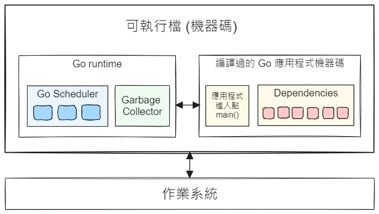

## Go 語言簡介

Go 於 2007 年誕生，由 Google 創建。

Go 程式語言沒有以下語法或機制：

- 沒有型別繼承。
- 沒有 exception handling 語法（沒有 `try...catch`，也沒有 `throw`）。
- 沒有巨集（macro）。
- 沒有 enum。（可以用具名常數）
- 沒有局部函式（partial functions）。
- 不支援變數延遲估值（lazy variable evaluation）。
- 沒有運算子多載（operator overloading）。
- 沒有樣式匹配（pattern matching）。
- 沒有內建的 GUI 框架或套件。

如欲了解為什麼 Go 不支援某些語言特性，可參閱官方文件：[Go FAQ](https://go.dev/doc/faq)。

Go 的優點與強項：

- 很適合開發 CLI 和伺服器端應用程式。
- 函式可回傳多個值。於是，函式可以輕易回傳錯誤，故也就不需要 throw exceptions 了。就如 Rob Pike 於 2015 年發表的文章所說，[errors are values](https://go.dev/blog/errors-are-values)。直到現在（2024 年）依然如此。
- Concurrency。非同步呼叫的語法非常簡單直觀，跟循序呼叫的語法幾乎一樣。
- 單元測試在 Go 語言中是一級公民：測試程式的檔案名稱一律命名為「*欲測試之程式檔名*`_test`.go」，而且兩個檔案要放在同一個目錄下。例如 hello.go 的測試程式會叫做 hello_test.go。
- 標準函式庫提供了常用的工具套件，包括網路通訊、HTTP、序列化、加解密等等。

> 如果需要開發跨平台的 GUI 應用程式，可以試試開源專案 [Wails](https://wails.io/)。

### Go Runtime

每一個可執行的 Go 應用程式的內部結構大致如下圖：



除了應用程式本身的機器碼和它依賴的外部套件（dependencies），還會包含一個叫做 **Go Runtime** 的東西，用來管理應用程式執行時的行為：

- Go Scheduler: 管理併發的（concurrent）函式，即所謂的 **goroutines**。
- Garbage Collector: 簡稱 GC，它會監看應用程式的記憶體使用情形，自動將沒有用到的記憶體回收。

撰寫 Go 程式的時候不用擔心何時該回收記憶體，這都要歸功於 GC 在背後提供的服務。

> 如欲了解 GC 的運作細節，可參考官方文件：[A Guide to the Go Garbage Collector](https://go.dev/doc/gc-guide)。

### Goroutines

Goroutines 是獨立執行的併發函式（concurrent functions）。

> [!note] concurrent vs. parallel
> 如果說「併行」或「並行」，很容易令人迷惑到底所指為何，故我選擇把 concurrent 翻譯為 「併發」，parallel 則為「平行」，以便容易區別。明確起見，有時甚至只寫英文，例如 concurrency（中文也許可用「併發能力」，但還是覺得英文最不易令人混淆）。

Concurrency 是 Go 語言在設計之初就提供的特性，而不是後來想到才加入的。Go 的併發函式有一個專屬名稱：goroutine，其寫法相當直觀且簡單，跟循序執行的函式沒有太大差別。舉例來說，如果你有一個函式叫做 `parseFile()`：

```go
func parseFile(filename string) {
  ...
}
```

如果只需要循序執行，呼叫該函式的寫法為：

```go
parseFile("file1.dat")
parseFile("file2.dat")
```

若需要併發執行，則呼叫的時候加上關鍵字 `go` 即可，像這樣：

```go
go parseFile("file1.dat")
go parseFile("file2.dat")
```

有注意到嗎？無論是循序還是併發執行，改變的地方只有呼叫該函式的寫法，而函式本身的宣告完全不需要改動。這是 Go 語言的一個美妙之處。

> ![note]
> 有的程式語言在撰寫併發函式的時候，會要求必須在函式宣告的地方加上額外的關鍵字（例如 `async`），代表該函式必須以併發的方式呼叫。換言之，一旦函式宣告為併發函式，那麼它的上游（呼叫端）也必須是併發函式，如此一路沿著呼叫路徑往上層蔓延開來。

## 建立開發環境 {#setup-dev-env}

### 安裝 Go {#installing-go}

請參閱官方文件：[Download and install](https://go.dev/doc/install)

安裝完成後，開啟命令列視窗，執行 `go version` 命令查看版本。

> 撰寫本文時，我安裝的 Go 版本是 v1.23.0。

### IDE

比較常聽到建議使用的 IDE：

- Visual Studio Code
- GoLand by JetBrains
- Neovim

對鍵盤操控和 coding 效率極為講究的人可能會喜歡 Neovim 或 JetBrains。我是習慣用 VS Code。

#### VS Code

與 Go 有關的 extensions：

- [Go](https://marketplace.visualstudio.com/items?itemName=golang.go) by the Go Team at Google
- [Go Test Explorer](https://marketplace.visualstudio.com/items?itemName=premparihar.gotestexplorer)

底下截圖展示了我撰寫本文時的 VS Code 工作環境：


左下角的 Go 面板可以查看 Go 環境變數以及安裝了哪些 Go tools。

VS Code 官方文件有更詳細的介紹：[Go in Visual Studio Code](https://code.visualstudio.com/docs/languages/go)。

如果已經有正確安裝 Go 工具鍊的相關工具，在預設情況下，按 Ctrl+S 存檔時會自動重新排版程式碼，可輕鬆維持一致的程式碼風格。如欲查看預設的自動排版選項，可以按 `F1` 或 `Crtl+Shift+P` 開啟命令面板，輸入 `Preferences: Open Default Settings (JSON)`，便可以找到所有跟 Go 有關的預設選項。底下僅摘錄其中一部份：

```json
  // Configure settings to be overridden for the go language.
  "[go]":  {
    "editor.insertSpaces": false,
    "editor.formatOnSave": true,
    "editor.codeActionsOnSave": {
        "source.organizeImports": true
    }
  },

  // Enable intellisense, code navigation, refactoring, formatting & diagnostics
  // for Go. The features are powered by the Go language server "gopls".
  "go.useLanguageServer": true,
```

其中提到的 "gopls"（讀作 "go please"）是官方提供的、用於 VS Code 的 Language Server。只要有安裝 gopls，在 VS Code 中撰寫程式就會有許多方便的編輯功能，像是 intellisense、重構、排版程式碼等等。

**參閱：** [gopls 官方文件](https://pkg.go.dev/golang.org/x/tools/gopls#section-readme)

順便提及，Go 提供的程式碼排版工具預設會使用 `tab` 來縮排，而不是插入空白字元，故剛才展示的預設選項中，`editor.insertSpace` 預設為 `false`。建議不要更改這個選項，以確保所有的 Go 程式碼維持同樣的風格。


## References

- [Go FAQ](https://go.dev/doc/faq)
- [A Guide to the Go Garbage Collector](https://go.dev/doc/gc-guide)
- [gopls 官方文件](https://pkg.go.dev/golang.org/x/tools/gopls#section-readme)
- [Go in Visual Studio Code](https://code.visualstudio.com/docs/languages/go)
 