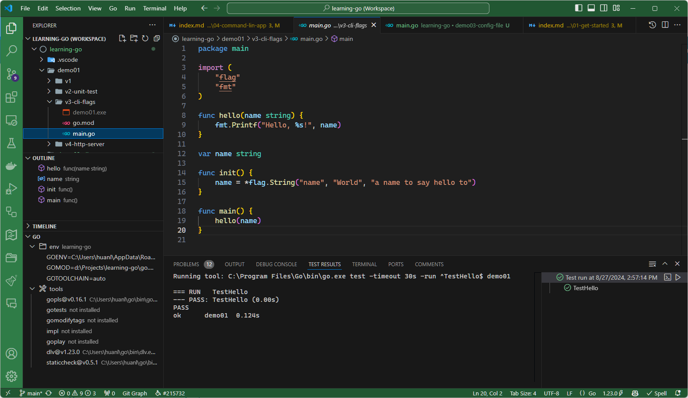

## Go 語言簡介

Go 於 2007 年誕生，由 Google 創建。

Go 程式語言沒有以下語法或機制：

- 沒有型別繼承。
- 沒有 exception handling 語法（沒有 `try...catch`，也沒有 `throw`）。
- 沒有巨集（macro）。
- 沒有 enum。（可以用具名常數）
- 沒有局部函式（partial functions）。
- 不支援變數延遲估值（lazy variable evaluation）。
- 沒有運算子多載（operator overloading）。
- 沒有樣式匹配（pattern matching）。
- 沒有內建的 GUI 框架或套件。

如欲了解為什麼 Go 不支援某些語言特性，可參閱官方文件：[Go FAQ](https://go.dev/doc/faq)。

Go 的優點與強項：

- 很適合開發 CLI 和伺服器端應用程式。
- 函式可回傳多個值。於是，函式可以輕易回傳錯誤，故也就不需要 throw exceptions 了。就如 Rob Pike 於 2015 年發表的文章所說，[errors are values](https://go.dev/blog/errors-are-values)。直到現在（2024 年）依然如此。
- Concurrency。非同步呼叫的語法非常簡單直觀，跟循序呼叫的語法幾乎一樣。
- 單元測試在 Go 語言中是一級公民：測試程式的檔案名稱一律命名為 *欲測試之程式檔名*_test.go，而且兩個檔案要放在同一個目錄下。例如 hello.go 的測試程式會叫做 hello_test.go。
- 標準函式庫提供了常用的工具套件，包括網路通訊、HTTP、序列化、加解密等等。

> 如果需要開發跨平台的 GUI 應用程式，可以試試開源專案 [Wails](https://wails.io/)。

## 建立開發環境 {#setup-dev-env}

### 安裝 Go {#installing-go}

請參閱官方文件：[Download and install](https://go.dev/doc/install)

安裝完成後，開啟命令列視窗，執行 `go version` 命令查看版本。

> 撰寫本文時，我安裝的 Go 版本是 v1.23.0。

### IDE

比較常聽到建議使用的 IDE：

- Visual Studio Code
- GoLand by JetBrains
- Neovim

對鍵盤操控和 coding 效率極為講究的人可能會喜歡 Neovim 或 JetBrains。我是習慣用 VS Code。

順便整理一下我用 VS Code 寫 Go 程式的一點筆記：

- 按 Ctrl+S 存檔時會自動重新排版程式碼，可輕鬆維持一致的程式碼風格。
- 與 Go 有關的 extensions：
  - [Go](https://marketplace.visualstudio.com/items?itemName=golang.go) by the Go Team at Google
  - [Go Test Explorer](https://marketplace.visualstudio.com/items?itemName=premparihar.gotestexplorer)

底下截圖展示了我撰寫本文時的 VS Code 工作環境：

左下角的 Go 面板可以查看 Go 環境變數以及安裝了哪些 Go tools。

