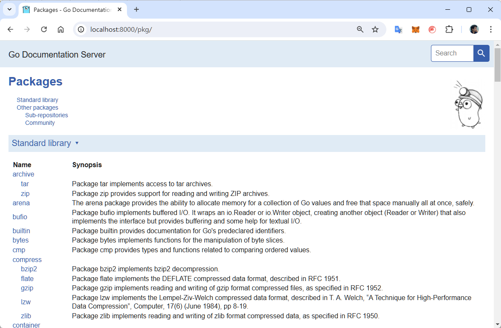

在剛開始學習一個程式語言的時候，我喜歡先用很簡單的程式來盡量體驗實際開發和部署流程中可能會用到的相關工具，而不是等到大部分的程式語法都學會之後才去學那些工具的用法。

因此，這裡要練習撰寫的 Hello World 範例程式會有幾個不同的版本：

1. 首先要寫一個最簡單的 Hello World 程式，開始認識 Go 應用程式的基本結構：模組和套件。
2. 接著對 Hello World 做一點小改版，以便快速體驗如何撰寫單元測試。
3. 繼續修改 Hello World 範例。這次要加入一點註解，然後用 `godoc` 工具來產生文件。
4. 使用命令列參數。這裡會用上標準函式庫的 "flag" 套件來剖析命令列參數。
5. 一個非常簡單的 HTTP server。

乍看可能會覺得練習的份量多了點，但其實每一個練習都很簡單。

## Hello World

首先要建立一個專案目錄，並使用 `go mod init` 命令來建立模組：

```shell
mkdir demo01
cd demo01
go mod init demo01
```

> 備註：這個 "mod" 一般讀音近似「罵的」。似乎比較少聽到「mode」的唸法。

上述命令會在當前目前建立一個 `go.mod` 檔案，內容是該模組的資訊，以及描述它依賴哪些外部模組（如果有的話）。上述指令所建立的 `go.mod` 檔案內容會像這樣：

```text
module demo01

go 1.23.0
```

這個模組即代表一個 project，其名稱通常是你的 Git repository 的名稱，而且所在目錄的名稱也會跟模組名稱一樣。比如說，如果是 GitHub 平台上的一個名為 "learning-go" 的 repository，那麼剛才的 `go mod init` 指令會這麼寫：

```text
mkdir learning-go
cd learning-go
go mod init github.com/learning-go
```

而此命令一樣只是單純地在當前目錄下建立一個 `go.mod` 檔案，內容為：

```text
module github.com/learning-go

go 1.23.0
```

有關 module 的運作方式與內容寫法還有許多細節可談，這裡只先整理一點小常識：

- 一個 module 即是一個 project，有一個版本編號。
- `go.mod` 檔案所在的目錄稱為 **模組根目錄**（module root directory）。

透過 `go.mod` 檔案把專案的基本資訊定義好之後，接著要往下一個實作議題靠近：套件（package）。

一個 project 是由一個或多個程式檔案組成，而這個組成的方式，是以 package 來作為邏輯分割單位。之所以說「邏輯分割」，是因為一個 package 通常會由多個 .go 的程式檔案所組成。

延續剛才的範例，在 `demo01` 目錄下建立一個 `hello.go` 檔案，內容為：

```go
package main

import (
    "fmt"
)

func main() {
    fmt.Println("Hello, World!")
}
```

在這個檔案中：

- `package main` 表明此套件的名稱叫做 `main`。
- `import` 表明此套件需要引用 `fmt` 套件。
- `main()` 函式為應用程式的進入點。

這裡需要介紹一點 Go 的 package 小常識，即 Go 的 package 有兩種：

- **Executable package**：要編譯成可執行的應用程式，其 package 名稱必須是 `main`，而且會包含程式的進入點：`main` 函式。
- **Library package**：供其他套件引用，不會編譯成可執行檔。這類套件的名稱不會是 `main`，而應該是符合該套件用途的名稱，例如 `http`、`list`、`fmt` 等等。注意 Go 官方建議的套件命名慣例是**簡短而且全部小寫**，即不要大小寫混用，也不要使用底線字元 ( `_` )。此外，套件名稱是可以用縮寫的——前提是那個縮寫是很常見、且一看就明白，例如 `fmt`、`strconv` 等等。

> 命名不是一件容易的事。有關 package 的命名，可參考 Go 部落格的 [Package names](https://go.dev/blog/package-names)。

現在回到我們的範例程式。到目前為止，此應用程式的檔案目錄結構會像這樣：

```text
/demo01
    go.mod
    hello.go
```

由於我們打算建立一個可執行的應用程式，故此範例的 package 名稱是 `main`，而且有進入點 `main` 函式。順便提及，雖然套件名稱是 `main`，但程式檔案名稱並不需要命名為 `main.go`（當然也可以這麼做）。

接著，使用 `go run` 命令來執行此程式：

```shell
go run hello.go
```

也可以用 `go build` 命令來將程式碼編譯成可執行檔：

```shell
go build
```

上述命令會在當前目錄下產生一個可執行檔，檔案名稱會是 `demo01.exe`（因為 `go.mod` 檔案中宣告的模組名稱是 `demo01`）。

補充說明：

- 如果要在 Windows 作業環境的 PowerShell 命令視窗中執行此範例程式，請輸入 `./demo01`，而不要只輸入 `demo01`，否則 PowerShell 可能會告訴你無法識別該命令。
- 如果要指定編譯的目標作業系統，可預先設定 Go 的環境變數 `GOOS`。詳情參見官方文件：[Environment variables](https://pkg.go.dev/cmd/go#hdr-Environment_variables)。

## 加入單元測試 {#unit-test}

本節要為先前的範例程式加入單元測試。完成本節的練習之後，應該能體會「單元測試是 Go 程式的一級公民」這句話的意思。

首先，把之前的 `demo01` 目錄下的 `hello.go` 檔案改成以下內容：

```go
package main

func hello() string {
    return "Hello, World!"
}
```

這裡定義了一個名為 `hello` 的函式，此函式沒有傳入參數，而回傳值是一個字串 "Hello, World!"。

接著，在相同目錄下新增一個 `main.go` 檔案，內容為：

```go
package main

import "fmt"

func main() {
    fmt.Println(hello())
}
```

也就是說，程式的進入點 `main()` 函式會去呼叫 `hello.go` 中的 `hello()` 函式來取得欲顯示的字串。

在加入單元測試之前，先用 `go build` 命令來建置應用程式，看看能否順利編譯和執行。

Go 的單元測試檔案有固定的命名慣例：其主檔名必須以 `_test` 結尾。比如說，要測試的對象是 `hello.go`，那麼其測試檔案的名稱就必須是 `hello_test.go`，而且兩個檔案要放在同一個目錄下。

因此，我們接著要新增一個 `hello_test.go` 檔案，內容如下：

```go
package main

import "testing"

func TestHello(t *testing.T) {
    actual := hello()
    expect := "Hello, World!"

    if actual != expect {
        t.Errorf("got %q want %q", actual, expect)
    }
}
```

此測試函式的邏輯不難看懂，以下是比較需要解釋的地方：

- 測試函式的命名必須以大寫英文字母開頭，也就是 exported 函式（可供外界存取），這樣才能讓測試工具「看得見」它。
- 測試函式固定有一個傳入參數： `t *testing.T`。這個參數會由測試工具傳入，內容則是測試框架的執行個體。
- 運算子 `:=` 可以一次完成兩件事：宣告一個變數並賦予初始值。

接著開啟一個命令視窗，使用以下命令來運行測試：

```go
cd demo01
go test
```

如果測試成功，應該會看到類似以下輸出結果：

```console
PASS
ok      hellogo 0.116s
```

## 用 godoc 產生文件 {#godoc}

Go 工具組當中有一個 `godoc` 可以用來產生應用程式的文件。我們可以用前面的範例程式來簡單體驗一下。

首先，在 `main.go` 檔案的最上方加入一些註解：

```go
/*
Demo01 is a simple program that prints "Hello, World!" to the console.
It also demonstrates how to write tests for Go programs.
*/
package main

import "fmt"

func main() {
    fmt.Println(hello())
}
```

接著開啟命令視窗，執行 `godoc`：

```shell
cd demo01
godoc -http=localhost:8000
```

然後 `godoc` 會輸出一些訊息：

```console
using module mode; GOMOD=D:\Projects\learning-go\demo01\go.mod
go: no module dependencies to download
```

然後，本機應該會起始一個 HTTP 服務，你可以用瀏覽器開啟 `http://localhost:8000` 來查看生成的文件，看起來會像底下這張截圖。



在此頁面搜尋字串 "demo01"，應該就能找到剛才加入的註解。

## 剖析命令列參數 {#cli-flags}

*(TODO)*

## 簡單的 HTTP server {#http-server}

*(TODO)*

## Packages and modules

### Packages

範例：

```text
.                -> 專案的根目錄
├── go.mod       -> 定義專案的名稱和 dependencies
├── hello.go     -> 實作 package main
└── cart         -> 用來放 cart 套件的程式碼
    └── cart.go  -> 實作 cart 套件
```

- Go 是以 package 來作為隔離的基本單位。
- 隸屬同一個 package 的程式碼可以互相存取任何東西，包括變數、函式、型別等等。
- 不同 package 的程式碼只能使用對方 export 出來的東西。
  - Go 語言沒有 `public`、`private` 或 `protected` 等識別字，而是根據變數名稱的第一個字母大小寫來判斷能否被外部引用。
  - 所有大寫字母開頭的名稱都會被 export，即可供外界使用。（等同其他物件導向語言的 `public` 存取範圍）
  - 所有小寫字母開頭的名稱只能在模組內部使用。

### Modules

- Modules 可以直接從版本控制儲存庫下載，或者從 module proxy 伺服器下載。
- 使用 `import` 來引用模組中的套件時，只能引用該模組 export 的（公開的）套件。
- 每一個 module 都是以 module path 來作為唯一識別，這個模組路徑是宣告在一個 go.mod 檔案中。

### Module paths

模組路徑是模組的正式名稱（唯一識別名稱），宣告於模組的 go.mod 檔案，而且模組路徑要能表達該模組的用途，以及可以從何處找到它。

模組路徑通常包含三個部分：

- repository root path
- repository 中的目錄
- 主要的版本編號（只有在主要版本編號為 2 或更高的版本才需要）

範例：

```go
module example.com/mymodule
```

如果此範例的模組的版本是 v0.x.x 或 v1.x.x，那麼它的 v2.0.0 版（以及之後版本）的模組路徑就要加上主版本號，例如：

```go
module example.com/mymodule/v2
```

建議閱讀 Go 官方文件以了解更多有關 modules 的細節：

- [Go Modules Reference](https://go.dev/ref/mod)
- [go.mod file reference](https://go.dev/doc/modules/gomod-ref)