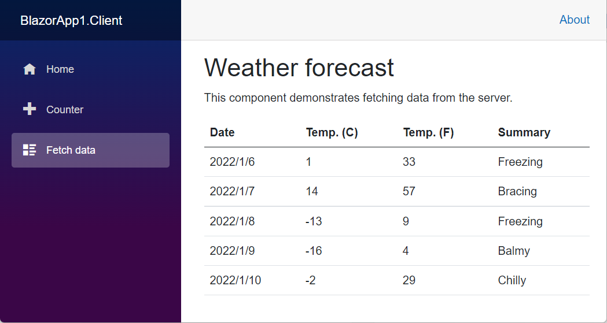
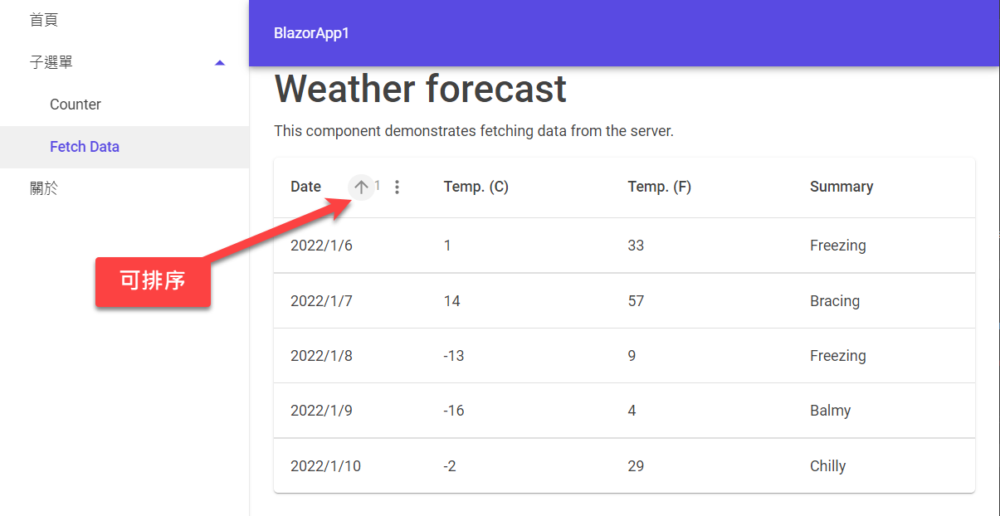
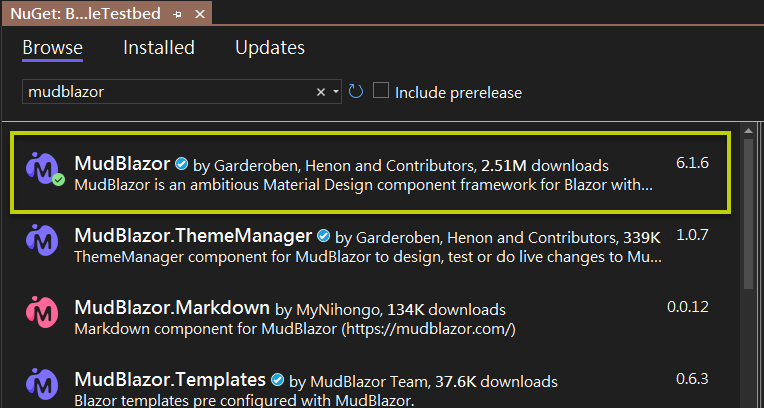
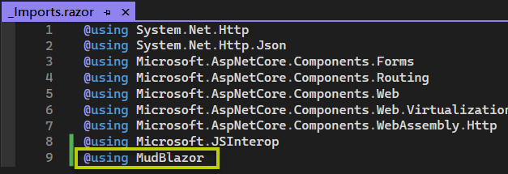
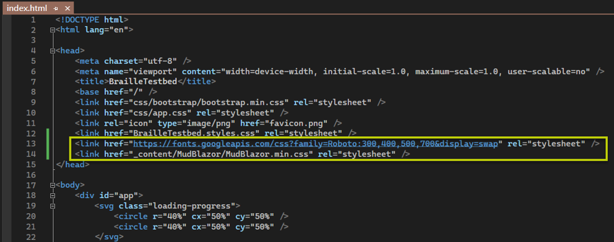
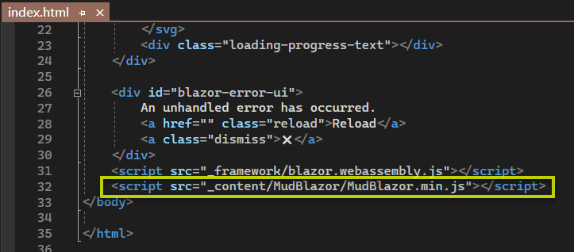
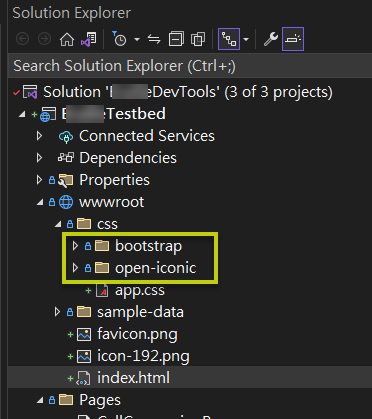
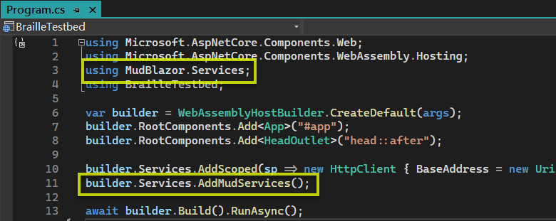
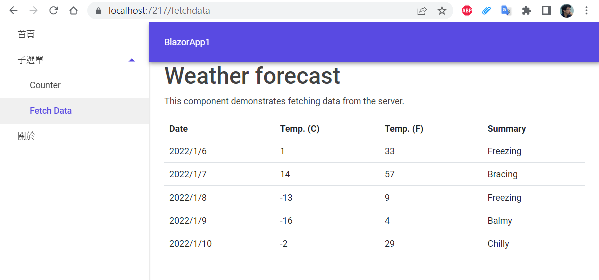

前面整理了三篇 Blazor 入門筆記，除了基礎觀念之外，程式實作的部分都是採用 standalone WASM 模式，也就是單獨運行於前端瀏覽器，沒有倚賴任何後端 ASP.NET Core 服務。往後的文章，預計會逐漸偏向 hosted Blazor WASM 以及 Blazor Server，也就是後端有 ASP.NET Core 的架構。在此之前，我想稍微輕鬆一下，玩一點 UI 元件庫的東西。

粗淺調查目前眾多開源 Blazor 元件庫，我比較屬意的是 [MudBlazor](https://mudblazor.com/) 和 [Blazorise](https://blazorise.com/)，且兩者可用於同一個專案中（可能需要調整一些 CSS）。

這篇筆記不會去評比各家 Blazor 元件庫的優缺點，畢竟我對前端技術不熟，單純是想要找一個簡單好上手、功能夠我用、文件完整的元件庫，幫我加強 UI 的部分，並提高一點生產力。

> [點我查看 Blazor 內建的元件有哪些](https://learn.microsoft.com/zh-tw/aspnet/core/blazor/components/built-in-components)

開發環境：Windows 11、.NET 7 SDK、Visual Studio 2022 version 17.5.0。

## 使用 MudBlazor 前後的差異

這裡要展示的是，先以 Blazor WebAssembly App 專案範本來建立一個應用程式，然後在此專案中加入 MudBlazor，替換一些元件，然後觀察應用程式的外觀與操作跟原先預設範本所建立的程式有何差異。

有關建立 Blazor WASM app 的操作步驟，可參考此系列筆記的第二篇：拆解專案結構、自訂版面配置（有影片）這裡就不重複了。

下圖是使用 MudBlazor 之前、也就是 Blazor 預設專案範本所建立應用程式頁面：

加入 MudBlazor 之後，長這個樣子：

由上圖可知，我會在範例程式中使用 MudBlazor 的 Data Grid 元件，名稱是 `MudDataGrid`。要提醒的是，此元件目前仍在 beta 版本，所以最好別用在正式產品當中，以免未來元件版本更新時給自己造成一些困擾。

## 實作步驟

以下幾個操作步驟主要是參考 [MudBlazor 官方文件：Getting Started](https://mudblazor.com/getting-started/installation)，我只稍微做了一點變化。

1. 安裝 MudBlazor 套件
2. 加入常用命名空間至 _Imports.razor
3. 加入字體和樣式連結
4. 加入 JS
5. 移除 Bootstrap 與 Open-Iconic（非必要）
6. 註冊基礎服務
7. 修改預設的版面配置
8. 修改左側選單 (NavMenu.razor)
9. 改用 MudDataGrid 元件（beta)

接著依序說明各個步驟。

> 如果不想經歷這些修改過程，也可以安裝 MudBlazor 提供的專案範本，直接用它提供的範本來建立專案：[MudBlazor.Templates](https://github.com/MudBlazor/Templates)。

### 1. 安裝 MudBlazor 套件

指令：`dotnet add package MudBlazor`

或者在 Visual Studio 中加入套件：

### 2. 加入常用命名空間至 _Imports.razor

修改專案根目錄下的 _Imports.razor，加入：

{linenos=off}
~~~~~~~~
@using MudBlazor
~~~~~~~~

參考下圖：

### 3. 加入字體和樣式連結

依你的 Blazor 專案類型而定，修改 index.html 或 _Layout.cshtml 或 _Host.cshtml，在 head 元素中加入 CSS 連結：

{linenos=off}
~~~~~~~~
<link href="https://fonts.googleapis.com/css?family=Roboto:300,400,500,700&display=swap" rel="stylesheet" />
<link href="_content/MudBlazor/MudBlazor.min.css" rel="stylesheet" />
~~~~~~~~

### 4. 加入 JS

在 wwwroot\index.html 的 body 元素結尾之前加入：

{linenos=off}
~~~~~~~~

~~~~~~~~

### 5. 移除 Bootstrap 與 Open-Iconic（非必要）

刪除 wwwroot\css 目錄下的兩個資料夾：

- bootstrap
- open-iconic

官方文件說這個步驟不是絕對必要，所以我是暫且保留這兩個資料夾。

### 6. 註冊基礎服務

在 Program.cs 中加入：

{linenos=off}
~~~~~~~~
using MudBlazor.Services;
builder.Services.AddMudServices();
~~~~~~~~

### 7. 修改預設的版面配置

修改 Shared 資料夾底下的 MainLayout.razor：

~~~~~~~~
@inherits LayoutComponentBase

<MudThemeProvider />
<MudDialogProvider />
<MudSnackbarProvider />

<MudLayout>
    <MudAppBar>
        BlazorApp1
    </MudAppBar>
    <MudDrawer Open="true">
        <NavMenu />
    </MudDrawer>

    <MudMainContent>
        <MudContainer Fxied="true">
            @Body
        </MudContainer>        
    </MudMainContent>
</MudLayout>
~~~~~~~~

如下圖：

其中的 `MudContainer` 元件，稍後也可以改成這樣看看結果有何不同：

{linenos=off}
~~~~~~~~
<MudContainer MaxWidth=“MaxWidth.Medium">
    @Body
</MudContainer>        
~~~~~~~~

### 8. 修改左側選單

修改 Shared 資料夾底下的 NavMenu.razor：

~~~~~~~~
@using MudBlazor

<MudNavMenu>
   <MudNavLink Href="/" Match="NavLinkMatch.All">首頁</MudNavLink>
   <MudNavGroup Title="子選單" Expanded="true">
      <MudNavLink Href="/counter" Match="NavLinkMatch.Prefix">Counter</MudNavLink>
      <MudNavLink Href="/fetchdata" Match="NavLinkMatch.Prefix">Fetch Data</MudNavLink>
   </MudNavGroup>
   <MudNavLink Href="/about"  Match="NavLinkMatch.Prefix">關於</MudNavLink>
</MudNavMenu>
~~~~~~~~

完成此步驟之後，執行看看，結果如下圖：

### 9. 改用 MudDataGrid 元件（beta)

修改 Pages 資料夾底下的 FetchData.razor：

~~~~~~~~
@if (forecasts == null) 
{    
    
<em>Loading...</em>
  
}
else
{
   <MudDataGrid Items="@forecasts">
      <Columns>
         <Column T="WeatherForecast" Field="Date" Title="Date" />
         <Column T="WeatherForecast" Field="TemperatureC" Title="Temp. (C)" />
         <Column T="WeatherForecast" Field="TemperatureF" Title="Temp. (F)" />
         <Column T="WeatherForecast" Field="Summary" Title="Summary" />
      </Columns>
   </MudDataGrid>
}
~~~~~~~~

再執行看看：

寫作本文時，`MudDataGrid` 元件目前仍在 beta 階段，意味著將來可能會有較大幅度的改動（可能有 breaking changes）。它有許多進階功能，包括：搜尋文字、排序、篩選、進階篩選、分頁、資料群組（grouping）、聚合（aggregation）、奇偶列顏色替換、凍結欄、[虛擬化](https://learn.microsoft.com/zh-tw/aspnet/core/blazor/components/virtualization?view=aspnetcore-7.0)（提升效能）等等，詳見[官方說明](https://mudblazor.com/components/datagrid)。

> 順便提及，Blazor 小組目前也正在開發一個 data grid 元件，叫做 [QuickGrid](https://aspnet.github.io/quickgridsamples/)。此元件目前仍在 beta 階段，可預期將來會正式納入 Blazor 套件。

# 結語

我覺得 MudBlazor 本身的官方文件寫得清楚易懂，還有提供[線上遊樂場](https://try.mudblazor.com/)來做一些簡單快速的小實驗，相當貼心。說明文件的品質是我挑選第三方元件庫的主要考量之一。

我想，完成本文的入門練習後，往後寫程式只要參考 [MudBlazor 官方文件](https://mudblazor.com/docs/overview) 就行了。故有關 MudBlazor 的筆記，也許就僅此一篇吧。

Happy coding with MudBlazor! （媽的不累惹，真的!)
