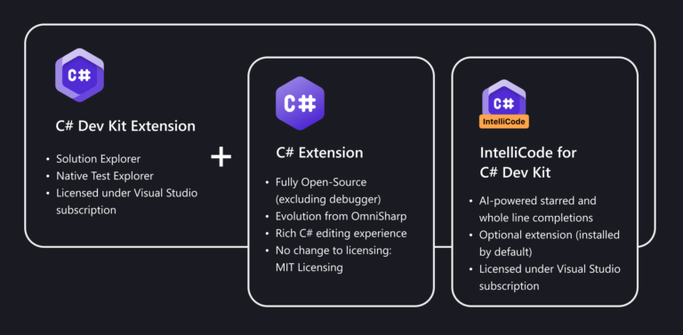

C# Dev Kit is a Visual Studio extension to enhance C# development in Visual Studio Code. This extension is based on the C# extension and can work with the following extensions:

- [IntelliCode for C# Dev Kit](https://marketplace.visualstudio.com/items?itemName=ms-dotnettools.vscodeintellicode-csharp) (automatically installed with C# Dev Kit)
- [.NET MAUI extension](https://marketplace.visualstudio.com/items?itemName=ms-dotnettools.dotnet-maui)
- [Unity extension](https://marketplace.visualstudio.com/items?itemName=VisualStudioToolsForUnity.vstuc)

Something you need to know about C# Dev Kit:

- It's not open-sourced.
- It's free for personal, academic, and open-source projects.
- For commercial projects, it's free for teams of up to 5 members. For teams of 6 or more developers, they must have a Visual Studio Professional or higher subscription.

The following video shows how to login you Visual Studio subscription in VS Code:

Youtube: [C# Dev Kit - Login your Visual Studio subscription](https://www.youtube.com/watch?v=FPwCrmVFawU)

I've also created a video to show how to create and run a Hello World C# project in VS Code:

Youtube: [C# Dev Kit - Create and run a HelloWorld project in Visual Studio Code](https://www.youtube.com/watch?v=MSYtwrLI-jk)

## Features

Currently, C# Dev Kit supports some basic features such as:

- Solution Explorer
- IntelliSense / Code completion
- Go to Definition
- Find All References
- Find All Implementations
- Run unit tests

Of course there are rooms for improvement, for instance: NuGet Manager, Symlink.

## Conclusion

From now on, it will be easier to develop and test C# applications with Visual Studio Code. However, for .NET developers working on Windows, Visual Studio 2022 is no doubt far better than C# Dev Kit.

I think C# Dev Kit is mainly targeting Linux and Mac developers, especially Microsoft have anounced that [Visual Studio for Mac will be retired on August 31, 2024](https://learn.microsoft.com/en-us/lifecycle/announcements/visual-studio-mac-end-of-servicing). By that time, I think Mac users will have no choice but move to Rider or C# Dev Kit.

