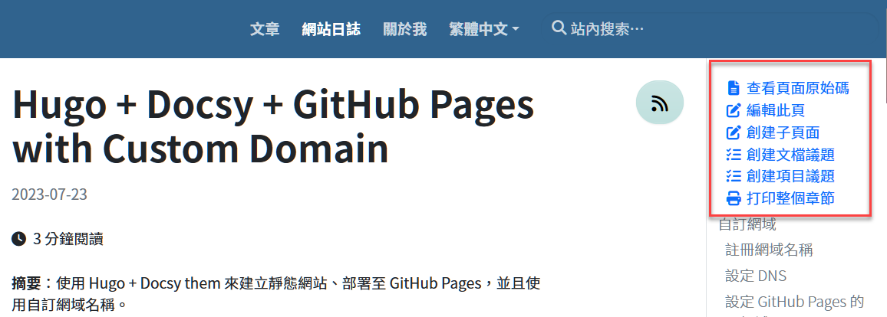

**摘要**：我使用 Hugo 與 Docsy theme 的一點粗淺心得，以及和 MkDocs 的比較。

## MkDocs vs. Hugo

MkDocs 相較於 Hugo，我認為有以下優點：

- 更容易上手，官方文件也寫得很清楚、詳細。
- 搭配 Material theme 和一些現成的 plugins，可快速搭建功能豐富且版面精美的網站。
- 自訂 CSS 與 JavaScript 的機制也設計得相當直觀、簡單。
- Admonitions（callouts）樣式很好看。相較之下，Hugo 搭配 Docsy 所呈現的樣式則單調許多。
- 搭配擴充工具，立刻讓圖片有燈箱效果（點擊圖片可放大，並將背景變暗）。Hugo 這邊，我目前還沒找到解決方案，故碰到高解析度的大圖，就只能受限於中間內容區塊的寬度來顯示縮小版的圖片，不利閱讀。
- 即使有一些擴充的 Makrdown 語法，但編寫出來的文件基本上仍可算是挺「乾淨」的 Markdown。相較之下，Hugo 提供了更多彈性的語法可以很方便的插入一段自訂的 HTML，雖然方便又彈性，卻容易導致編寫文件時使用過多的自訂語法（Hugo 稱之為 Short Code），使得將來更換工具的成本大幅提高，可能只好選擇繼續使用 Hugo。

如果從 Hugo 的角度來看，它也有一些優點：

- 網站左邊的文章選單是根據檔案目錄結構自動生成，並可搭配 Markdown 檔案標頭的 frontmatter 區塊來進行細部控制，例如選單排列順序。MkDocs 的作法則需要在 mkdocs.yml 檔案中編寫整個選單內容，如果是文件數量眾多的大型網站，這個手動編排文章選單的工夫可能會有點累。
- 多種搜尋方案，包括 Google 和一些本地搜尋工具（例如 Lunr）。
- 似乎比 MkDocs 更容易實現多語言和多版本（API 文件）任意切換的文件網站。這只是我個人的使用感受。MkDocs 在這方面不僅需要 plugin 的支援，而且在中文語系會碰到限制：受限於底層依賴的 Lunr.py 元件不支援中文，會導致網站建置失敗。不過，多語系和多版本切換的網站，本身的建置成本就比較高，而且複雜，倒不是每個網站都需要這兩個功能。

### Hugo 的圖片存放位置

MkDocs 與 Hugo 在檔案結構方面的一個差異是圖片的存放位置：

- MkDocs 的圖片可以存放在 Markdown 文件所在資料夾或其下的子目錄，也可以統一放在根目錄之下的某個子目錄。
- Hugo 雖然也是以 Markdown 語法，但是它在插入圖片的時候有一些特殊規必須了解，否則會摸不著頭腦，搞不清楚為何在 Markdown 文件中插入的圖片無法在網頁上顯示。

由於上述差異，編寫 MkDocs 文件時，圖片的存放位置比較直觀，沒有任何特殊之處。例如以下目錄結構：

```
docs\
    docker\
        images\
            figure1.png
            figure2.png
        docker-overview.md    
```

在 docker-overview.md 中插入圖片 images/figure1.png 的寫法是：

```

```

另一方面，Hugo 的圖片存放位置有以下規則：

- 對於共用的圖片檔案，應放在專門用來[存放靜態檔案的資料夾](https://gohugo.io/content-management/static-files/)，例如根目錄下的 `static` 或 `asset` 子目錄。
- 如果圖片要跟文件放在同一個資料夾下，或者放在文件所在位置的子目錄下（例如 images），那麼該文件的檔案名稱就必須是 index.md 或 _index.md。在 Hugo 中，若資料夾裡面有 `index.md` 檔案，該資料夾會被視為**樹葉節點（Leave Bundle）**；若資料夾裡面有 `_index.md` 檔案，該資料夾會被視為**分支節點（Branch Bundle）**。總之，想要把圖片和文件放在一起，就必須把文件放在樹葉或樹枝節點裡面，而文件的檔名必須是 index.md 或 _index.md。詳情可參考官方文件的 [Page bundles](https://gohugo.io/content-management/page-bundles/)。

若選擇把圖片放在 `static`` 資料夾，目錄結構看起來會像這樣：

```
\
    static\
        images\
            figure1.png
            figure2.png
    content\            
        docs\
            docker\
                docker-overview.md    
```

在上述結構中，欲在 docker-overview.md 檔案中插入圖片的寫法是：

```

```

注意圖片的路徑前面並不需要加上 `static/`，因為 Hugo 會自動去 `static` 目錄下尋找圖片，並於生成 HTML 的時候使用正確的圖片連結。

此寫法有個缺點：市面上大部分的 Markdown 編輯器的預覽功能將無法找到圖片，因而在預覽視窗中無法顯示圖片。基於這個緣故，我偏好把圖片放在文件所在的目錄或 `images` 子目錄中。

## 一些小地方

Q: 如何把文章頁面右邊自動出現的選單項目拿掉？如下圖。



A: 「打印整個章節」功能可以參考 Docsy 文件來移除：[Print Support](https://www.docsy.dev/docs/adding-content/print/)，其餘選項都是因為在 hugo.toml 裡面有設定repository URL 的緣故。只要把 Hugo 組態檔中的 `github_repo` 和 `github_project_repo` 設定為空字串，就能讓文章內容頁面右邊出現的那些選單項目消失。

```toml
# Repository configuration (URLs for in-page links to opening issues and suggesting changes)
github_repo = ""
# An optional link to a related project repo. For example, the sibling repository where your product code lives.
github_project_repo = ""
```

---

先這樣，往後有其他心得時再繼續補完。