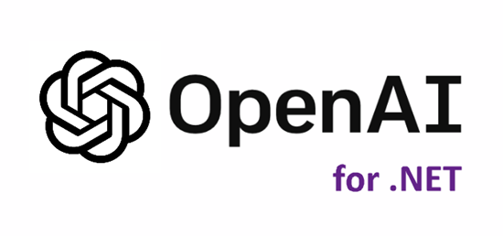
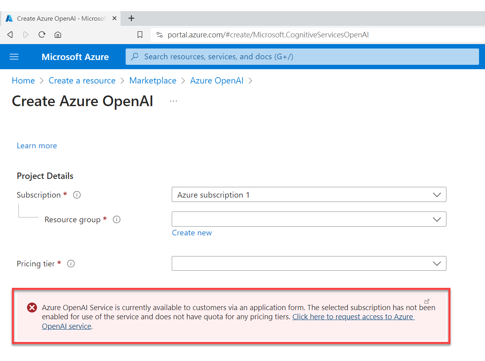
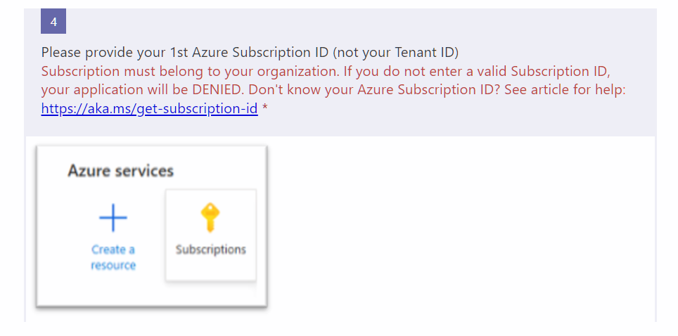
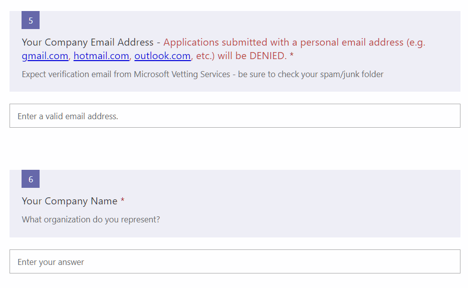
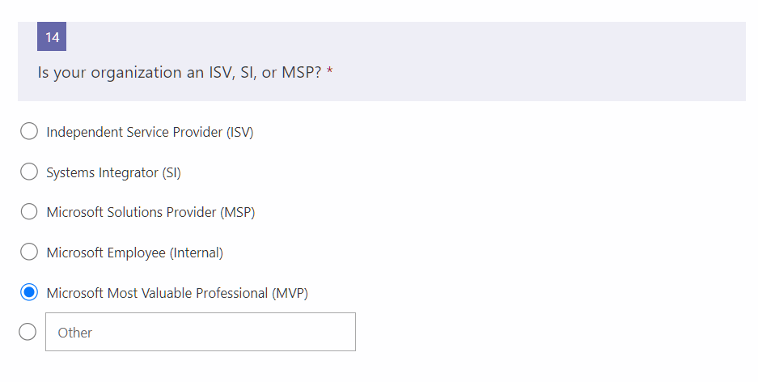
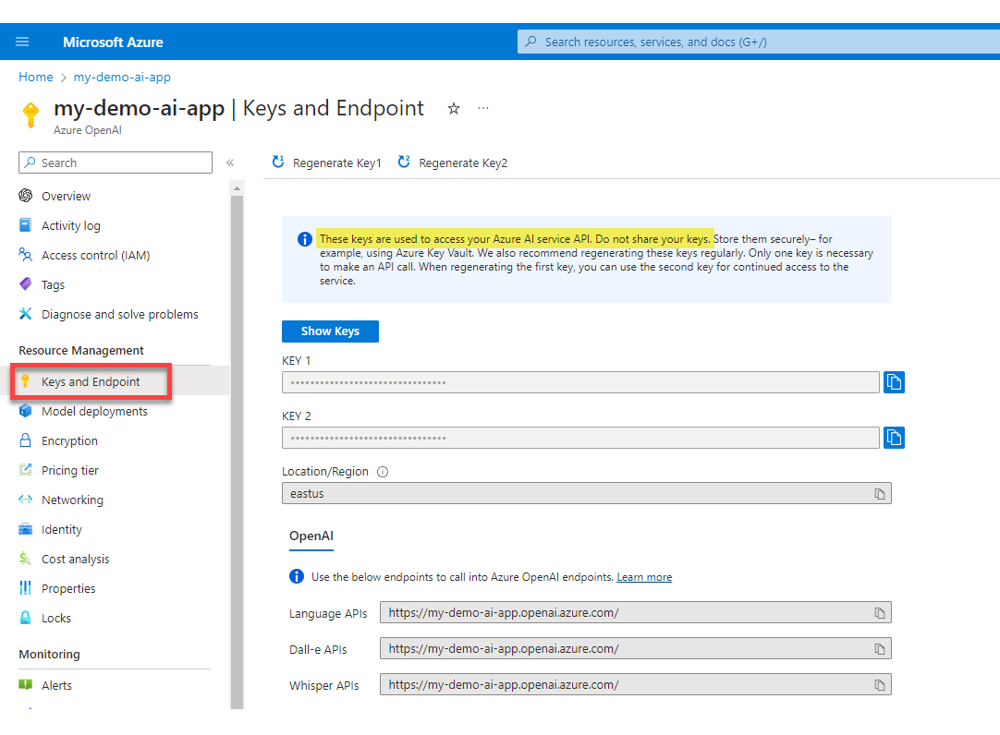
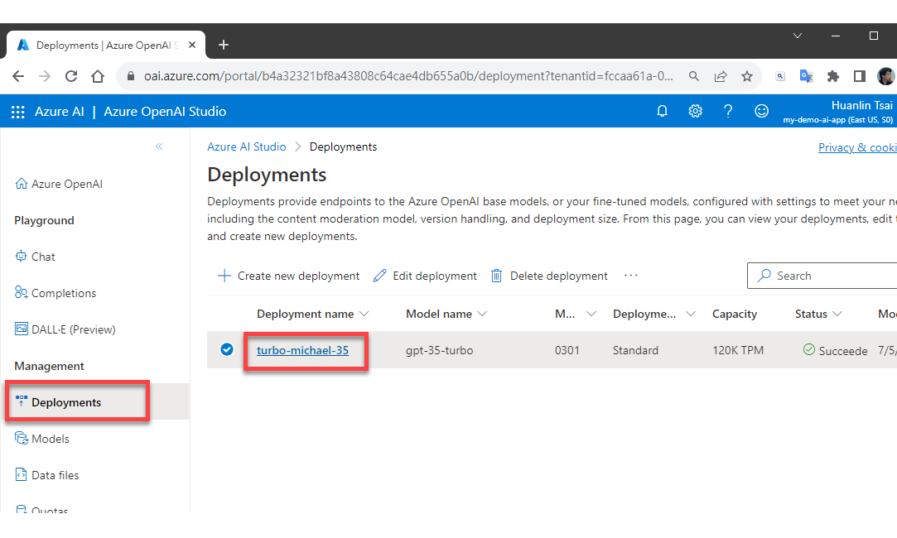
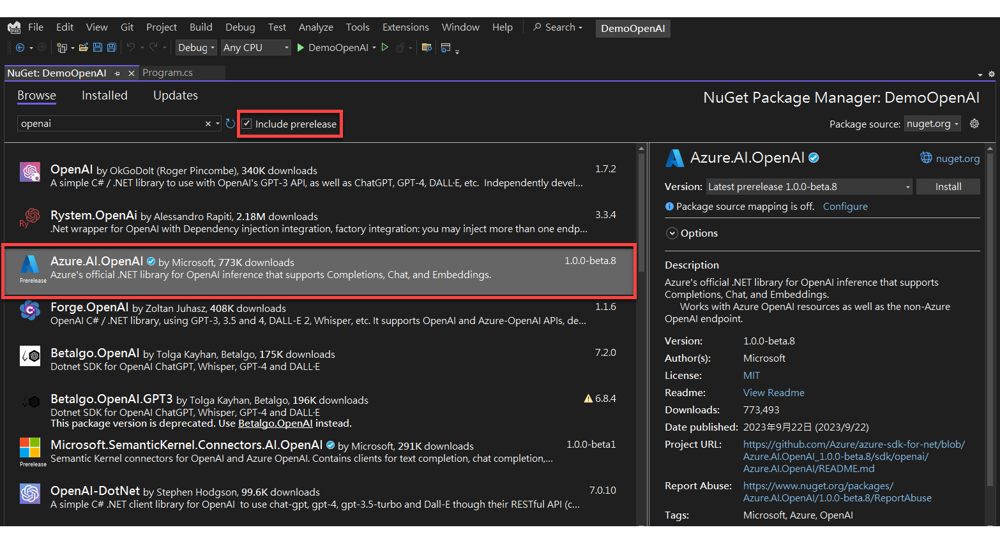
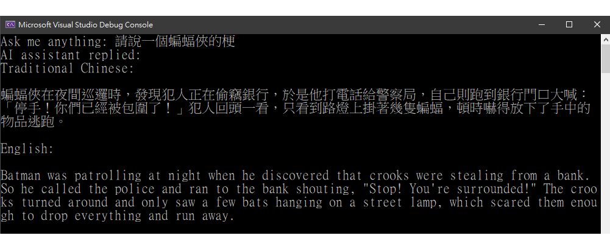

**摘要：** 說明如何開始使用 Azure OpenAI，從建立資源、deploy 一個模型、到撰寫程式來呼叫 OpenAI 的 Chat Completions API。

前提：要有 Azure 帳號（可[免費試用](https://azure.microsoft.com/en-us/free/)）。

## Step 1: Create an OpenAI Resource

欲撰寫程式來使用 Azure OpenAI 服務，必須先在自己的 Azure 帳戶中建立 OpenAI 資源，並[設定一個 deployment](https://learn.microsoft.com/en-us/azure/ai-services/openai/how-to/create-resource?pivots=web-portal#deploy-a-model) 來指定欲使用哪一個訓練模型（例如 gpt-35-turbo、gpt-4 等等）。

首先，登入 [Azure 入口網站](https://portal.azure.com/)，選擇建立資源（Create a resource）。然後在搜尋框中輸入 "openai"，即可找到建立 OpenAI 資源的地方。稍後有操作過程的影片連結）

建立 OpenAI 資源時，頁面下方可能會看到如下圖的錯誤訊息：



此訊息告訴我們：Azure OpenAI 目前必須透過一個申請程序，審核通過之後方能使用。此申請程序需要填寫一個線上表單，只要點擊訊息中的連結即可開啟那個線上申請表單。填寫表單時，有些欄位不可填錯，例如你的 Azure 訂閱 ID（subscription ID）：



還有你任職公司的 email、地址、電話：



如果沒有填寫正確的公司資料和 email，例如填寫 gmail、yahoo mail 等私人信箱，都無法通過審核。

如果你是 Microsoft MVP，在選擇組織類型的時候有對應的選項：



另外還要勾選你需要使用 AI services 提供的哪些功能，例如 Language、Dall-E、Whisper 等等。我不知道怎樣填寫才一定能通過申請，我只是據實填寫。

兩天後，我收到了核准通知的 email。然後我打開瀏覽器，登入 Azure 入口網站，前面圖中顯示的錯誤訊息便消失了，顯示我可以開始建立 OpenAI 資源。

我錄製了一個影片放在 Youtube 上，可大致了解如何建立一個 OpenAI 資源，連結如下：

[Create an Azure OpenAI Resource](https://youtu.be/fvU4XLW7Zco)

## Step 2: Call the API

建立好 OpenAI 資源後，可以從 Azure 網站上找到三個關鍵資訊：

- OpenAI 的 API endpoint。
- 呼叫 API 時必須提供的 keys。
- 預先建立的 OpenAI deployment 的名稱。

下圖顯示的網頁可以找到你申請的 OpenAI 的 API endpoint 以及 keys。密鑰有兩支，任何一支都可以用。



從上圖左方選單點擊 `Model deployments` 即可得知先前建立好的 OpenAI deployment 名稱，如下圖：



有了上述資訊之後，便可以撰寫程式碼來呼叫 OpenAI 服務了。

### A REST Client Example

如果你有使用 Visual Studio Code 和 [REST Client 擴充套件](https://marketplace.visualstudio.com/items?itemName=humao.rest-client)，可以直接用以下範例來測試（必須把開頭三個變數替換成你自己的資源和設定）：

```
@API_KEY = 0bc0xxxxxxxxxxxx7971
@RESOURCE_NAME = my-demo-ai-app
@DEPLOYMENT_NAME = turbo-michael-35

### OpenAI Test
POST https://{{RESOURCE_NAME}}.openai.azure.com/openai/deployments/{{DEPLOYMENT_NAME}}/chat/completions?api-version=2023-05-15
api-key: {{API_KEY}}

{
    "messages": [
        { "role": "system", "content": "Please answer with Chinese."},
        { "role": "user", "content": "Tell me a joke about dogs."}        
    ]
}
```

請注意這裡的 endpoint 並不是先前網頁截圖中顯示的 `https://my-demo-ai-app.openai.azure.com/`（此 endpoint 會用於稍後的 c# 範例），而是後面有加上 deployment name 和 Chat Completions API 路徑的 REST API endpoint：

```
https://{{RESOURCE_NAME}}.openai.azure.com/openai/deployments/{{DEPLOYMENT_NAME}}/chat/completions?api-version=2023-05-15
```

> 有關 Chat Completions 的 REST API endpoint 格式與查詢參數，可參考官方文件：[Azure OpenAI Service REST API reference: Chat completions](https://learn.microsoft.com/en-us/azure/ai-services/openai/reference#chat-completions)。

以上範例中，我在 POST request body 的 `messages` 陣列中加入了兩條訊息：

- 第一條訊息的角色是 `system`，表示這是一則 system message，用來預先給 AI 助理一些指示，請她在接下來的回應中按照這個指示來產生回應內容。這裡我給她的指示為：「請用中文回答。」
- 第二條訊息的角色是 `user`，表示這是一則 user message，亦即使用者的提問內容。OpenAI 服務會針對這個提問來產生回應。此範例是請 AI 助理說一則關於小狗的笑話。

執行結果如下：

```json
{
  "id": "chatcmpl-89WTdFFwqgeIZG6WNJ0g3mOxhaOb3",
  "object": "chat.completion",
  "created": 1697280485,
  "model": "gpt-35-turbo",
  "choices": [
    {
      "index": 0,
      "finish_reason": "stop",
      "message": {
        "role": "assistant",
        "content": "狗为什么总是追自己的尾巴？因为它们担心自己跑得太快，把自己追上了！"
      }
    }
  ],
  "usage": {
    "prompt_tokens": 25,
    "completion_tokens": 49,
    "total_tokens": 74
  }
}
```

結果 AI 助理是以簡體中文來回應。在接下來的 C# 範例程式中，我會明確指示她以繁體中文來回應。

### A .NET Example

以下範例是以 C# 撰寫的 .NET Console application。寫程式前，需在專案中加入套件：Azure.AI.OpenAI。此套件目前還是 beta 版，故加入套件時必須使用 `prerelease` 選項。



程式碼如下：

```c#
using Azure;
using Azure.AI.OpenAI;

var key = "0bc0xxxxxxxxxxxxxxxx7971";
var endpoint = "https://my-demo-ai-app.openai.azure.com/";
var deployment = "turbo-michael-35";

Console.Write("Ask me anything: ");
var prompt = Console.ReadLine();

OpenAIClient aiClient = new(new Uri(endpoint), new AzureKeyCredential(key));

ChatCompletionsOptions chatOptions = new()
{
    Messages =
    {
        new ChatMessage(ChatRole.System, "Please answer me with both Traditional Chinese and English."),
        new ChatMessage(ChatRole.User, prompt)
    }
};

ChatCompletions response = aiClient.GetChatCompletions(deployment, chatOptions);

Console.WriteLine("AI assistant replied: ");
Console.WriteLine(response.Choices[0].Message.Content);
```

這次我在 system message 中明確指示 AI 助理要同時使用繁體中文和英文來回應（第 17 行），執行結果如下圖：



如此便可確認 .NET 程式也能順利呼叫 OpenAI 服務。至於那個蝙蝠俠的梗（哏）好不好笑，就不是重點了。

Keep coding!

## Reference

- [Create and deploy an Azure OpenAI Service resource](https://learn.microsoft.com/en-us/azure/ai-services/openai/how-to/create-resource?pivots=web-portal)
- [Learn how to work with the GPT-35-Turbo and GPT-4 models](https://learn.microsoft.com/en-us/azure/ai-services/openai/how-to/chatgpt?pivots=programming-language-chat-completions)
- [Azure OpenAI Service REST API reference: Chat completions](https://learn.microsoft.com/en-us/azure/ai-services/openai/reference#chat-completions)
