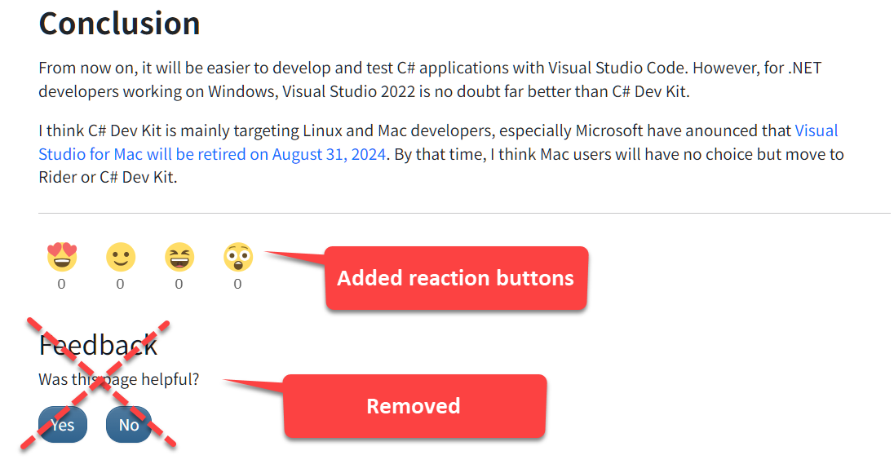
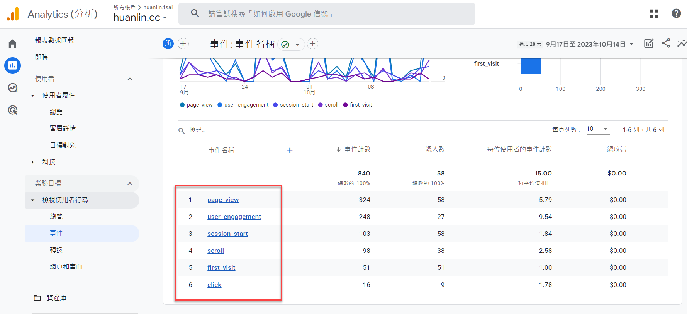

## Change Summary

- Disabled Docsy theme's built-in user feedback feature because it is not working. 
- Added ShareThis reaction buttons as the alternative for user feedback.

See the figure below:



## Disabling Docsy's User Feedback Feature
 
Docsy's built-in user feedback is now disabled in hugo.toml of this site:

```toml
[params.ui.feedback]
enable = false
```

Because Docsy is still using the deprecated Google Analytics method which is Universal Analytics (UA). 

Relevant issue: [Page feedback: support Google Analytics 4](https://github.com/google/docsy/issues/1302)

In the above issue, it mentioned that "Kubernetes docs had switched to using `gtag.js` in their override of [layouts/partials/feedback.html](https://github.com/kubernetes/website/blob/main/layouts/partials/feedback.html) already 4 years ago."

I think that's why I couldn't find the `Helpful` event in the Google Analytics event report:



> See also: Docsy document "Analytics, User Feedback, and SEO" > [Access the feedback data](https://www.docsy.dev/docs/adding-content/feedback/#access-the-feedback-data)

Since the user feedback feature is not working, I use ShareThis reaction buttons instead.

## Adding ShareThis Reaction Buttons

[ShareThis](https://platform.sharethis.com/) provides free shareing tools for websites. I only use the reaction buttons. 

To use ShareThis buttons, first register an account on ShareThis.com and activate the JavaScript. I copied the following code from ShareThis.com and paste it into `/layouts/partials/hooks/head-end.html`.

```html
<!-- ShareThis -->
<script type='text/javascript' src='https://platform-api.sharethis.com/js/sharethis.js#property=652ac3cc05f82e0013986ed2&product=inline-reaction-buttons' async='async'></script>
```

Once the above change is published to the website, go back to ShareThis.com and click `Activate` to verify that the JavaScript is installed successfully. 

Once the JavaScript is active, copy the code of reaction buttons from ShareThis.com and paste it to the location where we want them to be. Below is the code of reaction buttons:

```
<!-- ShareThis BEGIN -->
<div class="sharethis-inline-reaction-buttons"></div>
<!-- ShareThis END -->
```

I've placed the above code in two files:

- `/layouts/_default/content.html` - for articles.
- `/layouts/blog/content.html` - for blog posts.

Below is the content of `layouts/_default/content.html`:

```html
<div class="td-content">
	<h1>{{ .Title }}</h1>
	{{ with .Params.description }}<div class="lead">{{ . | markdownify }}</div>{{ end }}
	<header class="article-meta">
		{{ partial "taxonomy_terms_article_wrapper.html" . -}}
		{{ if (and (not .Params.hide_readingtime) (.Site.Params.ui.readingtime.enable)) -}}
			{{ partial "reading-time.html" . -}}
		{{ end -}}
	</header>
	{{ .Content }}
	<br />
	{{ partial "page-meta-lastmod.html" . }}
    <br />
	<!-- ShareThis BEGIN --><div class="sharethis-inline-reaction-buttons"></div><!-- ShareThis END -->
	{{ if (and (not .Params.hide_feedback) (.Site.Params.ui.feedback.enable) (.Site.GoogleAnalytics)) -}}
		{{ partial "feedback.html" .Site.Params.ui.feedback }}
		<br />
	{{ end -}}
    </div>
	{{ if (.Site.Params.DisqusShortname) -}}
		<br />
		{{- partial "disqus-comment.html" . -}}
	{{ end -}}	
</div>
{{/**/ -}}
```

Below is the content of `/layouts/blog/content.html`:

```html
<div class="td-content">
	<h1>{{ .Title }}</h1>
	{{ with .Params.description }}<div class="lead">{{ . | markdownify }}</div>{{ end }}
	<div class="td-byline mb-4">
		{{ if .Params.author }}
		    {{ with .Params.author }}{{ T "post_byline_by" }} <b>{{ . | markdownify }}</b> |{{ end}}
		{{ else }}	
		    {{ with $.Site.Params.default_blog_author }}{{ T "post_byline_by" }} <b>{{ . | markdownify }}</b> |{{ end}}
		{{ end }}
		<time datetime="{{  $.Date.Format "2006-01-02" }}" class="text-muted">{{ $.Date.Format $.Site.Params.time_format_blog  }}</time>
	</div>
	<header class="article-meta">
		{{ partial "taxonomy_terms_article_wrapper.html" . -}}
		{{ if (and (not .Params.hide_readingtime) (.Site.Params.ui.readingtime.enable)) -}}
			{{ partial "reading-time.html" . -}}
		{{ end -}}
	</header>
	{{ .Content }}	
	<hr style="margin-top: 25px;"/>
	<!-- ShareThis BEGIN --><div class="sharethis-inline-reaction-buttons"></div><!-- ShareThis END -->
	{{ if (and (not .Params.hide_feedback) (.Site.Params.ui.feedback.enable) (.Site.GoogleAnalytics)) -}}
		{{ partial "feedback.html" .Site.Params.ui.feedback }}
		<br />
	{{ end -}}	
	{{ if (.Site.Params.DisqusShortname) -}}
		<br />
		{{- partial "disqus-comment.html" . -}}
		<br />
	{{ end -}}

	{{ partial "pager.html" . }}
</div>
```

Hopefully the Docsy issue [Page feedback: support Google Analytics 4](https://github.com/google/docsy/issues/1302) will be fixed soon.

Keep writing!