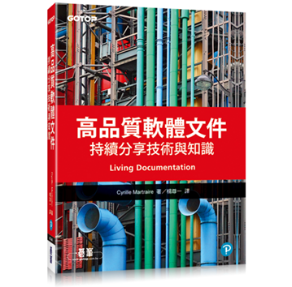

- 中文書名：《高品質軟體文件》
- 原文書名：Living Documentation
- 作者：Cyrille Martraire
- 譯者：楊尊一

---

我也有買英文版，所以有時會中英交替著看。這裡我想從書中摘出我特別有感的兩個段落，講的是關於保持文件的正確性（摘自第 1 章）。最後是一點個人感想。

以下先摘錄原文，然後是我修改後的中文翻譯。（註：不代表我修改後的翻譯一定更通順正確，只是我的一點個人偏執罷了。）

第一段，英文：

> Documentation that is not 100% accurate all the time cannot be trusted. As soon as you know documentation can be misleading from time to time, it loses its credibility. It might still be a bit useful, but it will take more time to find out what's right and what's wrong in it. And when it comes to creating documentation, it's hard to dedicate time to it when you know it won't be accurate for long; its lifespan is a big motivation killer.

第一段，中譯：

> 沒有隨時保持 100% 正確的文件不可信。一旦你發現有時會被文件誤導，它便失去了可信度。它可能還有一點用處，但需要花更多時間去分辨哪些是對的、哪些是錯的。當你一開始寫文件的時候就知道無法讓它長期保持正確，便很難付出心力去寫；文件的壽命會大大削弱撰寫文件的動力。

---

第二段，英文：

> But updating documentation is one of the most unappreciated tasks ever. It is not interesting and doesn't seem rewarding. However, you can have nice documentation if you take it seriously and decide to tackle it with a well-chosen mechanism to enforce accuracy at all times.
>
> **Therefore: You need to think about how you address the accuracy of your documentation.**

第二段，中譯：

> 然而，更新文件是最不受重視的工作之一。它不有趣，似乎也不會有什麼回報。但如果你認真對待並決定採取適當機制來確保其正確性，便能寫出好文件。
> 
> **因此：你需要思考如何處理文件的正確性。**

## 感想

持續更新文件以保持其正確性，其中的付出和成效是很難被看見的，尤其在當下或短時間內。這是身為 technical writer 必須有的體認和覺悟。

能夠在不被 appreciate 的情況下還願意花時間（加班）更新文件的細微角落，就像程式設計師即使在沒有別人 review 程式碼的情況下依然堅持寫 clean code，是需要一些信念來支撐的。

Keep writing!