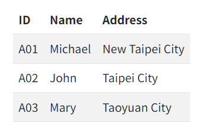

In this post, I share my Hugo shortcode that can render a .CSV file as an HTML table.

## Code generated by Copilot

I don't know much about Hugo syntax, so I asked Copilot to generate a Hugo shortcode for rendering a .CSV file as an HTML table. Herer is what I got:

```golang
{{- $csv := .Get "csv" -}}
{{- $data := getCSV $csv -}}
<table>
    <thead>
        <tr>
            {{- range $data.0 -}}
            <th>{{ . }}</th>
            {{- end -}}
        </tr>
    </thead>
    <tbody>
        {{- range $data.1 -}}
        <tr>
            {{- range . -}}
            <td>{{ . }}</td>
            {{- end -}}
        </tr>
        {{- end -}}
    </tbody>
</table>
```

Then I searched Google, and realized the [`getCSV` function](https://gohugo.io/functions/data/getcsv/) is deprecated:

> Deprecated in [v0.123.0](https://github.com/gohugoio/hugo/releases/tag/v0.123.0).
>
> Instead, use transform.Unmarshal with a global, page, or remote resource.
>
> See the remote data example.

## My code

After reading examples on the [`getCSV` function](https://gohugo.io/functions/data/getcsv/) page, I came up with the following code:

```golang
{{- $rows := "" -}}
{{- $filename := .Get 0 -}}
{{- with .Page.Resources.Get $filename -}}
    {{- $options := dict "delimiter" "," -}}
    {{- $rows = .Content | transform.Unmarshal $options -}}
    {{- $headerRow := index $rows 0 -}}
    {{- $dataRows := after 1 $rows -}}
    <table>
        <thead>
            <tr>
                {{- range $headerRow -}}
                <th>{{ . }}</th>
                {{- end -}}
            </tr>
        </thead>
        <tbody>
            {{- range $rowIndex, $columns := $dataRows -}}
            <tr>
                {{- range $col := $columns -}}
                <td>{{ . }}</td>
                {{- end -}}
            </tr>
            {{- end -}}
        </tbody>
    </table>
{{- else -}}
    {{ errorf "Unable to get the page resource: %q" $filename }}
    <p>CSV file not found: {{ $filename }}</p>
{{- end -}}
```

Save the above code as file `/layouts/shortcodes/csvtable.html`.

Notes about usage:

- The .CSV file must be located in the [lead bundle](https://gohugo.io/content-management/page-bundles/).
- The .CSV file must have a header row.

### Test my shortcode

To test the shortcode, save the following text as "test.csv" file:

```text
ID, Name, Address
A01, Michael, New Taipei City
A02, John, Taipei City
A03, Mary, Taoyuan City
```

Note that the value of the third column `Address` cannot be enclosed with double quotation marks. For example, `"New Taipei City"` is incorrect and will cause the following error while Hugo builds the site:

```text
execute of template failed at <transform.Unmarshal>: 
    error calling Unmarshal: 
        parse error on line 2, column 15: bare " in non-quoted-field
```

Now, create a file named "index.md" in the same folder as "test.csv", and add the following text in the file:

```text

```

Result:

