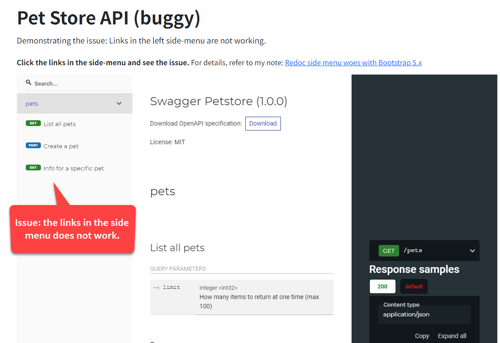

## Symptom

In a static website built with Hugo and Docsy theme, I added a page to render an OpenAPI yaml file using [Redoc](https://redocly.com/docs/redoc/). The markdown file of the page is as simple as below:

```markdown
---
title: API reference
---

<redoc spec-url="http://petstore.swagger.io/v2/swagger.json"></redoc>
<script src="https://cdn.redoc.ly/redoc/latest/bundles/redoc.standalone.js"> </script>
```

The result page should work like [the official Redoc demo](https://redocly.github.io/redoc/), that is when an item in the left side menu is clicked, the content area should scroll to the corresponding section. However, when I click the side menu, the content area doesn't scroll at all.



Well, that's not the whole story. Interestingly, it works on some environments. I have tested it with the three machines:

- Ubuntu 20.04
- Windows Server 2019
- Windows 10

All three machines have installed the same latest version of Chrome, and the Redoc rendered OpenAPI page works only on Windows Server 2019 machine. Weird enough.

It's puzzling why there is such a difference when browsing the pages generated by Redoc. During the troubleshooting process, I spent a lot of time suspecting Chrome extensions, firewalls, and other factors, but ultimately found no clear correlation.

### Demo

To see the issue and a fixed version in action, go to this page: [Demo Open API](/docs/demo). However, just as mentioned earlier, <mark>the issue might not appear on your machine.</mark>

### Tools and versions

- [Redoc 2.1.3](https://github.com/Redocly/redoc)
- [Docsy 0.9.0](https://github.com/google/docsy)
- [Bootstrap 5.3.1](https://github.com/twbs/bootstrap)

## Investigation

I'm not proficient in front-end technologies, so I used a rudimentary method to find the cause -- I removed some code from Docsy, bit by bit, until the side menu's scrolling behavior works.

It took me almost an entire day testing the issue with three different operating systems, just to find that the issue could be resolved by removing the following code from Docsy's `/asset/scss/main.scss`:

```scss
@import "../vendor/bootstrap/scss/bootstrap";
@import "support/bootstrap_vers_test";
```

At the end of the day, I managed to create my own Redoc layout page and remove Bootstrap CSS v5.x. Now, the side menu in the web page rendered by Redoc worked normally.

### Possible related issues

After I came up with my workaround and went home, I searched Google and found that the following issues seems relevant:

- Docsy issue #1628: [Redoc left navigation auto scrolling and link changing on scrolling is not working anymore](https://github.com/google/docsy/issues/1628)
- Redoc issue #1235: [Left navigation auto scrolling and link changing on scrolling is not working](https://github.com/Redocly/redoc/issues/1235)
- Redoc issue #1987 [Redoc sidemenu doesn't auto-activate for certain styled outer container](https://github.com/Redocly/redoc/issues/1987)

## Solution

As mentioned in the last section, creating a layout dedicated for Redoc and excluding Bootstrap CSS v5.x can fix this issue. However, I would call it a workaround, not a perfect solution. If you have better ideas for this issue, kindly let me know.

Here is the source code of my customized Redoc layout, and the file path name is `/layout/redoc/baseof.html`. For further details, refer to [the redoc folder on my GitHub repository](https://github.com/huanlin/huanlin.github.io/tree/redoc-woes-with-bootstrap-css-5.x/layouts/redoc).

```html
<!doctype html>
<html itemscope itemtype="http://schema.org/WebPage" lang="{{ .Site.Language.Lang }}" class="no-js">
  <head>
    <!-- Use the following lines to replace {{ partial "head.html" . }} -->        
    <!-- Note: Use Bootstrap CSS v4.x instead of v5.x to ensure the side-menu links work as expected. -->
    <link rel="stylesheet" href="https://cdn.jsdelivr.net/npm/bootstrap@4.6.2/dist/css/bootstrap.min.css" integrity="sha384-xOolHFLEh07PJGoPkLv1IbcEPTNtaed2xpHsD9ESMhqIYd0nLMwNLD69Npy4HI+N" crossorigin="anonymous">
    <script src="https://code.jquery.com/jquery-3.7.1.min.js" integrity="sha256-/JqT3SQfawRcv/BIHPThkBvs0OEvtFFmqPF/lYI/Cxo=" crossorigin="anonymous"></script>
  </head>
  <body class="td-{{ .Kind }}{{ with .Page.Params.body_class }} {{ . }}{{ end }}">
    <header>
      <!-- removed {{ partial "navbar.html" . }} -->
    </header>
    <div class="container-fluid td-outer">
      <div class="td-main">
<!-- Commented for redoc
        <div class="row flex-xl-nowrap">
          <aside class="col-12 col-md-3 col-xl-2 td-sidebar d-print-none">
            {{ partial "sidebar.html" . }}
          </aside>
          <aside class="d-none d-xl-block col-xl-2 td-sidebar-toc d-print-none">
            {{ partial "page-meta-links.html" . }}
            {{ partial "toc.html" . }}
            {{ partial "taxonomy_terms_clouds.html" . }}
          </aside>
          <main class="col-12 col-md-9 col-xl-8 ps-md-5" role="main">          
-->          
          <main role="main">          
            {{ partial "version-banner.html" . }}
            {{ if not .Site.Params.ui.breadcrumb_disable }}{{ partial "breadcrumb.html" . }}{{ end }}
            {{ block "main" . }}{{ end }}
          </main>
        </div>
      </div>
      <!-- {{ partial "footer.html" . }} -->
    </div>
    <!-- {{ partial "scripts.html" . }} -->
  </body>
</html>
```

To use the above Redoc layout, add a markdown page as below, or refer to [the source code on GitHub](https://github.com/huanlin/huanlin.github.io/blob/redoc-woes-with-bootstrap-css-5.x/content/en/docs/demo/redoc-fixed.md?plain=1).

```text
---
title: "Pet Store API (working)"
type: redoc
weight: 2
description: "Demonstrating a customized Redoc layout for fixing side-menu links." 
---


```

---

That's it. Hope this helps.
