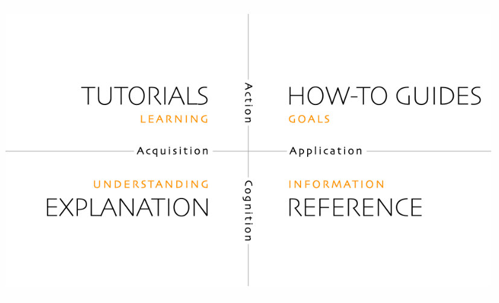

## 概要

在這篇筆記，我想整理幾個有關技術文件寫作的重要觀念和理念：

- 理念：Docs as a product，指的是把「技術文件」當成一個產品來發展和維護。
- 理念：Content first，即內容優先。既不是工具優先、平台優先，也不是美觀樣式優先。
- 方法：Docs as Code，指的是以跟寫程式一樣或相似的工具與流程來製作文件。

有關 Docs as Code，我在[上一篇筆記](https://huanlin.cc/blog/2024/04/24/docs-as-code-and-kms/)中已經有稍微提到，這篇筆記就不展開細說（未來可能針對這個主題再另外寫一篇筆記）。

## Docs as a product

Documentation as a product 簡稱 Docs as a product，指的是把「技術文件」當成一個產品來發展和維護。

乍聽之下似乎很直觀，沒必要特別強調。但實際上，每個人寫出來的技術文件不會完全一樣，而文件對於目標讀者是否「有用」才是最要緊的。並不是說，每個人今天搞懂了一項技術或 know-how，鍵盤抄起來劈哩啪啦開始打字，便都可以立刻成就一篇易讀易懂、對讀者有用的文章。而且，如果本身肩負 DevOps 相關工作，日常的程式開發、問題排查、技術支援等工作可能已占滿大部分的時間（還有一堆會議？），恐怕也沒有太多時間去思考一篇文章要怎樣寫才好。

能不能寫出對讀者有用的文章，除了需要掌握文章內容涉及的技術與 know-how，更重要的是有沒有去思考一篇文章該怎麼寫，才能讓人讀起來舒服、易懂、有學到東西或者解決他們手邊碰到的問題。當然我們不能排除有的人已經是寫手等級，或者對於想要寫的內容早已在心中醞釀多時、胸有成竹，故可下筆如有神，一蹴而就。

簡單來說，關鍵在於：身為作者的你，是否知道怎樣的技術文件才是對多數的目標讀者有幫助？如果寫文件的過程能夠經常考慮這點，並持續改善文件內容，我想已經走在對的道路上。能夠做到這點，自然也就懂得 docs as a product 是一個怎樣的理念。

> 有關成為 technical writer 的一些個人特質與要件，之後可能再另開一篇筆記來分享個人淺見。

總之，docs as a product 不是把技術文件當成零散筆記、隨意為之，而是經過作者構思與細心整理的文件。作者知道知識傳遞與知識分享的重要性，他／她希望有更多人願意讀這些文件，且信任這些文件，故願意投注長期的心力來持續改善文件的品質，就像持續改善一項產品那樣。

## Content first

內容優先，這也相當直觀，文件首重其內容是否有用，自然是內容優先了。強調這點的原因是相對於其他考量來說的，例如：優先考慮文件撰寫工具或文件管理平台是否容易取得、工具是否好用、產生出來的文件是否美觀 fancy 等等。

當然，這是基於前一項理念來說的，也就是 docs as a product。

有些文件並不需要那麼嚴肅認真地對待，例如一些不穩定的暫時知識、零碎知識，我們可能就不會大費周章去把它們當成一個產品來發展與維護，於是內容結構如何、是否易讀易懂，也就變成次要的了。

### 構思文件架構 {#ideate-content-structure}

一旦確定要撰寫**正規文件**，把文件當成一項產品來認真看待，便需要規劃和構思文件結構與內容。此時，有一個名為 [Diátaxis](https://diataxis.fr/) 的文件構思框架可以派上用場。如下圖（取自 diataxis.fr）：

此框架把文件分成四大類：

- **教學文件**：協助讀者學習某一個主題。
- **How-to 文件**：包含完成特定工作或目標的指引。例如「如何建立虛擬機器」、「手把手教你 XYZ」通常屬於此類。
- **解釋型文件**：說明某個概念、名詞、架構等等都是。
- **參考文件**：提供參考資訊，例如 error codes、API reference manual 等等。

構思技術文件該包含哪些內容時，不妨以此框架來規劃文件的架構。

有了大分類之後，可以再進一步思考更細、更具體的文件類型，例如：

- Introduction、overview
- Tutorials
- Use cases and best practices
- FAQs
- API reference manual
- 專有名詞（terminology）
- 產品的 road map
- 產品的 release notes
- 聯繫技術支援的管道
- 提供有關文件內容 feedback 的管道
- 相關法規與政策

規劃文件內容架構時，若想不到該放哪些東西到文件中，不妨利用上述清單來刺激靈感。

## 結語

本文提及的概念和方法，都是我贊同而且正在使用的，而且我覺得對於從事軟體開發或系統工程方面的 DevOps 與工程師特別合適，因為相對容易上手。比如說，讓 DevOps team 成員學習使用 markdown 來寫文件，碰到的抗拒通常會比一般習慣用 Word 和 Powerpoint 寫文件的人來得低。

然而，也不能預設只有 DevOps 工程師才能使用這套方法來寫文件。理想情況下，撰寫文件的相關配套工具、平台、教學文件，也都應該盡量準備齊全而且容易上手，讓組織中的其他角色（例如 PM、SA）也能參與文件協作、貢獻知識。

最後，最重要的，無論採用何種工具，只要是正規文件，都應該以易讀易懂為目標，而且能讓讀者自行閱讀文件就學會特定知識、或解決特定問題（而不是看了文件感覺一頭霧水還得一直去找人問）。

喔對了，非正規文件當然也可以用上述理念和方法來撰寫，例如部落格就是練習寫文件的一個好方法（儘管有點老派，但還是很棒的方法）。

Keep writing!

## 延伸閱讀 {#see-also}

- [Diátaxis 文件類型框架](https://diataxis.fr/)
- [Docs as Code 與知識管理系統](https://huanlin.cc/blog/2024/04/24/docs-as-code-and-kms/)
