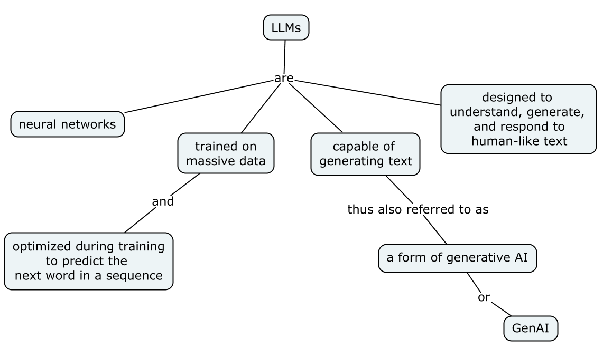

LLMs (large language models)

are 

 神經網路

用途

- 設計用來理解、產生、和回應人類的語言文字。

能夠產生文字（text），因此也稱為一種生成式 AI（generative AI），或簡稱 GenAI。

GenAI: 使用深度學習的神經網路來建立新的內容，像是產生文字、圖像、或各種形式的媒體。

怎麼來的？

基於大量資料的訓練

## Reference