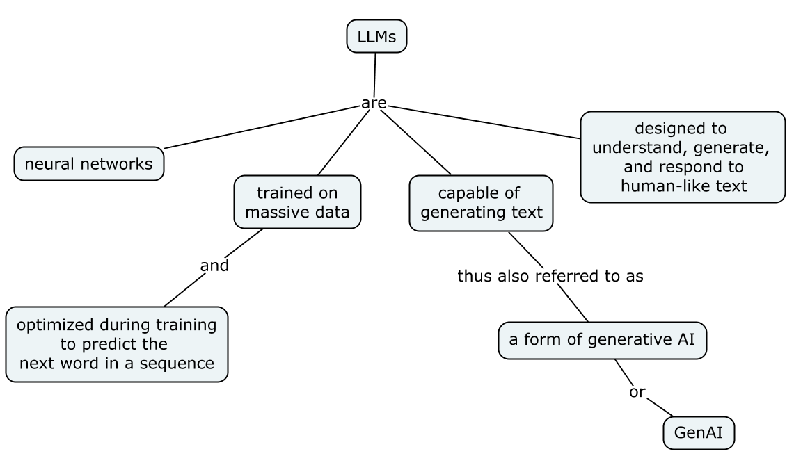

這裡用一張概念圖來簡單介紹 LLMs (large language models) 的基礎觀念，稍後附上文字說明。

說明：

- LLMs 是基於大量資料來進行訓練的大型深度學習模型，也是一種神經網路（neural network）模型。實例：OpenAI 的 ChatGPT。
- LLMs 能夠理解、產生、和回應人類的語言文字。由於能夠生成文字，故也稱為生成式 AI（generative AI），或簡稱 **GenAI**。
- 訓練模型的過程會針對「預測下一個字詞」來優化。
- LLMs 使用了一種稱為**轉換器（transformer）**的架構來處理複雜精細的人類語言。

> GenAI: 使用深度學習的神經網路來建立新的內容，像是產生文字、圖像、或各種形式的媒體。

下圖描繪了 LLMs 與其相關知識領域的關係（參考自 [Build a Large Language Model (From Scratch)][1]）：

- LLMs 是深度學習（deep learning）技術的一種特殊應用，主要用於處理和生成文字。
- 深度學習則是機器學習（machine learning）的一個分支（或子集），專注於多層的神經網路。
- 機器學習的領域則涉及各種用於人工智慧的演算法。

## Reference

- [Build a Large Language Model (From Scratch)][1] by Sebastian Raschka
- AWS 文件：[什麼是大型語言模型 (LLM)？](https://aws.amazon.com/tw/what-is/large-language-model/)

[1]: https://www.manning.com/books/build-a-large-language-model-from-scratch