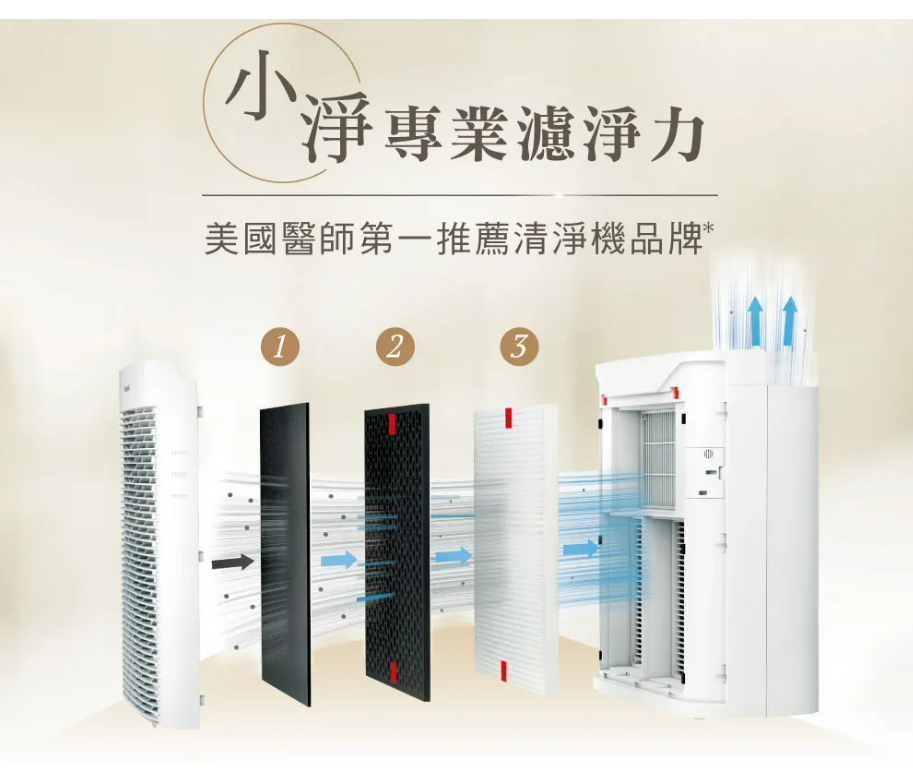

空氣清淨機實在太多廠牌了，規格和細節也很多，所以整理這次購入兩台空氣清淨機的規格和考慮因素。

## 選購重點 {#key-factors}

底下是我列出的必要條件（依重要順序排列）：

- 一級省電節能標章。
- 濾網配置：有 HEPA 13 濾網而且位置是在活性碳濾網的後面。我認同陳寗說的，[活性碳濾網應該放在在 HEPA 濾網之前](https://www.youtube.com/watch?v=SqfP02EyYUI)。
- 濾網類型：方形一片式，不同濾網可個別替換。不要圓筒式濾網，因為圓筒式濾網每次更換都是整個圓筒要換掉，我覺得不太合理，因為活性炭濾網和 HEPA 濾網的壽命通常不一樣。
- 有空氣品質燈號。
- 最低音量必須很安靜（以免夜間影響睡眠）。

> 註：濾網該怎麼配置，這裡沒有說我的看法一定對。我只是根據自己的理解和判斷來做決策而已。本文純粹紀錄和分享，不認同的朋友請選購自己覺得合適的機器就好喔（無須爭論）。

## 買了什麼 {#what-i-bought}

我在 2024 年 7 月購入以下兩台空氣清淨機，都有符合上述條件：

- Honeywell HPA-5350WTWV1
- Coway AP-1220B

兩台都沒有輪子，重量都在 9 kg 以下，搬到其他房間倒也不太費力。Honeywell 那台的手提設計就在上方出風口的地方，要搬到其他房間使用時，我都單手就能抓起來。

### Honeywell HPA-5350WTWV1

購入價格：NT$ 10990 (2024 年 7 月)

產品規格：

- 清淨能力：適用 14-28 坪。CADR 328CFM 或 557 CMH；CASR 8.49 cmm。
- 空氣品質偵測：三種燈號：綠、黃、紅
- 濾網配置：預設只有兩層：活性碳（不是蜂巢式，看起來是比較便宜的那種。廠商建議 3 個月更換一次）+ HEPA 13 （廠商建議 。中間可以加裝選購的各種加強型濾網（寵物、甲醛、廚房...等）。
- 節能標章：一級省電。
- 音量： 32db-55db。
- 濾網更換提醒：有（倒數計時）。
- 保固：全機兩年保固，馬達五年保固。
- 商品淨重：8 kg。
- 產地：中國。

這裡想要提醒的是官方產品文宣裡面的這張照片：

照片裡面顯示有三層濾網，中間那個看似應該是蜂巢式活性碳濾網，但其實產品內附的濾網只有兩層喔！也就是照片中的第一層和第三層。中間那層濾網，是要自行選購的。

目前為止，我沒有另外選購強效濾網，但有加裝靜電濾網，稍後會說明。

### Coway AP-1220B

購入價格：NT$ 9900 (2024 年 7 月)

產品規格：

- 清淨能力：適用 5-12 坪。CASR 3.13 cmm。
- 空氣品質偵測：四種燈號：藍、綠、黃、紅
濾網配置：預設為三層濾網：可水洗濾網（三個月洗一次） + 蜂巢式活性碳濾網（12 個月更換） + HEPA 13 濾網（24 個月更換）。水洗濾網後面可以自行選購加裝特定功能的濾網（強效除臭、除甲醛、超微塵等等）。
- 節能標章：一級省電
- 音量： 21db-50db （很安靜）。
- 濾網更換提醒：有（倒數計時）。
- 保固：一年保固。
- 商品淨重：8.6 kg。
- 產地：中國。

## 使用心得 {#notes}

平常都是開啟自動偵測模式，讓機器根據當前偵測到空氣品質來決定要使用哪一段風力。

剛買回家時，還是有點擔心會不會只是買心安的。但是當家人從外面回來，進家門之後幾分鐘，放在客廳的那台 Honeywell 清淨機就突然轉為紅燈，並切換成強風，似乎還真的有用。（不然ㄌㄟ）

> 註：我家客廳約 12 坪。

晚上睡覺時，房間的冷氣和清淨機都開著。由於清淨機很安靜，絲毫不影響睡眠。不過，有一次我在睡覺時忘記把自動偵測模式關閉，半夜時，Honeywell 那台清淨機突然轉為黃燈並且吹強風，由於聲音較大，我就醒了。

### 加裝靜電濾網

我家裡沒有養寵物，所以在加強過濾效果以及延長 HEPA 濾網壽命這個部分，我是另外買 3M 靜電濾網。這個靜電濾網，在 Coway 這台機器是安裝於可水洗濾網之後（蜂巢式活性碳濾網之前）。Honeywell 那台機器，由於第一層就是活性碳濾網（比較便宜那種），所以我就把靜電濾網貼在活性碳濾網前面，充當第一層過濾。

根據我的調查，靜電濾網因為很容易吸附大顆粒灰塵和毛髮，而且又不能洗，所以應該放在水洗濾網之後，以及耗材較貴的濾網之前（例如蜂巢式活性碳濾網和 HEAP 濾網）。靜電濾網成本較低，髒了就換一片新的，比較不心疼。無論選擇放在哪一層，絕對不要放在 HEAP 濾網的後面。

### 濾網更換提醒 {#replace-filter}

雖然機器本身都有設計濾網更換提醒燈號，但我是自己在機殼貼上兩個自黏標籤，分別紀錄活性碳濾網和 HEPA 濾網的安裝時間與下次更換時間。喔對了，保固年限也是同樣的作法。

## Q & A

**Q: 為何買兩種不同牌子的機器？**

空氣清淨機廠牌和機種超多，即便我當時花了不少時間調研，還是覺得非常難選。因此，先買了 Honeywell 的機器，放在客廳使用。兩天之後，再替另一個約六坪的小套房添購空氣清淨機。第二台就換買 Coway 試試，因為我覺得還是要實際用過，才比較能真的了解各家廠牌的清淨機到底有什麼細節是規格表上面看不出來的。

**Q: 還有調查過哪些廠牌？**

日立、Panasonic、Blueair、Dustie、飛利浦、LG。

**Q: 為何不選 Dustie？**

當初有考慮 Dustie DAC352，但是它前後各有一組濾網，雖然理論上清淨效率較高，但我比較喜歡可以一面緊靠著牆壁的設計。不然的話，我其實差一點就買了 Dustie DAC352。

**Q: 為何不選 XX 牌的機器？**

很可能是以下原因：

- 濾網配置方式不符合我列出的條件（如前所述）。當然濾網該怎麼配置，這裡沒有說我的看法一定對。我只是根據自己的理解和判斷來做決策。
- 有些廠商宣稱的強效 HEPA 濾網，我覺得可能不是真的 HEPA 13 濾網。
- 有電漿功能或者 UV 紫外光功能的，我也都排除。也就是選購時，只要濾網設計符合就好，其他一些加強功能，我不是很在意。包括 app 遙控功能，我也不需要。
- 價格太高。
