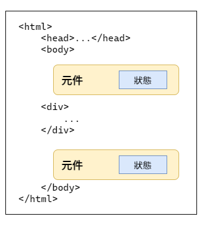
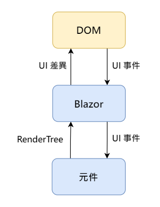
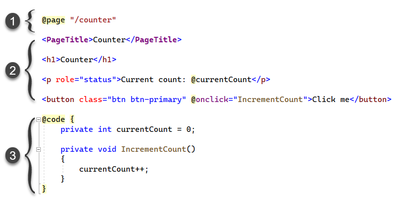
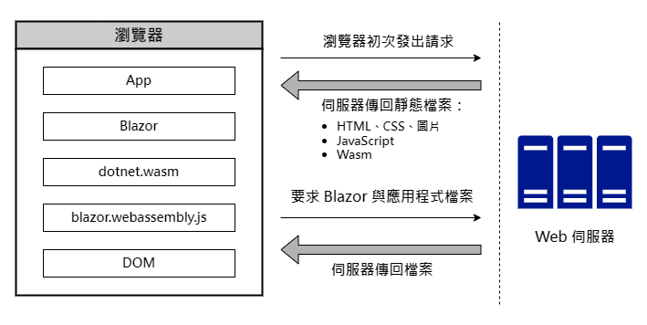
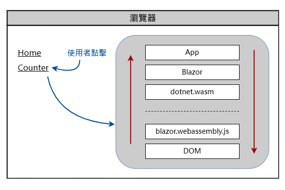
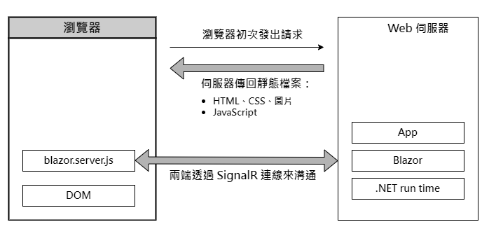
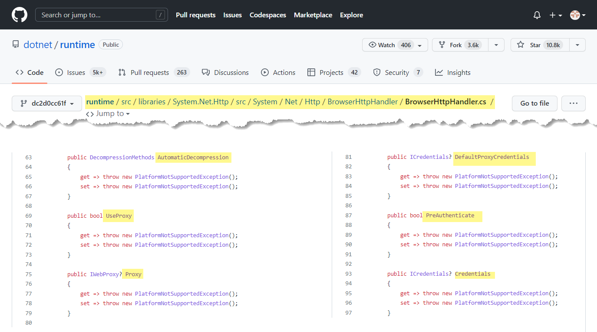

- 為何選擇 Blazor？
- 基於元件的 UI 框架
- Blazor 的裝載模型

一直以來，儘管有 ASP.NET MVC、Razor Pages、Web API 等技術可用來開發 web 應用程式，但我們始終無法使用 C# 來撰寫用戶端的網頁程式——這是由 JavaScript 支配的領域，直到 Blazor 技術的出現，終於開始突破了這層限制。

Blazor 是基於 web 標準規範的用戶端框架，可讓我們用 C# 與 .NET 來開發 web 應用程式，並提高生產力。

Blazor 程式的運行方式，與其說是請求—回應模型，倒不如說它是事件驅動模型，更為貼切。

## 為何選擇 Blazor？

正所謂「萬事起頭難」，這句話用來形容一個 web 應用程式的誕生並不為過。尤其是這些年來，網頁前端技術百花齊放，令新手眼花撩亂，無所適從。比如說，在前端網頁框架有 Angular、React、Vue.js……等等，程式語言有 TypeScript、CoffeeScript、Dart，建構方面又有 webpack、Parcel、Browserify 等工具可供選擇。對一個 web 開發經驗不多的個人或團隊來說，逐一嘗試每一種選項幾乎是不可能的任務。即便是經驗豐富的開發人員，在不斷推陳出新的技術洪流中，也難免陷入選擇困難。

那麼，Blazor 的出現能解決上述問題嗎？讓我們先來看看 Blazor 有哪些優點：

- **使用 C# 語言**：從前端到後端，.NET 開發人員都可以用自己熟悉的 C# 語言。
- **強大的開發工具**：Visual Studio 以及許多擴充工具（插件）。如果偏好輕量級的整合環境開發工具（IDE），也可以選擇 Visual Studio Code（簡稱 VS Code）。Visual Studio 可執行於 Windows 和 macOS 作業環境，VS Code 則同時支援 Windows、macOS、和 Linux。另外還有功能強大的第三方 IDE 可以選擇，例如 JetBrain 公司出品的 Rider（支援三種作業平台）。
- **豐富的 .NET 生態**：各式各樣現成而且免費的 NuGet 套件與程式庫。
- **自由彈性**：你可以自由選擇偏好的程式設計模式與框架，例如 MVVM（model-view-viewmodel）、Redux。
- **平緩的學習曲線**：對熟悉 .NET 技術的人來說，學習曲線相對平緩，因為 C#、Razor、依賴注入（dependency injection）等技術或程式寫法都比較熟悉，或者很容易就能上手。這也意味著開發人員將能縮短學習時間，更快投入應用程式的開發工作。
- **前端與後端程式碼共用**：開發 web 應用程式經常碰到的麻煩，是前端與後端資料模型（model 或 data transfer object；DTO）的重複。也就是說，同一個資料模型往往需要在後端和前端的程式碼各寫一份（C# 和 JavaScript），若稍後修改了資料模型，就必須同時修改兩份程式碼，以確保前後端資料模型的一致。在 Blazor，資料模型可以用 C# 撰寫，讓前端與後端共用同一份程式碼。
- **開放原始碼**：如同微軟的其他專案，Blazor 也是完全開放原始碼。

對許多人來說，Blazor 的最大好處可能是讓他們免於學習 Angular、Vue.js、和 React 等 JavaScript 框架，並且更容易開發跨平台的應用程式。Blazor 甚至可以搭配 MAUI——即所謂的 Blazor Hybrid 技術——來開發各種類型的跨平台應用程式，包括 web app、桌上型 app、行動裝置 app。

D> Blazor Hybrid 技術是透過 BlazorWebView 控制項來呈現 Blazor app 的內容。WinForms 和 WPF 也有提供 BlazorWebView。

## 基於元件的 UI 框架

在 Blazor 應用程式中，使用者看到的任何東西都是由元件所產生，包括網頁、網頁中的部分區塊、版面配置（layout）等等。

每一個 Blazor app 都有一個或多個根元件（root component），這些元件最終會以特定 HTML 元素呈現於網頁。每一個 Blazor 元件都是 .NET 類別，它們通常被設計成可重複使用的 UI 元素。每個元件負責管理自己的狀態並決定如何轉譯（render）成 HTML，而當使用者對元件進行特定操作時，便會觸發相應的事件來變更元件的狀態或外觀。

當元件處理完某個事件之後，Blazor 會產生該元件的網頁內容，並記錄這次網頁內容的變動。元件本身並不會直接修改網頁的 DOM（Document Object Model），而是修改 DOM 的分身，叫做 `RenderTree`。Blazor 會比對 `RenderTree` 變更前後的內容，以找出 UI 的差異，並依此差異來修改 DOM。

相較於每次重新產生整個網頁的內容，Blazor 針對有需要更新的部分來修改 DOM，是更有效率的做法。

### 可路由元件

在程式碼頂端有加上 `@page` 指示詞的元件叫做**可路由元件**（routable component）。基本上，可路由元件就是應用程式中的一個頁面，故我更喜歡叫它「可跳轉頁面」。下圖是一個簡單範例：

此範例程式碼包含三大區塊：

1. 頂端區塊：指示詞，例如 `@page`、`@using`、`@inject`、`@layout` 等等。
2. 中間區塊：視覺化元素的標記；這裡通常會混合使用 Razor、C#、和 HTML 三種語法。
3. 底部區塊：C# 程式碼；你可以在這裡加入欄位、屬性，甚至整個類別。

> 寫程式的時候如果需要查閱 Razor 語法，可參考微軟文章：[ASP.NET Core 的 Razor 語法參考](https://learn.microsoft.com/zh-tw/aspnet/core/mvc/views/razor)。

## Blazor 裝載模型

裝載模型（hosting model）是開發 Blazor app 時必須盡早了解的必要知識，因為它牽涉到你的 Blazor app 的部署方式，以及應用程式執行在什麼位置（前端或後端）。

Blazor 應用程式有兩種裝載模型：

- Blazor WebAssembly：簡稱 **Blazor WASM**，.NET 程式碼執行於用戶端瀏覽器。
- Blazor Server：部署於後端主機，.NET 程式碼完全執行於後端機器。

不用太擔心是否會選錯裝載模型，因為 Blazor 的設計架構已經把應用程式與裝載模型分開，將來如果想要改用另一種裝載模型並不會太困難。

### Blazor WebAssembly app

Blazor WebAssembly app 是以 WebAssembly 的形式運行於用戶端的瀏覽器，其功能類似前端 JavaScript 框架（例如 Angular、React），但不是以 JavaScript 撰寫，而是 C#。程式執行時所需要的 .NET 基礎程式庫與其他相關套套件都會隨著應用程式一起下載至用戶端；這些套件通常是一般的 .NET 組件（assembly）。

> .NET 6 開始提供了 AOT（ahead-of-time），即預先編譯的方式，讓開發人員能夠把應用程式編譯成 WebAssembly。好處是能夠大幅提升需要 CPU 運算的程式碼執行效能，缺點則是編譯出來的檔案比較大，約略比一般 .NET 組件大個兩倍左右，意味著用戶端下載檔案時必須等待更久的時間。

由於 WebAssembly app 的 .NET 執行環境支援 .NET Standard，所以只要是符合 .NET Standard 規格的程式庫皆可使用。不過，這些組件是執行於瀏覽器中，故其存取權限仍受限於瀏覽器。比如說，嘗試存取本機電腦的檔案或建立某些網路連線時，便可能因為違反安全規範而出現 `PlatformNotSupportedException`。

#### 啟動過程

如下圖：

首先，使用者在瀏覽器中開啟網站首頁，瀏覽器發送請求至後端主機，於是主機回傳一組檔案，包括首頁（通常是 index.html）、圖片、CSS、JavaScript 等等。其中包括一個很重要的 JavaScript 檔案：**blazor.webassembly.js**，它肩負以下工作：

- 在瀏覽器中載入並初始化 Blazor 應用程式。
- 直接操作 DOM 來更新網頁內容。
- 提供 API 來進行一些需要使用 JavaScript 的場合。

一旦瀏覽器下載好這些初始階段所需之檔案，便會建立目前頁面的 DOM。然後，blazor.webassembly.js 又會下載一個名為 **blazor.boot.json** 的檔案，其內容記錄著 Blazor 框架以及應用程式所需要的其他相關檔案。

剛才提到的從主機下載至用戶端的檔案，它們全都是靜態檔案，也就是不需要在後端主機進行編譯或動態生成等操作，故後端主機甚至不需要安裝 .NET，而且 app 可以部署至任何支援靜態網頁的伺服器，例如 GitHub Pages。

 Blazor WASM app 所在的主機當然也可以安裝 .NET，以便能夠使用完整的 .NET API。為了明確區分，如果後端是 ASP.NET Core 伺服器，微軟把它叫做 **hosted** Blazor WebAssembly app，反之則稱作 **standalone** Blazor WebAssembly app。
 
 > 下一章就會看到，使用 Visual Studio 建立新專案時，如果專案範本選擇「Blazor WebAssembly App」，就會有額外的選項讓你指定是否要建立 hosted app（實際的選項名稱是 ASP.NET Core hosted）。

接著來看一下，當使用者在網頁上點某個連結來進入一個新頁面時，在 WebAssembly app 裡面發生了哪些事。如下圖：

當使用者點擊頁面上的 Counter 連結時，便會觸發一個導覽事件（navigation event），而此事件將由 Blazor 內建的 JavaScript（blazor.webassembly.js）攔截，轉送給 Blazor 執行環境（dotnet.wasm）之後，再由 Blazor 的路由機制接手處理。

接下來，Blazor 的路由機制會從路由表中找到符合目前請求的路由元件，即前面範例中的 `Counter` 元件，然後建立此元件的實例，並觸發元件的相關事件和方法。

一旦 `Counter` 元件的工作完成，Blazor 會找出 DOM 裡面需要變更哪些元素，然後把這些變更傳遞給下層的 Blazor JavaScript 來更新 DOM 的內容。然後，使用者便可在瀏覽器中看到 `Counter` 頁面的內容。

在 standalone Blazor WebAssembly app 中，上述過程全都發生在前端瀏覽器，並未涉及任何後端主機的處理。

### Blazor Server app

在 Blazor Server app 中，元件是執行於後端伺服器，而非前端瀏覽器。瀏覽器中觸發的 UI 事件會經由即時的網路連線傳送至伺服器，然後在伺服器端分派至各個元件。接下來，元件把需要更新的網頁內容填入 `RenderTree`（稍早提過），再由 Blazor 計算 UI 差異，並將這些差異回傳至瀏覽器，再由瀏覽器中的 Blazor JavaScript 來更新 DOM。

> 如果你曾用過早期的 ASP.NET AJAX，你可以把 Blazor Server 裝載模型理解成當時的 `UpdatePanel` 控制項。該控制項的運作原理就是依事件的觸發來對網頁進行局部更新，而無須刷新整個頁面。不過，兩者還是有一些差異，例如 UI 的狀態，`UpdatePanel` 控制項是透過 `ViewState` 來保存狀態，Blazor Server app 的所有 UI 狀態則是全部保存於伺服器端。

#### 啟動過程

 Blazor WebAssembly app 的運作方式比較接近桌上型應用程式，每一個用戶端都會啟動一個 app 的執行個體。Blazor Server app 則是在後端主機由一個執行個體來服務眾多用戶端。

下圖為 Blazor Server app 的啟動過程：

### 該選哪一種裝載模型？

本節整理 Blazor 兩種裝載模型各有何優缺點，以便協助我們根據實際工作的需求來選出較合適者。

Blazor WebAssembly app 的優點：

- **可完全執行於用戶端**：當大部分的工作都由前端負責執行，後端主機的工作負荷便可大幅降低，這表示後端主機的硬體成本也較低，而應用程式也能夠有較佳的延展性（scalability）。
- **可離線作業**：用戶端不需要頻繁與後端主機溝通，所以即使網路不夠穩定，甚至網路完全斷線，對使用者也不會造成太大的影響。
- **以靜態檔案的方式部署**：Blazor WebAssembly app 是純粹的用戶端應用程式，故可部署於任何支援靜態網頁的平台，例如 GitHub Pages、Azure Static WebSite Hosting 等等。應用程式本身在進行頁面跳轉時，會將頁面請求重新導向至 app 的根網址（或者說基礎網址；base URI）。
- **共用程式碼**：雖然 Blazor WebAssembly app 並不需要在後端主機上面安裝 .NET，但如果後端主機上面也有 .NET，開發人員將更容易讓前後兩端共用 C# 程式碼（包括相關的套件、框架、和工具）。

Blazor WebAssembly app 的缺點：

- **載入時間較長**：初次執行 app 時需要花較多時間來下載檔案。一旦相關的 .NET 組件都下載至用戶端，下次執行 app 就不再需要重新下載那些檔案，載入速度便會快得多。
- **受限於瀏覽器**：Blazor WebAssembly app 跟 JavaScript 程式一樣都是執行於瀏覽器的沙箱環境，故可存取的資源也有所限制，例如無法存取本機的檔案。
- **程式的機密性較低**：所有程式檔案都下載至用戶端，表示使用者很容易取得應用程式的 DLL 檔案來進行逆向工程或其他破解操作。如果程式部署在後端主機，就比較沒有這類顧慮。如果程式碼包含某些特別機密的資料，最好還是放在後端主機比較保險。

接著是 Blazor Server app 的優點：

- **載入時間較短**：用戶端需要下載的檔案大小比 Blazor WebAssembly app 小很多，所以應用程式的載入速度也更快。
- **可使用 .NET 完整的 API**：後端主機有完整的 .NET 執行環境，應用程式可以發揮 .NET API 的全部功能。
- **程式的機密性較高**：用戶端無法取得放在後端主機的程式碼。

Blazor Server app 的缺點：

- **主機的負荷較重**
- **網路延遲**
- **需要穩定的網路連線**

簡單來說，如果你需要伺服器的強大運算功能與各種服務（例如資料庫），那就選 Blazor Sever app；如果應用程式的運作方式比較接近桌上型應用程式，而且不太需要網路隨時連線，便可優先考慮 Blazor WebAssembly app。

### Hosted Blazor WASM vs. Blazor Server

一個常見的問題是，hosted Blazor WASM app 跟 Blazer Server app 的後端都有 ASP.NET Core，兩者有何差異？又該如何選擇呢？

前面提過，standalone Blazor WASM app 是完全的靜態網頁，只要應用程式相關檔案（包含 .NET 組件）下載至用戶端瀏覽器，後續的使用者操作便全都發生於瀏覽器中。可是，如果程式在某些時候需要呼叫 Web API 呢？若有這種需求，standalone Blazor WASM app 便會碰到許多問題，其中一個立即而明顯的問題是：**跨來源資源共用**（Cross-Origin Resource Sharing），簡稱 **CORS**。另外還有一些限制，大多是基於瀏覽器沙箱本身的安全規範，使得 standalone Blazor WASM app 在呼叫第三方 Web API 或對任意網站發出 HTTP 請求時，會不斷碰到 `PlatformNotSupported` 例外。這些例外有許多是由 Blazor WASM app 內部的 `BrowserHttpHandler` 所拋出，如下圖，可以看到一部分不支援的屬性，例如 `AutomaticDecompression`、`Proxy` 等等。

### 另一種選擇：Blazor Hybrid

關於 Blazor Hybrid 的部分，容我在此偷個懶，僅列出我寫過的筆記以及微軟文章連結：
- [.NET Blazor Hybrid app with MAUI 初體驗](https://www.huanlintalk.com/2022/07/a-first-look-at-net-blazor-hybrid-app.html)
- 微軟文章：[ASP.NET Core Blazor Hybrid](https://learn.microsoft.com/zh-tw/aspnet/core/blazor/hybrid/)

## 重點回顧

- Blazor 應用程式的運行方式，與其說是請求—回應模型，倒不如說是事件驅動模型，更為貼切。
- Blazor 應用程式是以元件來組合 UI。所謂的元件，具體來說就是 .razor 檔案。一個 .razor 檔案頂端如果有寫 `@page` 指示詞，就是一個可路由元件（routable component），也就是 page 元件，而我更喜歡這樣叫它：可跳轉頁面。
- Blazor 有兩種裝載模型：Blazor WebAssembly app（簡稱 Blazor WASM）和 Blazor Server app。
- Blazor WASM app 可以建構成純粹的用戶端應用程式，故可部署於任何支援靜態網頁的平台，例如 GitHub Pages、Azure Static WebSite Hosting 等等。這表示後端主機上面不需要安裝 .NET，主機的硬體要求較低，工作負荷也較低。
- Blazor WASM 模型又可分為 standalone WASM 和 hosted WASM；前者是程式碼完全執行於用戶端瀏覽器（將受限於瀏覽器沙箱的安全規範），後者則是後端主機有安裝 ASP.NET Core，故可於後端提供 Web API 供前端 WASM app 調用。還有另一個選擇：Blazord Hybrid。
