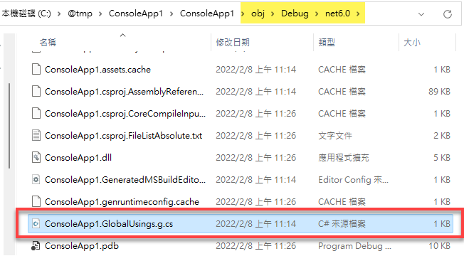
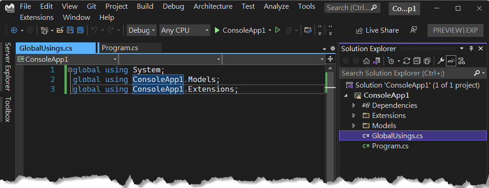
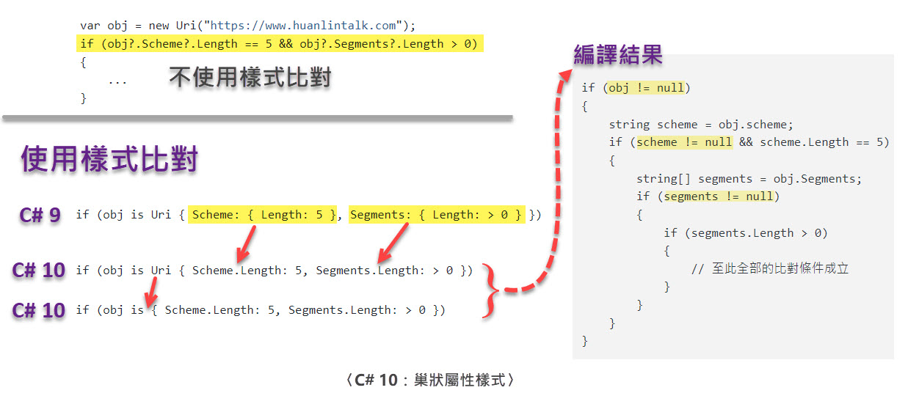

介紹 C# 10 的新增語法和改進之處，包括：

- [File-scoped 命名空間](#file-scoped-命名空間)
- [全域引用](#全域引用)
  - [使用 C# 檔案來管理全域引用](#使用-c-檔案來管理全域引用)
  - [透過專案檔來管理全域引用](#透過專案檔來管理全域引用)
- [字串常數插補](#字串常數插補)
- [巢狀屬性樣式](#巢狀屬性樣式)
- [Lambda 語法的改進](#lambda-語法的改進)
- [分解式的改進](#分解式的改進)
- [記錄的改進](#記錄的改進)
  - [以結構實作的記錄](#以結構實作的記錄)
  - [`ToString` 方法可被密封](#tostring-方法可被密封)
- [結構的改進](#結構的改進)
- [匿名型別的非破壞式變形](#匿名型別的非破壞式變形)
- [字串插補的效能改進](#字串插補的效能改進)
  - [字串插補處理器](#字串插補處理器)
- [`CallerArgumentExpression` 特徵項](#callerargumentexpression-特徵項)
- [`AsyncMethodBuilder` 特徵項可套用至方法](#asyncmethodbuilder-特徵項可套用至方法)
- [其他改進](#其他改進)

**注意**：.NET 6 或後續版本才有支援 C# 10。本章若有提及 Visual Studio，皆是指 Visual Studio 2022。

---

## File-scoped 命名空間

C# 10 新增了 file-scoped namespace 語法，中文譯作「檔案範圍的命名空間宣告」。往後提及此語法時，大多會使用英文 file-scoped。

File-scoped 命名空間宣告只要寫一行，就可以讓整個檔案裡面的型別全都隸屬在指定的命名空間裡。光用白話解釋恐怕不好理解，看程式碼會更清楚。以往都是以一對大括號來界定一個命名空間的有效範圍，例如：

~~~~~~~~csharp
namespace Models
{
    class Employee {  }
    class Customer {  }
}
~~~~~~~~

在 C# 10 可以這樣寫：

~~~~~~~~csharp
namespace Models;  // 宣告整個檔案範圍的命名空間

class Employee {  }  
class Customer {  }
~~~~~~~~

顯而易見，這個 file-scoped 命名空間語法的好處是可以讓我們的程式碼減少一層縮排。

Visual Studio 編輯器的預設值是「Block scoped」。你可以為 solution 加入一個 EditorConfig 檔案，並將其中的「namespace declarations」設定改為「File scoped」。如此一來，以後在此專案中新加入的 C# 檔案，其命名空間就會是 file-scoped 寫法。設定 EditorConfig 檔案的操作步驟可參考下圖（GIF 動畫）：

## 全域引用

當我們在 Visual Studio 中建立一個新的 Console 應用程式專案，目標框架選擇 .NET 6，並採用預設的專案名稱 ConsoleApp1，專案建立完成後，可以看到 Program.cs 檔案裡面只有一行程式碼，外加一行註解：
 
    // See https://aka.ms/new-console-template for more information
    Console.WriteLine("Hello, World!");

程式裡面使用了 `Console.WriteLine(...)` 卻沒有 `using System` 命名空間，這是使用了 .NET 6 的「隱含引用」（implicit using）功能。那麼，這些隱含引用的命名空間是隱藏在哪裡呢？

開啟專案的 .csproj 檔案，應該會看到裡面有一個 `<ImplicitUsings>` 元素：

~~~~~~~~xml
<Project Sdk="Microsoft.NET.Sdk">
  <PropertyGroup>
    <OutputType>Exe</OutputType>
    <TargetFramework>net6.0</TargetFramework>
    <ImplicitUsings>enable</ImplicitUsings>
    <Nullable>enable</Nullable>
  </PropertyGroup>
</Project>
~~~~~~~~

第 5 行的 `<ImplicitUsings>` 元素就是用來控制該專案是否開啟「隱含引用」的開關，預設為開啟（`enable`）。

於是，編譯專案時，就會在專案目錄下的「obj\Debug\目標框架\」底下自動產生一個名為 *[專案名稱]*.GlobalUsings.g.cs 的檔案。如下圖：
 

 
開啟這個 *[專案名稱]*.GlobalUsings.g.cs 檔案，便可以看到類似底下的內容：

~~~~~~~~csharp
// <auto-generated/>
global using global::System;
global using global::System.Collections.Generic;
global using global::System.IO;
global using global::System.Linq;
global using global::System.Net.Http;
global using global::System.Threading;
global using global::System.Threading.Tasks;
~~~~~~~~
 
每行程式碼開頭的 `global using` 是 C# 10 新增的全域引用語法，而上面的程式片段裡面總共有七個全域引用的命名空間，這表示不僅 `Console` 類別，包含 `File`、`HttpClient`、`Thread` 等類別也都不用在其他 .cs 檔案中引用對應的命名空間，即可直接使用。如此一來，便可節省一些重複打字的時間。

值得一提的是，上列程式碼片段中的 `global::` 指示詞是在告訴編譯器：其後面跟著的命名空間是全域（最上層）的命名空間，請不要解析成特定命名空間底下的子命名空間。這個指示詞並非必要，但如果碰到命名空間衝突的情形，便可以使用命名空間別名辨識符號 `::` 來解決。

剛才展示的程式片段是來自預設的 Console 專案模板，如果是其他類型的專案模板，則會看到不同的內容。例如底下是建立 Blazor Server 專案時自動產生的 .GlobalUsings.g.cs 檔案的內容：

~~~~~~~~csharp
// <auto-generated/>
global using global::Microsoft.AspNetCore.Builder;
global using global::Microsoft.AspNetCore.Hosting;
global using global::Microsoft.AspNetCore.Http;
global using global::Microsoft.AspNetCore.Routing;
global using global::Microsoft.Extensions.Configuration;
global using global::Microsoft.Extensions.DependencyInjection;
global using global::Microsoft.Extensions.Hosting;
global using global::Microsoft.Extensions.Logging;
global using global::System;
global using global::System.Collections.Generic;
global using global::System.IO;
global using global::System.Linq;
global using global::System.Net.Http;
global using global::System.Net.Http.Json;
global using global::System.Threading;
global using global::System.Threading.Tasks;
~~~~~~~~
 
現在我們知道了，原來「隱含引用」這項功能，背後其實使用了一種叫做 `global using` 的語法。那麼，我們是否可以「棄暗投明」，在自己的專案裡面明白地撰寫這些「全域引用」呢？答案是肯定的。
 
### 使用 C# 檔案來管理全域引用
 
我們可以使用一個 C# 檔案來集中管理 `global using` 語句，具體作法如下。
 
首先，開啟專案的 .csproj 檔案，把 `<ImplicitUsings>enable</ImplicitUsings>` 整行刪除，或將其屬性值改為 `disable`。也就是說，不要使用 Visual Studio 專案範本所提供的那些預設的全域命名空間。
 
接著在專案中加入一個 C# 檔案，通常命名為 GlobalUsings.cs。然後只要在這個檔案裡面使用 `global using` 來加入你想要套用至整個專案的命名空間就行了。參考下圖：

在同一個 C# 檔案裡面可以同時有 `using` 和 `global using` 語句，但 `global using` 必須寫在 `using` 之前，否則無法通過編譯。例如：

~~~~~~~~csharp
using System.IO;
global using System; // 編譯失敗! 
~~~~~~~~

順便提及，從 C# 6 開始提供的 [`using static`](https://github.com/huanlin/LearningNotes/blob/main/csharp6/_post.md#using-static-%E9%99%B3%E8%BF%B0%E5%BC%8F) 也同樣可以讓我們少打一些字，但其適用對象為「靜態成員」。它也可以跟 `global using` 搭配運用，例如：

~~~~~~~~csharp
global using System;
global using static System.Console;
~~~~~~~~

- 第 1 行：整個專案的 C# 檔案都不用再撰寫 `using System`，便可使用該命名空間底下的所有型別。
- 第 2 行：整個專案的 C# 檔案都可以直接使用 `System.Console` 類別的所有靜態成員，例如：`WriteLine("Hello")`。

### 透過專案檔來管理全域引用

除了使用剛才示範的 GlobalUsings.cs 檔案，我們也可以在 .csproj 裡面使用 `<Using>` 元素來增加或移除全域的命名空間。參考以下範例：
 
~~~~~~~~xml
<Project Sdk="Microsoft.NET.Sdk">
    <PropertyGroup>
        <OutputType>Exe</OutputType>
        <TargetFramework>net6.0</TargetFramework>
        <ImplicitUsings>enable</ImplicitUsings>
        <Nullable>enable</Nullable>
    </PropertyGroup>
    
    <ItemGroup>
      <Using Include="MyLib.Extensions" />
      <Using Remove="System.Net.Http" />
    </ItemGroup>    
</Project>
~~~~~~~~

說明：

- 第 5 行：`<ImplicitUsings>` 為 `enable`，表示要使用 .NET SDK 的隱含引用功能來自動產生稍早提過的 *[專案名稱]*.GlobalUsings.g.cs 檔案。
- 第 11 行：把 `MyLib.Extensions` 加入全域引用名單。
- 第 12 行：把 `System.Net.Http` 從全域引用名單中移除。也就是說，如果 `<ImplicitUsings>` 所產生的全域引用名單裡面有 `System.Net.Http`，便將它移除。

> 我個人不是很喜歡編輯 XML，所以偏好使用一個 C# 檔案來管理整個專案的 `global using` 語句。一旦發生命名空間衝突，或有任何疑慮時，只要打開我建立的那個 GlobalUsings.cs 檔案，便可一目瞭然。

**重點整理：**

- `global using`（全域引用）是 C# 10 新增的語法，其用途是將指定的命名空間套用於整個專案。如此一來，那些常用的命名空間可以只寫一次 `using` 語句，而不用在每一個 C# 檔案裡面重複寫。
- 專案的 .csproj 檔案中的 `<ImplicitUsings>` 可用來控制是否啟用 .NET SDK 的「隱含引用」功能。若啟用，編譯專案的時候就會自動產生一個名為 *[專案名稱]*.GlobalUsings.g.cs 的檔案，裡面有一些常用命名空間的 `global using` 語句。此外，.csproj 檔案裡面也可以透過 `<Using>` 元素來增加或移除全域引用的命名空間。
- 我們也可以用一個 C# 檔案來集中管理全域引用的命名空間。
- 全域引用的有效範圍是「這個專案」。換言之，A 專案裡面的 `global using` 語句不會影響到 B 專案或其他專案。

## 字串常數插補

C# 9 不允許字串常數使用字串插補（string interpolation，或「字串插值」），例如：

~~~~~~~~csharp
const string AppName = "我的程式";
const string Version = "1.0";
const string ProductName = $"{AppName} {VersionName}";
~~~~~~~~

第 3 行在 C# 9 無法通過編譯，從 C# 10 開始則沒有問題。

## 巢狀屬性樣式

在樣式比對的部分，C# 10 針對巢狀屬性的寫法有了進一步簡化。先來看一個沒有使用樣式比對的例子：

~~~~~~~~csharp
var obj = new Uri("https://www.huanlintalk.com");
if (obj?.Scheme?.Length == 5 && obj?.Segments?.Length > 0)
{
    ...
}
~~~~~~~~

在 C# 10 之前，如果要改用樣式比對語法，會這樣寫：

~~~~~~~~csharp
if (obj is Uri { Scheme: { Length: 5 }, Segments: { Length: > 0 } })
~~~~~~~~

結果比原本沒有樣式比對的寫法還要囉嗦！還好 C# 10 針對巢狀屬性的語法做了簡化，可以寫成：

~~~~~~~~csharp
if (obj is Uri { Scheme.Length: 5, Segments.Length: > 0 }) 
~~~~~~~~

事實上，還可以再簡化一點點，把型別省略：

~~~~~~~~csharp
if (obj is { Scheme.Length: 5, Segments.Length: > 0 }) 
~~~~~~~~

這樣就真的比較簡潔了。剛才的最後兩個使用巢狀屬性的寫法，編譯器會幫我們轉譯成類似底下的程式碼，可以看到所有必要的 null 檢查都幫我們處理了：

~~~~~~~~csharp
if (obj != null)
{
    string scheme = obj.scheme;
    if (scheme != null && scheme.Length == 5)
    {
        string[] segments = obj.Segments;
        if (segments != null)
        {
            if (segments.Length > 0) 
            {
                // 至此全部的比對條件成立
            }
        }
    }
}
~~~~~~~~

最後把前面幾個範例整理成一張圖，方便快速複習：

## Lambda 語法的改進

C# 10 的 lambda 語法有幾處改進，首先要介紹的是**自動推斷委派型別**（inferred delegate type）。範例：

~~~~~~~~csharp
Func<string> hello = () => "Hello World"; 
Console.WriteLine(hello());
~~~~~~~~

此範例在 C# 9 可以通過編譯。到了 C# 10，則因為編譯器能夠自動推斷委派型別而可以使用 `var` 來宣告委派變數，像這樣：

~~~~~~~~csharp
var hello = () => "Hello World"; // C# 9 無法編譯!
~~~~~~~~

如果委派的回傳值為 null，編譯器自然無法判定你想回傳什麼型別，例如：

~~~~~~~~csharp
var hello = () => null; // 無法編譯!
~~~~~~~~

此時如果還是想要用 `var` 來宣告變數型別，則可以在撰寫 lambda 表達式的時候宣告回傳型別：

~~~~~~~~csharp
var hello = string? () => null; // OK!
~~~~~~~~

當你的程式有很複雜的巢狀 lambda 語句，便可使用這種明確宣告回傳型別的方式來減輕編譯器推斷型別的負擔，從而加快編譯速度。這是 lambda 語法的第二項改進。

第三項改進是當我們把 lambda 表達式傳入某方法的參數時，參數型別可以是 `object`、`Delegate`、或 `Expression`：

~~~~~~~~csharp
M1(() => "test"); // Func<string>
M2(() => "test"); // Func<string>
M3(() => "test"); // Expression<Func<string>>

void M1(object x) { }
void M2(Delegate x) { }
void M3(Expression x) { }
~~~~~~~~

在 C# 9，第 1 行至第 3 行都無法通過編譯（無法將 lambda 表達式轉換成目標參數型別），C# 10 則沒有問題。

最後一項改進是，lambda 表達式從現在開始可以套用特徵項（attribute），包括匿名方法、方法參數、以及回傳值，皆可套用。範例：

~~~~~~~~csharp
var fn1 = [Description("是在哈囉")] () => "Hello";
var fn2 = ([Description("參數")] string s) => "Hello " + s;
var fn3 = [Description("是在哈囉")] 
          [return: Description("回傳字串")]
          ([Description("參數")] string s) => "Hello " + s;
~~~~~~~~

說明：

1. 為 `fn1` 的匿名方法套用 DescriptionAttribute，也就是替方法加上說明文字。
2. 為 `fn2` 的匿名方法加上參數的說明文字。
3. 為 `fn3` 的匿名方法、參數、回傳型別都加上說明文字。

使用時機：某些 API 會去判斷傳入的委派方法是否套用了某些特徵項而有不同的行為，此時便可使用 C# 10 新增的 lambda 特徵項語法來撰寫匿名方法，而不用像以前那樣非得撰寫具名方法不可。

## 分解式的改進

閱讀以下程式片段：

~~~~~~~~csharp
var student = (Id: 1, Name: "Mike"); // tuple
(int id, string name) = student;     // 分解
Console.WriteLine($"{id}-{name}"); // "1-Mike"
~~~~~~~~

第 1 行程式碼建立了一個 tuple，接著第 2 行將此 tuple 分解為兩個變數 `id` 和 `name`。在 C# 10 之前，第 2 行用來承接分解結果的變數必須全部宣告在一對括弧裡面。到了 C# 10，此限制被放寬了，可以這樣寫：

~~~~~~~~csharp
string name; 
var student = (Id: 1, Name: "Mike");
(int id, name) = student; // C# 9 編譯失敗，C# 10 OK!
~~~~~~~~

也就是說，物件分解的結果可以全部宣告在一對括弧中，也可以混合其他變數。

## 記錄的改進

記錄（record）是從 C# 9 開始提供，而 C# 10 有兩處強化：

1. 宣告記錄類型時，可明確指定以結構（struct）作為真實型別。
2. 在記錄中改寫 `ToString` 方法時，可將其密封（sealed），以避免其他人——尤其是編譯器——改寫此方法。

接著對此兩處強化功能進一步說明。

> 以下內容需要具備 `record` 基礎知識，才比較好理解。可參閱 [C# 9 的〈記錄〉](https://github.com/huanlin/LearningNotes/blob/main/csharp9/_post.md#%E8%A8%98%E9%8C%84)一節的說明。

### 以結構實作的記錄

記錄（record）類型是從 C# 9 開始提供，其編譯後的程式碼是以**類別**的形式存在，所以是參考型別。

C# 10 新增了 `record struct` 語法，讓我們能夠指定使用**結構**來作為實際型別。例如：

~~~~~~~~csharp
public record struct Point(int X, int Y);
~~~~~~~~

這裡使用了比較簡潔的「位置參數」語法來定義 `Point` 記錄。以此方式定義的記錄類型，實際上會被編譯成類似底下的程式碼：

~~~~~~~~csharp
public struct Point : IEquatable<Point>
{
	public int X { get; set; }
	public int Y { get; set; }
    ... 其餘省略
}
~~~~~~~~

**觀察重點 1**：此記錄類型是以結構來實現（第 1 行），所以它是個實質型別，而非參考型別。換言之，它也會有實質型別的限制，例如不支援繼承。

**觀察重點 2**：以位置參數語法來定義的記錄，編譯器會自動產生對應的屬性；而編譯器為 `record struct` 產生的屬性並非唯讀，而是可以隨時修改的，如第 3～4 行的屬性 X 與 Y。這是 `record struct` 和單純宣告 `record` 的一個主要差異。

如果基於某些原因而必須使用 `record struct`，同時又希望整個結構是唯讀的，此時有兩種作法，一個是在宣告時加上 `readonly` 關鍵字：

~~~~~~~~csharp
public readonly record struct Point(int X, int Y);
~~~~~~~~

另一種作法是改用一對大括號的寫法，以便我們可以更細緻地去設計每個屬性的行為：

~~~~~~~~csharp
public record struct Point
{
    public int X { get; init; }
    public int Y { get; init; }
}
~~~~~~~~

如此一來，`X` 和 `Y` 便是 [init-only 屬性](https://github.com/huanlin/LearningNotes/blob/main/csharp9/_post.md#Init-only-Setter)，亦即只能在物件初始化的過程中賦值，隨後無法再修改其值。

### `ToString` 方法可被密封

**基礎知識**：編譯器會幫我們自訂的 `record` 類型安插許多程式碼，其中包括[改寫的 `ToString` 方法](https://github.com/huanlin/LearningNotes/blob/main/csharp9/_post.md#tostring-%E6%96%B9%E6%B3%95)。

然而，當我們有多個自訂的記錄類型，彼此之間有好幾層繼承關係時，編譯器提供的這項功能反倒會出問題：位於繼承階層頂端的記錄如果想要把 `ToString` 的輸出結果固定下來，不讓後代亂改，這在 C# 9 是辦不到的，因為編譯器總是會替子代記錄改寫 `ToString` 方法。

於是有人想到，何不在基礎型別裡面加上 `sealed` 修飾詞來禁止後代修改呢？像這樣：

~~~~~~~~csharp
abstract record Point(int X, int Y)
{
    public sealed override string ToString() // C# 9: Error!
    {
        return $"({X},{Y})";
    }
}
~~~~~~~~

在 C# 9，第 3 行無法通過編譯。錯誤訊息是：

> Error CS8773:	Feature 'sealed ToString in record' is not available in C# 9.0. 

到了 C# 10，上列程式碼便可以通過編譯。如此一來，便可防止他人（特別是編譯器）改寫父代記錄的方法。

> 實作此功能的 Thomas Levesque 曾在某個討論串中說：「this feature isn't really to prevent a user from overriding the method, but to prevent the compiler from doing so.」

## 結構的改進

C# 10 的結構（struct）類型有兩處改進：無參數建構式、可使用 `with` 語法來進行初始化。

範例：

~~~~~~~~csharp
public struct Point
{
    public int X { get; set; }
    public int Y { get; set; }
    
    public Point() // C# 9 無法編譯!
    {
        X = 5;
        Y = 5;
    }
}
~~~~~~~~

第 6 行看起來沒什麼特別，只是不帶參數的建構式罷了，這在類別很常見，但 C# 9 的結構不允許這樣寫，到 C# 10 才可以。

接著看另一項改進：可使用 `with` 語法來進行初始化。

~~~~~~~~csharp
var p1 = new Point { X = 0, Y = 0 };
var p2 = point1 with { X = 5 }; // C# 9 不支援，C# 10 OK!
~~~~~~~~

## 匿名型別的非破壞式變形

C# 9 新增了 `with` 關鍵字來對記錄（record）執行非破壞式變形（non-destructive mutation）。到了 C# 10，這個語法也能用於匿名型別：

~~~~~~~~csharp
var obj1 = new { X = 1, Y = 2, Z = 3 };
var obj2 = obj1 with { Y = 10 };
Console.WriteLine (obj2); // { X = 1, Y = 10, Z = 3 }
~~~~~~~~

> 有關記錄的非破壞式變形語法，可參閱 C# 9 筆記的〈[記錄：複製物件](https://github.com/huanlin/LearningNotes/blob/main/csharp9/_post.md#%E8%A4%87%E8%A3%BD%E7%89%A9%E4%BB%B6)〉一節的說明。

## 字串插補的效能改進

C# 10 (.NET 6) 的字串插補，無論執行速度還是記憶體的使用效率，都比 C# 9 (.NET 5) 好很多。那麼，效能究竟提升多少呢？我用一個簡單的小程式來測試，結果發現 C# 10 的字串插補比 C# 9 快了大約一倍，而且使用的記憶體也更省。測試的過程與相關說明，請參考這個 Youtube 影片：[C# 10 (.NET 6) 字串插補的效能改進](https://www.youtube.com/watch?v=rXZGEmBk79c)。

> 程式碼：[StringInterpolationPerformanceTest](https://github.com/huanlin/LearningNotes/tree/main/csharp10/examples/StringInterpolationPerformanceTest)。

影片中用來觀察執行效能的 Today 方法，只是單純用字串插補來組成「今天是某年某月某日」的字串：

~~~~~~~~csharp
public string Today()
{
    var d = DateTime.Now;
    return $"今天是 {d.Year} 年 {d.Month} 月 {d.Day} 日";
}
~~~~~~~~

在 C# 9，上列程式碼會被編譯成這樣：

~~~~~~~~csharp
// C# 9 轉譯結果（使用 string.Format 方法）
public string Today()
{
	DateTime d = DateTime.Now;
	return string.Format("今天是 {0} 年 {1} 月 {2} 日", d.Year, d.Month, d.Day);
}
~~~~~~~~

也就是說，C# 9 使用了 `string.Format()` 來實現字串插補，而此作法往往需要付出較高的成本。比如說，它必須額外配置一個陣列來存放引數、可能需要額外處理實質型別的裝箱（boxing）、無法減少非必要的字串建構……等等。

> 什麼時候會碰到「非必要的字串建構」？一個常見的例子是輸出 Log 訊息的場合。稍後介紹字串處理器的時候會有進一步的說明。

到了 C# 10，則採取不同的作法，其轉譯結果會像這樣：

~~~~~~~~csharp
// c# 10 轉譯結果
public string Today()
{
	DateTime d = DateTime.Now;
	var defaultInterpolatedStringHandler = new DefaultInterpolatedStringHandler(12, 3);
	defaultInterpolatedStringHandler.AppendLiteral("今天是 ");
	defaultInterpolatedStringHandler.AppendFormatted(d.Year);
	defaultInterpolatedStringHandler.AppendLiteral(" 年 ");
	defaultInterpolatedStringHandler.AppendFormatted(d.Month);
	defaultInterpolatedStringHandler.AppendLiteral(" 月 ");
	defaultInterpolatedStringHandler.AppendFormatted(d.Day);
	defaultInterpolatedStringHandler.AppendLiteral(" 日");
	return defaultInterpolatedStringHandler.ToStringAndClear();
}
~~~~~~~~

程式碼變多了，執行速度卻更快，消耗的記憶體也更少。就如前面影片所展示的測試結果，整體效能比 C# 9 的字串插補提升了一倍左右。在頻繁使用字串插補的場合（例如迴圈），效能差距會更明顯。這樣的寫法有點 `StringBuilder` 的味道，對吧？只是這次完全由編譯器自動生成，不用我們自己手工一行一行去刻，而且實際負責組合字串的是 .NET 6 新加入的結構：`DefaultInterpolatedStringHandler`，也就是預設的字串插補處理器。

### 字串插補處理器

上一節末尾提到了 C# 10 的字串插補語法背後負責組合字串的是一個叫做 `DefaultInterpolatedStringHandler` 的結構。每當編譯器碰到字串插補語法時，便會使用這個預設的字串插補處理器來建構字串。這便是 C# 10 的字串插補效能優於 C# 9 的主要原因。

在某些特殊場合，我們甚至可以自行設計特定用途的字串插補處理器，以減少一些非必要的字串連接操作，進一步提升應用程式的執行效能。一個常見的例子是輸出 log 訊息的場合。比如說，應用程式在許多地方呼叫了 logging API 來記錄程式的執行過程與錯誤訊息，並且在不需要記錄的時候，藉由修改組態檔來關閉記錄功能。然而，程式裡面有許多地方在呼叫 logging API 的時候使用了字串插補語法來組合字串，即便把記錄功能關閉了，那些傳遞給 logging API 的字串還是會在程式執行的時候經由 `DefaultInterpolatedStringHandler` 來進行字串的組合。請看以下範例：

~~~~~~~~csharp
var date = DateTime.Now;
logger.Enabled = true;  // 啟用記錄功能
logger.Log($"今天是 {date.Month} 月 {date.Day} 日");

logger.Enabled = false;  // 關閉記錄功能
logger.Log($"今天是 {date.Month} 月 {date.Day} 日");
~~~~~~~~

第 3 行呼叫 Log 方法時，記錄器的功能是啟用的，這裡沒有問題。接下來，第 5 行把記錄功能關閉，故第 6 行呼叫 `Log` 方法時，儘管該方法在內部會直接返回、不輸出任何 log，但呼叫 `Log` 方法時的字串插補語法卻還是會透過 `DefaultInterpolatedStringHandler` 來完成字串的組合，而這些組合字串的操作便等於白做工了。

剛才舉的例子，如果你是那個 logging API 的設計者，便可以特別為它撰寫一個字串插補處理器，來避免無謂的效能損耗。以下範例仿自微軟文件：[Improved Interpolated Strings](https://docs.microsoft.com/zh-tw/dotnet/csharp/language-reference/proposals/csharp-10.0/improved-interpolated-strings#the-handler-pattern)。

~~~~~~~~csharp
using System.Runtime.CompilerServices;
......
[InterpolatedStringHandler]
public ref struct MyLoggerInterpolatedStringHandler
{
    private DefaultInterpolatedStringHandler _handler;

    public MyLoggerInterpolatedStringHandler(
        int literalLength, int formattedCount,
        MyLogger logger, out bool handlerIsValid)
    {
        if (!logger.Enabled)
        {
            _innerHandler = default;
            handlerIsValid = false;
            return;
        }

        _handler = new DefaultInterpolatedStringHandler(literalLength, formattedCount);
        handlerIsValid = true;
    }

    public void AppendLiteral(string msg)
    {
        _handler.AppendLiteral(msg);
    }

    public void AppendFormatted<T>(T msg)
    {
        _handler.AppendFormatted(msg);
    }

    public string ToStringAndClear()
    {
        return _handler.ToStringAndClear();
    }
}
~~~~~~~~

字串插補處理器的設計要點如下：

- 宣告型別的時候必須套用 `InterpolatedStringHandler` 特徵項（第 3 行）。
- 宣告型別的時候加上 `ref struct`，表示這個字串插補處理器是個結構，而且必須是配置於堆疊中的結構（即不可配置於堆積；參見〈[C# 7：只能放在堆疊的結構：ref struct](https://github.com/huanlin/LearningNotes/blob/main/csharp7/_post.md#%E5%8F%AA%E8%83%BD%E6%94%BE%E5%9C%A8%E5%A0%86%E7%96%8A%E7%9A%84%E7%B5%90%E6%A7%8Bref-struct)〉）。
- 建構式至少要有兩個 `int` 參數：`literalLength` 和 `formattedCount`（第 8～10 行）。前者代表常數字元的字數，後者則為需要插補（格式化）的數量。比如說，`$"Hi, {name}"` 這個字串樣板的 `literalLength` 是 4，而 `formattedCount` 是 1。
- 建構式還可以視需要加入兩個額外參數：一個是來源物件（第 10 行的 `logger` 參數），另一個是布林型別的輸出參數，代表字串處理器是否可用（（第 10 行的 `handlerIsValid` 參數）。
- 必須提供 `AppendLiteral` 和 `AppendFormatted` 方法。在建立字串的過程中會呼叫這兩個方法。
- 必須提供 `ToStringAndClear` 方法，以傳回最終組合完成的字串。

相較於 `DefaultInterpolatedStringHandler`，這裡示範的字串插補處理器只有一個比較特別的地方，即建構式會根據來源物件 `logger` 的 `Enabled` 屬性（是否啟用記錄）來決定是否需要進行字串插補：

- 如果不需要記錄，則不建立字串插補處理器，並將輸出參數 `handlerIsValid` 設為 `false`。（第 12～17 行）
- 如果需要記錄（第 19～20 行），則建立一個 `DefaultInterpolatedStringHandler` 物件，而且往後的字串組合操作都是轉交給它處理；這些操作包括：`AppendLiteral`、`AppendFormatted`、和 `ToStringAndClear` 方法。

接著來看記錄器（logger）類別：

~~~~~~~~csharp
public class MyLogger
{
    public bool Enabled { get; set; }

    public void Log(
        [InterpolatedStringHandlerArgument("")]
        ref MyLoggerInterpolatedStringHandler handler)
    {
        if (Enabled)
        {
            string msg = handler.ToStringAndClear();
            Console.WriteLine(msg);
        }
    }
}
~~~~~~~~

你可以看到，`Log` 方法的 `handler` 參數的型別並非單純的 `string`，而是我們設計的的字串處理器 `MyLoggerInterpolatedStringHandler`。

此外，`handler` 參數前面套用的特徵項 `[InterpolatedStringHandlerArgument("")]`，是用來指定欲傳遞給 `MyLoggerInterpolatedStringHandler` 建構式的引數。由於此範例並沒有需要把當前引數列當中的某個引數傳遞給字串插補處理器的建構式，故傳入空字串，表示要傳入當前呼叫此方法的物件（亦即 `this`）。如果你覺得剛才的解釋不好理解，不妨對照一下我們的字串插補處理器的建構函式：

~~~~~~~~csharp
[InterpolatedStringHandler]
public ref struct MyLoggerInterpolatedStringHandler
{
    public MyLoggerInterpolatedStringHandler(
        int literalLength, int formattedCount,
        MyLogger logger, out bool handlerIsValid)
    { ...... }
}
~~~~~~~~

這裡要關注的是建構式的第三個參數：`logger`。當我們撰寫類似底下的程式碼：

~~~~~~~~csharp
var name = "Michael";
var aLogger = new MyLogger();
aLogger.Log($"Hello, {name}");
~~~~~~~~

編譯器看到傳入 `Log` 方法的參數是字串插補語法，就會知道要先建立一個 `MyLoggerInterpolatedStringHandler` 型別的字串插補處理器，並由該物件來負責組合字串。建立該物件時，便會將當時的 `aLogger` 物件傳入至 `MyLoggerInterpolatedStringHandler` 建構式的第三個參數。這便是稍早說的，套用 `[InterpolatedStringHandlerArgument("")]` 特徵項時傳入空字串的作用。那麼，什麼情況會需要傳入某個引數的名稱呢？其中一個常見的場合是擴充方法，例如：

~~~~~~~~csharp
public static class MyLoggerExtension
{
    public static void Log(
        this MyLogger logger, 
        [InterpolatedStringHandlerArgument("logger")] 
        ref MyLoggerInterpolatedStringHandler handler)
    {
        ......
    }
}
~~~~~~~~

第 5 行的意思是：請把這次呼叫的參數列中名為 `logger` 的物件傳入至 `MyLoggerInterpolatedStringHandler` 建構式的第三個參數。

> 原始碼：[CustomInterpolatedStringHandler.sln](https://github.com/huanlin/LearningNotes/tree/main/csharp10/examples/CustomInterpolatedStringHandler) 裡面的 CustomInterpolStringHandler.csproj 專案。

OK，我們的字串插補處理器已經寫好了，回頭看本節開頭的程式碼：

~~~~~~~~csharp
var date = DateTime.Now;
logger.Enabled = true;  // 啟用記錄功能
logger.Log($"今天是 {date.Month} 月 {date.Day} 日");

logger.Enabled = false;  // 關閉記錄功能
logger.Log($"今天是 {date.Month} 月 {date.Day} 日");
~~~~~~~~

現在，我們已達成以下目的：

- 第 2～3 行：在記錄功能開啟的情況下，呼叫 `Log` 方法並傳入需要插補的字串時，會建立 `MyLoggerInterpolatedStringHandler` 物件，並由它來負責完成字串組合的工作。
- 第 5～6 行：在記錄功能關閉的情況下，呼叫 `Log` 方法並傳入需要插補的字串時，不會建立 `MyLoggerInterpolatedStringHandler` 物件，所以也不會產生任何字串組合所需的效能損耗——更快、更省記憶體。

至於上述兩種情形的效能損耗差異，我另外寫了一個小程式來觀察，並且錄製成影片。效能測試程式的原始碼以及影片的連結如下：

> Youtube 影片：[Performance Test with Custom String Interpolation Handler](https://youtu.be/cvnoj2b_61E)

> 效能測試程式的原始碼：[CustomInterpolatedStringHandler.sln](https://github.com/huanlin/LearningNotes/tree/main/csharp10/examples/CustomInterpolatedStringHandler) 裡面的 InterpolStringHandlerBenchmark.csproj 專案。

## `CallerArgumentExpression` 特徵項

`[CallerArgumentExpression]` 特徵項可用來捕捉函式中的某個傳入參數的表達式，並將其表達式保存於另一個字串參數。範例：

~~~~~~~~csharp
Show(Math.Sqrt(9)); // 取平方根

void Show(double num,
          [CallerArgumentExpression("num")] string expr = null)
    => Console.WriteLine(expr + $" = {num}");
~~~~~~~~

執行結果：

~~~~~~~~
Math.Sqrt(9) = 3
~~~~~~~~

從這個例子可以看得出來，呼叫端傳入 `num` 參數的時候是怎麼寫的，當時的寫法就會被捕捉並保存於字串參數 `expr`。由於不需要呼叫端傳入 `expr` 參數，故此參數在宣告的時候必須給一個預設值（通常是 `null`）。此外，`[CallerArgumentExpression]` 可以在同一個方法當中使用多次，亦即可捕捉多個參數。

這項功能對於測試、驗證、或輸出記錄（log）訊息的場合特別有用。例如：

~~~~~~~~csharp
IsTrue(1 + 1 == 3);

void IsTrue(bool value,
[CallerArgumentExpression("value")] string expr = null)
{
    if (!value)
        throw new ArgumentException($"{expr} 不是真的!");
}
~~~~~~~~

執行結果：

~~~~~~~~
System.ArgumentException: 1 + 1 == 3 不是真的!
~~~~~~~~

> 試試看：https://dotnetfiddle.net/etlTWD

這裡不妨順便複習一下其他 Caller* 特徵項（從 C# 5 便已提供）：

~~~~~~~~csharp
Log("發生錯誤");

void Log(
    string msg,
    [CallerMemberName] string caller = null, 
    [CallerFilePath] string filePath = null, 
    [CallerLineNumber] int lineNum = 0) 
{
    Console.WriteLine(
        $"{msg}, 呼叫端: {caller}, 檔案: {filePath}, 行號: {lineNum}");
}
~~~~~~~~

執行結果：

~~~~~~~~
發生錯誤, 呼叫端: Main, 檔案: Program.cs, 行號: 12
~~~~~~~~

> 試試看：https://dotnetfiddle.net/wDYoVB

以上提及的 Caller* 特徵項皆隸屬於 `System.Runtime.CompilerServices` 命名空間。

## `AsyncMethodBuilder` 特徵項可套用至方法 

打從 C# 7 開始，`[AsyncMethodBuilder]` 特徵項便可以套用至類別。到了 C# 10，則可以套用至方法。此特徵項可用來告訴編譯器：「在處理非同步方法的時候，請改用我提供的類別來建構背後的非同步狀態機。」

> 對於一般的應用程式而言，應該不太會用到這項功能。

範例：

~~~~~~~~csharp
[AsyncMethodBuilder(typeof(MyAsyncMethodBuilder))]
public void MyMethod()
{
}

public class MyAsyncMethodBuilder
{
    public static MyAsyncMethodBuilder Create()
        => new MyAsyncMethodBuilder();
    
    ...（其餘省略）
}   
~~~~~~~~

此範例省略了 `MyAsyncMethodBuilder` 方法的實作。根據官方文件，此類別必須提供下列成員：

- 靜態方法 `Create`，用來建立 `MyAsyncMethodBuilder` 的執行個體。
- 屬性 `Task`，用來提供非同步工作的回傳型別。
- `void SetException(Exception)` 方法，用來設定非同步工作失敗時的例外。
- `void SetResult()` 或 `void SetResult(T result)` 方法，以標記工作完成，或者同時設定工作結果。
- `void Start<TStateMachine>` 方法。
- `void AwaitOnCompleted<TAwaiter, TStateMachine>` 方法。
- `void AwaitUnsafeOnCompleted<TAwaiter, TStateMachine>` 方法。

以上僅為重點摘錄，如欲獲取更完整的說明，可參考官方文件〈[AsyncMethodBuilder override](https://docs.microsoft.com/en-us/dotnet/csharp/language-reference/proposals/csharp-10.0/async-method-builders)〉，以及原始碼 [AsyncMethodBuilder.cs](https://referencesource.microsoft.com/#mscorlib/system/runtime/compilerservices/AsyncMethodBuilder.cs)。

## 其他改進

除了前面介紹的新功能，C# 10 還對既有的 `#line` 指示詞做了進一步強化。但這項功能對多數人而言幫助不大，可能只有在撰寫程式碼產生器的時候才會用到，所以這裡略過不提。

如果你想要學習 `#line` 指示詞的用法，可參閱微軟文件：〈[Enhanced #line directives](https://docs.microsoft.com/en-us/dotnet/csharp/language-reference/proposals/csharp-10.0/enhanced-line-directives)〉。

---

⬆️[回頂端](https://github.com/huanlin/LearningNotes/blob/main/csharp10/_post.md#c-10)
↩️[回首頁](https://github.com/huanlin/LearningNotes#readme)
