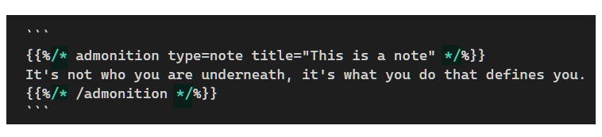

## Shortcodes

### Escaping Shortcodes

Sometimes I need to demonstrate how to use a shortcode in my article. Simply put the shortcode example in a markdown code block won't work because the shortcode will be interpreted and executed anyway.

The solution is to add a pair of `/*` and `*/` in both the beginning and end lines of the shortcode block. Here is an example:



It is rendered like this:

```
{}
It's not who you are underneath, it's what you do that defines you.
{}
```

## Templates

### Showing Recent Posts

The following code can be used to show recent 5 posts:

```html
<h4>Recently added/updated posts</h4>
<div>
    {{ $byLastMod :=  .Site.RegularPages.ByLastmod  }}
    {{ $recent := ($byLastMod | last 5).Reverse }}

    <ul>
    {{ range $recent }}
      <li>
        <a href="{{ .RelPermalink }}">{{ .LinkTitle }}</a>
        &nbsp; ({{ .Lastmod.Format "2006-01-02" }})
      </li>
    {{ end }}
    </ul>
</div>
```

You can put them into a partial file, for example, if you're using Docsy theme, the `partials/section-index.html` might be a good choice.
