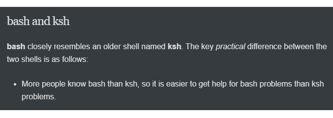

> **預計閱讀時間：** 10 分鐘

Markdown 是一種輕量級標記語言，許多技術專業人士用它來創建和編輯技術文件。使用 Markdown，您可以在純文字編輯器（如 vi 或 Emacs）中撰寫文字，並插入特殊字元來建立標題、粗體、項目符號等。例如，以下範例展示了一個用 Markdown 格式化的簡單技術文件：

```markdown
## bash and ksh

**bash** closely resembles an older shell named **ksh**.  The key
*practical* difference between the two shells is as follows:

* More people know bash than ksh, so it is easier to get help for bash
  problems than ksh problems.
```

前述文件的排版結果如下：



Markdown 解析器會將 Markdown 檔案轉換成 HTML。瀏覽器接著可以將產生的 HTML 顯示給讀者。

我們建議透過以下其中一個教學來熟悉 Markdown：

* [www.markdowntutorial.com](https://www.markdowntutorial.com/)
* [Mastering Markdown](https://guides.github.com/features/mastering-markdown/)

### 下一步？

恭喜：您已完成技術寫作（一）的課前作業（pre-class）。

如果你的組織提供技術寫作（一）的課堂部分，請務必參加。如果你想要擔任技術寫作（一）課堂部分（in-class）的引導者，請參閱[引導者指南](https://developers.google.com/tech-writing/for-instructors/one/instructors-guide)。

技術寫作（一）涵蓋的主題可在[重點回顧頁面]()查看。
