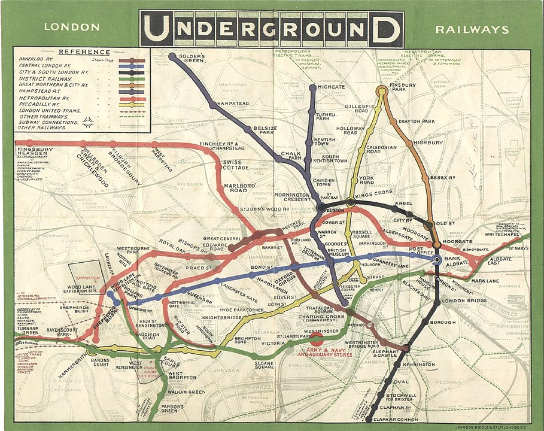

**預估時間：** 10 分鐘

還記得老師曾經指定你閱讀一整大章的課本內容嗎？你翻著那段指定的課文，心裡懇求著……沒錯，要有圖！看插圖總是比讀文字有趣多了。事實上，當我們在閱讀技術內容時，大多數的大人其實就像小孩一樣——依然期待圖片，而不是一大堆文字。

**圖 1. 好的圖像能以文字無法達到的方式吸引讀者。** 來源：Nirmal Dulal [CC BY-SA 4.0](https://creativecommons.org/licenses/by-sa/4.0)

 

根據 [Sung 和 Mayer（2012 年）的研究](https://www.sciencedirect.com/science/article/pii/S0747563212000921)，不論圖像品質好壞，只要有圖，讀者對文件的好感就會提升；但只有具有教學功能的圖像，才真正有助於學習。本單元將提供幾種方法，幫助你製作出真正「勝過千言萬語」的圖表。

## 先寫圖說

在製作插圖之前，先寫出圖說，往往會很有幫助。接著再依照圖說的內容，設計最能呈現其意義的圖像。這樣的流程可以幫助你確認插圖是否符合原本的目的。

一個好的圖說應該具備以下幾個特點：

* **簡潔扼要**：通常只需要幾個字就夠了。
* **說明重點**：讀者看完這張圖後，應該記住什麼？
* **引導讀者聚焦**：尤其當照片或圖表包含大量細節時，圖說可以幫助讀者掌握重點。

**注意：** 依照慣例，圖說通常放在圖表的下方。

### 練習 {#ex1}

目標讀者：正在修習「資料結構導論」課程的資工系大學生。

請看以下三張圖，每一張都使用了相同的圖說。

 

**圖說 A. 單向鏈結串列的節點會儲存資料內容，以及指向下一個節點的參考。**

  

**圖說 B. 單向鏈結串列的節點會儲存資料內容，以及指向下一個節點的參考。**

 

**圖說 C. 單向鏈結串列的節點會儲存資料內容，以及指向下一個節點的參考。**

 

上述三張圖中，哪一張最能清楚表現其圖說？

 


* **圖 A** 很差。鏈條看起來漂亮，但沒有提供任何資訊。而且這條鏈還錯誤地暗示單向鏈結串列同時指向前後節點。
* **圖 B** 還可以。插圖幫助學生理解第一個節點指向第二個，第二個節點指向第三個，依此類推。但雖然圖說提到節點包含內容和指標，這張圖只顯示了指標，卻沒有呈現內容。
* **圖 C** 是最佳且最具教學意義的選擇。插圖清楚區分每個節點的內容部分與指標部分。


## 限制單張圖中的資訊量

很少有智力活動能像欣賞一幅優秀畫作那樣令人滿足，隨著時間推移，逐步發掘出層層的洞見與意涵。人會花大錢專程到世界各地的美術館去做這件事。

**圖 2. 你會很樂意細細品味這幅梵谷的畫作。** 
來源：Portrait of Pere Tanguy By Vincent van Gogh - Musée Rodin [Public domain](https://commons.wikimedia.org/w/index.php?curid=119599)

 

相較之下，像以下這種高度複雜的技術插圖，往往會讓大多數讀者感到卻步：

**圖 3. 複雜的方塊圖會讓讀者感到負擔過重。**

 

就像你會避免使用過長的句子一樣，也要盡量避免視覺上的冗長複雜。一般原則是：不要在單一圖表中放入超過一段文字量的資訊。（或者採用此規則：避免使用需要超過五個重點項目才能解釋清楚的插圖。）我聽到你心裡想說：「但真實世界的技術系統通常比圖 3 更複雜得多。」你說得沒錯，不過你也不會期望用一段文字就能解釋清楚現實中複雜的系統。

將視覺雜亂化繁為簡、變得有條理且有幫助的秘訣，是把複雜系統拆解成子系統，就像下面這張圖所示：

**圖 4. 一個複雜系統被拆解成三個子系統。**

 

在展示「整體架構」之後，請分別提供各個子系統的獨立插圖。

**圖 5. 複雜系統中某個子系統的詳細展開圖。**

另一種做法是，先從簡單的「整體架構」（big picture）開始，然後在後續的每張插圖中逐步展開細節。

## 聚焦讀者注意力

當面對像以下這種複雜的截圖時，讀者往往難以判斷哪些部分是重點：

**圖 6. 讀者不知道該聚焦在哪裡。**

 

加入視覺提示，例如下面圖中的紅色橢圓，有助於引導讀者聚焦截圖中的重點區域：

**圖 7. 讀者會聚焦在打破既有模式的形狀上。**

 

**標註（Callouts）** 是另一種引導讀者注意力的好方法。對於照片或線條圖來說，註解能幫助我們的視線精準落在重點位置。標註通常比冗長的文字說明更有效，因為它們直接聚焦在圖中最重要的部分。這樣你在解說時，就能直接針對圖表的相關區域說明，而不用花時間描述你在講的是圖的哪一部分。

如以下範例圖，標註與箭頭能迅速引導讀者理解該部分的用途。

**圖 8. 標註能引導讀者的視線。**  
來源：[NASA / JPL-Caltech / University of Arizona [Public domain]](https://commons.wikimedia.org/wiki/File:Phobos_colour_2008.jpg)

## 繪圖就是重繪

就像寫作一樣，插圖的第一版很少能一次到位。你需要不斷修改，讓圖像內容更清楚。在修訂插圖時，可以問自己以下幾個問題：

* 我可以怎麼簡化這張圖？
* 這張圖是否應該拆成兩張或更多簡單的圖？
* 圖中的文字好閱讀嗎？文字與背景的對比是否足夠清楚？
* 這張圖的重點是什麼？

舉例來說，可以參考[倫敦地鐵圖的演進過程](https://wikipedia.org/wiki/Tube_map#History)。1931 年以前的地鐵圖是按照實際比例繪製的，包含地面道路，地鐵線也隨著軌道彎曲而彎曲。

**圖 9. 1908 年按比例繪製的倫敦地鐵圖，包含地面道路。** 來源：[\[Public domain\]](https://commons.wikimedia.org/wiki/File:Tube_map_1908.jpg)

 

1931 年，Harry Beck 開創了一種全新的大眾運輸地圖風格。他的設計大幅簡化了舊有地圖，移除了地面標示與比例尺，轉而專注於地圖使用者真正關心的事情：如何從 A 站到 B 站。即使 1931 年的地圖已經獲得成功，Beck 仍在接下來多年持續修改圖表，使其更加簡潔明瞭。看看[現在的地鐵圖](https://www.google.com/search?tbm=isch&q=london+tube+map)，儘管新增了許多路線與車站，整體設計仍大致延續 Beck 的風格。

### 練習 {#ex2}

請看以下這張原始插圖：

**圖 10. 一張複雜的圖表。**

 

上述圖表的重點應該是：

> 對於遞迴解法，在 `return` 敘述中呼叫函式本身，直到達到基礎情況為止。

圖表的複雜性是如何掩蓋這個重點的？你可以如何解決這些問題？

 


這張圖表可能存在以下幾個問題：

* **問題**：亮色過於搶眼，轉移了讀者對圖表其他部分的注意力。 
  **解決方式**：謹慎選擇色彩，避免讓顏色主導整張圖表。

* **問題**：圖表的色彩對比不足，對於視力較弱或某些色盲使用者來說，可能難以辨識。 
  **解決方式**：移除不必要的色彩使用，並確保所用顏色符合[標準的色彩對比建議](https://material.io/design/color/text-legibility.html#legibility-standards)。

* **問題**：箭頭指向雙向，讓圖表的流程方向變得不清楚。 
  **解決方式**：將箭頭分成兩組，一組表示函式的呼叫過程，另一組表示函式的回傳過程。

此外，這張圖表中還有其他未被指出的問題。


---

以下是一張改良後的插圖：

**圖 11. 前述圖表的簡化版本。**

 

你在改良後的插圖中看到了哪些缺點？

 


以下是仍然存在的兩個缺點：

* 這張圖仍然過於複雜，解釋它可能需要超過一段文字。可以考慮移除多餘資訊或增加說明標籤，以簡化理解。
* 雖然將箭頭分開有助於呈現函式何時呼叫與回傳資料，但回傳箭頭若能加上標籤說明回傳值內容，會更有幫助。


---

## 繪圖工具

市面上有許多繪製圖表的選擇，以下三款是免費或提供免費方案的工具：

* [Google Drawings](https://drawings.google.com/)
* [diagrams.net](https://diagrams.net/)
* [LucidChart](https://www.lucidchart.com/pages/)

欲在文件中使用從這些工具匯出的圖片時，通常建議匯出為[可縮放向量圖形](https://wikipedia.org/wiki/Scalable_Vector_Graphics)（SVG）格式。SVG 格式能依據空間大小調整圖像比例，不論尺寸如何，都能保持高品質。

  

**下個單元：** [建立範例程式碼]()
