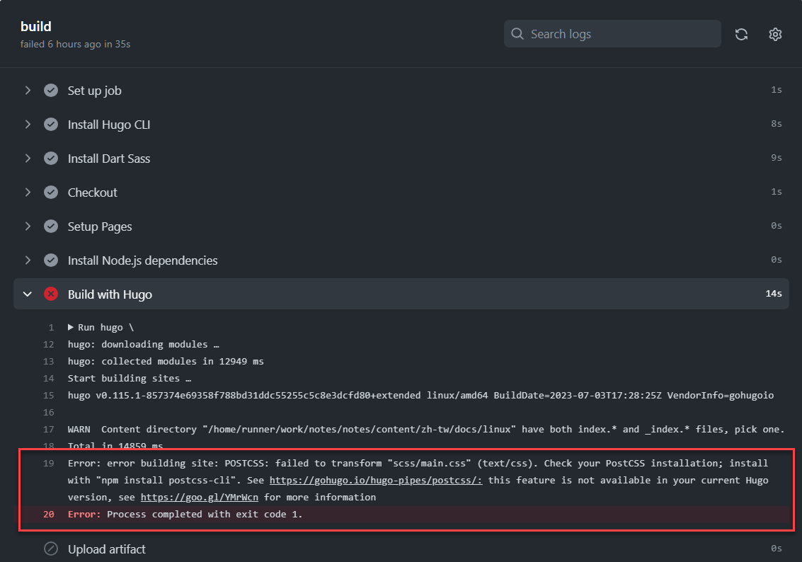
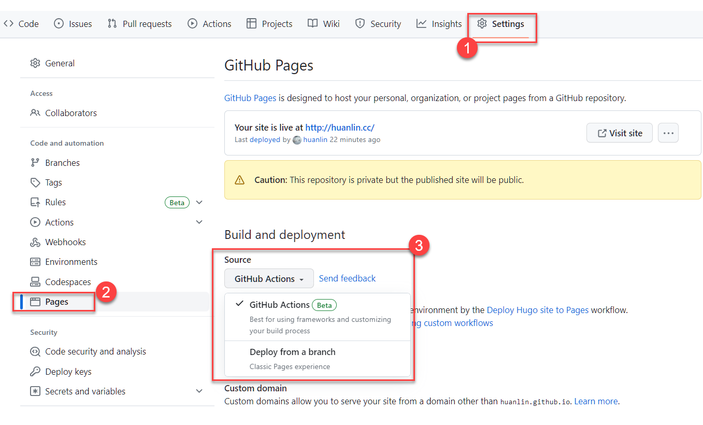
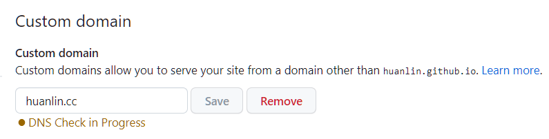

**摘要**：使用 Hugo + Docsy them 來建立靜態網站、部署至 GitHub Pages，並且使用自訂網域名稱。

參考以下兩份官方文件：

- GitHub 官方文件：[Quickstart for GitHub Pages](https://docs.github.com/en/pages/quickstart)
- Hugo 官方文件：[Host on GitHub Pages](https://gohugo.io/hosting-and-deployment/hosting-on-github/)

基本上，只要按照文件中的指示來設定，應該就能順利完成，或完成 80% 左右的設定。由於我還使用了 Docsy theme，所以如果只參考上面的 Hugo 官方文件來設定，GitHub Action 會出現 SASS 的相關錯誤，如下圖，擷取自我的 GitHub 儲存庫的 Workflow 執行紀錄：

由錯誤訊息得知還需要安裝 PostCSS。詳細步驟可參考 Docsy 官方文件：[Get Started](https://www.docsy.dev/docs/get-started/)。

## 自訂網域

### 註冊網域名稱

我的 huanlin.cc 網域是[在 Cloudflare 網站購買](https://www.cloudflare.com/zh-tw/products/registrar/)，當時利用網站上提供的搜尋功能來確認「huanlin」開頭的網域名稱還有哪些一級域名（TLD）可用。查詢結果顯示 huanlin.cc 一年只要 8 美金，價格相當實惠，便立刻下單付款。

事前調查，Cloudflare 不會像某些域名經銷商那樣耍一些小手段：第一年的域名註冊費用很便宜，卻沒告知（或放在比較隱密的地方）第二年 renewal 的費用超級昂貴。Cloudflare 主要不是靠這個域名註冊費用來營利，所以費用便宜，也不玩那些惡劣行銷手法。總之，如果你要買網域名稱，請小心那些知名的、而且廣告打很兇的域名經銷商。

### 設定 DNS

之前曾聽說，Cloudflare 的網域名稱註冊費用之所以比較便宜，其中一個原因是他們也沒在這方面提供什麼技術服務，而且設定 DNS 方面的操作對一般人來說可能技術門檻較高。我自己使用過的感覺是操作介面蠻友善、清楚明瞭，只要對「DNS 記錄」有一點基礎概念，應該不用半小時就能設定完成，包括：

- 四筆指向 GitHub 伺服器 IP 位址的 A 記錄。
- 一筆指向 GitHub 網站的 CNAME 記錄。
- 用來避免駭客偽造 huanlin.cc 寄件者身分寄送 email 的三筆記錄：一筆是 SPF，另外三筆是 MX 記錄。值得一提的是，這四筆記錄是我在 Cloudflare 儀錶板上瀏覽各項功能的時候，網頁上自動跳出來建議我要加入這四筆記錄。只要點一個按鈕就自動幫我加好了，實在方便。

{}
如欲了解什麼是 SPF，可參考 Cloudflare 部落格文章：[應對電子郵件欺騙和網路釣魚](https://blog.cloudflare.com/zh-tw/tackling-email-spoofing-zh-tw/)。
{}

結果如下圖，擷取自我的 Cloudflare 儀錶板頁面：

其中有一筆記錄是剛剛沒有提到的，名稱以「_github-page-challenge-」開頭，那是 [GitHub Pages 驗證自訂網域名稱](https://docs.github.com/en/pages/configuring-a-custom-domain-for-your-github-pages-site/verifying-your-custom-domain-for-github-pages)的時候用到的。

### 設定 GitHub Pages 的子網域

在 Cloudflare（或其他網域供應商平台）上面設定好 DNS 記錄之後，還要看一下 GitHub Pages 這邊有哪些地方要設定。

首先，從儲存庫的 Settings > Pages 頁面中，查看 Build and deployment 區塊的 source 選項，如下圖：

依此部署選項而定：

- 如果是「Deploy from a branch」，那就必須在靜態網站的根目錄底下放置一個純文字檔案，檔名為 CNAME（沒有副檔名），裡面只有一行，就是你的網站的域名，例如 `huanlin.cc`。使用 Hugo 來生成靜態網站時，這個 CNAME 檔案要放在 `/static` 目錄下（Hugo 在建置時就會把根目錄下的檔案放到網站的根目錄）。
- 如果是「GitHub Actions」，則不需要任何額外的設定。官方文件 [Troubleshooting a custom domain](https://docs.github.com/en/pages/configuring-a-custom-domain-for-your-github-pages-site/troubleshooting-custom-domains-and-github-pages) 當中也有提到，即使你建立了 CNAME 檔案，GitHub 也不會去使用它。

> If you are publishing from a custom GitHub Actions workflow, any CNAME file is ignored and is not required.

接下來，在同一個設定頁面中，找到 Custom domain 區塊，把自訂網域名稱填進去，點 Save 按鈕保存。

## 參考資料

- Hugo 官方文件：[Host on GitHub Pages](https://gohugo.io/hosting-and-deployment/hosting-on-github/)
- GitHub 官方文件：[Quickstart for GitHub Pages](https://docs.github.com/en/pages/quickstart)
- GitHub 官方文件：[Custom domains in GitHub Pages](https://docs.github.com/en/pages/configuring-a-custom-domain-for-your-github-pages-site/about-custom-domains-and-github-pages)
- Google 提供的 DNS 工具: [Dig](https://toolbox.googleapps.com/apps/dig/)

### 如果選擇 GitLab Pages

如果因為某些原因而選擇將網站部署至 GitLab，可以參考以下文章：

- Hugo 官方文件：[Host on GitLab Pages](https://gohugo.io/hosting-and-deployment/hosting-on-gitlab/)
- [Start a blog with Hugo + GitLab Pages](https://ayaco.gitlab.io/zerogravity/en/docs/)
