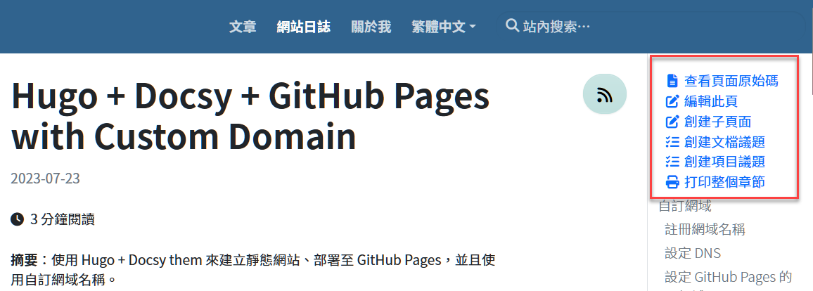

Q: 如何把文章頁面右邊自動出現的選單項目拿掉？如下圖。



A: 「打印整個章節」功能可以參考 Docsy 文件來移除：[Print Support](https://www.docsy.dev/docs/adding-content/print/)，其餘選項都是因為在 hugo.toml 裡面有設定repository URL 的緣故。只要把 Hugo 組態檔中的 `github_repo` 和 `github_project_repo` 設定為空字串，就能讓文章內容頁面右邊出現的那些選單項目消失。

```toml
# Repository configuration (URLs for in-page links to opening issues and suggesting changes)
github_repo = ""
# An optional link to a related project repo. For example, the sibling repository where your product code lives.
github_project_repo = ""
```