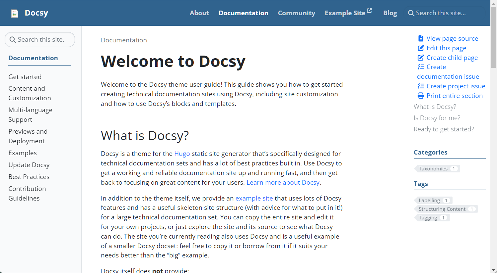
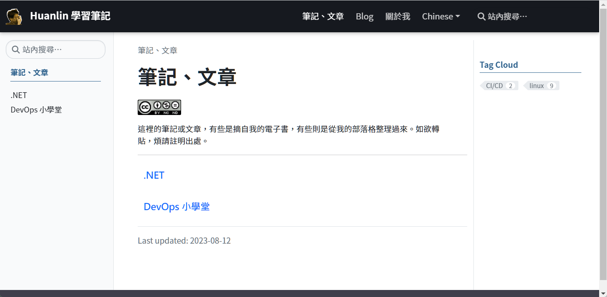

***

我的 huanlin.cc 網站是 host 在 Github 平台上，網頁生成工具是用 Hugo 搭配 Docsy theme。本文的目的是記錄我對此網站的 Hugo 與 Docsy 主題框架做了哪些調整。

我把所有調整或新增的檔案放在 Github 上面：[docsy-customization](https://github.com/huanlin/docsy-customization)。如果你要使用的話，只要先在你的網站安裝好 Docsy theme，然後把我的 repo 中的檔案覆蓋掉你的網站裡對應的檔案，即可套用我的自訂樣式。

## 文件首頁

先大概看一下 look and feel 有何差異。

入口基本上沒有太大差異，我主要是針對「文件」，也就是 `docs` 目錄下的頁面排版樣式來做調整。

撰寫本文時，[Docsy 展示網站的 docs 首頁](https://www.docsy.dev/docs/) 長這樣：



我的網站的文件首頁：



在調整樣式的時候，我經常參考和模仿 Material for MkDocs 的網頁風格，包括顏色、字體大小等等。詳見 [_variables_project.scss](#_variables_projectscss) 和 [_styles_project.scss](#_styles_projectscss)。

## 左側選單

左側選單（sidebar menu）主要有兩處修改：

- 顯示三角形箭頭圖案，方便使用者一看就知道哪些選單項目還有子項可展開，以及哪些項目是沒有子項的葉節點。
- 記住卷軸位置。

### 顯示三角形箭頭圖案

Docsy 官方文件的 Navigation and Menus 的 [Section menu options](https://www.docsy.dev/docs/adding-content/navigation/#section-menu-options) 一節當中有說明，只要修改 Hugo 組態檔，將 `params.ui.sidebar_menu_foldable` 參數設定為 `true`，即可令左側選單出現三角形箭頭圖案來表示可展開／摺疊的選單項目。

以下摘自我的 `hugo.toml` 檔案內容：

```toml
# User interface configuration
[params.ui]
# Enable to show the side bar menu in its compact state.
sidebar_menu_compact = true
# 讓左邊選單可以折疊／展開
sidebar_menu_foldable = true
```

儘管 Docsy theme 有提供這個選項，但是它的[展示網站](https://www.docsy.dev/docs/) 並沒有啟用此功能，再加上 Docsy 範本的 `hugo.toml` 檔案裡面也沒有 `sidebar_menu_foldable` 參數，導致我剛開始以為 Docsy 無此功能。我相信應該也有不少人跟我一樣吧，所以 GitHub 上面的 [issue #100](https://github.com/google/docsy/issues/100) 在我寫這篇筆記的時候都還是 open 狀態。

### 記住卷軸位置

在操作 Docsy 的左邊選單時，如果在子項目之間點選切換，每點一次就會因為網頁重新載入而令左邊選單也重新整理。雖然 Docsy 會記住目前選擇的項目，並且令該項目加粗顯示，但卻不會記住卷軸位置。這會造成一個對使用者操作上的不方便，因為當左邊選單的項目很長的時候，使用者透過左邊選單區塊的垂直捲軸往下找到想要查看的文章，點選之後，左邊選單就會因為網頁重新載入而令卷軸位置回到最頂端，於是就看不到先前選取的那個項目了。

光看以上文字說明可能不好理解，但只要自行操作看看，應該就能發現問題所在。

針對此問題，我加了一些 JavaScript 來記住左邊選單的卷軸位置。詳情：[Keep Sidebar Menu's Scroll Position](/en/docs/hugo-docsy/docsy-tips/sidebar-menu-scroll-pos/)

## 文章右邊的大綱連結

檔案：`/layouts/partials/toc.html`

閱讀文章時，右邊會有一個區塊顯示文章大綱連結，也就內容的各級標題的連結。

原本：

```html
  <div class="td-toc">
    {{ . }}
  </div>
```

改成：

```
  <div style="margin-left: -2px; font-weight: 700; padding-bottom: 8px;">Table of contents</div>
  <div class="td-toc">        
    {{ . }}
  </div>  
```

也就是在大綱區塊上方加上一行 "Table of contents"。有些網站是用 "In this article:"。

## 導覽列

檔案：`/layouts/partials/navbar.html`

Docsy 原本是用 logo.svg 作為網站頂端導覽列的 logo 圖案，我的 logo 是 .png 格式，所以也做了修改。

原本：

```
  {{ with resources.Get "icons/logo.svg" -}}
    {{ ( . | minify).Content | safeHTML -}}
```

改成：

```
  {{ with resources.Get "icons/logo.png" -}}
    
```

同時必須在 `/assets/scss/_styles_project.scss` 檔案中加入以下樣式：

```
.logo-image-height {
  height: 32px;
  padding-right: 12px;
}
```

## Blog

### `/layouts/blog/list.html`

原本：

```hugo
<p class="pt-0 mt-0">{{ .Plain | safeHTML | truncate 250 }}</p>
```

那個 `truncate 250` 的作用是取部落格貼文的前面 250 個字元來當作 "Read more" 之前的摘要。但我發現 250 個字元對中文的帖子來說太長了，不好看，所以我把它改成 100：

```hugo
<p class="pt-0 mt-0">{{ .Plain | safeHTML | truncate 100 }}</p>
```

另外，中文語系的用詞也有點過於簡略。原本叫做「更多」，我覺得「閱讀更多」或「閱讀全文」會更好一些，故我也修改了 `/i18n/zh-tw.toml`。詳見：[繁體中文語系檔案](#i18n-zh-tw)。

### `/layouts/blog/content.html`

原本：

```hugo
{{ with .Params.author }}{{ T "post_byline_by" }} <b>{{ . | markdownify }}</b> |{{ end}}
```

改為：

```hugo
{{ if .Params.author }}
    {{ with .Params.author }}{{ T "post_byline_by" }} <b>{{ . | markdownify }}</b> |{{ end}}
{{ else }}	
    {{ with $.Site.Params.default_blog_author }}{{ T "post_byline_by" }} <b>{{ . | markdownify }}</b> |{{ end}}
{{ end }}
```

同時在 `hugo.toml` 檔案中增加 `default_blog_author` 參數：

```toml
[params]
default_blog_author = "Michael Tsai" 
```

如此一來，每一篇部落格帖子的檔頭就不用提供 author 屬性。

## /assets/scss/ 資料夾

以下分別

### `_variables_project.scss`

```scss
/*
  Add styles or override variables from the theme here.
*/

$google_font_name: "Noto Sans TC";
$google_font_family: "Noto+Sans+TC:300,300i,400,400i,700,700i";

@import "_admonition_variables";
@import "_admonition";
```

其中 import 的 `_admonition.scss` 和 `_admonition_variables.scss` 也是放在同一個目錄下。這部分的細節已整理在另一篇文章：[Admonitions](/en/docs/hugo-docsy/admonitions/)。

### `_styles_project.scss`

```scss
// This is a custom SCSS file for Hugo Docsy theme.
// See: https://www.docsy.dev/docs/adding-content/lookandfeel/#project-style-files

/*
  For MediumZoom.js to force the zoomed image to be displayed on top of everything.
  Without these settings, the zoomed image will display under some elements on the page.

  Ref: https://github.com/francoischalifour/medium-zoom#debugging
*/
.medium-zoom-overlay,
.medium-zoom-image--opened {
  z-index: 999;
}

// For admonitions. Copied from MkDocs Material (by Michael Tsai 2023-8-6).
:root > * {
  --md-shadow-z1: 0 0.2rem 0.5rem #0000000d,0 0 0.05rem #0000001a;
  --md-shadow-z2: 0 0.2rem 0.5rem #0000001a,0 0 0.05rem #00000040;
  --md-shadow-z3: 0 0.2rem 0.5rem #0003,0 0 0.05rem #00000059;

  --md-primary-fg-color: #16191F;
}

:root {
  --bs-body-font-family: Noto Sans TC, -apple-system, BlinkMacSystemFont, Segoe UI, Roboto, Helvetica Neue, Arial, sans-serif, Apple Color Emoji, Segoe UI Emoji, Segoe UI Symbol;
  --bs-font-monospace: SFMono-Regular, Menlo, Monaco, Consolas, "Liberation Mono", "Courier New", monospace;
}

.logo-image-height {
  height: 32px;
  padding-right: 12px;
}

pre {
  font-size: 0.9rem;
}

h2 {
  font-size: 1.9rem;  
  font-weight: 600;
}

h2.feedback--title {
  padding-top: 2rem;
  font-size: 1.7rem;  
  font-weight: 500;
  color: var(--md-primary-fg-color);
}

// Section 首頁的標題連結
.section-index h5 a {
  font-weight: 700;
  font-family: '微軟正黑體', var(--bs-body-font-family);
  font-size: 1.18rem;
}

.lead {
  font-size: 1.1rem;
  font-weight: 400;
}

.reading-time {
  margin-top: 20px;
} 

.td-toc a {
  font-weight: 400;
}

.td-max-width-on-larger-screens {
  @include media-breakpoint-up(lg) {
    max-width: 95%; /* Docsy 預設為 80% */
  }
}

@media (min-width: 1200px) {
  // 左邊主選單的寬度
  .col-xl-2 {
    flex: none;
    width: 19%; // 原本為 16.66666667%
  }

  // 中間內文區域的寬度
  .col-xl-8 {
    flex: 0 0 auto;
    width: 60%; // 原本為 66.66666667%;
  }
}

// Docsy 預設的選單字型太大，顏色太淺，此處略作調整。
.td-sidebar-nav .td-sidebar-link {
  color: var(--md-primary-fg-color);
  display: block;
  padding-bottom: 0.375rem;
  font-size: 0.95rem;
  font-weight: 400;
}

// 左邊選單的子項目縮排
@media (min-width: 768px) {
  .td-sidebar-nav__section .ul-1 ul {
    padding-left: 1.2em;
  }
}

// 右邊的 table of contents 的樣式
.td-toc #TableOfContents a {
  color: var(--md-primary-fg-color);
  font-size: 0.9rem;
}

// 右邊的 table of contents 區塊的子標題縮排
.td-toc li li {
  margin-left: 0.9rem;
}

// 右邊的 table of contents 區塊的位置保持固定
@supports (position: sticky) {
.td-sidebar-toc {
    position: sticky;
    top: 6rem;
    height: calc(100vh - 6rem);
    overflow-y: auto;
  }
}

// 頁面頂端標題列（導覽列），樣式取自 Material for MkDocs。
.td-navbar {
  background: var(--md-primary-fg-color); // #30638e;

  // 下方加上陰影
  box-shadow: 0 0 0.2rem #0000001a, 0 0.2rem 0.4rem #0003;
  transition: transform .25s cubic-bezier(.1,.7,.1,1),box-shadow .25s;
}

// 頂端導覽列的字體
.td-navbar .nav-link {
    text-transform: none;
    font-weight: 500;
    font-size: 1.05rem;
}
```

## 繁體中文語系檔案 {#i18n-zh-tw}

底下是我修改的繁體中文語系檔案 `/i18n/zh-tw.toml` 的內容：

```toml
[ui_search]
other = "站內搜尋…"

[post_reading_time]
other = " 分鐘左右可讀完"
[post_less_than_a_minute_read]
other = "1 分鐘內可讀完"

[post_last_mod]
other = "Last update"

[post_byline_by]
other = "作者："

[ui_read_more]
other = "閱讀全文"
```

說明：

- `[post_byline_by]` 是用於部落格文章的作者姓名之前的標籤文字。若使用 Docsy 原本的檔案，顯示作者姓名的時候會像這樣：`藉由: Michael`。
- `[ui_read_more]` 在英文語系檔案裡面的用詞是 "Read more"，可是到了中文語系的檔案裡面卻是「更多」——只有 more，沒了 read 動作。
- `[post_last_mod]` 我決定使用英文 "Last update"。

如欲取得完整檔案內容，可以[從我的 Docsy fork 下載 zh-tw.toml](https://github.com/huanlin/docsy/blob/main/i18n/zh-tw.toml)。