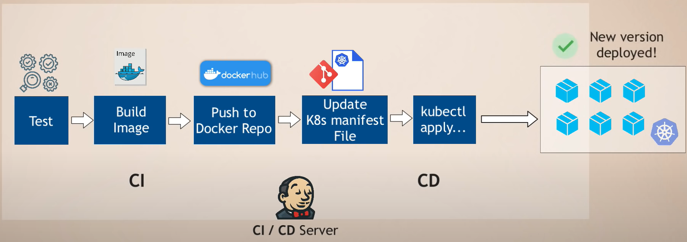
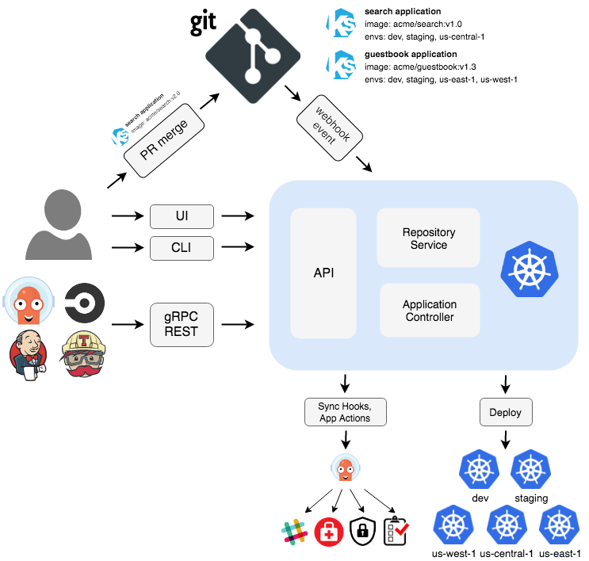

# Argo CD 簡介

摘要：

先備知識：[GitOps](gitops.md)

## What

顧名思義，Argo CD 是一個用於持續部署（continuous delivery）的工具。稍後會提到，Argo CD 本身也是一個 Kubernetes controller，故也可以說它是一個基於 Kubernetes 的宣告式 GitOps 工具。

關於 GitOps 與宣告式工具，可參考另一篇文章的說明：[GitOps 簡介](gitops.md)。至於 Kubernetes，則可參考 [Kubernetes 簡介](../k8s/overview/k8s-overview.md)。主要是了解我們的程式會部署到 Pods 中，而 Kubernetes 會根據我們在 YAML 檔案中描述的期望狀態來調整作業環境。

!!! note
    許多 DevOps 工具的設計都有相同的特色：以宣告方式來定義應用程式的目標狀態（應該以何種狀態運行），而且宣告的內容皆可放入 Git 儲存庫進行版本控管，以便透過工具本身的差異比對功能來自動調整目標環境的狀態，而「自動化」往往是這些機制背後的主要目的。

## Why

目前市面上已不乏知名的 CD 工具，例如 Jenkins、GitLab CI/CD，那麼 Argo CD 又有何特別之處？以及，它能完全取代其他 CD 工具嗎？

且讓我們先來看一個典型的、沒有 Argo CD 的場景，其部署流程如下圖：

## Argo CD 的運作方式

Argo CD 遵循 GitOps 模式，使用 Git 儲存庫作為單一資訊來源，以獲取應用程式預期狀態的定義。

Argo CD 本身也是一個 Kubernetes controller，它會持續監測運行中的應用程式，並拿當前的狀態去跟預期的目標狀態（保存於 Git repo）比較。一旦發現當前狀態與目標狀態有差異，Argo CD 能夠以自動或手動的方式來讓應用程式當前的運行狀態回到預期的目標狀態。換言之，在 Git repo 中對目標狀態所做的任何修改都能自動反映至目標環境。

底下是 Argo CD 的架構圖（摘自 [Argo CD 文件](https://argo-cd.readthedocs.io/en/stable/)）：

## 參考資料

- [Argo CD Overview](https://argo-cd.readthedocs.io/en/stable/)
- [What is Argo CD](https://www.youtube.com/watch?v=p-kAqxuJNik)