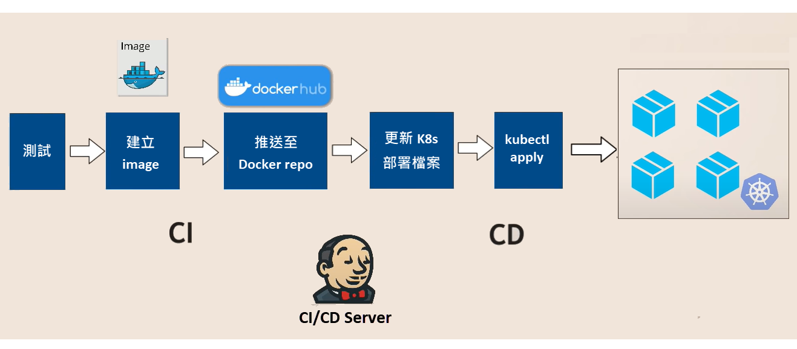
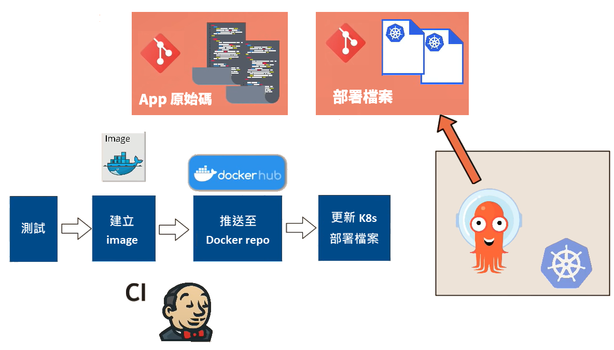
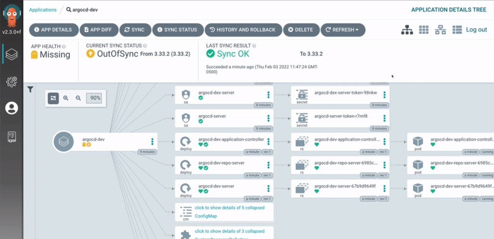

## Argo CD 是什麼？

顧名思義，Argo CD 是一個用於持續部署（continuous delivery）的工具。稍後會提到，Argo CD 本身也是一個 Kubernetes controller，故也可以說它是一個基於 Kubernetes 的宣告式 GitOps 工具。

關於 GitOps 與宣告式工具，可參考另一篇文章的說明：[GitOps 簡介](gitops.md)。至於 Kubernetes，則可參考 [Kubernetes 簡介](../k8s/overview/k8s-overview.md)。主要是了解我們的程式會部署到 Pods 中，而 Kubernetes 會根據我們在 YAML 檔案中描述的期望狀態來調整作業環境。

!!! note
    許多 DevOps 工具的設計都有相同的特色：以宣告方式來定義應用程式的目標狀態（應該以何種狀態運行），而且宣告的內容皆可放入 Git 儲存庫進行版本控管，以便透過工具本身的差異比對功能來自動調整目標環境的狀態，而「自動化」往往是這些機制背後的主要目的。

## 為何採用 Argo CD？

目前市面上已不乏知名的 CD 工具，例如 Jenkins、GitLab CI/CD，那麼 Argo CD 又有何特別之處？以及，它能完全取代其他 CD 工具嗎？

先來看一個典型的、沒有 Argo CD 的場景。假設我們有一個微服務 app 已經部署且運行於 Kubernetes 叢集，現在因為開發了新功能，新版 app 的程式碼已經合併至 Git 儲存庫的主分支，然後觸發了 Jenkins 的 CI/CD 流程，如下圖：

1. 執行測試。
2. 建立 Docker image。
3. 把新版本的 Docker image 推送至 Docker repository。
4. Jekins 更新 YAML 格式的 Kubernetes 部署檔案，把 Docker image 的 tag 從原本的 "myapp:1.0" 改為 "myapp:2.0"。
5. 使用 kubectrl 工具來把部署檔案套用至目標環境，完成新版 app 的部署工作。

上述做法的一個麻煩是，我們必須在 Jenkins 所在的作業環境中安裝 kubectrl、helm 等工具，並且為這些工具設定能夠存取 Kubernetes 叢集的帳號。此外，如果目標環境是 Amazon EKS，就還得讓那些工具也能通過 AWS 的身分驗證與授權程序。這不僅僅涉及一些繁瑣設定，同時也容易引發安全疑慮，因為我們必須把 Kubernetes 叢集的帳號資訊提供給外部工具；要是應用程式數量多達數十個，而每個應用程式都需要一個專屬的 Kubernetes 帳號，情況會變得更加棘手。同樣問題也會出現在應用程式需要同時部署至數十座 Kubernetes 叢集的場合。

另一個問題是，當 Jenkins 透過 kubectrl 來執行部署或更新之後，Jenkins 並不知道部署之後的應用程式是否如預期般順利運行——可能更新作業完成後，應用程式就掛掉了也不一定。

由上述場景可以發現，原本的 CI/CD 流程中的 CD 這塊還有值得改善的空間，而這也就是 Argo CD 所欲解決的問題所在。接著就來了解 Argo CD 的運作方式，看看它如何能夠改善 CD 流程的效率。

## Argo CD 的運作方式與優點

為了改善傳統 CD 流程的效率，與其在 CD 伺服器上面把想要部署或更新的內容推送至 Kubernetes，Argo CD 反其道而行，把自己放在 Kubernetes 叢集裡，主動去 Git 儲存庫拉取 Kubernetes 的 YAML 檔案，然後更新至 Kubernetes 環境，如下圖所示。

這種作法需要預先進行的安裝設定工作有：

1. 將 Argo CD 部署至 Kubernetes 叢集。
2. 讓 Argo CD 能夠存取 Git 儲存庫。

如此一來，Argo CD 就會定期查看 Git 儲存庫，並且在發現有新的變動時，自動拉取變更，然後將變更套用至 Kubernetes 叢集。

### CI 與 CD 分頭進行

有了 Argo CD 之後，便可以搭配一種更好的實務做法：將應用程式的原始碼和部署用的組態檔分別放在不同的 Git 儲存庫。這是因為用來部署至 Kubernetes 的組態檔案不見得會跟著應用程式原始碼一起更動，而 Argo CD 只需要持續偵測用於部署的 Git 儲存庫是否有變動。另一方面，如果應用程式的原始碼並未更動，我們也不希望當 Kubernetes 部署檔案有變動時就連同前半段的 CI 流程也重新跑一次。於是原先傳統的 CI/CD 流程會變成 CI 和 CD 不再綁得那麼緊，得以分頭進行，如下圖所示（圖片取自網路）。

### 快速復原

除了剛才提到的優點，Argo CD 還具有快速復原的能力。

舉例來說，某位工程師離開座位去買咖啡時，有一隻貓咪正好跳上他的桌子，碰巧那隻貓也會敲打 kubectl 指令……

結果貓咪不小心把還沒測試過的組態檔套用至 production 環境，導致應用程式突然掛掉。然後，牠就溜走了。

由於 Argo CD 不只持續監看 Git 儲存庫的變動，它也會監看 Kubernetes 叢集的變動，於是 Argo CD 會發現目標環境跟 Git 儲存庫中定義的預期狀態不一樣了，它就會立即把目標環境恢復成 Git 儲存庫中定義的狀態。

由此可見，採用 Argo CD 之後，我們用來存放部署組態檔的 Git 儲存庫變成為了所謂的單一資訊來源（single source of truth）。這意味著我們只要查看 Git 儲存庫中的組態檔，便可知道目標環境實際運行的狀態，因為 Argo CD 會自動比對預期狀態和實際狀態，並讓它們始終保持一致。如果擔心某些工程師不小心把錯誤的部署檔案推送至 Git 儲存庫，我們也可以藉由 Pull Request/Merge Request 的作法來降低這類風險。

!!! note
    由於某些情況還是可能需要讓工程師手動執行部署作業，故 Argo CD 也允許關閉自動比對、自動更新的功能，而只傳送警示，通知系統管理員目標環境被改變了。

---

最後，由於 Argo CD 就運行在叢集中，而且採用主動至 Git 儲存庫拉取檔案的做法，故不再需要讓 Jenkins 或其他 CI/CD 工具直接存取 Kubernetes 叢集，從而提高了叢集的安全性。

也許有人會問：「那如果把 Jenkins 也部署至 Kubernetes 叢集中，不就也能獲得同樣的好處嗎？」

不盡然。

### 如同 K8s 的擴充元件

Argo CD 不僅只是部署在 Kubernetes 叢集中，它本身也是一個 Kubernetes controller，能夠使用 Kubernetes 既有的功能，例如使用 etcd 來儲存資料、透過 Kubernetes 來監看和比對預期狀態與實際狀態等等。相較於 Jenkins 這類傳統 CI/CD 工具，Argo CD 能夠更加即時地更新應用程式，而且能在應用程式的部署作業完成後持續監看其運行狀態，同時將這些狀態即時呈現在 Argo CD 的管理介面（如下圖，取自[官方文件](https://argo-cd.readthedocs.io/en/stable/)），提供了更高的透明度。

## 結語

本文簡單介紹了 Argo CD 的基礎概念，以及它有哪些優點。實務上，在多個 Kubernetes 叢集的環境中，Argo CD 可以只部署於其中一座叢集，並負責同步更新全部的 K8s 叢集。或者也可以將 Argo CD 部署至每一個叢集，例如三個叢集分別作為開發環境、測試環境、正式環境，並且將三個叢集中的 Argo CD 分別指向 Git 儲存庫的不同分支，例如 dev、test、main。

最後，Argo CD 本身作為部署工具，並不能完全取代既有的 CI/CD 工具，畢竟還有 CI 程序要跑。此外，Argo CD 也不是唯一實踐 GitOps 模式的工具，只是在 GitOps 與 Kubernetes 的場景中，它會是非常合適的選擇。（另一個類似的選擇是 Flux CD）

## 參考資料

- [Argo CD Overview](https://argo-cd.readthedocs.io/en/stable/)
- [What is Argo CD](https://www.youtube.com/watch?v=p-kAqxuJNik)
- [ArgoCD Tutorial for Beginners](https://youtu.be/MeU5_k9ssrs)