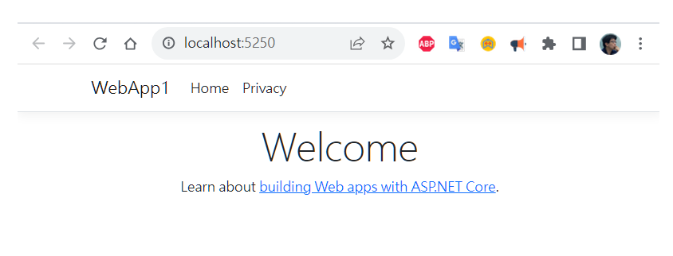
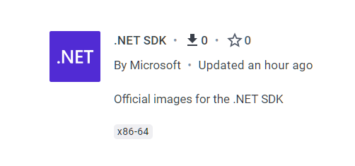
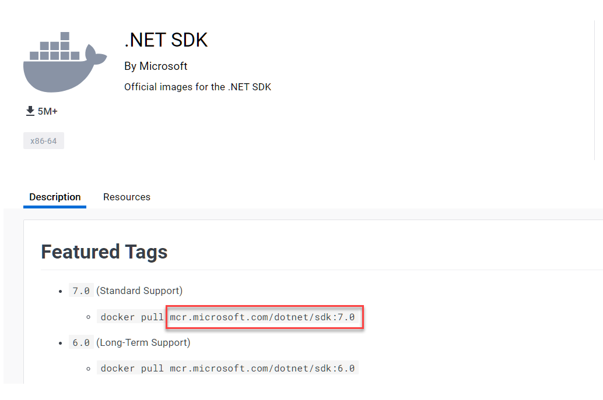
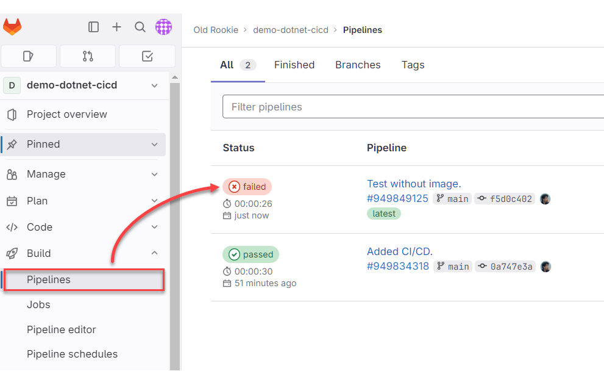
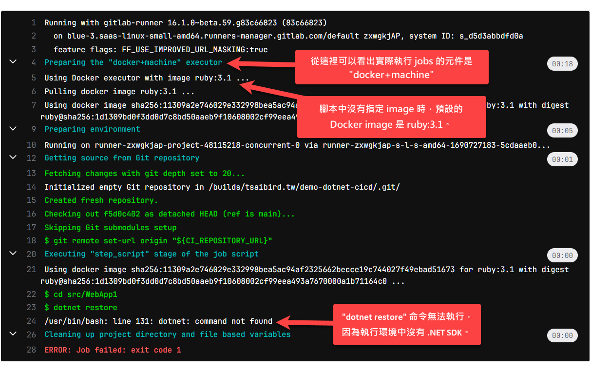

## 工作原理

 GitLab CI/CD（持續整合／持續交付）是透過一種名為 GitLab Runner 的程式來執行 CI/CD 流程中的工作（jobs）。GitLab Runner 可運行在各種不同的環境中，包括實體機器、虛擬機、容器等等，它會透過 GitLab CI/CD 管線接收來自 GitLab 專案的任務，並在適當的運行環境中執行這些任務。

{}
真正負責於適當環境執行 jobs 的是與 GitLab Runner 搭配的元件，叫做 GitLab Executor。這裡沒有針對 Executor 做詳細說明。
{}

有啟用 GitLab CI/CD 的專案，其 repo 裡面會有一個 `.gitlab-ci.yml` 檔案，通常放在 repo 的根目錄下。這是一個 YAML 格式的文字檔，用來定義 CI/CD 流程所要執行的工作，以及哪些工作應該在什麼條件或什麼環境之下執行。簡單來說，`.gitlab-ci.yml` 就是 CI/CD 流程的的腳本。

運作流程如下：

1. 每當有新的 commit 或 Merge Request，而 GitLab 發現 repo 根目錄底下有 `.gitlab-ci.yml` 檔案，便會觸發 CI/CD 流程。
2. GitLab 透過 API 與 GitLab Runner 溝通，令 Runner 根據預先定義的腳本來執行各項工作（jobs）。
3. GitLab Runner 執行工作完畢，把結果回報給 GitLab，供開發團隊查看。

### Stage 與 Job

每一個 GitLab CI/CD 管線（pipeline）的腳本包含兩個主要元件：

- Job：定義要執行**什麼**工作，例如建置、測試、部署等工作，可能會在腳本中分別命名為 build、test、deploy，而每一項工作都有包含一至多個命令。
- Stage：定義**何時**執行 jobs。如果一個 stage 中的所有 jobs 都成功執行完畢，便會繼續執行下一個 stage；如果 stage 當中有任何一個 job 發生錯誤，則整個 pipeline 會提前終止。


## 編寫腳本 — 以 Python app 為例

假設我們有一個 Python 專案，在開發環境中已經可以手動執行測試，而現在我們想要在 GitLab 上面設定 CI/CD 流程，好讓每次有程式碼 commit 至 repo 時，就自動跑一遍測試。

首先，在 repo 的根目錄下建立一個 `.gitlab-ci.yml` 檔案，內容如下：

```yaml
run_tests:
  script:
    - make test
```

此範例腳本只有三行：

- 第 1 行：定義一個 job，命名為 `run_tests`。
- 第 2 行：`script` 區段是用來撰寫欲直行的命令。每個 job 都必須有 `script` 區段。
- 第 3 行：此 job 實際要執行的命令，只有一個：`make test`。

當你 commit 這個檔案至 repo，GitLab 會立刻觸發 CI/CD 流程，並執行 `run_tests` 這個 job 所指定的命令。

然而，`make test` 命令雖然能夠在開發環境的電腦上面執行，放到 GitLab CI/CD 流程裡面執行的時候卻會發生錯誤，因為負責執行此 job 的環境並沒有這些工具：

- make
- pip
- python

那麼，這個 job 又是在哪個環境中執行的呢？

### Jobs 是執行於哪個環境？

如果是 gitlab.com 平台（而不是自行架設的 GitLab 伺服器），那麼 GitLab 會使用一個叫做「docker+machine」的 GitLab Executor 來執行 CI/CD 流程中的工作。簡單來說，剛才的範例腳本中的 job 就是執行於某個 Docker 容器中。

{}
根據目前的[官方文件](https://docs.gitlab.com/ee/ci/runners/saas/linux_saas_runner.html#container-images)，Gitlab 預設的 Docker 容器是 `ruby:3.1`。
{}

然而，GitLab 預設使用的 Docker 容器裡面並沒有 Python 相關工具，所以無法順利執行我們的腳本。欲解決此問題，我們必須在腳本中明確告訴 GitLab：請使用我指定的 Docker image。修改後的腳本如下：

```yaml
run_tests:
  image: python:3.9-slim-buster
  script:
    - make test
```

如此一來，GitLab Runner 就會改用我們指定的 Docker image 來運行容器，並在該容器中執行我們定義的 job。現在執行環境的容器雖然有 Python 工具了，卻還是沒有 make 工具，所以我們還必須在腳本中撰寫安裝 make 工具的命令，如下：

```yaml
run_tests:
  image: python:3.9-slim-buster
  before_script:
    - apt-get update && apt-get install make
  script:
    - make test
```

`before_script` 區段裡面的命令會在 `script` 區段之前執行，所以這裡很適合用來安裝一些必要的工具。

{}
Docker image 都有一個特殊的 tag 叫做 `latest`，代表最新的版本。例如 `python:latest` 就會令 GitLab 使用 Docker Hub 上面最新版本的 Python image。一般而言，最好使用專案開發與測試的軟體版本，以免 `latest` 拉回最新版本而導致應用程式出錯。
{}

## 演練：以 ASP.NET Web app 為例

了解 GitLab CI/CD 腳本的基本寫法之後，其他程式語言的專案也能如法炮製。這裡再以一個簡單的 ASP.NET 應用程式為例，示範如何為 .NET 專案建立 GitLab 的 CI/CD 腳本。使用的 IDE 工具是 Visual Studio 2022 v17.7 Preview 5.0。

首先，以 Visual Studio 建立一個新專案，專案範本選擇 `ASP.NET Web Core`，專案名稱為 "WebApp1"。或者使用以下命令來建立專案：

```
dotnet new webapp -n WebApp1 -f net7.0
```

在本機執行看看，確認程式碼可以編譯和執行。下圖為執行畫面：



在 GitLab 平台建立一個新 project/repository，並將剛才建立的 WebApp1 原始碼放進此 repo。其目錄結構如下：

```text
.
├── .gitignore
└── src    
    └── WebApp1
        ├── Pages
        ├── Properties
        ├── wwwroot
        ├── Program.cs
        ├── WebApp1.sln
        └── WebApp1.csproj
```

**注意**：專案的目錄結構對於編寫 CI/CD 腳本而言經常是重要的。如果沒有在腳本中切換至正確的工作目錄，有些命令便可能無法順利執行。

### 編寫腳本

在 repo 的根目錄下建立 `.gitlab-ci.yml` 檔案，內容如下：

```yaml
build:
  image: mcr.microsoft.com/dotnet/sdk:7.0
  before_script:
    - "cd src/WebApp1"
    - "dotnet restore"
  script:
    - "dotnet build" 
```

說明：

- 第 1 行：開始一個 job 區塊，並將此 job 命名為 "build"。
- 第 2 行：指定 Docker image，使用微軟官方的 .NET SDK 7.0。
- 第 3～5 行：`before_script` 區段，先把工作目錄切換至 WebApp1.scproj 所在的資料夾，然後執行 `dotnet restore` 命令來還原（下載）相依套件。
- 第 6～7 行：`script` 區段，執行 `dotnet build` 命令來建置專案。注意執行此命令時所在的工作目錄依然是 `src/WebApp1`，也就是會延續先前在 `before_script` 區段中切換的工作目錄。
  
值得一提的是，`mcr.microsoft.com/dotnet/sdk:7.0` 這個 Docker image 的名稱可以從 Docker Hub 網站搜尋關鍵字 ".net sdk" 便可在搜尋結果中找到如下圖的區塊：



點擊此區塊之後所顯示的頁面會有 Featured Tags 清單，也就是目前比較建議使用的版本，你可以從這裡得知 Docker image 的名稱。如下圖：



把寫好的 `.gitlab-ci.yml` 檔案 commit 至 repo。接著用瀏覽器登入 gitlab.com，然後進入此專案的 repo 頁面，點擊左邊選單的 Build > Pipelines，應該就能看到最近的 CI/CD 建置工作的結果。如下圖：



圖中顯示的執行紀錄有兩次，一次成功，一次失敗，而失敗的那次是我刻意把 CI/CD 腳本中的 `image: ...` 那行拿掉，以便抓取錯誤訊息的截圖。從那筆顯示 failed 的紀錄點進去就能看到完整的執行紀錄，如下圖：



### 建立 Docker Image 並推送至 Docker Hub

(Sorry! This section is not finished yet.)

## 其他範例腳本

最後順便整理幾個範例當作參考。

### 區分測試和部署階段

以下腳本定義了兩個 jobs：test_job 和 deploy_job，它們分別作用於 test 和 deploy 階段。


```yaml
stages:
  - test
  - deploy

test_job:
  stage: test
  script:
    - echo "Running tests..."

deploy_job:
  stage: deploy
  script:
    - echo "Deploying to test server..."
```

### 加入限定規則

以下腳本加入了 `rules` 區段，限定唯有 commit 至「預設分支」的動作才要執行 `build` 工作。

```yaml
build:
  image: mcr.microsoft.com/dotnet/sdk:7.0
  script:
    - "dotnet build" 
  rules:
    - if: $CI_COMMIT_BRANCH == $CI_DEFAULT_BRANCH

```

詳細說明可參閱官方文件：[Choose when to run jobs](https://docs.gitlab.com/ee/ci/jobs/job_control.html)

### 定義變數

使用 `variables` 區段來定義變數，以及使用 `$` 符號來使用變數。

```yaml
variables:
  GLOBAL_VAR: "我是全域變數"

job1:
  variables:
    JOB_VAR: "我是工作區域變數"
  script:
    - echo "兩個變數的值是：'$GLOBAL_VAR' 和 '$JOB_VAR'"
```

參閱官方文件：[GitLab CI/CD variables](https://docs.gitlab.com/ee/ci/variables/)

## 重點回顧

- GitLab 的 CI/CD 腳本檔案名稱是 `.gitlab-ci.yml`。
- 只要 repo 的根目錄有 `.gitlab-ci.yml`，每當有程式碼 commit 至 repo，就會自動觸發 GitLab 的 CI/CD 流程。
- GitLab CI/CD 流程會調用 GitLab Runner 來執行腳本中的 jobs，而真正負責在適當環境執行 jobs 的是 Executor。
- 由 gitlab.com 平台管理的 CI/CD 流程會執行於一個 Docker 容器中。我們可以在腳本中使用 `image` 屬性來指定要使用哪一個 Docker image 來作為運行腳本的容器；若未指定，則預設的容器是 Ruby。

## 參考資料

- 官方文件：[GitLab CI/CD](https://docs.gitlab.com/ee/ci/index.html)
- 官方文件：[GitLab Runner](https://docs.gitlab.com/runner/)
- [GitLab CI CD Tutorial for Beginners](https://youtu.be/qP8kir2GUgo)