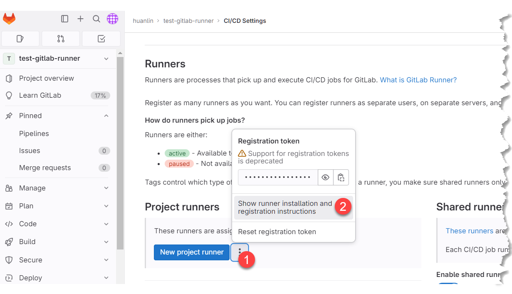
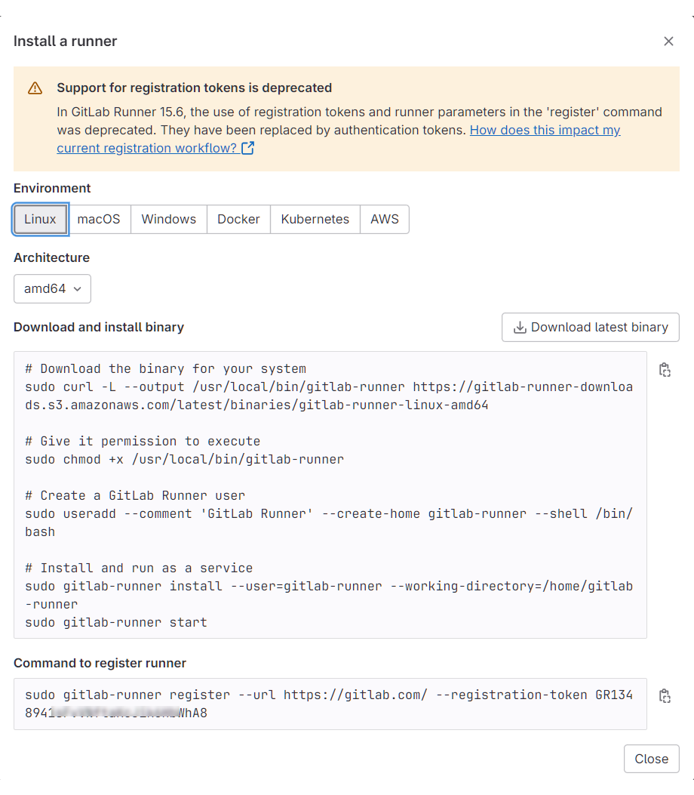
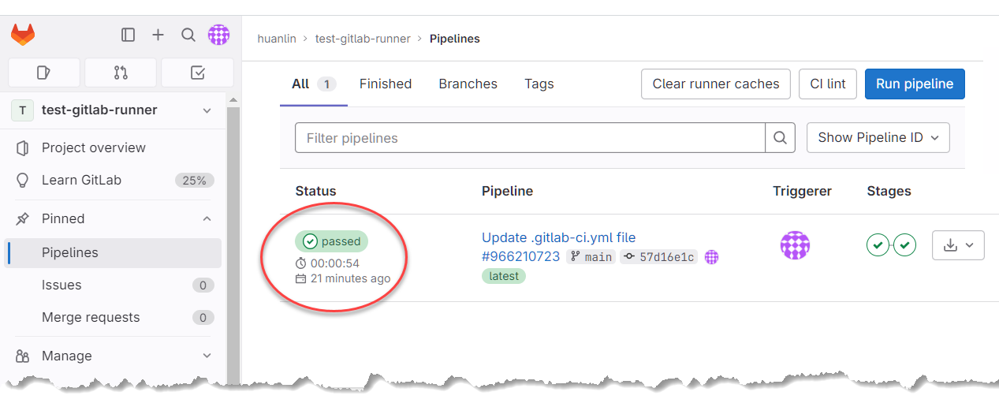

## 簡介

GitLab runner 是 gitlab.com 提供的一個程式，可下載安裝於 Linux、Windows、VM、容器等環境。

接著從 [GitLab 官方文件](https://docs.gitlab.com/runner/)摘錄幾個基礎觀念，然後搭配一個簡單的練習來理解其運作方式。

### GitLab Runner Types

依「誰有存取權限」來看，GitLab runners 有三種：

- Shared runners：在一台 GitLab 伺服器上面的所有專案都能使用。
- Group runners：在同一個 group 及其 subgroup 中的所有 projects 和都能使用。
- Project runners：僅特定專案才能使用。

### GitLab Runner Executor

- Executor 決定了每個 job 實際執行在什麼環境中。
- 在註冊 GitLab runner 時，必須選擇一個 executor。

### Tags

你可以為 GitLab runner 加上 tags，以便在你的 GitLab pipeline 中指定對應的 tags 來「篩選 runner」。也就是說，當你的 GitLab pipeline 檔案中有為某個 job 指定 tag，那麼就只有同樣具備該 tag 的 runner 才能執行那個 job。

直接取用官方文件的範例，假設你的專案的 `.gitlab-ci.yml` 檔案內容如下：

```yaml
job:
  tags:
    - ruby
```

這就表示 GitLab 只會使用具有 `ruby` tag 的 runner 來執行這個 job。

## 實作練習

Self-hosting GitLab runner 包含以下步驟：

1. 在目標主機上面安裝 runner 程式。
2. 選擇一個 executor。
3. 註冊 GitLab runner。
4. 編寫 pipeline 腳本，在腳本中使用 tag 來限定使用我們自己的 runner 來跑 job。然後實際跑跑看這個 pipeline。

以下是我的操作過程。

### 在目標主機上安裝 Runner

我用來練習的目標主機是 DigitalOcean 平台上的一台 Linux VM。

先登入我的 GitLab 帳號，建立一個練習用的專案。我的專案網址是 https://gitlab.com/huanlin1/test-gitlab-runner。

在此專案的 Settings > CI/CD 頁面展開 Runners 區塊，可以看到有左右兩個區塊，分別是 Project runners 和 Shared runners。這裡要建立的是供特定專案使用的 runner，故按下圖操作：



接著會開啟對話窗，裡面有完整的安裝步驟和指令，如下圖：



接著以 SSH 遠端登入我在 DigitalOcean 上面建立的 Ubuntu 虛擬機，然後照著上圖的指示逐一執行所有的命令，即可在 gitlab.com 註冊好一個 runner。

在 GitLab 提供的指示當中，最後一個步驟就是註冊 runner，其命令為：

```shell
sudo gitlab-runner register 
```

執行此命令時，會先要求輸入 GitLab 伺服器的網址：

```shell
Enter the GitLab instance URL (for example, https://gitlab.com/):
[https://gitlab.com/]:
```

直接按 Enter，表示使用預設的 https://gitlab.com。接著會要求輸入註冊用的 token，前述安裝指示當中也已經提供了這個 token，直接貼上即可：

```text
Enter the registration token:
GR123456789aBcDeFgHiJk987654321
```

接著輸入 runner 的描述：

```text
Enter a description for the runner:
[ubuntu-s-1vcpu-512mb-10gb-sgp1-01]: My test for GitLab runner
```

然後輸入 tags，這裡我指定的 tag 是 `python`：

```text
Enter tags for the runner (comma-separated):
python
```

接著要求輸入 maintenance note，可以直接按 Enter 跳過，然後就能看到註冊 runner 成功的訊息：

```text
Enter optional maintenance note for the runner:

WARNING: Support for registration tokens and runner parameters in the 'register' command has been deprecated in GitLab Runner 15.6 and will be replaced with support for authentication tokens. For more information, see https://gitlab.com/gitlab-org/gitlab/-/issues/380872
Registering runner... succeeded                     runner=GR123456789aBcDe
```

雖然訊息顯示註冊 runner 成功，但還沒完，緊接著會要求我們選一個 executor。我輸入的是 "docker"（我的 VM 上面有安裝 Docker）：

```text
Enter an executor: docker-autoscaler, shell, ssh, virtualbox, parallels, docker+machine, instance, kubernetes, custom, docker, docker-windows:
docker
```

接會著詢問預設的 docker image 要用哪一個，就照它提供的範例中輸入 "ruby:2.7"，反正稍後可以在我們的 pipeline 檔案中指定使用其他 image。

```text
Enter the default Docker image (for example, ruby:2.7):
ruby:2.7
```

最後顯示 runner 註冊成功的訊息：

```text
Runner registered successfully. Feel free to start it, but if it's running already the config should be automatically reloaded!

Configuration (with the authentication token) was saved in "/etc/gitlab-runner/config.toml"
```

至此大功告成。

#### 查看 Runner 的組態檔

註冊 Runner 的最後一個步驟完成時，除了顯示註冊成功，最後還有一條訊息告訴我們這個 runner 的相關設定是保存在這個檔案：`/etc/gitlab-runner/config.toml`。之後有可能需要修改這個組態檔案來改變 runner 的行為，所以這裡先看一下檔案內容。

一樣是在遠端虛擬機上面執行命令：

```shell
sudo cat /etc/gitlab-runner/config.toml
```

結果：

```toml
concurrent = 1
check_interval = 0
shutdown_timeout = 0

[session_server]
  session_timeout = 1800

[[runners]]
  name = "My test for GitLab runner"
  url = "https://gitlab.com/"
  id = 26923949
  token = "U88hEGQAvuWz99999WtX"
  token_obtained_at = 2023-08-13T14:12:05Z
  token_expires_at = 0001-01-01T00:00:00Z
  executor = "docker"
  [runners.cache]
    MaxUploadedArchiveSize = 0
  [runners.docker]
    tls_verify = false
    image = "ruby:2.7"
    privileged = false
    disable_entrypoint_overwrite = false
    oom_kill_disable = false
    disable_cache = false
    volumes = ["/cache"]
    shm_size = 0
```

如果想要用 `shell` 來跑 pipeline 的 jobs，可以修改檔案中的 `executor = "docker"`，把 `"docker"` 改成 `"shell"`。 

#### 確認 Runner 是否正常運行

Runner 註冊完成後，可用以下命令來確認這個它是否順利運行：

```shell
sudo gitlab-runner verify
```

結果：

```text
Runtime platform                                    arch=amd64 os=linux pid=55771 revision=674e0e29 version=16.2.1
Running in system-mode.

There might be a problem with your config based on jsonschema annotations in common/config.go (experimental feature):
jsonschema: '/runners/0/docker/ulimit' does not validate with https://gitlab.com/gitlab-org/gitlab-runner/common/config#/$ref/properties/runners/items/$ref/properties/docker/$ref/properties/ulimit/type: expected object, but got null

Verifying runner... is alive                        runner=U88hEGQAv
```

然後，回到專案的 Runners 設定頁面，重新載入頁面就能看到剛剛新建立的 runner：


### 運行 pipeline

底下是我的專案的 `.gitlab-ci.yml` 檔案內容：

```yaml
image: python:latest

default:
  tags: 
    - python

variables:
  USERNAME: michael

stages:
  - build
  - deploy

build-job:
  stage: build
  script:
    - echo "Compiling the code..."

deploy-job:
  stage: deploy
  script:
    - echo "Deploying the app..."
    - python3 --version
    - echo "Using credential - $USERNAME, $PASSWORD"
    - echo "App deployed successfully."
```

更新此檔案之後，GitLab 會立刻執行此 pipeline 所設定的工作。從專案的 Pipelines 頁面可查看執行結果：



執行結果 `passed` 表示成功。點擊 `passed` 可查看進一步資訊：


頁面顯示此 pipeline 的兩個 jobs 都成功跑完。個別 job 也可以點進去查看執行過程的詳細 log。底下是 `build-job` 的 log：


從 log 的第 1 行可以看到運行這個 job 的 gitlab-runner 版本是 16.2.1，第 2 行則可以看到先前註冊到此專案的專屬 runner 的描述和 ID。第 3 行則顯示此 job 實際執行的環境，是以 `docker` executor 來執行。

## 結語

[GitLab 官方文件](https://docs.gitlab.com/runner/)對於 GitLab Runner 的說明還蠻清楚的，但如果沒有實際操作一番，恐怕還是不容易搞懂 Runner 和 Executor 各扮演什麼角色。就我目前的粗淺理解，Runner 比較像是一個經紀人，而真正執行工作、以及決定在何種環境下工作的是 Executor。

