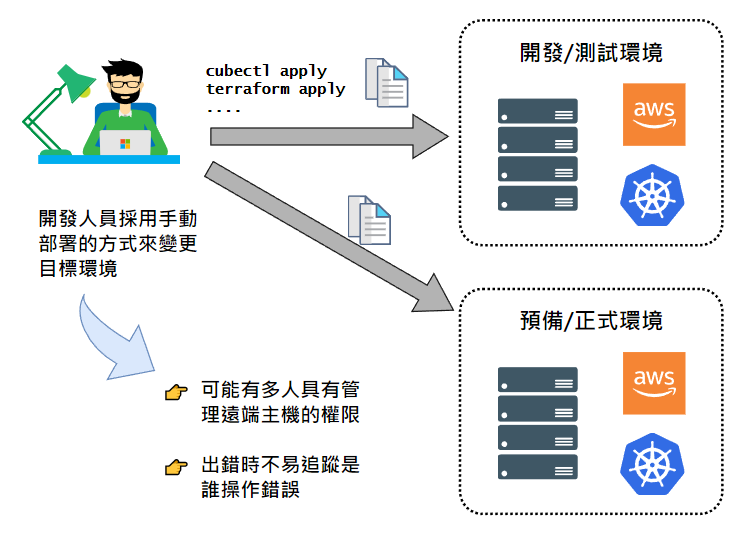
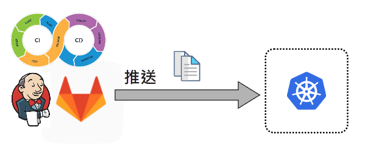
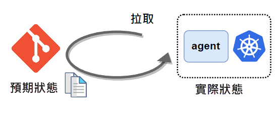

**背景知識：** Git 版本控制、CI/CD 管線（pipeline）。

## What

GitOps 是什麼？簡單來說，就是以**正確的方式**來實現 IaC（Infrastructure as Code；基礎設施即代碼），即以程式碼（組態檔、指令腳本等等）來定義基礎設施。

這裡的基礎設施，指的是運行應用程式或日常操作所需要的作業環境，包括作業系統、資料庫、網路、容器、CD/CD 工具……等等，都可能是基礎設施涵蓋的範圍。

## Why

相較於傳統的人工操作方式來建立基礎設施，IaC 強調以宣告的方式來達成相同目的。所謂宣告的方式，即是以 JSON 或 YAML 這類純文字檔案來描述目標作業環境的基礎設施——只需描述我們想要達成什麼狀態和結果，而實際的布建與設定等相關工作則全部由工具代勞，其最大優點是可以重複執行、重複使用，而且容易自動化。故 IaC 概念逐漸普及，演變成幾乎任何與電腦設備相關的東西都可以用程式碼來定義，例如網路組態、安全政策、系統組態等等，對象已經不僅只是 infrastructure 了，而是 Everything as Code，故後來也有 X as Code 的說法。

{}
各家雲端廠商有各自的 IaC 工具來協助部署應用程式到雲端平台或管理雲端上面的伺服器，例如 Amazon CloudFormation，它能夠讓我們以宣告的方式來布建（provision）整個 AWS 應用程式架構。又如微軟的 Azure Resource Manager 和 Google 的 Cloud Deployment Manager，也都是同類型的工具。
    
雖然各家雲端平台都有提供類似工具讓我們以宣告的方式來定義和管理伺服器，但各家工具只能用在自家平台上。比如說，Amazon 的工具並沒有辦法用來管理 Azure 平台上的伺服器，反之亦然。如果有一種工具能夠支援各家雲端平台，自然提供了更多方便與彈性，這也是 Terraform 與 Ansible 等工具受到普遍歡迎的原因之一。
{}

舉例來說，原本以手動方式在 AWS 平台上建立伺服器、設定網路，以及建立 Kubernetes 叢集，現在改成編寫 Terraform 組態檔、Ansible 腳本、Kubernetes manifest 檔案，以及其他用來描述系統環境設定的 YAML 檔案。換言之，原先的人工作業幾乎都可以用文字檔來定義，然後交給工具執行。

於是，我們可能會在自己的電腦（或者某一台開發專用的主機）上面編寫與測試這些組態檔與腳本，並且將這些檔案保存至一個 Git 儲存庫中，以便多人共同開發與管理版本。然而，這個多人共同開發的流程有可能不夠嚴謹，例如沒有 Pull Request 或 Merge Request（合併請求）機制，也沒有 review 程序，於是任何人修改檔案之後，只要 commit 然後 push，就可以直接把程式碼送進主分支；又或者沒有自動測試機制，故每當程式碼有改動，有時遺漏了測試工作，導致部署到正式作業環境之後出現一堆狀況。

{}
PR（Pull Request）和 MR（Merge Request）指的是同一件事：合併請求。GitHub 平台稱之為 PR，而 GitLab 稱為 MR。基本的做法是，開發人員在自己的 git 分支修改程式，等到修改完成，並不是直接合併到主分支，而是提出一個合併請求，藉此通知其他團隊成員：「我這邊有程式碼可以準備合併到主分支了，大家可以幫我 review 一下嗎？」等大家看過之後沒問題，才由某人核准這次的合併請求，然後程式碼才會合併到主分支。
{}

除了上述問題，各人在自己的開發機器上執行腳本來變更遠端伺服器，即表示每個有權限部署的人都可以直接存取並修改遠端伺服器的作業環境。萬一出狀況，可能不容易追查是誰造成的，以及當時做了哪些變動。底下是手動部署的示意圖：

上述情形雖然不見得會發生在每個團隊，但顯然只有 IaC 是不夠的，我們還需要搭配一套嚴謹的部署程序來確保每一項工作都按照標準程序來執行。這便是 GitOps 所要解決的問題。

## How

基本上，GitOps 就是把開發與管理應用程式原始碼的那一套程序照搬到 Infrastructure as Code。也就是說，我們會有一個專門用來保存基礎設施相關腳本與組態檔的 Git 儲存庫（所以叫做 GitOps），而且有一套 CI/CD 流程來自動執行測試、整合、與部署等工作。

在 GitOps 流程中，部署是自動執行的。也就是說，一旦基礎設施的腳本通過持續整合程序，進入持續部署階段時，就會由工具自動將那些腳本套用至遠端機器。部署的做法有兩種：Push（推送）和 Pull（拉取）。

### Push vs. Pull mode

推送模式就是以往我們熟悉的那種部署應用程式的方式，透過 Jenkins、GitLab 等工具來執行一些命令，把應用程式部署到另一台機器上。

拉取模式則是在目標環境中安裝一個代理程式（agent），並由該 agent 主動去我們的 Git 儲存庫拉回檔案，如下圖所示。

那麼，agent 怎麼知道何時該去儲存庫拉回檔案，然後更新至目標環境呢？

在拉取模式中，agent 會持續比對儲存庫中的組態檔所定義的狀態以及目標環境當前的狀態，當兩邊的狀態有差異，agent 就會自動執行拉取和部署工作，以便讓目標環境的狀態符合組態檔所描述的狀態。萬一某次 commit 至儲存庫的組態檔有錯誤，導致目標作業環境中的應用程式故障，可能只要透過 git revert 命令將檔案回復至先前的版本，就能輕鬆地讓伺服器恢復正常運作。

採用拉取模式的 CD（持續部署）工具當中，目前比較知名的是 Flux CD 和 Argo CD。它們都能夠運行在 Kubernetes 叢集中，並透過自動比對機制來確保目標作業環境的狀態符合儲存庫中定義的狀態。

## 結語

大致了解 GitOpt 的 what、why、與 how 之後，這裡做個簡單總結：理想情況是所有基礎設施和應用程式都能透過各種工具的組態檔與腳本來定義（即 IaC），而這些檔案則全部集中放在 Git 儲存庫，成為**單一資訊來源**（single source of truth），然後搭配合併請求（PR 或 MR）、code review 等實務做法以及 CD/CD 工具來實現自動部署。剛才這一長串的文字描述可濃縮成一個好記的公式（摘自免費電子書 [A Beginner's Guide to GitOps](https://page.gitlab.com/resources-ebook-beginner-guide-gitops.html)）：

**`GitOps = IaC + MRs + CI/CD`**

## 參考資料

- [A Beginner's Guide to GitOps](https://page.gitlab.com/resources-ebook-beginner-guide-gitops.html) （由 GitLab 提供免費下載）
- [What is GitOps, How GitOps Works and Why it's so useful](https://www.youtube.com/watch?v=f5EpcWp0THw)

## 下一步

認識 [Argo CD](argo-cd-overview.md)。
