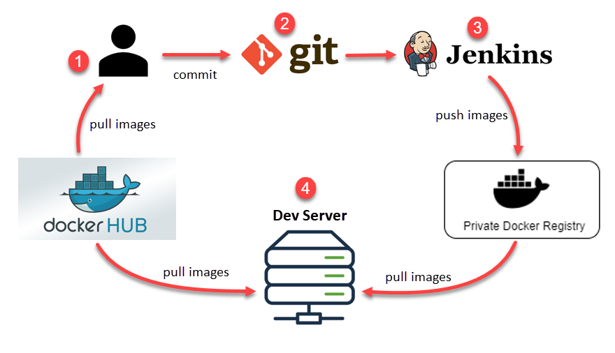

## 什麼是容器？

容器是一種打包 app 的方式。透過容器管理工具（例如 Docker）來把 app 及其所需的相關檔案全包在一個特殊格式的檔案裡，而這個檔案就是所謂的容器影像檔（container image）。

!!! note
    如同程式碼經過編譯之後產生的 .exe 和 .dll 檔案，容器影像檔也是軟體開發過程的一種產出（artifact）。

## 容器放在哪裡？

打包成容器格式的檔案會放在容器的儲存庫（container repository）。

容器儲存庫可以是完全公開的，例如 Docker Hub，也可以是公司內部建立的私有儲存庫。

!!! note
    私有儲存庫不見得一定放在公司內部主機，也有可能上傳至其他雲端平台提供的儲存庫管理服務，例如 Amazon ECR。

## 容器有何優點？

在沒有容器技術的時代，安裝開發工具和應用程式的步驟可能會因為作業系統而不同，因而經常出現一些意外狀況。再加上許多安裝步驟需要人工操作，也容易出錯。

有了容器之後，運行特定開發工具或軟體的環境全都放在一個容器裡面，而且組態檔也都預先設定好了。於是，開發人員只要到容器儲存庫中找到他們需要的容器影像檔，下載到自己的開發機器上，便可立即使用。此外，由於容器本身的隔離性質，在一台機器上還可以同時執行一個 app 的兩種版本，不至於互相干擾。

對於維運和部署團隊來說，如果沒有容器技術，就得使用傳統的做法，也就是開發人員把應用程式打包完成後，交給維運人員來進行部署、安裝和設定，而其中大部分的操作都是人工作業，而人工作業的缺點就是費勁而且容易出錯。

由以上說明可知，容器除了方便複製、移動，更大的優點是能夠提升開發與部署的效率。

下圖描繪了 Docker 容器運用於軟體開發流程的一種作法：

說明：

1. 開發人員從 Docker Hub 拉回容器影像檔至本機，以便安裝開發環境。
2. 程式碼推送至 git 儲存庫。
3. Jenkins 自動執行 app 的編譯、測試、打包等工作，並將打包好的 Docker 容器檔案推送至私有的 Docker 儲存庫。
4. 最後，由一台伺服器從私有的 Docker 儲存庫拉回容器檔案，並且從公開的 Docker Hub 拉回 app 運行所需之容器檔案，以便進行最後的整合與部署。

!!! note
    Docker 不是唯一的容器管理工具，另外還有 containerd、cri-o 等等。
