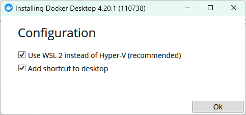
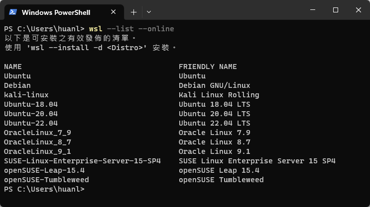
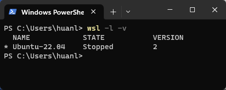
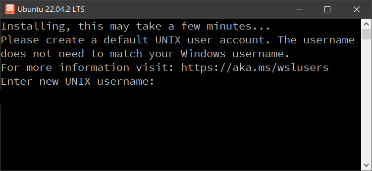
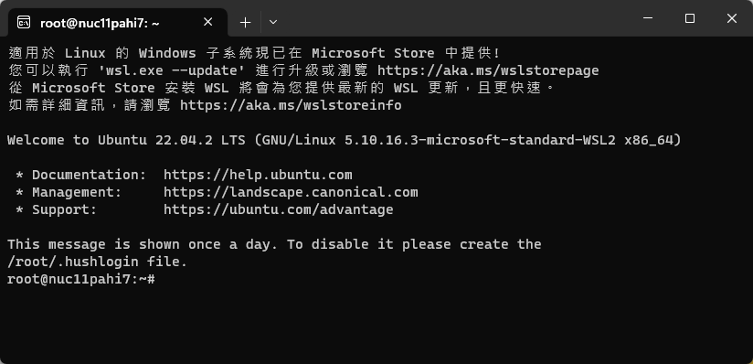
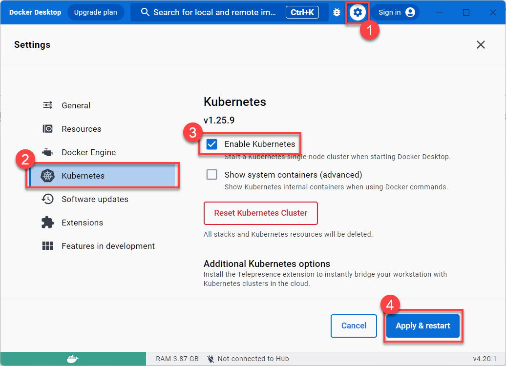

{}
在 Windows 環境中運行的 k8s 無法 scale-out，故只能用於學習和測試，不可當 production 環境來用。
{}

## 概述

欲在本機電腦上安裝 Kubernetes，有兩種選項：Minikube 和 Docker Desktop。本文介紹的方式為後者。

基本上，主要的操作都和 Docker Desktop 有關。一旦成功安裝並啟動 Docker Desktop，之後就剩下一個簡單步驟：把 Docker Desktop 選項中的 Kubernetes 核取方塊勾選起來。

以此方式運行於本機的 k8s 雖然無法像在 production 環境那樣進行 scale-out，但是主要的元件和工具都有了，包括：一個主要節點（master node）、一個工作節點（worker node），以及完整功能的命令列工具：[kubectl](https://kubernetes.io/docs/reference/kubectl/)（常見讀音為 "cube C-T-L" 或者 "koob control"）。

{}
如果需要 scale out 工作節點，可以使用 [kind](https://kind.sigs.k8s.io)（全名是 Kubernetes in Docker)。如果要安裝完整功能的 Kubernetes，則可以使用 [kubeadm](https://kubernetes.io/docs/reference/setup-tools/kubeadm/)。
{}

## 1. 安裝 Docker Desktop

下載並安裝 [Docker Desktop](https://www.docker.com/products/docker-desktop/)。我安裝的版本是 4.20.1。

安裝過程只出現一個對話窗，裡面有兩個選項。採預設選項（都勾選）並繼續安裝。
  

安裝完成後，可能會出現提示要求重新開機。

重新開機之後，如果 Docker Desktop 沒有自動執行起來，可透過 Windows 開始功能表當中的捷徑將它啟動。

第一次啟動 Docker Desktop 會看到一個視窗，裡面是使用協議，說明哪些情況需要付費使用 Docker：

點 Accept 接受來關閉此視窗。

接著如果出現問卷調查，點 Skip 跳過，之後便會啟動 Docker。

到目前為止所描述的過程，無論在我的 Windows 10 筆電還是 Windows 11 電腦上面安裝 Docker Desktop，都大致符合。不過，我在 Windows 11 上面啟動 Docker Desktop 時，還出現了一個對話窗，提示需要更新 WSL，如下圖：

{}
如果你的作業環境沒有出現上圖的提示，應該就是不用更新 wsl，可略過以下步驟，直接跳到下一節。
{}

按照對話窗的提示，此時有兩個選擇：

1. 開啟 Powershell 視窗並執行 `wsl --update` 命令。
2. 點擊對話窗中的連結，並按照該文件的指示來進行相關操作。

我選擇了第二個選項。點擊對話窗裡面的連結之後，頁面自動跳轉到微軟文件：[Manual installation steps for older versions of WSL](https://learn.microsoft.com/en-us/windows/wsl/install-manual)。該文件包含 6 個操作步驟，我直接從第 4 個步驟開始進行，直到第 6 步，依序是：

- Step 4 - Download the Linux kernel update package
- Step 5 - Set WSL 2 as your default version
- Step 6 - Install your Linux distribution of choice

接著說明安裝 Linux distribution 的相關操作。

## 2. 安裝 Linux distribution

以系統管理員身分開啟 Powershell，然後參考這份文件來執行相關指令：[Install Linux on Windows with WSL](https://learn.microsoft.com/en-us/windows/wsl/install)。以下是我的操作過程。

首先，我用 `wsl --list` 命令來確認我的 Windows 11 作業環境中並沒有安裝任何 Linux。 如下圖： 

{}
在我的 Windows 10 筆電上執行此命令時，我看到的情況和 Windows 11 不同。結果顯示有兩個 Windows 子系統 Linux，分別是「docker-desktop (預設值)」和「docker-desktop-data」。接下來的描述都是發生在我的 Windows 11 電腦上。
{}

接著用 `wsl --list --online` 查看有哪些 Linux 版本可以安裝：

然後用 `wsl --install -d Ubuntu-22.04` 來指定要安裝的 Linux 版本。或者也可以不加額外參數，只用 `wsl --install` 命令，那麼預設會安裝 Ubuntu。

安裝完成後，用 `wsl -l -v` 查看目前已安裝的 Linux 系統，以及它目前的運行狀態。

接著要做的是啟動剛才安裝好的 Linux 系統，也就是 Ubuntu，並且設定 Linux 的使用者帳號和密碼。

## 3. 設定 Linux 使用者帳號和密碼

參考這份文件來設定 Linux 系統的使用者帳號和密碼：[Set up a WSL development environment](https://learn.microsoft.com/zh-tw/windows/wsl/setup/environment)。此文件還告訴我們萬一有一天忘記自己之前設定的 Linux 使用者帳號的密碼，該如何重設密碼（至少要記住使用者帳號名稱）。

首先，從 Windows 的開始功能表找到我剛才安裝的 Ubuntu，點一下就能啟動該作業系統。

{}
或者也可以在 Powershell 視窗中輸入 `ubuntu2204` 來啟動 Ubuntu，其中的 "2204" 是作業環境中安裝的 Ubuntu 版本號碼的前四碼。
{}
    

啟動 Ubuntu 之後，應該會看到他要求你建立第一個使用者帳戶，該帳戶也將會預設的系統管理員帳戶。如下圖：

輸入使用者帳戶，接著設定其密碼。由於只是用於本機的測試與學習，所以帳戶名稱和密碼都取得很簡單好記，寫在這裡也沒關係：huanlin/MMDD。

底下是兩種可能碰到的狀況。

**狀況一**：如果不小心把這個建立預設使用者帳戶的視窗關閉了，下次再啟動 Ubuntu 時，可能會看到預設登入的使用者名稱是 root。此時可以用 `useradd` 和 `passwd` 命令來建立使用者帳號。

**狀況二**：如果 Ubuntu 啟動之後有出現訊息建議執行 `wsl --update`，如下圖，那就按照指示來更新 WSL。

最後，執行以下命令來更新和升級套件：

`sudo apt update && sudo apt upgrade`

## 4. 啟用 Kubernetes

從 Windows 開始功能表中找到 Docker Desktop 並執行，待 Docker Desktop 視窗開啟之後，於視窗右上角點一下設定按鈕，找到 Kubernetes 項目，並將它啟動。操作步驟如下圖：

等待幾分鐘，若一切順利，上圖的左下角原本只有一個綠色背景的 docker 圖案，之後會多一個 Kubernetes，滑鼠移過去便會告訴你 k8s 正在執行中。

當 Docker 正在運行時，你也可以在 Windows 桌面右下角的工具列圖示中找到 Docker 圖示，然後以滑鼠右鍵開啟選單，點選其中的 Settings，便可以進入 Docker 的設定視窗。

## 下一步

在 Docker Desktop 和 k8s 二者皆處於正常運行的狀態下，接著可以開始學習使用命令列工具 [kubectl](https://kubernetes.io/docs/reference/kubectl/)。
