# 在 Windows 11 運行 Docker 與 Kubernetes

**摘要**：在 Windows 11 上面安裝 Docker Desktop 並運行 Kubernetes 的操作步驟。

!!! note
    在 Windows 環境中運行的 k8s 無法 scale-out，故只能用於學習和測試，不可當 production 環境來用。

## 概述

欲在本機電腦上安裝 Kubernetes，有兩種選項：Minikube 和 Docker Desktop。本文介紹的方式為後者。

基本上，主要的操作都和 Docker Desktop 有關。一旦成功安裝並啟動 Docker Desktop，之後就剩下一個簡單步驟：把 Docker Desktop 選項中的 Kubernetes 核取方塊勾選起來。

以此方式運行於本機的 k8s 雖然無法像在 production 環境那樣進行 scale-out，但是主要的元件和工具都有了，包括：一個主要節點（master node）、一個工作節點（worker node），以及完整功能的命令列工具：[kubectl](https://kubernetes.io/docs/reference/kubectl/)（常見讀音為 "cube C-T-L" 或者 "koob control"）。

!!! info
    如果需要 scale out 工作節點，可以使用 [kind](https://kind.sigs.k8s.io)（全名是 Kubernetes in Docker)。如果要安裝完整功能的 Kubernetes，則可以使用 [kubeadm](https://kubernetes.io/docs/reference/setup-tools/kubeadm/)。

## 1. 安裝 Docker Desktop

下載並安裝 [Docker Desktop](https://www.docker.com/products/docker-desktop/)。我安裝的版本是 4.20.1。

安裝過程只出現一個對話窗，裡面有兩個選項。採預設選項（都勾選）並繼續安裝。
  
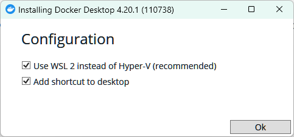

安裝完成後，可能會出現提示要求重新開機。

重新開機之後，如果 Docker Desktop 沒有自動執行起來，可透過 Windows 開始功能表當中的捷徑將它啟動。

第一次啟動 Docker Desktop 會看到一個視窗，裡面是使用協議，說明哪些情況需要付費使用 Docker：

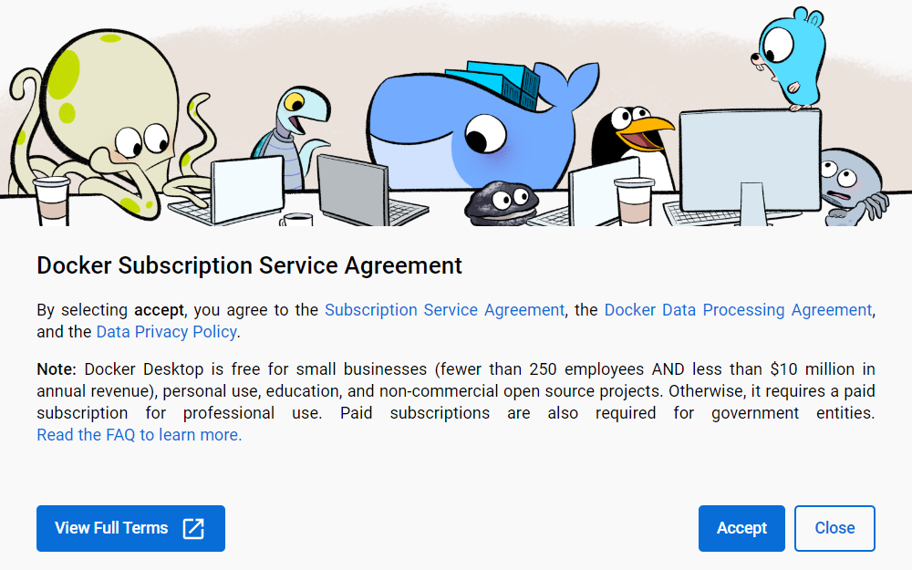

點 Accept 接受來關閉此視窗。

接著如果出現問卷調查，點 Skip 跳過，之後便會啟動 Docker。

到目前為止所描述的過程，無論在我的 Windows 10 筆電還是 Windows 11 電腦上面安裝 Docker Desktop，都大致符合。不過，我在 Windows 11 上面啟動 Docker Desktop 時，還出現了一個對話窗，提示需要更新 WSL，如下圖：

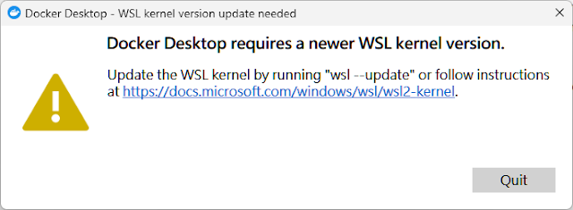

!!! note
    如果你的作業環境沒有出現上圖的提示，應該就是不用更新 wsl，可略過以下步驟，直接跳到下一節。

按照對話窗的提示，此時有兩個選擇：

1. 開啟 Powershell 視窗並執行 `wsl --update` 命令。
2. 點擊對話窗中的連結，並按照該文件的指示來進行相關操作。

我選擇了第二個選項。點擊對話窗裡面的連結之後，頁面自動跳轉到微軟文件：[Manual installation steps for older versions of WSL](https://learn.microsoft.com/en-us/windows/wsl/install-manual)。該文件包含 6 個操作步驟，我直接從第 4 個步驟開始進行，直到第 6 步，依序是：

- Step 4 - Download the Linux kernel update package
- Step 5 - Set WSL 2 as your default version
- Step 6 - Install your Linux distribution of choice

接著說明安裝 Linux distribution 的相關操作。

## 2. 安裝 Linux distribution

以系統管理員身分開啟 Powershell，然後參考這份文件來執行相關指令：[Install Linux on Windows with WSL](https://learn.microsoft.com/en-us/windows/wsl/install)。以下是我的操作過程。

首先，我用 `wsl --list` 命令來確認我的 Windows 11 作業環境中並沒有安裝任何 Linux。 如下圖： 

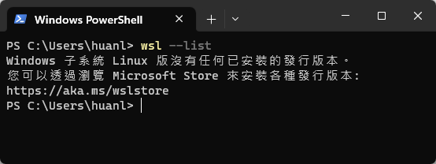

!!! note
    在我的 Windows 10 筆電上執行此命令時，我看到的情況和 Windows 11 不同。結果顯示有兩個 Windows 子系統 Linux，分別是「docker-desktop (預設值)」和「docker-desktop-data」。接下來的描述都是發生在我的 Windows 11 電腦上。

接著用 `wsl --list --online` 查看有哪些 Linux 版本可以安裝：

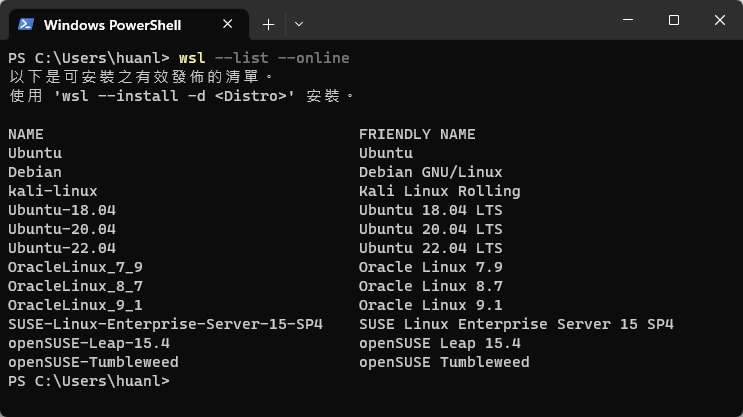

然後用 `wsl --install -d Ubuntu-22.04` 來指定要安裝的 Linux 版本。或者也可以不加額外參數，只用 `wsl --install` 命令，那麼預設會安裝 Ubuntu。

安裝完成後，用 `wsl -l -v` 查看目前已安裝的 Linux 系統，以及它目前的運行狀態。

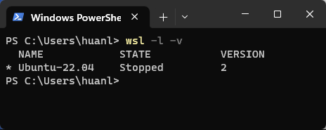

接著要做的是啟動剛才安裝好的 Linux 系統，也就是 Ubuntu，並且設定 Linux 的使用者帳號和密碼。

## 3. 設定 Linux 使用者帳號和密碼

參考這份文件來設定 Linux 系統的使用者帳號和密碼：[Set up a WSL development environment](https://learn.microsoft.com/zh-tw/windows/wsl/setup/environment)。此文件還告訴我們萬一有一天忘記自己之前設定的 Linux 使用者帳號的密碼，該如何重設密碼（至少要記住使用者帳號名稱）。

首先，從 Windows 的開始功能表找到我剛才安裝的 Ubuntu，點一下就能啟動該作業系統。

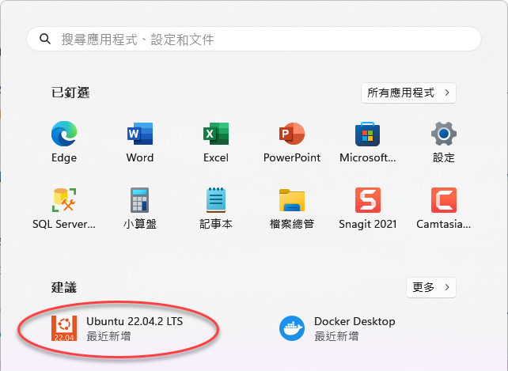

!!! note
    或者也可以在 Powershell 視窗中輸入 `ubuntu2204` 來啟動 Ubuntu，其中的 "2204" 是作業環境中安裝的 Ubuntu 版本號碼的前四碼。

啟動 Ubuntu 之後，應該會看到他要求你建立第一個使用者帳戶，該帳戶也將會預設的系統管理員帳戶。如下圖：

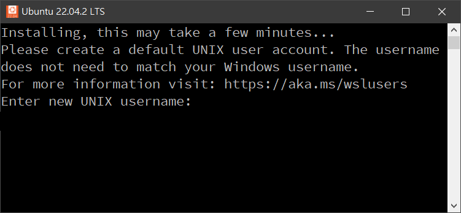

輸入使用者帳戶，接著設定其密碼。由於只是用於本機的測試與學習，所以帳戶名稱和密碼都取得很簡單好記，寫在這裡也沒關係：huanlin/MMDD。

底下是兩種可能碰到的狀況。

**狀況一**：如果不小心把這個建立預設使用者帳戶的視窗關閉了，下次再啟動 Ubuntu 時，可能會看到預設登入的使用者名稱是 root。此時可以用 `useradd` 和 `passwd` 命令來建立使用者帳號。

**狀況二**：如果 Ubuntu 啟動之後有出現訊息建議執行 `wsl --update`，如下圖，那就按照指示來更新 WSL。

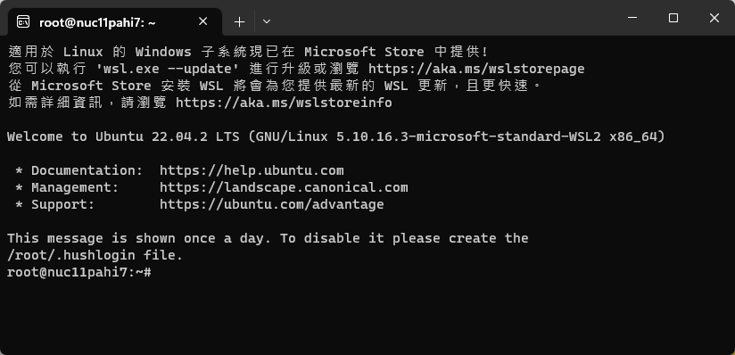

最後，執行以下命令來更新和升級套件：

`sudo apt update && sudo apt upgrade`

## 4. 啟用 Kubernetes

從 Windows 開始功能表中找到 Docker Desktop 並執行，待 Docker Desktop 視窗開啟之後，於視窗右上角點一下設定按鈕，找到 Kubernetes 項目，並將它啟動。操作步驟如下圖：

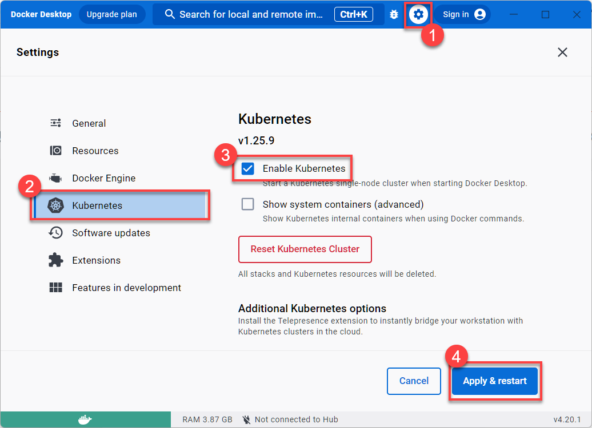

等待幾分鐘，若一切順利，上圖的左下角原本只有一個綠色背景的 docker 圖案，之後會多一個 Kubernetes，滑鼠移過去便會告訴你 k8s 正在執行中。

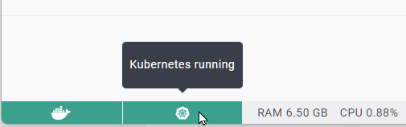

當 Docker 正在運行時，你也可以在 Windows 桌面右下角的工具列圖示中找到 Docker 圖示，然後以滑鼠右鍵開啟選單，點選其中的 Settings，便可以進入 Docker 的設定視窗。

## 下一步

在 Docker Desktop 和 k8s 二者皆處於正常運行的狀態下，接著可以開始學習使用命令列工具 [kubectl](https://kubernetes.io/docs/reference/kubectl/)。
