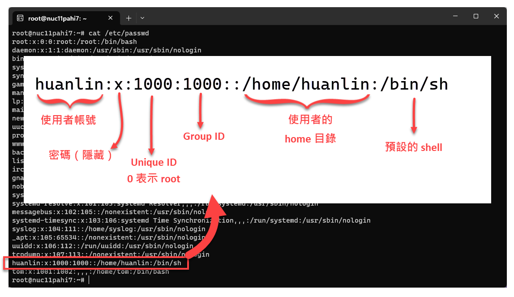

有三類使用者：

- Super user 帳號，也就是 root。
- 一般 user 帳號，即平常建立的使用者帳號。
- Service 帳號，用於執行特定服務。

{}
Running a service with a root user is very bad!
   
每個服務都應該使用它專屬的 service 帳號來執行。
{}

## 權限

權限（permissions）可賦予至使用者（user）或群組（group）。

以下命令可查看目前環境中有建立哪些使用者帳號：

`cat /etc/passwd`

執行結果與說明如下圖：



其中的 Unique ID 簡稱 UID，Group ID 則簡稱 GID。root 帳號的 UID 一定是 0，其所屬群組的 GID 也一定是 0。

## 管理使用者帳號與群組

範例 1：建立使用者時一併建立群組

```shell
sudo adduser tom
```

上面的 `adduser` 命令會建立使用者 tom，並且建立一個名為 tom 的群組。

範例 2：設定使用者 tom 的密碼

```shell
sudo passwd tom
```

範例 3：切換使用者為 tom

```shell
su - tom
```

如果要切換為 root，則是：

```shell
su -
```

範例 4：建立群組 "devops"

```shell
sudo groupadd devops
```

範例 5：顯示當前使用者所屬群組

```shell
groups
```

兩組相似的命令：

- `adduser/addgroup/deluser/delgroup`：比較 user-friendly，適用於手動下指令的互動環境。
- `useradd/groupadd/userdel/groupdel/usermod/groupmod`：下命令的時候須提供完整參數，較少互動功能，故比較適用於撰寫 script。

## 下一步

了解 [Linux 的檔案權限](file-permissions.md)。