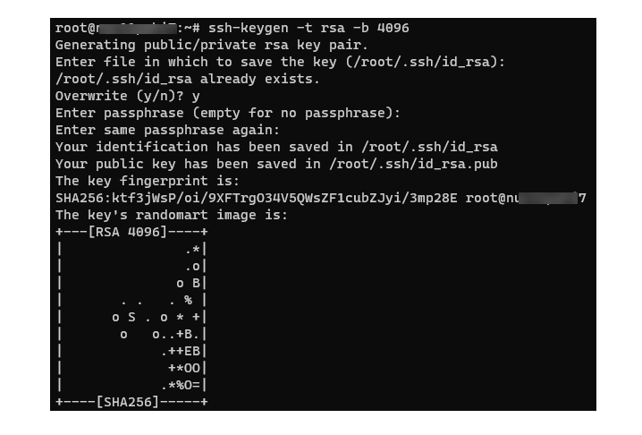
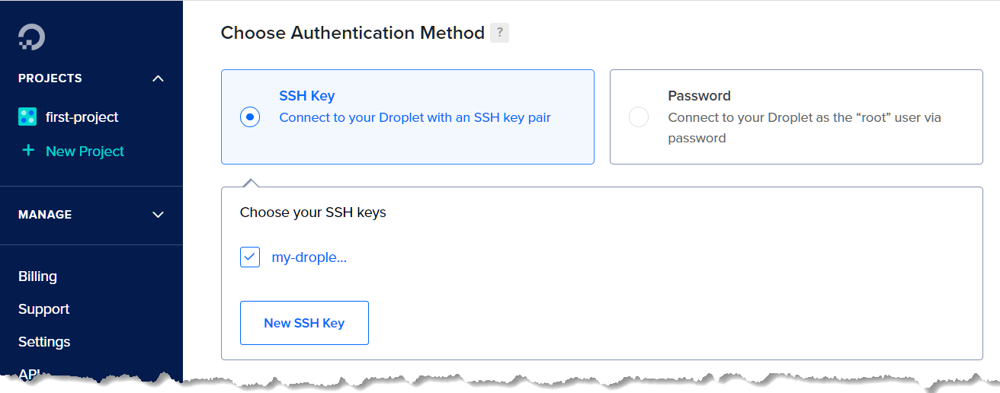
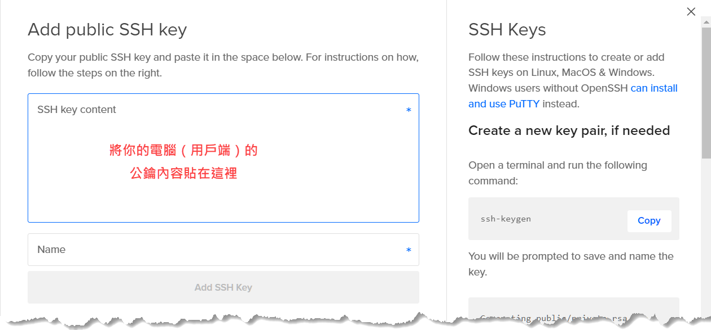
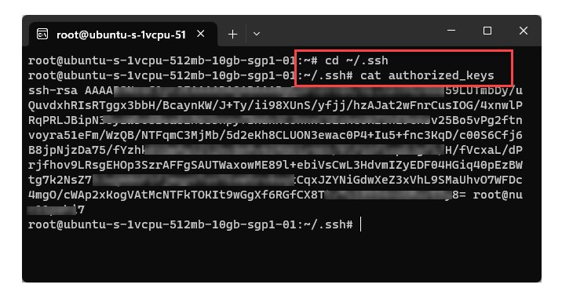
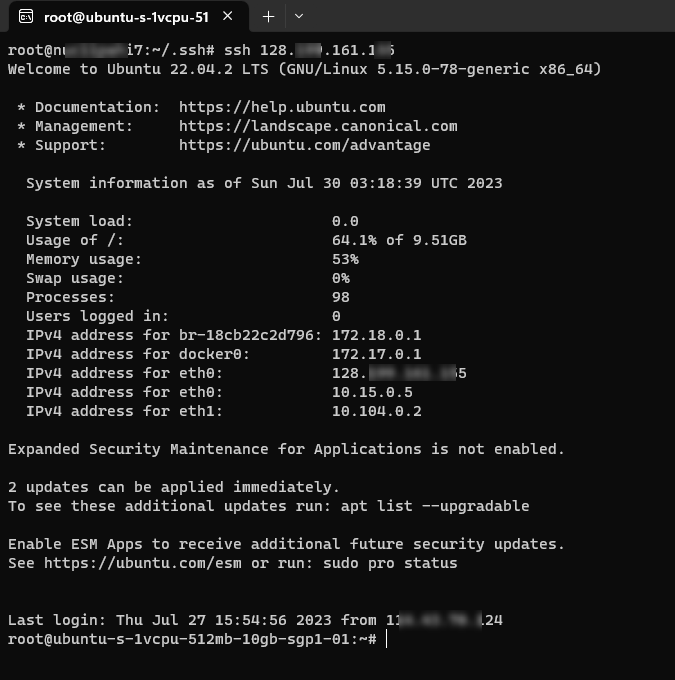

## 簡介

SSH（Secure Shell）是一種網路協定，它能讓我們在 Internet 上面進行加密連線與資料傳輸，以防止資料被他人攔截或篡改。

SSH 也是一組工具，可讓用戶端電腦和遠端伺服器之間進行安全通訊，包括身分驗證、遠端登入、複製檔案到遠端主機、在遠端主機上面安裝軟體等操作。

基於安全考量，使用者連接至遠端主機時，必須先通過身分驗證程序。SSH 支援兩種身分驗證方式：

1. 使用帳號和密碼來驗證身分。
2. 使用一組公開金鑰（public key）與私密金鑰（private key）來驗證身分。

使用公鑰／私鑰的方式來驗證身分，除了省掉輸入帳號密碼的麻煩，也可以降低密碼洩漏的風險，故實務上建議採用此驗證方式來取代帳號密碼。

> 如需了解何謂公鑰與私鑰，可搜尋關鍵字：公開金鑰密碼學、非對稱式密碼學。

接著說明如何以公鑰／私鑰、亦即 SSH Key 的方式來驗證身分。其中有些操作是以 DigitalOcean 雲端平台為例，但只要了解背後的觀念，碰到其他平台或工具的時候也都是類似用法，例如 GitLab 也可以使用 SSH Key 來驗證使用者身分。

## 使用 SSH Key 來驗證身分

要能透過 SSH 連接遠端主機，前提是用戶端電腦能夠存取目標主機的 SSH 服務，而 SSH 服務通常使用 port 22。故目標主機的防火牆必須開通 SSH 服務所使用的 port，而且用戶端電腦的 IP 在防火牆的白名單內，才會有後續的 SSH 身分驗證程序。

{}
用戶端一旦與遠端主機建立起 SSH 連線，就能存取遠端主機的全部功能，所以防火牆應該要限制只允許特定 IP 位址的電腦才能透過 SSH port 22 連接至牆內的主機。
{}

使用 SSH Key 來驗證使用者身分的主要步驟是：

1. 在遠端電腦上面建立使用者帳號，並給予適當權限。
2. 在用戶端電腦上面建立一組 SSH Key（即一對公鑰／私鑰）。
3. 把用戶端電腦上的公鑰部署至目標主機。這個部署操作通常只是簡單的複製貼上公鑰內容。
 
Linux 作業環境都有 root 帳號，故以下說明係假設你已經知道 root 帳號的密碼，接著要從步驟 2 開始進行，也就是建立 SSH Key，然後把公鑰部署至目標主機。

### 在用戶端電腦建立 SSH Key

首先，在用戶端電腦（也就是你的電腦）開啟終端機視窗，使用以下命令來查看電腦上面是否已經有 SSH keys：

```bash
ls ~/.ssh/
```

如果有看到 `id_rsa` 和 `id_rsa.pub`，即表示這台電腦上面已經有建立 SSH 密鑰。這兩個檔案是成對的，`id_rsa` 是私鑰（private key），`id_rsa_pub` 是公鑰（public key）。

如果沒有任何密鑰檔案，或者想要建立另一組新的密鑰，可使用以下命令：

```bash
ssh-keygen -t rsa -b 4096
```

其中的 `-t rsa` 的意思是以 RSA 演算法來建立密鑰，此參數亦可省略，因為預設的密鑰類型就是 RSA。`-b 4096` 則指定 RSA 密鑰位元長度為安全性較高的 4096 bits。

執行上述命令時，會先出現以下提示訊息，讓你為新建立的私鑰檔案命名：

```txt
Generating public/private rsa key pair.
Enter file in which to save the key (/root/.ssh/id_rsa):
```

如果直接按 Enter，就會採用預設的 `id_rsa` 作為私鑰的檔案名稱。如果檔案已經存在，則會詢問是否要覆蓋既有檔案：回答 `n` 會終止命令，回答 `y` 則會繼續詢問是否要為私鑰設置密碼（passphrase）來替私鑰增加一層防護，防止他人任意使用這個私鑰。執行過程如下圖：



新建立的密鑰檔案會存放在 `~/.ssh/` 目錄下。私鑰 `id_rsa` 必須妥善保存，避免被他人取得，公鑰 `id_rsa.pub` 則可以公開。

如果在執行 ssh-keygen 的過程中有替私鑰設置 passphrase，那麼你就得記住這個密碼，因為將來需要使用密鑰時，就必須輸入這個密碼。

### Step 2：把公鑰放在目標環境

以雲端平台 DigitalOcean 為例，假設我在該平台上面建立了一個虛擬機器（該平台稱為 Droplet，這裡簡稱 VM），並選擇 Ubuntu 為作業系統。

在 DigitalOcean 平台上面建立 Ubuntu VM 的過程中，除了設定 root 帳號的密碼，還有一個步驟是讓我們選擇將來遠端登入時，欲採用何種身分驗證方法：使用 SSH Key 或者 Password，如下圖。



如果選擇 Password，就是每次身分驗證的時候必須輸入使用者帳號密碼。若選擇 SSH Key 來驗證身分，那麼只要在此步驟設置好公鑰，未來需要身分驗證時，就會自動比對密鑰來完成身分驗證。點擊圖中的 `New SSH Key` 按鈕，便可在接下來的對話窗中貼上先前產生的公鑰內容。參考下圖：



這個設置公鑰的步驟會把我們貼上的公鑰內容儲存至 root 帳號的 `~/.ssh/authorized_keys` 檔案中，這表示我們也可以手動將公鑰內容儲存至`authorized_keys` 檔案來達到相同目的。你可以用 `cat` 命令來查看這個檔案的內容，如下圖：



在目標環境設置好公鑰之後，只要知道欲連接之 VM 的對外 IP 位址，而且防火牆相關設定已經開通（例如 incoming SSH port 22），我們就可以在自己的電腦上面使用 SSH 來登入那台 VM，如下圖：



如圖中展示的，過程中只有輸入 `ssh` 和目標主機的 IP 位址，就成功登入遠端主機了。身分驗證的程序是在背後自動完成：拿本機電腦上的私鑰（id_rsa）去跟目標主機上的公鑰內容配對，如果確認屬於同一組密鑰，便通過驗證。

### Step 3：為個別使用者設置公鑰

上一個步驟所展示的，是替目標主機的 root 帳號設置公鑰。然而實務上通常不建議使用 root，而會建立個別使用者帳號來執行特定操作。

前面也有提到，我們可以手動將公鑰內容儲存至遠端主機的使用者帳號的 `~/.ssh/authorized_keys` 檔案來達到設置公鑰的目的。只要知道這個關鍵，剩下的就好辦了。

接著示範如何在目標主機上面建立一個使用者帳號，並且為該帳號提供我們的本機電腦（用戶端電腦）的公鑰。

首先，在目標主機上面建立使用者帳號 `michael`，並加入 super user 群組。命令如下：

```bash
adduser michael
usermod -aG sudo michael
```

使用 `pwd` 命令確認目前所在目錄為 `/home/michael`，也就是 michael 帳號的 home 目錄。接著在此 home 目錄下建立隱藏資料夾 `.ssh`：

```bash
mkdir .ssh
```

然後使用 vim 編輯器在 .ssh 目錄下建立 `authorized_keys` 檔案：

```bash
sudo vim .ssh/authorized_keys
```

接著在 vim 編輯視窗中貼上我們的本機電腦（用戶端電腦）的公鑰內容，存檔，然後退出 vim。

現在，回到我的電腦，我就可以使用 michael 這個帳號來登入那台主機，例如：

```
ssh michael@128.199.168.168
```

{}
曾經連線過的主機 IP 位址會保存於 `~/.ssh/know_hosts` 檔案。
{}

## 建立多組 SSH Keys

欲建立多組 SSH Keys，可在執行 ssh-keygen 命令時輸入自訂檔名，例如 `id_rsa2`，這會產生兩個檔案：`id_rsa2` 和 `id_rsa2.pub`。

使用 SSH 連線至遠端主機時，則必須使用 `-i` 參數來明確指定使用哪一組 key。例如：

```bash
ssh -i ~/.ssh/id_rsa2 michael@63.250.123.123
```

## Secured Copy

`scp` 命令會透過 SSH 通道將本機檔案複製到遠端電腦。範例：

```bash
scp test.sh michael@63.250.123.123:/michael/temp
```

此範例會使用預設的私密金鑰，也就是 `~/.ssh/id_rsa`。如果要指定使用其他私鑰，則則必須使用 `-i` 參數。例如：

```bash
scp -i ~/.ssh/my_id_rsa test.txt .....
```

## 重點回顧

- SSH 服務通常使用 port 22。
- SSH 密鑰的存放位置是**用戶端電腦**的使用者帳戶的 `~/.ssh/` 目錄。
- 用戶端電腦的公鑰必須放到**目標主機**的使用者帳戶的 `~/.ssh/authorized_keys` 檔案中，以便在驗證身分時，跟用戶端電腦上的私鑰進行比對。

