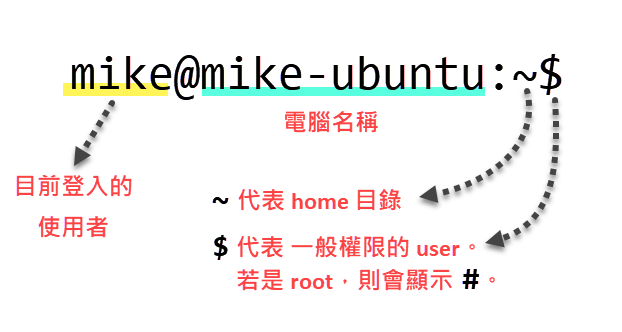

CLI：Command Line Interface，也就是命令列操作介面。

## 命令提示字串

命令提示字串當中包含了一些重要資訊，如下圖：



- 最前面的是目前登入的使用者帳號，接著 `@` 符號，然後是電腦名稱。這可以讓你隨時清楚看到目前是以哪個使用者的身分在操作哪一台電腦。
- 水波紋符號 `~` 代表使用者的 home 目錄。
- 錢字符號 `$` 代表一般權限的使用者。如果是 root，則會顯示 `#`。

## 終端機視窗裡的常用按鍵

| 按鍵 | 用途說明 |
|:-----|:-------|
| Ctrl+Shift+C | 複製選取的文字到剪貼簿。 |
| Ctrl+Shift+V | 貼上剪貼簿中的文字。 |
| Ctrl+R | 搜尋歷史命令。|

## 常用命令

| 命令 | 用途說明 |
|:-----|:-------|
| `ls`  | 列出當前所在目錄下的檔案。|
| `ls -a` | 參數：all，列出全部檔案，包括隱藏檔。|
| `ls -a` | 參數：all，列出全部檔案，包括隱藏檔。|
| `cat `*`[filename]`* | 顯示檔案內容。|
| `cat `*`[filename]`* `\| more` | 使用管線 `more` 來逐頁顯示檔案內容。|
| `cat /etc/os-release` | 顯示 OS 版本。 |
| `uname -a` | 顯示系統資訊，包括：核心版號、主機名、CPU 架構等等。註：命令名稱的第一個字母 u 代表 Unix。|
| `lscpu` | 列出詳細 CPU 資訊。|
| `lsmem` | 列出詳細記憶體資訊。|
| `su - `*`<username>`* | 切換使用者帳號。 |
| `history` | 列出之前用過的命令。 |
| `clear` | 清除終端機視窗的文字。|

## 操作檔案目錄的常用命令

| 命令 | 用途說明 |
|:-----|:-------|
| `pwd` | 顯示當前路徑。|
| `cd` | 切換至指定路徑。|
| `mkdir` | 建立資料夾。|
| `rm` | 刪除檔案。|
| `cp` | 拷貝檔案。|
| `mv` | 搬移檔案。|
| `touch` | 建立一個空的檔案。|
| `chmod` | 變更檔案的操作權限。 |

## 網路相關命令

有些命令需要安裝 `net-tools`，安裝的命令是：

```
sudo apt install net-tools
```

| 命令 | 用途說明 |
|:-----|:-------|
| `ifconfig` | 查看網路介面卡資訊、設定 IP 位址、遮罩等等。 |
| `netstat` | 顯示 active 網際網路連線。|
| `ps aux` | 列出所有執行中的 processes。|
| `nslookup` | 可查詢任何網域名稱的 IP 位址，或者從 IP 位址反查網域名稱。|
| `ping` | 檢測當前電腦與指定設備之間的網路是否暢通。|

## 其他常用命令

| 命令 | 用途說明 |
|:-----|:-------|
| `reboot` | 重開機。|
| `shutdown -h now` | 關機。|
| `passwd` | 變更使用者密碼。|
| `sudo passwd `*`<username>`* | 以 root 權限變更特定使用者的密碼。|

## 下一步

了解 [Linux 的套件管理員](package-manager.md)。