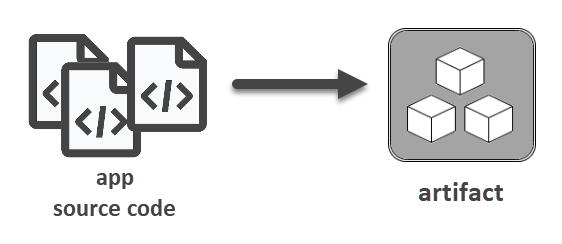
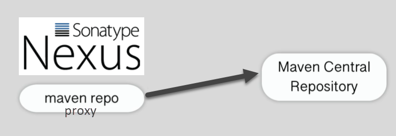
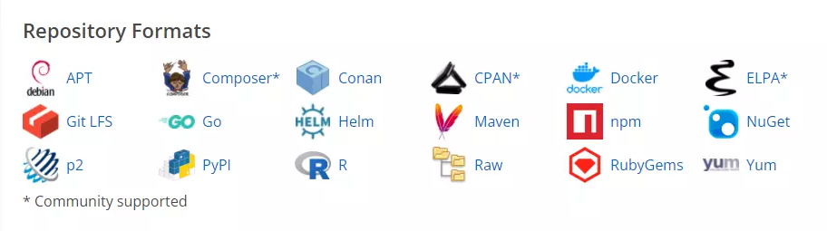
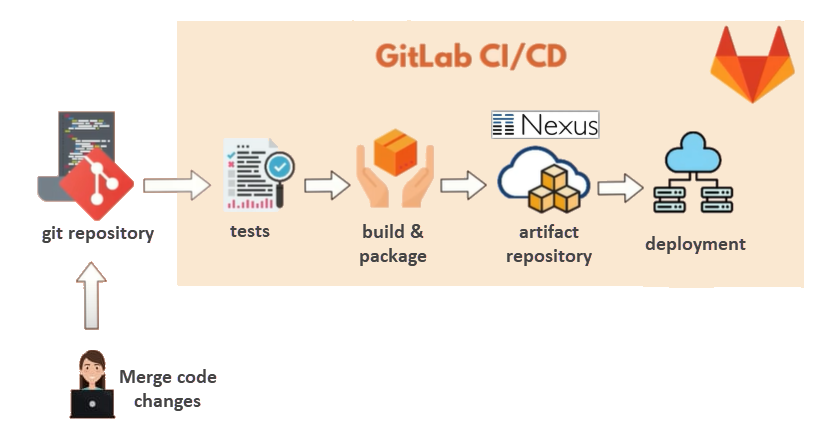

## Artifact Repository

所謂的 artifact，指的是程式原始碼透過一些開發工具來執行建置（build）或打包（package）所產生的單一檔案，主要目的是為了方便部署以及與他人共享。

依使用的工具而定，artifact 的檔案格式有可能是 JAR、WAR、 ZIP、TAR……等等，而用來存放這些 artifacts 的地方就稱為 artifact repository（有時會簡稱 repo）。不同格式的 artifact 會保存於不同的 repo。

比如說，公司裡面有三個開發團隊，分別使用了 Java、Python、和 .NET 來開發應用程式，而這些開發工具都會產生不同類型的 artifacts。因此，我們會需要多種 repo 來儲存那些 artifacts。基本上，有幾種 artifact 格式就需要幾個 repo，因為一個 artifact repo 裡面只能儲存一種 artifact 格式。 

然而，artifact 類型眾多，除了剛才提到的幾種格式，開發團隊也可能需要同時處理 Docker images、Go、NuGet、Ruby……等工具所產生的 artifacts（函式庫或套件），如果每一種 artifacts 都得各自分開管理，未免太辛苦了。那麼，是否有可能集中在一個地方來統一管理所有格式的 artifact repositories 呢？這便是 artifact repository manager 要解決的問題。

## Artifact Repository Manager

Artifact repository manager（以下簡稱 repo manager）可以讓我們儲存或上傳不同類型的 artifacts，之後也可以下載它們。將來如果需要用到某些 artifacts，例如把它們部署至某台主機，便可透過 repo manager 把需要的 artifacts 取出來。此外，公司內部的開發團隊也能透過這個集中的 repo manager 來共享各專案的 artifacts。換言之，repo manager 就等於是所有 artifacts 的集散地。

目前比較受歡迎的 artifact repository manager 產品是 Sonatype Nexus 和 JFrog Artifactory。這裡要進一步介紹的是 Nexus。

## 認識 Nexus 

了解前面介紹的基礎觀念之後，我們知道 Nexus 至少具備下列功能：

- 支援多種 artifacts：能讓使用者上傳並儲存各類開發工具所建立的 artifacts。
- 使用者能夠從 Nexus 下載他們需要的 artifacts。
- 能夠集中管理軟體專案的 artifacts。

也就是說，我們可以在公司內部使用 Nexus 來保存和管理所有專案的 artifacts，以便讓多個開發與維運團隊共用它們。

除了在公司內部私用，也有一些 repo manager 是公開的，可供任何人取用 ，例如 Maven Central Repository。Java 開發人員可以將自己開發的函式庫上傳至 Maven Central Repository 供他人取用，亦可從上面抓取他們需要的函式庫。又如 NPM、NuGet  等等，也都有公開的 repository。

在公司內部使用 Nexus，即表示會自行建立一些私有的 repositories，例如專供內部使用的 Maven repo 或 NPM repo 等等。至於需要使用第三方開源套件的場合，Nexus 亦提供了 **repository proxy** 的機制來讓公司內部的開發團隊也能以同樣的方式存取公開的 repositories。如此一來，Nexus 便成為名副其實的中央儲存庫，無論是內部自行開發的私有 repo，還是存放於外部的公開 repo，全都是透過 Nexus 取得。

## Nexus 的其他功能

除了前面介紹的基礎功能，Nexus 還提供了以下功能：

- 能夠和 LDAP 整合，以便管理使用者的權限。
- 提供 REST API，以便與其他工具整合。此功能非常重要，因為在 CI/CD（持續整合／持續部署）的流程中，我們不希望以人工手動的方式去下載相關套件。舉例來說，當 Jenkins 產生建置結果之後，必須自動將產出的檔案推送至 Nexus；而在後續進行部署工作時，則需要從 Nexus 拉取相關檔案，並將它們部署至特定主機。這些推送和拉取檔案的操作，都可以透過 Nexus 提供的 API 來達成，無需人工介入。換言之，Nexus 也是 CI/CD 流程中不可或缺的重要環節。
- 支援 Staging 和 Tagging，主要的用途是讓元件進入正式的 repository 之前，先進入到一個 staging repository 來進行測試；等到通過測試，確認沒問題了，才放行進入正式的 repository。在此流程中，Nexus 會替一群相關的元件打上標記（例如 uat、prod），以便識別一群元件目前是處於 staging 測試階段還是已經準備好正式發布。
- 可使用 User Token 來驗證使用者身分，而不需要一組使用者名稱和密碼。以帳號密碼來驗證使用者身分的缺點是，有時難免會在某個地方以明碼來保存帳密，導致資安漏洞。
- 可設定清理規則，以便自動刪除一些無用或者過時的檔案。基本上，每次有新的變動推送至 程式碼儲存庫的主分支，就會觸發一次建置流程。故每天可能會產生非常大量的檔案，其中可能有許多檔案都是可以拋棄的，卻仍占用著磁碟空間。有了清理規則，我們可以只保留必要的、或最近建置成功的 artifacts，以便更有效率地運用磁碟空間。
- 搜尋特定版本的 artifact。
- 備份與還原。

其中有些是 Nexus 付費版本（Nexus Pro）才有的功能，例如 User Token、Staging 和 Tagging。此外，Nexus 付費版所支援的 repository 格式也比較多，但一般來說，免費版的 Nexus 支援的格式已經相當足夠（參考下圖）。

如果需要進一步了解 Nexus 不同版本之間的功能差異，可參考以下官方文件：

- [Repository Manager Pro Features](https://help.sonatype.com/repomanager3/product-information/repository-manager-pro-features)
- [Repository Manager Feature Matrix](https://help.sonatype.com/repomanager3/product-information/repository-manager-feature-matrix)

最後以 GitLab CI/CD 的流程圖作為本文的結尾。從圖中可以看出 Nexus 作為一個 artifact repository 是位於整個 CI/CD 流程中的哪個位置。

## 參考資料

- [Nexus 官方文件：Staging](https://help.sonatype.com/repomanager3/nexus-repository-administration/staging)
- [Repository Manager Feature Matrix](https://help.sonatype.com/repomanager3/product-information/repository-manager-feature-matrix)
- [DevOps Bootcamp by Nana](https://www.digistore24.com/redir/350808/user24310372/CAMPAIGNKEY)