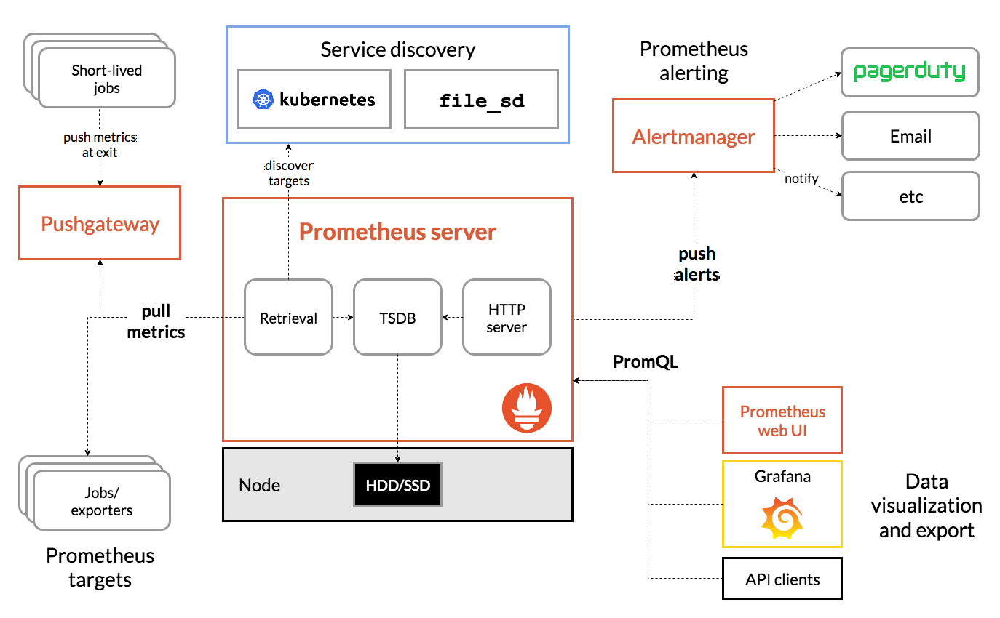
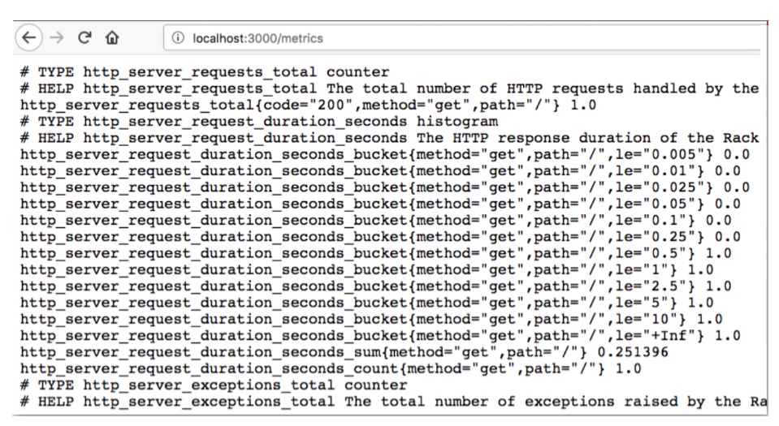
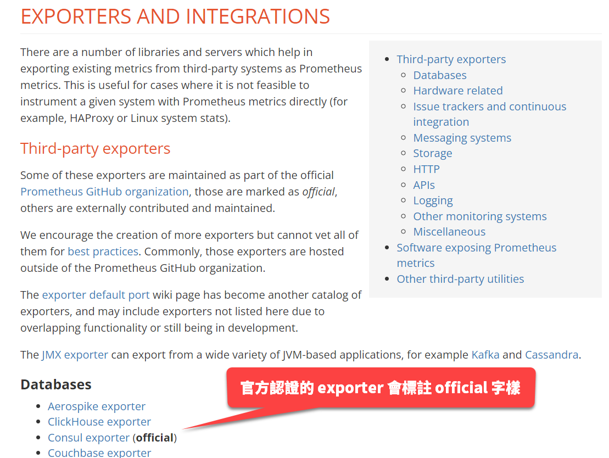

## What

Prometheus 是個開放原始碼專案，其主要用途是監測高度動態的容器環境，像是 Kubernetes、Docker、Swarm 等等。不過它也可以用在傳統的、非容器的作業環境，例如在伺服器上面直接安裝和運行應用程式。過去幾年，Prometheus 已經成為容器與微服務領域中的主流監測工具。

## Why

現代 DevOps 愈趨複雜，人工作業的方式已經難以負荷，自動化的重要性也就與日俱增。實務上，機房裡面通常有多台伺服器，各機器上面運行許多容器應用程式，數量可能上百個，甚至更多，而應用程式之間會彼此溝通來完成特定工作，故如何確保它們始終穩定運行，服務永不中斷，是蠻大的挑戰。想像在更大型的跨國企業中，機房遍布全球各地，而任何一台伺服器的服務突然中斷，都有可能引發其他伺服器一連串的錯誤或服務中止，例如應用程式回應速度異常緩慢、出現錯誤訊息、記憶體或磁碟空間不足……等等。那麼，IT 維運人員要如何才能隨時掌握各地伺服器的狀況，以便盡快解決問題？以及，一旦出現連鎖反應，導致許多應用程式發生錯誤，IT 維運人員又要如何盡快找出問題根源？有時候，光是找到問題根源就需要耗費大量的人力與時間。

舉個例子，假設一台伺服器的記憶體耗盡，導致運行於該機器上的某個容器停止運行，而該容器原本是負責執行某個 Kubernetes 叢集中的的兩個資料庫 Pods 的資料同步作業，因而導致資料庫同步失敗。接著，另一台伺服器上面的身分驗證服務也無法正常運作了，因為它需要存取剛才提到的資料庫。於是，使用者在登入應用程式時，便看到登入失敗的錯誤訊息——不是因為帳號密碼錯誤，而是源於更深層的問題。為了找出問題根源，工程師通常得從使用者看到的錯誤訊息著手，逐一往上游回溯，從各個環節的 log 當中尋找線索。

Prometheus 的功用就在於持續監控所有服務的狀態，並在偵測到問題的時候發出警告，讓 IT 工程師能夠及時知道系統出了什麼狀況。Prometheus 也能發現潛在問題，起到預警作用，例如持續偵測所有伺服器的記憶體用量以及可用的磁碟空間，當記憶體或磁碟用量達到某個預先設定的警戒線，便發出警示。

再舉一個例子：某個應用程式因為發生非預期的錯誤，導致應用程式持續不斷地輸出 logs，並產生大量的磁碟與網路 I/O，因而拖慢其他伺服器的應用程式與服務的回應速度。如果有個工具在背後持續監視網路流量，並顯示網路流量衝高的元凶，便有機會防患於未然，或者至少在問題發生的時候盡快解決。

Prometheus 提供的自動監控與警示功能便是為了解決上述問題。

## How

Prometheus 的架構中，負責執行監試工作的主要元件叫做 Prometheus Server，它包含三個元件：

- Time Series Database（TSDB）：時間序列資料庫，即按時間順序存放的監測數據（metrics）。
- Data Retrieval Worker：從各處蒐集／拉取數據，然後存入資料庫。
- Web Server：提供了 Web API，可用來查詢資料庫中的監測數據，並可搭配其他視覺化工具來呈現這些數據，例如 Prometheus Web UI 或 Grafana。

按時間順序存放的監測數據至關重要，因為我們能夠藉由觀察這些資料來找出特定時間範圍內出現的可疑狀況，例如 web 應用程式的 HTTP 請求數量突然暴增。此外，查詢監測數據時，是採用一種稱為 PromQL 的查詢語言。

底下是摘自[官方網站的 Prometheus 架構圖](https://prometheus.io/docs/introduction/overview/)，可大致看出三個主要元件以及其他元件的互動關係，包括 Pushgateway、Alertmanager、和 Prometheus Web UI。



由上圖可知，Prometheus 在蒐集數據時，除了直接從各種 Targets 拉取數據，也可以透過一個中間的 Pushgateway 來獲取某些短期工作所產生的數據。Retrivial 元件會將拉回的監測數據儲存至 TSDB，以便其他前端工具（Prometheus Web UI、Grafana 等等）透過 PromQL 來查詢 TSDB 中的數據。

{}
雖然 Prometheus 獲取監測數據的方式有拉取和推送（透過 Pushgateway）兩種方式，但主要的方式為拉取，而推送的方式應該只用於特定短時間執行的工作（例如清理老舊檔案）。有些雲端監測服務是採用推送機制，例如 Amazon Cloud Watch、New Relic 等等。
{}

### Target

Prometheus 能夠監測的東西很多，可能是一整台 Linux 或 Windows 伺服器，或者 Apache 伺服器、某個應用程式或服務、資料庫……等等。這些由 Prometheus 監測的對象叫做 Target。

每個 Target 都有各自的一些監測項目（units）。如果 Target 是 Linux 伺服器，那麼監測項目可能有 CPU 使用率、記憶體和磁碟空間使用率等等。如果 Target 是 web 應用程式，則監測項目可能有請求數量、各請求的持續時間、程式發出的錯誤（exception）數量等等。

### Metrics

從各個 Targets 蒐集來的監測數據，稱之為 metrics。Prometheus 在儲存 metrics 的時候，採用了便於人眼閱讀的格式，如下圖：



每一筆數據有兩個屬性：

- HELP：描述這筆數據是什麼。
- TYPE：數據類型。

數據類型有三種：

- Counter：某事件發生的次數。例如應用程式的 exception 數量和 HTTP 請求數量都屬於此類。
- Gauge：在某個時間點的數值，例如當下的 CPU 使用率。
- Histogram：用來表示「程度」，像是某事件持續了多久，或某數據有多大。例如某次 HTTP 回應的時間、HTTP 請求的大小等等。

然而，這裡有個問題：我們有不同 OS 伺服器，還有各式各樣的基礎設施、應用程式與服務等等，欲監測的數據來源何其多，Prometheus 怎麼有辦法獲取每一種數據呢？

Prometheus 是透過所謂的 exporters 來作為數據蒐集／交換的機制。

### Exporters

顧名思義，exporter 的用途就是匯出資料給 Prometheus。不難想像，所有的 exporters 必然要遵循一種固定的規範與格式，Prometheus 才有辦法解讀它們，並將那些數據存入 TSDB。

Prometheus 的 Data Retrieval Worker 是透過 HTTP 端點來向各個 Targets 拉取監測數據（metrics）。此機制有兩項要件：

- HTTP 端點的 URL 必須以 `/metrics`` 結尾，例如：`my-host-name/metrics`。
- HTTP 回應的內容必須是 Prometheus 能夠解讀的 metrics 格式（稍早提過）。

然而，很多應用程式並沒有提供 `/metrics` 端點，所以這個部分就得倚賴各種 exporters 來填補空缺，以滿足上述條件。也就是說，exporter 會負責向 Target 獲取監測數據，並將這些數據轉換成 Prometheus 能夠解讀的格式，並提供 `/metrics` HTTP 端點來讓 Prometheus 拉取數據。

官方網站上面有一份 exporters 清單，方便我們尋找並下載現成的 exporter 來使用，參考下圖。



許多 exporters 是由社群貢獻，其中有標示 `official` 字樣的是 Prometheus 官方驗證過，相對安全可靠。比如說，如果要監測 Linux 伺服器的相關數據，可以從 Hardware related 分類清單底下找到「Node/system metrics exporter (official)」，下載並執行，即可運行背景服務來提供 HTTP 端點（閱讀該 exporter 的說明文件以得知具體的端點位址與埠號等資訊）。

!!!note
    有些 exporter 還有提供 Docker image，例如 mysqld_exporter，我們可以把它跟 MySQL 一同部署在 Kubernetes 叢集中的同一個 Pod。

### 與應用程式整合

如果自行開發的應用程式需要納入 Prometheus 監測，那肯定沒有現成的 exporter 可用。對此需求，Prometheus 亦提供了用戶端程式庫來讓開發人員為應用程式加入 `/metrics` 端點。從官方網站上面可以找到目前可用的各種程式語言的[用戶端程式庫](https://prometheus.io/docs/instrumenting/clientlibs/)，例如 Go、Python、Java 等等。

### Prometheus 組態檔

Prometheus 是透過一個名為 prometheus.yml 的組態檔來控制何時、以及拉取什麼數據。底下是一個簡單範例：

```yaml title="prometheus.yml" linenums="1" hl_lines="2 8 13"
# 全域設定
global:
  scrape_interval: 15s # 每 15 秒抓一次數據。預設為 1 分鐘。
  evaluation_interval: 15s # 每 15 秒評估一次規則。預設為 1 分鐘。
  # scrape_timeout 採用預設值：10 秒。

# 指定規則檔案。定期評估規則的時間是由上方 global 區塊設定。
rule_files:
  # - "first_rules.yml"
  # - "second_rules.yml"

# 指定欲監測的目標
scrape_configs:  
  - job_name: "prometheus"

    # metrics_path 預設為 '/metrics'
    # 協定預設為 'http'.
    static_configs:
      - targets: ["localhost:9090"]
```

- `global` 區塊是全域設定，可在此設定抓取數據的間隔、逾時時間，以及多久評估一次規則（由稍後的規則檔案來設定）。
- `rule_files` 區塊用來提供規則檔案，每一個規則檔案裡面定義了抓取數據的規則，例如 CPU 使用率達到多少 % 的時候必須發出警示。
- `scrape_config` 區塊是用來指定欲監測的 Targets，其中的 `job_name` 屬性代表工作名稱。


此範例只定義了一項數據蒐集工作，那就是蒐集 Prometheus 本身的數據。由上述組態檔亦可得知 Prometheus 本身提供的監測端點為 `http://localhost:9000/metrics`。

`scrape_configs` 區塊可以加入其他想要監測的目標，並且在個別目標的設定中覆蓋 `global` 區塊的全域設定。

範例：

```yaml linenums="1" hl_lines="13-17"
global:
  scrape_interval: 15s 
  evaluation_interval: 15s 

rule_files:
  # - "first_rules.yml"
  # - "second_rules.yml"

scrape_configs:  
  - job_name: "prometheus"
    static_configs:
      - targets: ["localhost:9090"]
  - job_name: node_exporter      
    scrape_interval: 1m 
    evaluation_interval: 1m 
    static_configs:
      - targets: ["localhost:9100"]
```

那麼，Prometheus 又是如何根據 `rule-file` 當中定義的規則來觸發警示？那些警示又是由誰來接收呢？這就要進一步介紹前面架構圖中出現過的元件：Alertmanager。

### Alertmanager

Alertmanager 元件（或稱之為警示管理員）的責任是透過多種管道發出警示，所謂的管道可能是 email、Slack，或其他能夠接收通知的用戶端程式。

Prometheus 會根據組態檔案中的 `rule_files` 所提供的規則來研判目前監測的 Targets 狀態是否符合規則所定義的條件。一旦符合條件，就會發出警示給預先設定的管道。

底下是定義警示規則的範例：

```yaml linenums="1"
groups:
- name: example
  rules:
  - alert: HighRequestLatency
    expr: job:request_latency_seconds:mean5m{job="myjob"} > 0.5
    for: 10m
    labels:
      severity: page
    annotations:
      summary: High request latency
```

每一條警示規則是由五個部分所組成：

- `alert`：指定其名稱。
- `expr`：觸發條件。語法是採用 PromQL 查詢語言。
- `for`：持續時間，亦即某狀態必須持續超過此屬性所指定的時間才會觸發警示。
- `labels`：給警示套用一個或多個標籤，以便用來識別、分類，或用於篩選特定條件。
- `annotations`：提供警示的詳細說明。

詳細語法可參考官方文件：[ALERTING RULES](https://prometheus.io/docs/prometheus/latest/configuration/alerting_rules/)。

## 結語

Prometheus 的目的是為了持續監測 IT 基礎設施與應用程式，以便及早發現和處理故障與效能問題，故 Prometheus 本身的設計也強調穩定、可靠。要是 Prometheus 經常故障，便失去它存在的意義了。此外，每一個 Prometheus 伺服器都是可以單獨運行的完整個體，亦即它不需要依賴其他額外的設備或服務（例如網路磁碟或其他資料庫伺服器），故其安裝步驟相當簡單。

雖然安裝與運行一台 Prometheus 伺服器並不困難，但是在延展性（scalability）方面則略顯不足。比如說，在同時運行數百台、甚至上千台伺服器的環境中，我們可能會想要建立許多 Prometheus 伺服器來蒐集數據，但如此一來，個別伺服器蒐集到的數據是存放在各自的時間序列資料庫中，難以統整。像這種大規模監控的需求，官方網站提供的解決方案是 Prometheus Federation，其作法是讓某一台 Prometheus 伺服器從其他 Prometheus 伺服器抓取監控數據。相關細節可參考[官方文件](https://prometheus.io/docs/prometheus/latest/federation/)的說明。
