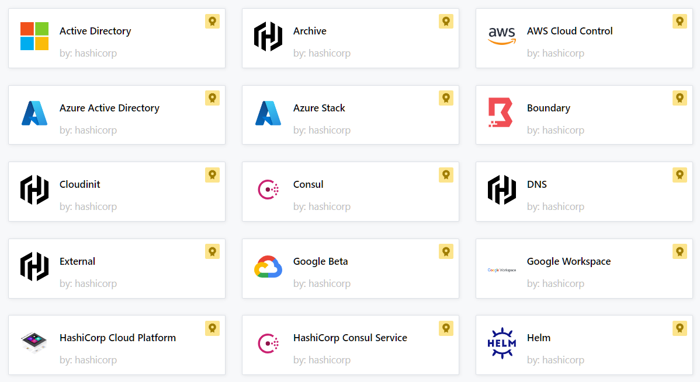
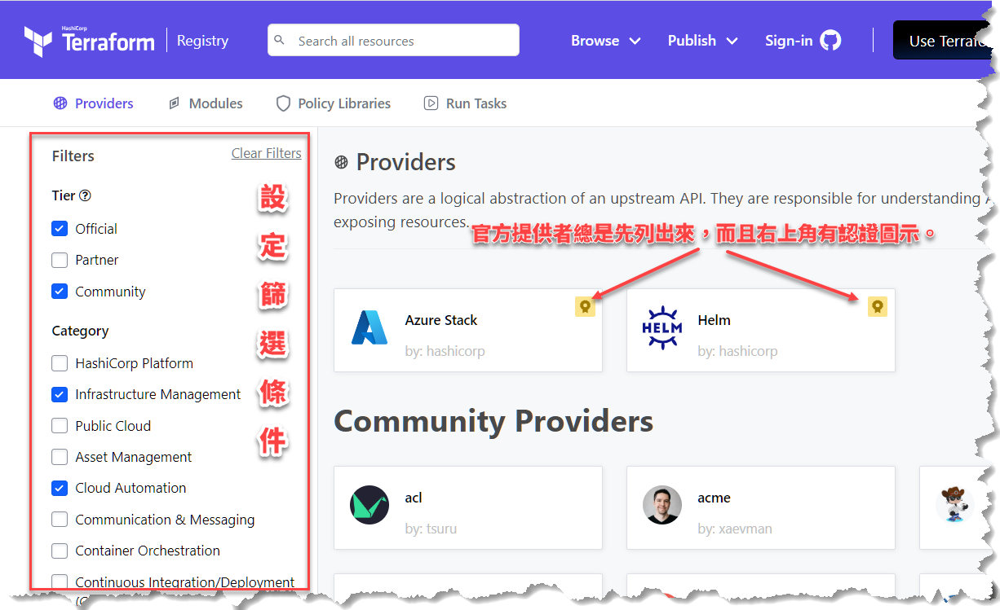
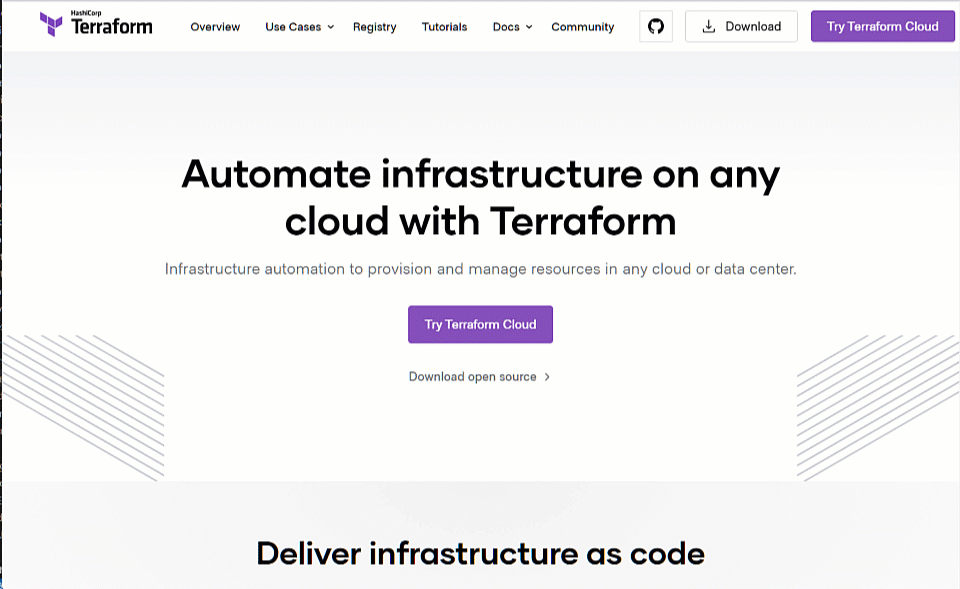
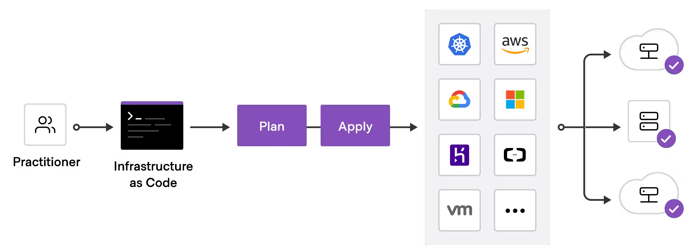

# Terraform 簡介

**摘要：**簡單介紹 Terraform 在布建基礎設施方面的功能、Terraform 的運作方式、組態檔，以及幾個重要的 Terraform 命令。

（預估閱讀時間：10 分鐘）

## 什麼是 Terraform？

Terraform 是：

- 開源工具。
- 可自動布建基礎設施、軟體平台，以及運行於該平台之上的服務。
- 可實現「基礎設施即代碼」（Infrastructure as Code，簡稱 IaC），亦即以宣告的方式（declarative）來描述我們想要做什麼，以及希望達成的結果。我們不用費心描述「怎麼做」，Terraform 會想辦法按照指示來完成工作。

以上簡單的描述文字當中，特別需要留意的關鍵字是：自動、布建基礎設施、和宣告的方式。

自動的意思很直觀，優點是省時省力，並減少因為人工作業而容易犯的錯誤。那麼，「布建基礎設施」（provisioning infrastructure）指的又是什麼呢？

!!! note
    平日討論碰到需要講 infrastructure 的時候，口語上經常會簡稱「infra」。

舉例來說，你正在開發一個新的軟體專案，其中包含一些微服務，於是你打算準備一個作業環境來運行這些微服務。這些準備作業環境的工作，就是所謂的「布建基礎設施」。比如說，你可能會需要建立幾台虛擬機器，將你的微服務打包成幾個 Docker 容器，另外還需要部署一個資料庫容器。

假設你打算在 AWS 上面建立這些基礎設施，那麼接下來你可能需要在 AWS 平台上進行下列操作：

- 建立虛擬私人網路（virtual private network；VPC）。
- 建立 EC2 伺服器（虛擬機器）。
- 在每一台虛擬機器上安裝 Docker 以及運行你的 app 所需要的相關軟體。
- 建立 AWS 使用者帳號並設定權限。
- 設定防火牆。

一旦基礎設施準備就緒，便可將你的 app 或 Docker 容器部署到那個基礎設施上面，令它們開始運行。

剛才描述的過程可區分為兩大塊：一個是準備基礎設施的工作，另一個是部署應用程式的工作。在公司裡面，可能有兩個團隊（或兩位工程師）各自負責其中一塊。所以，一種可能的情況是由 DevOps 團隊來負責基礎設施的部分，然後由開發人員來將應用程式部署到預先準備好的基礎設施平台上。

那麼，Terraform 在其中佔據哪個位置、擔任什麼角色呢？

### 布建基礎設施

Terraform 的能力主要是用在第一塊，也就是布建基礎設施的部分。剛才舉例提到的建立 VPC、EC2 伺服器、安裝 Docker 與相關軟體、設定使用者帳號與權限、設定防火牆等工作，Terraform 都能派上用場。這些工作當然也可以由工程師手動進行，但如果交給 Terraform，不僅更輕鬆，而且更容易確保各項工作都按照我們期望的順序逐一完成。

!!! note "Ansible vs. Terraform"
    有個常見的問題是：Ansible 和 Terraform 二者功能似乎差不多，該用哪個？    

    二者皆可實現 Infrastructure as Code，功能也有若干重疊，故常令人不知該如何選擇。嚴格來說，Ansible 的主要能力是組態配置（configuration），它可以配置基礎設施的組態，也可以用來安裝軟體和部署應用程式。Terraform 的強項則是布建與管理基礎設施，至於部署應用程式方面的工作，亦可能搭配其他工具來達成。從年齡來看，Ansible 相對成熟，而 Terraform 是後起之秀，在調度（orchestration）方面有更多進階的功能。

    實務上，DevOps 團隊經常是二者並用——依實際需要解決的問題來選擇最適合的工具。

### 調整基礎設施

基礎設施一旦建立完成，並非永久不變。以前面的例子來說，假設我們已經用 Terraform 在 AWS 上面建立好基礎設施，應用程式也已經部署到環境中順利運行。然後，有一天發現需要再加五台虛擬機器來部署更多新開發的微服務，或者需要修改一些安全設定、刪除某些資源，諸如此類的，這些工作都是針對既有的基礎設施來進行調整，而且未來還會持續發生。

由於 Terraform 能夠讓我們以文字描述的方式來定義該做哪些事，故只要搭配持續整合工具來對既有的基礎設施進行必要的調整與改善，便可輕鬆達成任務。

### 複製基礎設施

Terraform 的另一個用途是複製既有的基礎設施。比如說，當產品準備好發布到正式環境時，我們可以透過 Terraform 來自動將軟體開發時期所佈建的基礎設施複製一份到正式環境。如果需要測試環境或預備環境（staging environment），也是同樣的作法。

大致了解 Terraform 的功能與用途之後，接著說明其運作方式。

## Terraform 的運作方式

前面提過 Terraform 能夠在 AWS 上面建立 VPC、建立 EC2 伺服器、設定網路等等。那麼，它是如何連接 AWS 或者其他雲端平台的服務呢？

這些工作需要倚賴 Terraform 的兩個主要元件：Core，以及特定技術的提供者（providers）。

### Core

Core 使用兩項資訊來決定它要執行哪些工作：

- Terraform 組態檔：描述該做什麼、達成什麼狀態。
- State：基礎設施目前的狀態。

Core 會根據組態檔描述的需求以及基礎設施當前的狀態來決定該做哪些事情。也就是說，持續比對需求與現狀，一旦發現二者有差異，便可執行必要的工作來讓基礎設施達到組態檔所描述的狀態。

### 特定技術的提供者

Terraform 的另一個主要元件是提供者（providers），例如 AWS、Azure、Google Cloud Platform，或其他 IaaS 平台。簡單來說，提供者就像是連接各種技術或服務平台的管道，而藉由該管道，不同的技術平台之間便可相互連接、存取對方提供的服務。

!!! note "IaaS"
    IaaS 是 Infrastructure as a Service 的縮寫，中文是「基礎設施即服務」。

舉例來說，透過 AWS 提供者，你就能存取數百種 AWS 資源，像是 EC2 伺服器、AWS 使用者等等。透過 Kubernetes 提供者，則能夠存取 Kubernetes 的資源，如 Services、命名空間等等。剛才提到的 Core 元件就需要倚賴這些提供者，以串接 API 的方式來執行它的任務。

Terraform 的提供者數量眾多，下圖僅只是從官方網站的[提供者清單](https://registry.terraform.io/browse/providers)擷取其中一小部分：



## Terraform 組態檔

前面提過 Terraform 是以組態檔來描述我們期望基礎設施應該符合的狀態，現在就以一個簡單的範例來看一下 Terraform 組態檔大概長什麼樣子（檔案名稱是 `main.tf`）：

```hcl
terraform {
  required_providers {
    aws = {
      source  = "hashicorp/aws"
      version = "~> 4.0"
    }
  }
}

# 配置 AWS Provider
provider "aws" {
  region = "us-east-1"
}

# 建立一個 VPC
resource "aws_vpc" "example" {
  cidr_block = "10.0.0.0/16"
}
```

Terraform 組態檔是以 [HCL 語法](https://developer.hashicorp.com/terraform/language)語法來撰寫，副檔名是 `.tf`，例如 `main.tf`。前述範例當中有三個區塊（由一對大括號 `{...}` 來辨別）：

- 第一個區塊的 `required_providers` 宣告了我們的專案所需要用到的提供者。此範例只使用一個提供者：`aws`，`source` 屬性告訴 Terraform 去哪裡下載這個提供者的程式碼，`version` 屬性則指定版本號碼。
- 第二個區塊宣告此專案要使用 AWS 雲端服務。
- 第三個區塊則表示需要建立一個 VPC，而該 VPC 資源的類型是 `aws_vpc`，名稱是 `example`。
 
由以上範例可以看得出來，HCL 語法相當簡單，直觀，基本上就是在描述資源的類型、名稱，然後設定其屬性。你不會在組態檔案中撰寫類似「增加 2 台 VM」、「刪除某個 AWS 使用者的權限」這種命令式語法。就如前面提過的，Terraform 的組態配置是採用宣告的方式——我們只需定義 what，不用去指示 how。

值得一提的是，範例中的第一個區塊，也就是宣告 `required_providers` 的部分，如果是 Terraform 官方註冊的提供者（例如 aws），即使沒有寫這個區塊也能運作，但一般還是建議明白宣告專案會用到哪些提供者。如果用到的提供者數量較多，亦可將這塊宣告抽離出去，單獨放在一個名為 `providers.tf` 的檔案裡。至於非官方的提供者，就一定要明白宣告，否則 Terraform 會不知道如何獲取提供者相關資訊。

Terraform 網站的[提供者清單頁面](https://registry.terraform.io/browse/providers)中，有提供選項與圖示可以快速尋找與辨認哪些是官方的提供者、哪些是由合作夥伴或第三方社群提供。如下圖：



初次撰寫 Terraform 組態檔案時，可參考官方網站上提供的[教學文件](https://developer.hashicorp.com/terraform/tutorials)，並利用文件中提供的現成範例來學習組態檔的語法。以下動畫展示了如何在官網上面查找 AWS Provider 的用法與範例。



## Terraform 的常用命令

大致了解 Terraform 的運作方式與組態檔的語法之後，接著來看幾個常用的基本命令。

- **refersh**：令 Terraform 查詢目前的狀態。此時可能會呼叫提供者（例如 AWS）的 API 來取得當前狀態。
- **plan**：令 Terraform 的 Core 元件根據組態檔與當前狀態的差異來建立工作計畫。這個步驟就像是預覽稍後需要執行哪些工作，並沒有真正去執行工作。
- **apply**：執行上一個步驟所建立的工作計畫。當你下達此命令時，Terraform 會依序執行 `refresh`、`plan`，然後 `apply`。
- **destroy**：清除資源或基礎設施。一種可能的使用場合是在進行某個產品的展示之後，將展示用的環境清除。此命令類似 `apply`，它也會自動執行 `refresh` 來獲取當前狀態，然後執行 `plan` 來決定需要清理的資源以及清理的順序，最後再逐一執行清理工作。

看完前面的介紹，應該就能理解底下這張圖所描繪的 Terraform 工作流程：

<figure markdown>
  
  <figcaption>圖片來源：Terraform 官方網站</figcaption>
</figure markdown>

!!! info
    參考官方文件以了解更多命令與說明：[Basic CLI Features](https://developer.hashicorp.com/terraform/cli/commands)

## 結語

透過本文的簡短介紹，應可理解 Terraform 是一個用來建立與管理基礎設施的工具，同時它也是個「宣告式」 IaC 工具，亦即只要在組態檔中描述需要達成的結果或狀態，Terraform 就會自行判斷需要執行哪些工作。

宣告式 IaC 的好處是：

- 每當需要調整既有的基礎設施，只要修改組態檔就行了。例如原本是 5 台虛擬機器，後來在組態檔案中改成 7 台，Terraform 就能比對組態檔與現行狀態的差異，然後執行必要的操作。
- 相較於命令式（imperative）語句，採用宣告式語法的組態檔內容通常更簡潔、易懂。
- DevOps 工程師總是能清楚知道目前基礎設施的狀態，因為 Terraform 會讓基礎設施的狀態維持跟組態檔中描述的狀態一致。

此外，在比較複雜的作業環境中，DevOps 團隊可能會使用多種雲端平台和不同的技術，而 Terraform 能夠串接眾多平台，故可成為單一的 IaC 工具，而不需要 DevOps 團隊去學習使用各家平台自行提供的 IaC 工具（例如 Amazon 的 CloudFormation），這也是 Terraform 的優點之一。

## 參考資料

- [Terraform 官方教學文件](https://developer.hashicorp.com/terraform/tutorials)
- [DevOps Bootcamp by Nana](https://www.digistore24.com/redir/350808/user24310372/CAMPAIGNKEY)