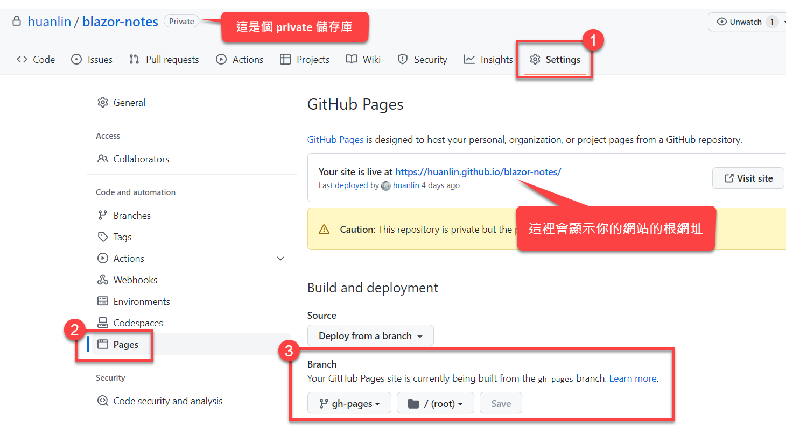
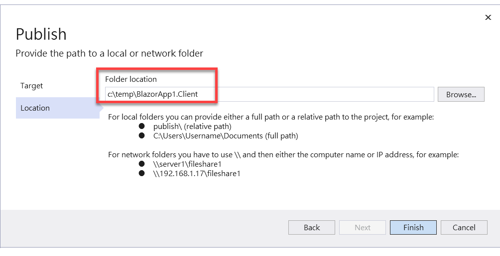
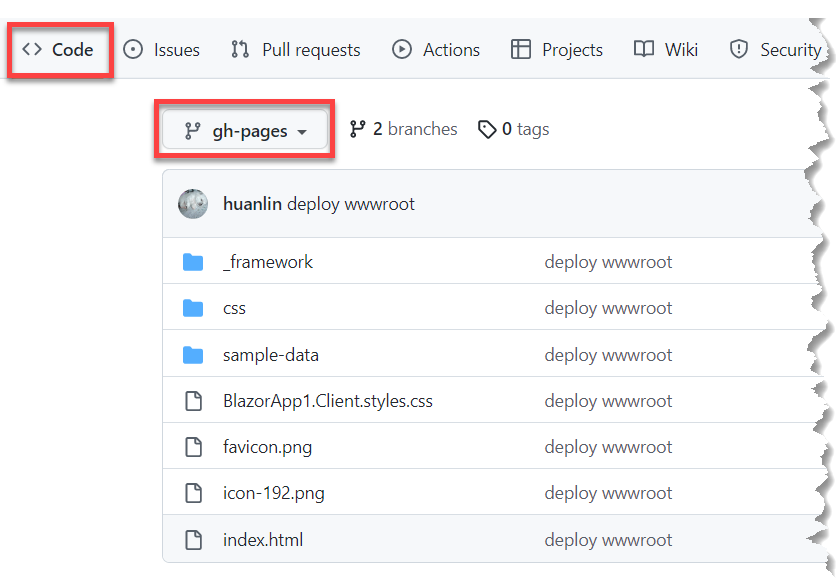
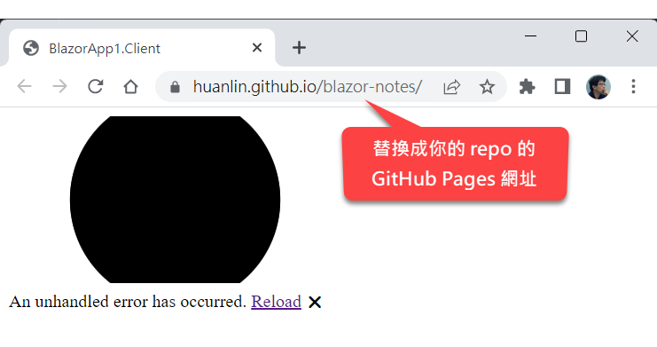
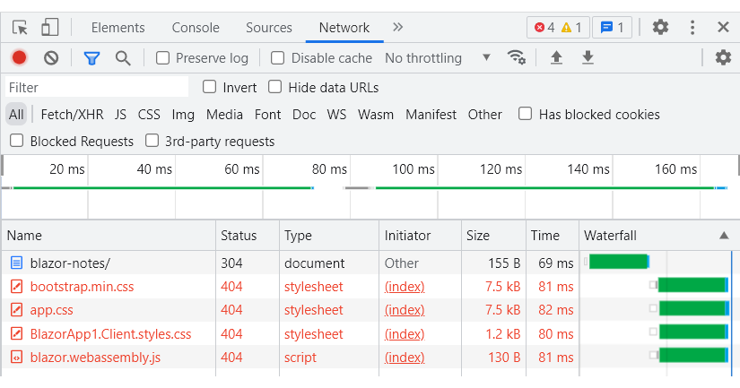
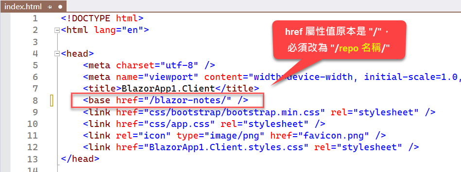
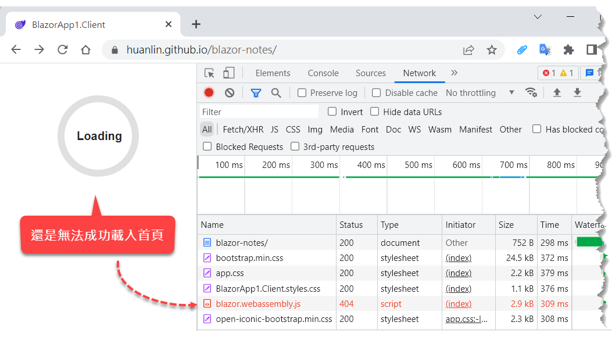
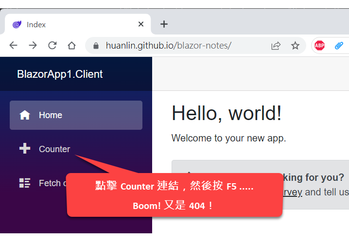
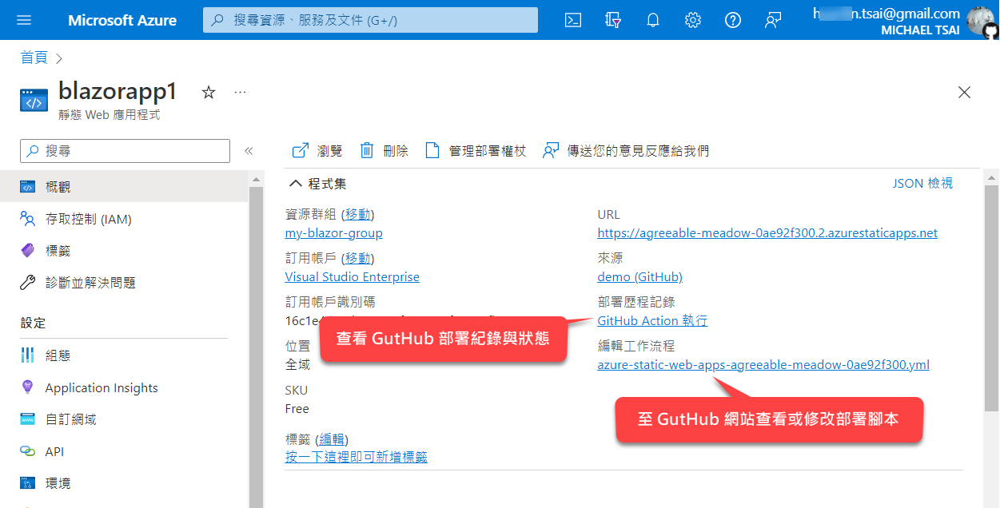
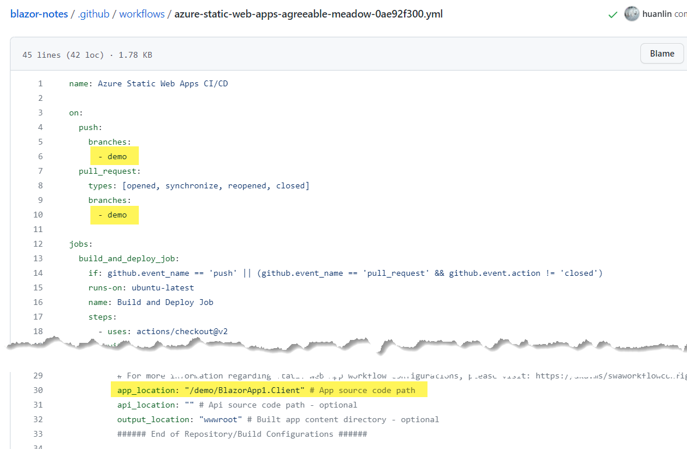

「我們才剛寫完一個超級陽春的 Blazor app，這麼快就要把它部署到網站主機？」

Blazor 應用程式的兩種裝載模型（hosting model）決定了將來的部署方式，故我認為越早部署越好。盡早練習部署可能對個人帶來以下好處：

- 更深刻理解 Blazor 裝載模型。
- 有助於概念驗證（proof of concept）。
- 盡早完成最簡可行產品（minimum viable product）。
- 增加部署相關知識，提早發現架構層面的需求與限制。

儘管如此，以本書規劃的學習進度來看，目前並不適合涵蓋所有部署議題，特別是 Blazor Server app 的部分，所以本章所介紹的部署操作都是針對 standalone Blazor WebAssembly app。等到介紹 Blazor Server app 的時候，會再一併提及有關部署的相關事項。

您將在本章學習如何將單獨運行的 Blazor WebAssembly app 部署至兩個靜態網頁平台，分別是 GitHub Pages 和微軟 Azure。

I> 本章包含 1 個 Youtube 影片。

## 部署至 GitHub Pages

GitHub 是一個多人協作與 git 原始碼版本控制平台，有免費與付費方案。對於個人或小型開發團隊而言，它提供的免費服務算是相當夠用，包括自動建置、靜態網站等等，都是免費的。其中的靜態網頁服務叫做 GitHub Pages。

欲將 standalone Blazor WebAssembly app 部署至 GitHub Pages，首先必須在 GitHub 平台上建立一個儲存庫（repository），或簡稱 **repo**。儲存庫可以直接建立在你的 GitHub 帳戶之下，或者你也可以先[建立一個組織](https://github.com/account/organizations/new)，然後在組織底下建立你的專案原始碼的 repo。

> 當然你必須[先有一個 GitHub 帳號](https://github.com/signup)，才能進行本節所介紹的相關操作。此外，這裡會假設您已具備 git 版本控制的基礎觀念與一些常用命令，故不會詳細解釋每一個 git 命令或操作。

當你在 GitHub 平台上建立一個 repo 時，除了指定儲存庫的名稱，它還會讓你選擇誰可以看見你的儲存庫。如果選擇「public」（公開），就表示任何人都能看見該儲存庫的所有檔案；若選擇「private」（私人），則表示該儲存庫只有你能看見。

那麼，我們要在 GitHub Pages 上面部署靜態網頁，自然是要給所有人都能看見，所以 repo 也就必須設定為公開存取，對嗎？那樣一來，我的程式碼不就給別人看光光了嗎？

還好 GitHub Pages 並不是那樣運作的。你的 repo 依然可以是 private repo，只有你能存取其中的原始碼；每當需要發布網頁時，只要將靜態網站所需之檔案複製到 GitHub Pages 專屬的分支（branch）就行了。這個專門用來架站用的分支，其預設名稱是「**gh-pages**」。

也就是說，只要在你的 repo 中建立一個名為「gh-pages」的分支，GitHub 平台就會知道你要替這個 repo 架設一個公開網站，而且每當那個分支有檔案更新時，平台會自動進行相關的部署操作。如果你想要用其他名稱的分支來部署網站也沒問題，只要進入 repo 的設定頁面就能找到 Pages 的相關設定，如下圖：

由上圖可知我有一個名為 blazor-notes 的私人儲存庫，而且建立了一個 gh-pages 分支用來部署靜態網站。你現在就可以開啟那個網站來查看稍後的實戰操作成果，網址是 https://huanlin.github.io/blazor-notes/。

在進行後續操作之前，請先確定你已經在自己的 GitHub repo 中建立好一個用來部署用的分支。簡單起見，建議您採用預設的分支名稱，也就是「gh-pages」。你可以用任何自己覺得順手的 Git 圖形化介面工具（例如 TortoiseGit）來完成相關操作，或者參考以下指令：

{linenos=off}
~~~~~~~~
git branch gh-pages
git checkout gh-pages
git push --set-upstream origin gh-pages
~~~~~~~~

執行最後一道命令之後，就可以在 GitHub 網站上面看到這個新建立的分支。

在建立分支以前，如果你的 repo 已經有程式檔案，那麼這些程式檔案也會自動納入這個新建立的 gh-pages 分支，因此，請先把這些你不想要公開的程式檔案與目錄從 gh-page 分支裡面全部刪除（不要刪除隱藏目錄 ".git"），並完成 commit 與 push 至遠端主機的操作。

> 也許有點多餘，但還是提醒一下：在 gh-pages 分支裡面刪除程式檔案之後，不要把相關變動合併至你的主分支（名稱通常是 main 或者 master）或其他作為程式開發用途的分支，因為那等於把檔案刪除的動作也套用至那些分支。

以文字和截圖來描述操作步驟，往往沒有影片來得生動、直觀。因此，我另外錄製了一個 4 分鐘的短片，用來展示整個部署的操作過程。若趕時間，不妨先看一下影片，以快速了解部署過程會碰到哪些狀況，以及如何解決。底下是影片連結：

[Deploying standalone Blazor WebAssembly app to GitHub Pages with .NET 7](https://www.youtube.com/watch?v=fhWR8MV_f_4)

### 部署你的 Blazor WASM App

此時，你應該已經在自己的 GitHub repo 中建立了一個名為 gh-pages 的分支，而且該分支裡面除了 git 版控所需的組態檔之外，應該沒有其他檔案。

接下來，我們只要把網站所需之檔案複製到該分支的根目錄就行了，對嗎？大致沒錯，但還有三個地方需要手動修正，才能讓我們的 Blazor app 順利運行於瀏覽器。

這裡用上一章所建立的第一個 Blazor WebAssembly 專案來展示整個部署過程，當時建立的專案名稱是 BlazorApp1.Client。請參考以下指令來建立部署所需的檔案：

~~~~~~~~
cd c:\work\blazor-notes\demo\BlazorApp1.Client
dotnet publish -c Release -o c:\temp\BlazorApp1.Client
~~~~~~~~

第 1 行命令是將目前工作路徑切換至 BlazorApp1.Client 專案所在的目錄（其中的 blazor-notes 即是我的 repo 根目錄）。第 2 行是以 `dotnet publish` 來發布專案的建置結果，其中使用了兩個選項：

* `-c` 選項：指定使用 Release 模式來建置專案。
* `-o` 選項：指定建置完成的檔案輸出路徑。

如果你偏好在 Visual Studio 中進行上述操作，可以先在 Solution Explorer 中對專案名稱點一下滑鼠右鍵，然後從右鍵選單中點「Publish」。接著會出現一個對話窗，讓你選擇部署方式：

在此對話窗選擇「Folder」，表示我們要把專案的建置結果輸出至某個資料夾。接著按 Next （下一步），便可指定輸出路徑，如下圖：

點一下 Finish（完成）按鈕，便會開始建置並發佈專案。

完成上述操作之後，你應該會在 c:\temp\BlazorApp1.Client\ 資料夾底下看到一個 web.config 檔案，以及 wwwroot 資料夾。部署至 GitHub Pages 時並不需要 www.config（那是給 IIS 用的），我們只需要 wwwroot 資料夾底下的全部檔案。

接著請將此專案所在的分支切換至「gh-pages」分支，並將剛才建置專案所產生的檔案複製到 repo 的根目錄。命令如下：

{linenos=off}
~~~~~~~~
cd c:\work\blazor-notes
git checkout gh-pages
xcopy /S c:\temp\BlazorApp1.Client\wwwroot\*.*
~~~~~~~~

完成上述命令之後，到你的 repo 根目錄（也就是我的 c:\work\blazor-notes）確認一下相關的檔案目錄是否都已經複製過來。

接著，同樣在 repo 的根目錄執行以下命令：

~~~~~~~~
"* binary" >> .gitattributes
git add .
git commit -m "deploy step 1"
git push
~~~~~~~~

上述命令的用意是在 repo 根目錄下產生一個名為 ".gitattributes" 的檔案，裡面的內容只有一行，也就是 "* binary"。這會告訴 git：「請把這個分支裡面的所有檔案都當成二進位檔案來處理。」如此一來，無論是 Windows 還是 Linux 作業系統，git 在處理檔案時便不會因為作業系統的差異而去自動轉換程式檔案（純文字檔案）的換行符號（Windows 環境慣用的換行符號是  CRLF，而 Linux 是 LF）。

I> 如果讓 git 在背後自動修改程式檔案的換行符號，那些被修改過的檔案（例如 blazor.webassembly.js）就會有不同的雜湊值，而 Blazor 一旦發現雜湊值不對，就會拒絕載入檔案。如果有興趣深入考究，可參考：[Git's CRLF transformations interfere with content hashes](https://github.com/dotnet/aspnetcore/issues/19796)。

接著用瀏覽器登入你的 GitHub 帳號，進入你的專案的 repo，並切換至 gh-pages 分支，你看到的頁面內容會像這樣：

上方橫排有一個 Actions 連結，由此連結點進去，便可查看 GitHub 自動執行的部署工作與狀態。一旦確認 GitHub 的自動部署工作完成，便可用瀏覽器開啟你的 repo 的 GitHub Pages 網頁（前面提過可以在 repo 的 Settings > Pages 頁面找到這個網址）。然而，開啟網頁時卻出現錯誤：

怎麼回事？

### 修正之一：base 標籤

打開瀏覽器的除錯視窗，可以看到裡面有四個 404 錯誤，如下圖：

問題出在我們的 index.html 裡面的 `base` 標籤所設定的根網址是 "/"，故瀏覽器會嘗試從 https://huanlin.github.io 這個根網址來載入相關檔案。然而，我們部署的檔案實際上並非存在 *.github.io/ 底下，而是在 *.github.io/[repo]/ 底下。

解決方法是修改 gh-pages 分支的根目錄底下的 index.html，把 `base` 標籤的 href 屬性值從原本的 "/" 改為你的 repo 名稱，而且前後都必須加上 "/"。如下圖：

修改完成並存檔，然後推送至遠端儲存庫：

~~~~~~~~
git add .
git commit -m "Fix base tag"
git push
~~~~~~~~

等待 GitHub 的自動部署工作完成，然後再次開啟 GitHub Pages 首頁。這次有了嗎？

結果還是不行！這次看到網頁上出現「Loading」圖案之後就沒動靜了。

### 修正之二：關閉 Jekyll

從瀏覽器的除錯視窗可以看到這次仍有一個檔案找不到：blazor.webasembly.js。如下圖：

這個 blazor.webasembly.js 是放在一個名為「_framework」的目錄底下，而問題就出在 GitHub Pages 預設的靜態網頁產生器「[Jekyll](https://github.com/jekyll)」會自動忽略所有以底線開頭的子目錄。「_framework」資料夾的第一個字元就是底線。

解決方法是在 gh-pages 分支的根目錄下建立一個名為「.nojekyll」的檔案。檔案內容不重要，空白即可。參考以下命令：

~~~~~~~~
"" >> .nojekyll
git add .
git commit -m "Disable Jekyll"
git push
~~~~~~~~

等待 GitHub 的自動部署工作完成，然後再次開啟 GitHub Pages 首頁，這次應該就能順利顯示首頁了。

你也可以到我的 GitHub Pages 查看執行結果，網址是 https://huanlin.github.io/blazor-notes/。

等等！先別急著收工，還有一個地方要修正。

### 修正之三：用 index.html 取代 404 頁面

目前為止，雖然可以瀏覽器中順利呈現部署後的網頁，但其實還有一個問題需要解決。按照下圖的提示來操作，便可令 404 錯誤再度出現：

這是因為在 Counter 頁面中按 F5 來重新載入頁面時，GitHub 會嘗試去找 "Counter" 檔案的緣故。

針對此問題，有一個比較簡便的解決方法，就是在根目錄底下放一個 404.html 檔案，而檔案內容是直接從我們的 index.html 複製而來。命令如下：

~~~~~~~~
copy index.html 404.html
git add .
git commit -m "Fix 404 page"
git push
~~~~~~~~

大功告成！

以上便是部署 standalone Blazor WebAssembly app 至 GitHub Pages 的全部過程。接著要看的是另一個選項：部署至 Microsoft Azure。

## 部署至 Azure Static Web Apps

相較於 GitHub Pages，把 Blazor apps 部署到 Azure Static Web Apps 可以說是小菜一碟。微軟網站上面已經有教學文章：

[使用 Blazor 和無伺服器 API 建置 Azure Static Web Apps 網站](https://learn.microsoft.com/zh-tw/azure/static-web-apps/deploy-blazor)

依照那篇文章來設定，順利的話，通常半個小時以內便可完成初次的部署設定。

下圖是我在 Azure Static Web Apps 服務中建立的一個名為 "blazorapp1" 的應用程式的「概觀」頁面：

雖然相關設定並不複雜，但仍有需要留意、和手動調整的地方。

需要留意的是：在設定建置腳本時，Azure 不需要像 gh-pages 那樣的分支，而是可以直接指定要用哪個原始碼分支來部署。Azure 平台所產生的建置腳本會自動從我們指定的分支取出原始碼來建置專案，而其中的一個關鍵設定是 `app_location`。

在建置腳本中，`app_location` 所指向的路徑必須有 .csproj 檔案。如果該路徑底下只有 .sln 檔案，建置會失敗（可至 GitHub 儲存庫的 Actions 頁面查看建置狀態與錯誤訊息）。下圖是我的 BlazorApp1.Client 專案的部署設定檔的部分內容：

由上圖可知，我用來部署的原始碼分支是 demo，而此分支的根目錄底下有一個子目錄名稱也叫做 demo。專案的 .csproj 檔案所在位置是 /demo/BlazorApp1.Client 目錄。

> 分支名稱和根目錄都叫做 "demo" 可能令人混淆，這裡必須承認我當初命名時有點隨便。比較常見的目錄結構會是 /src/BlazorApp1.Client 或者 /src/BlazorApp1/BlazorApp1.Client。

此外，部署至 Azure Static Web Apps 同樣會出現本文提及的「修正之三：用 index.html 取代 404 頁面」一節中描述的問題，但解法不同。我的作法是在專案的 wwwroot 目錄下增加一個檔案：**staticwebapp.config.json**。內容如下：

~~~~~~~~
{
    "navigationFallback": 
    {
        "rewrite": "/index.html"
    }
}
~~~~~~~~

詳情可參考微軟文章：〈[設定 Azure Static Web Apps](https://learn.microsoft.com/zh-tw/azure/static-web-apps/configuration)〉。

## 下一步

完成本章的相關操作之後，當你想到任何點子，只要是靜態網頁類型的 Blazor WebAssembly 應用程式，應該都能立刻著手進行開發，並且部署到 GitHub Pages 或 Azure Static Web Apps，看看網頁實際執行起來的樣子。

Blazor 還有許多有趣的東西可以玩。一邊學習，一邊把學到的東西拿來加強既有的應用程式，然後測試、部署，如此反覆循環，說不定一個有趣的工具或產品就這樣生出來了。
